Si bien en el artículo [anterior](/revistas/numero-27/powerapps-creando-nuestra-primera-aplicacion)     pudimos ver una introducción a que es PowerApps y cómo empezar a trabajar, en este artículo nos vamos a centrar en el tratamiento de la información desde nuestros orígenes de datos.

Se puede decir que el mayor potencial de PowerApps más allá de poder implementar aplicaciones móviles o para tablets de forma sencilla, disminuyendo complejidad y costes de desarrollo, es que podemos conectar nuestros datos de negocio y transformar estos datos en nuestras aplicaciones.

Podemos conectar desde diversas fuentes de datos como SharePoint, Office365 o SLQ Server sin necesidad de tener un gran conocimiento de estos sistemas o sin tener la obligación de implementar una capa de acceso a datos para obtener la información que necesitamos. Esto sin duda es un hándicap muy importante a la hora de poder elegir PowerApps como nuestra tecnología base para desarrollar una aplicación.

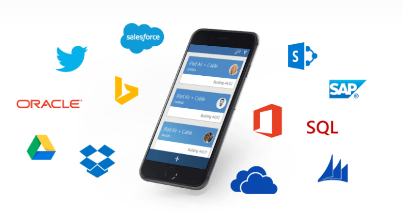

**Conectando con los datos de origen: Concepto de DataSource**

El primer paso para conectar nuestro negocio con nuestra app, es crear una nueva conexión contra la fuente de datos de origen. Por defecto PowerApps proporciona una lista de conectores estándar que nos permiten trabajar casi con cualquier sistema existente en el mercado, por lo que este hecho nos va ahorrar mucho tiempo respecto a que tuviéramos que hacer nosotros una capa de conexión y obtención del dato.

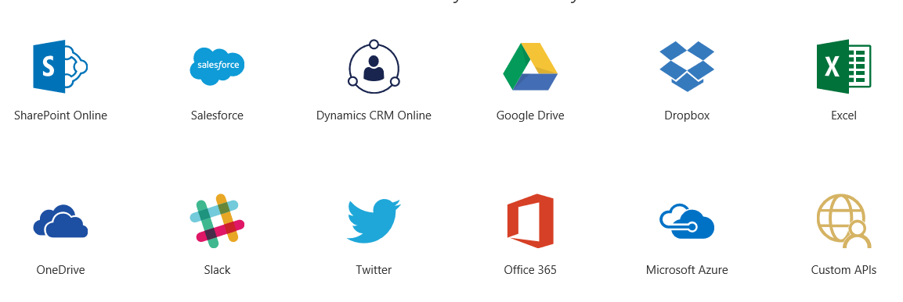

Antes de ver cómo crear una nueva conexión contra por ejemplo SharePoint Online y obtener datos sobre listas, es importante tener claro el proceso que realiza nuestra aplicación con el dato. Ya que como veremos más adelante no siempre el dato que llega a la app esta 100% preparado para ser expuesto en nuestras vistas, y nos vemos obligados a realizar algún pequeño cálculo para poder preparar la información tal cual la necesitamos. Para realizar una conexión, PowerApps usa una serie de conectores como puede ser SharePoint, Saleforce o Twitter entre otros, y este conector va a crearnos un DataSource, sobre el que podremos realizar consultas y utilizarlo en nuestras vistas.

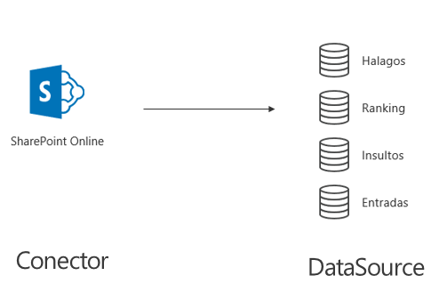

Por ejemplo, si vemos la imagen anterior, podemos ver que una conexión contra SharePoint Online se realiza con un conector estándar de PowerApps, y de esta conexión obtenemos en este caso un DataSource por cada lista que contenga el site de SharePoint que hemos utilizado en la conexión. En mi caso tengo cuatro listas que me genera 4 DataSource distintos.

**Creación de una conexión y definición de un dataSource**

Para crear una conexión nueva en PowerApps lo primero que tenemos que hacer es registrar nuestra conexión en nuestra cuenta  de PowerApps. Si accedemos a la aplicación de PowerApps de Windows, podemos ver que en el menú superior tenemos un apartado de "Conexiones".

Si accedemos, se nos va a redirigir a la dirección [http://web.powerApps.com](http://web.powerapps.com/), nos pedirá credenciales, que en este caso son las mismas con las que estamos desarrollando nuestra aplicación.

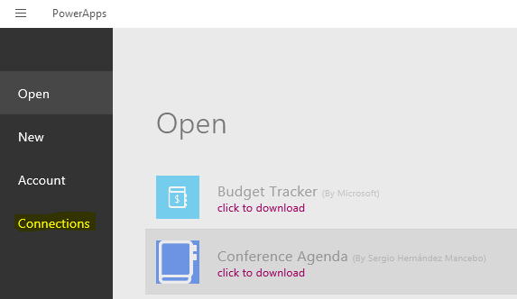

Una vez en la web, accedemos a Manage -&gt; Connections, para dar de alta una nueva conexión. En la parte superior derecha veremos un enlace a "New Connection**"**, que debemos seleccionar.

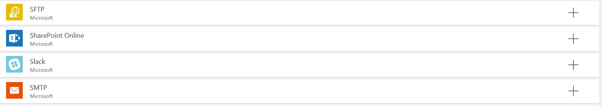

De entre todos los conectores que se nos ofrece, nosotros vamos a seleccionar el de SharePoint Online. Confirmamos añadir la conexión e introducimos las credenciales de un SharePoint Online que tengamos disponible, por ejemplo, una licencia trial de desarrollador para O365 es suficiente.

Una vez nos hayamos conectado de forma correcta, tendremos disponible la conexión en nuestra cuenta y podremos hacer uso de ella desde nuestras apps.

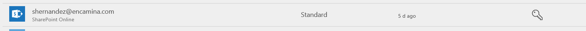

Si volvemos a nuestra app de PowerApps, en la ribbon superior en la pestaña “Content”, encontramos la gestión de los Data Sources de la app.

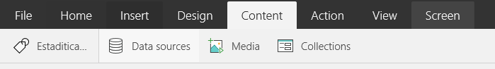

Para añadir un data source contra la conexión de SharePoint que hemos configurado en el paso anterior, basta con seleccionar Data sources, y en el menú que se despliega en la parte derecha de la pantalla seleccionar “Add new Data Source”. Seleccionamos la conexión de SharePoint, y se nos pedirá que introduzcamos un site web disponible en esa conexión, la introducimos y veremos que se listan todas las listas y bibliotecas del sitio.

Seleccionamos las que necesitemos, para crear un Data Source por cada una de las listas que queremos consultar.

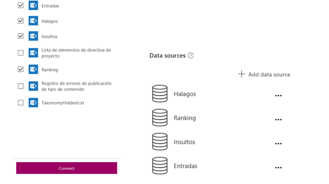

En este caso al seleccionar 4 listas de SharePoint, vemos que se generan 4 Data Source en la PowerApps, y desde este momento podemos hacer uso de ellos.

**Presentar un Data Source en una vista**

Una vez tenemos cargado el Data Source en nuestra aplicación (en este caso hemos volcado 4 listas de SharePoint en la App), ya es posible hacer uso de estos datos y realizar consultas para poder representarlas en una vista.

Decir que hemos definido el "schema" del dato, pero hasta que no hagamos una consulta o un acceso al Data Source no se va a cargar nada en la app, simplemente se deja preparada la estructura del Data Source.

Antes de continuar, necesitamos definir el contenido de las cuatro listas de SharePoint de nuestro ejemplo, para a partir de ahora poder estar familiarizado con su contenido.

Estas cuatro listas componen el backend de una aplicación que controla los halagos y los insultos que llegan vía twitter a una cuenta en concreto, y que se almacenan en SharePoint. En la lista **Entrada** estarán todos los mensajes de entrada que ha recibido la cuenta de twitter, en la lista **Halagos** e **Insultos** estarán los valores especificados como insulto o halagos y que se deben rastrear dentro de los mensajes, y en la lista **Ranking** estarán todos los insultos o halagos ya clasificados para un usuario determinado (Esta aplicación es real y se presentó en el pasado [SharePoint Saturday de Madrid](https://channel9.msdn.com/Events/Microsoft-Spain-Events/SharePoint-Saturday)).

Por ejemplo, en la lista de Ranking tendremos que el usuario shmancebo ha insultado 20 veces con el insulto "melón" o halagado con "crack".

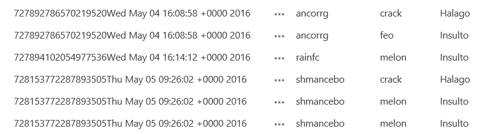

Si ahora una vez sabemos el contenido de nuestras listas, quisiéramos listar en una vista de nuestra app todos los mensajes recibidos en la cuenta de Twitter deberíamos seguir los siguientes pasos:

1.          Crear una nueva pantalla en la app, seleccionando sobre el listado de pantallas una de ellas y seleccionando “New screen”.

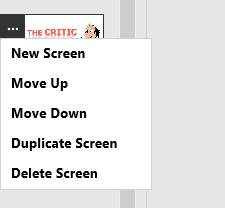

2.          Añadir una galería de datos con formato vertical en nuestra nueva pantalla

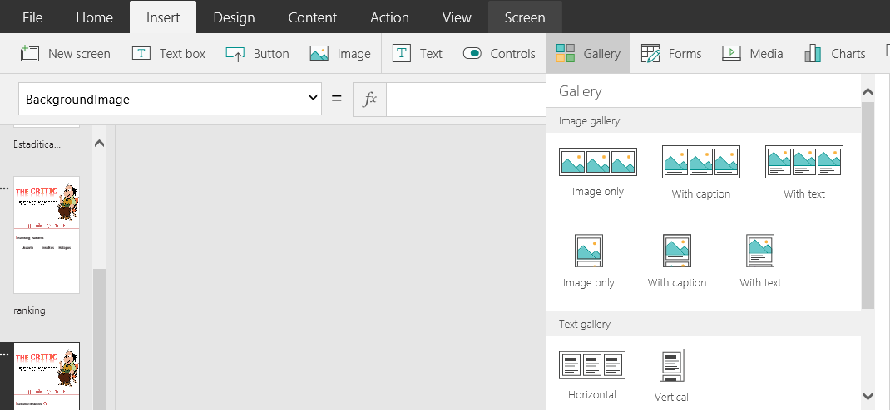

3.          Mapearemos nuestro Data Source a nuestro objeto galería, seleccionando la galería configuramos la propiedad “Items” para que tenga el valor “DataSource”, en este caso entradas.

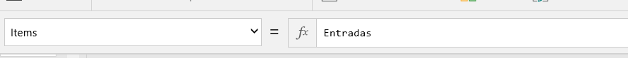

4.          Modificamos la galería, en concreto los ítems para que liste el Autor, la fecha y el mensaje de Twitter.

Pod​emos arrastrar controles desde la ribbon a nuestra galería por ejemplo del tipo Label y configurarlos para que se mapee el campo Entradas.Autor tal cual vemos en las siguientes imágenes.​

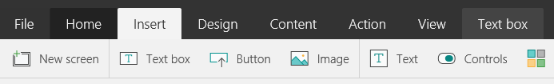

De esta forma vemos que conectarnos con SharePoint, y volcar una lista en nuestra app es casi directo una vez tenemos todas las conexiones y conectores habilitados en nuestra aplicación.

Los estilos ya a gusto del diseñador, pero podemos dar estilos a los ítems que insertemos en la vista como tipos de fuentes, colores, imágenes, bordes….; todo de forma sencilla sin tener grandes conocimientos, simplemente usando la ribbon superior y modificando propiedades de los controles seleccionados, como por ejemplo la barrita separadora de los mensajes que es un control Shape con la propiedad “Fill = IndianRed”.

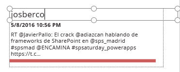

**Trasforma y prepara tus datos**

Es evidente que consultar una lista de SharePoint, y presentarlos en una galería de PowerApp es sencillo, pero poco útil ya que nunca o casi nunca vamos a querer listar todo el contenido de la lista, bien porque tenga un número elevado de ítems o porque necesitemos hacer algún tipo de filtro o consulta más compleja.

Para conseguir hacer consultas complejas en PowerApps, y sin necesidad de tirar de código servidor como sería utilizar una api personalizada, vamos a utilizar el concepto de "Formulas" y estructuras de datos como "Colecciones".

**Formulas en PowerApps**

Si estamos familiarizados con la herramienta Excel y con el concepto de fórmulas, podemos decir que en PowerApps tenemos una utilidad si no idéntica, muy similar para poder hacer filtros o transformaciones de nuestros Data Source, y así representarlos en nuestras vistas.

Entre las fórmulas que encontramos tenemos operaciones aritméticas, operaciones lógicas (If, else...), filtrados o agrupaciones, o gestión de datos como crear columnas de una colección o añadir una nueva colección de datos (lo veremos en el próximo apartado).

Volviendo a nuestro ejemplo, vamos a añadir una ordenación para que nuestros mensajes salgan ordenados por el campo "Fecha de creación" y de forma descendente.

Seleccionando el control de galería que añadimos antes, podemos añadir desde la ribbon para la propiedad "Items", la formula SortOrderByColums("DataSource","Columna por la que ordenar","Asc/Dsc").

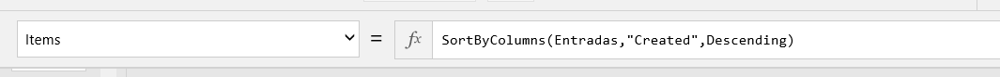

También podemos ordenar en base a una operación básica como puede ser la suma de dos campos de un Data Source. Por ejemplo, en el ejemplo para sacar los totales de insultos o halagos ordenados por el total de estos, podemos usar la función Sort según vemos en la imagen siguiente.

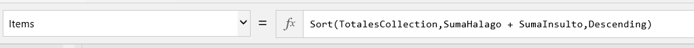

En esta fórmula vemos que tenemos una colección "TotalesCollection", que ahora veremos cómo se calcula, y por otro lado estamos ordenando de manera descendente en función de la SumaHalago y SumaInsulto que son dos campos de la propia colección y que representan el total de insultos o de halagos.

**Estructuradas de datos en PowerApps**

Con fórmulas podemos hacer transformaciones básicas de nuestros Data Source, o bien algún tipo de filtrado sencillo, pero si queremos hacer algunas operaciones más complejas vamos a necesitar hacer uso de alguna estructura de datos que nos proporciona PowerApps, con el fin de poder almacenar estos cálculos.

A los ya mencionados Data Source tenemos que añadir los siguientes tipos de datos:

·       Collection. Son las estructuras más complejas dentro de PowerApps, y se trata de un dato persitente en modo tabla en el que podemos almacenar un Data Source al completo o un resultado de una formula.
·       DataContext. Variables globales, que sirven para almacenar valores simples, que se comparten entre pantallas y que podemos enviar en un evento de navegación entre dos pantallas, por ejemplo.
·       Table. Es una estructura de tabla, pero no persistente como puede ser una colección, esta tabla es temporal y se pierde con la navegación entre pantallas.

En el ejemplo ya hemos visto que hemos hablado de alguna colección en concreto como puede ser TotalesCollection. Esta colección hemos almacenado los totales de insultos y halagos para un autor en concreto.

Para conseguirlo hemos seguido los siguientes pasos

1.       Obtenemos todos los usuarios de la lista Ranking que sabemos han proporcionado algún insulto o halago y los guardamos en una colección que definimos como AutoresAgrupados. 
Para ello necesitamos ejecutar la formula  ClearCollect(AutoresAgrupados,GroupBy(Ranking,"Autor","Autores")). Si analizamos en profundidad esta fórmula tenemos dos fórmulas agrupadas:
a.       ClearCollect, que nos permite crear una colección en PowerApps en base a un Data Source que en nuestro caso es otra fórmula.
b.       GroupBy, estamos filtrando desde la lista Ranking por agrupación del campo "Autor", y generando una colección que se llama Autores.

c.      Por último, la unión de los dos nos proporciona una colección AutoresAgrupados, que a su vez tiene una lista o colección de Autores como vemos en la imagen.

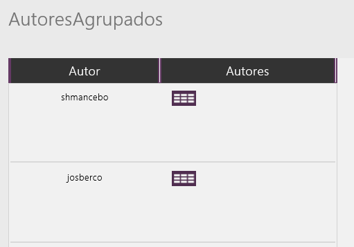

En la columna “Autores” esta todos los datos del ranking asociados al usuario o autor.

2.          Una vez tenemos los datos de los “distintos” autores que tenemos en la lista Ranking, podemos sacar los totales de insultos y de halagos que han escrito en twitter. Para ello aplicamos la siguiente formula:

ClearCollect(TotalesCollection,AddColumns(AutoresAgrupados,"SumaInsulto",Sum(Autores,If(TipoLogro = "Insulto",Peso,0)),"SumaHalago",Sum(Autores,If(TipoLogro = "Halago",Peso,0))))

Si analizamos esta fórmula tenemos la creación de una nueva colección “TotalesCollection”, en la que estamos almacenando una nueva columna con AddColummns que va a contener el número de filas de la colección Autores del tipo “Insulto”. Bajando un poco más al detalle del dato para entender bien este paso, si nos fijamos en la colección AutoresAgrupados, tenemos una entrada que es “shmancebo”, que a su vez tiene una colección Autores relacionada con los siguientes datos.

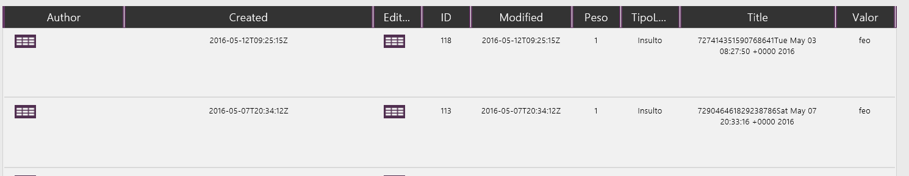

Si analizamos esta colección tenemos un peso de la entrada que siempre es 1 en nuestra aplicación, y un tipo de entrada que puede ser Insulto o Halago.

La fórmula Sum(Autores,if (TipoLogro = “Insulto”,Peso,0), va a buscar todas las filas de la tabla Autores para shmancebo cuyo tipo de entrada es “Insulto”, y va ir sumando la columna Peso, o lo que es lo mismo contando el nº total de insultos realizados por shmancebo. Si hacemos algo similar con la parte de halagos no va a quedar que la fórmula para obtener el ranking de los usuarios que más han insultado o halago es la primera que hemos visto.

3.          Por ultimo solo queda añadir estas fórmulas al evento de carga de la página de ranking, seleccionando la página en la herramienta y desde la ribbon en la pestaña action añadimos para la propiedad “OnVisible” la formula de obtener TotalesCollection.

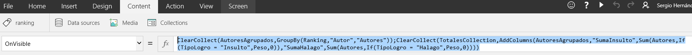

Además, deberemos añadir a la galería de esta página a la propiedad ítems la colección TotalesCollection, con la ordenación que vimos en el apartado de fórmulas.

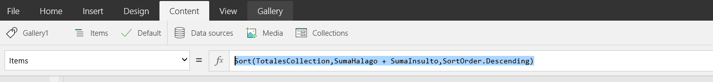

Con todo esto tendremos como resultado la pantalla de Ranking que necesitamos para la aplicación.

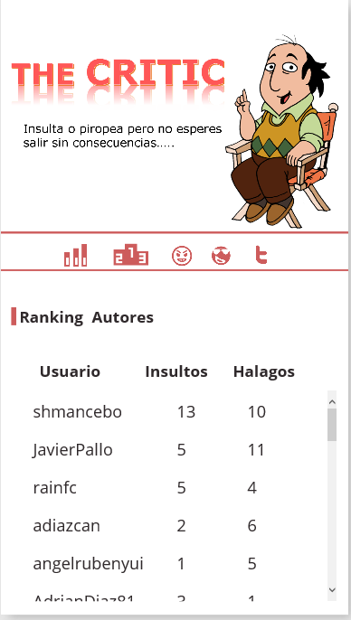

**Conclusiones de la obtención de datos desde PowerApps**

Si nos ceñimos al tiempo de implementación, PowerApps gana por goleada ya que en un primer paso traernos los datos de nuestro SharePoint o de cualquier otro origen de datos se antoja casi directo y en pocos clicks es muy sencillo montar un prototipo de aplicación.

Si bien por otro lado cuando empezamos a profundizar en "que nos aporta" PowerApps y cómo transformar la información, nos encontramos con alguna complicación más, pero siempre enfocada a que posiblemente el operar con fórmulas de Excel o jugar con estas estructuras de datos para profesionales que vengan del mundo .Net se nos antoja un poco escaso y muy rígido por motivos obvios como trazabilidad, rendimiento o mantenimiento de nuestras capas de negocio.

Para todos aquellos que quieran evitar el mundo de las formulas, que por otra parte para mí es muy interesante para perfiles más de negocio o que se manejen de forma más cómodo en lenguajes no programáticos, podemos hacer una curva en nuestras implementaciones en PowerApps y conectar una api personalizada como un conector más, tal y como veremos en próximos artículos.

En resumen, PowerApps es un prometedor inicio para aplicaciones que conecten y presenten datos, y quien sabe si va evolucionando hacia una herramienta potente para diseñar formularios en base a un modelo de datos, bien sean aplicaciones móviles o formularios web. Tendremos que ir trabajando con la herramienta que aún está en preview, y ánimo a ello ya que si se potencia y se usa, puede tener un gran futuro.

**Sergio Hernández Mancebo**

shernandez@encamina.com

@shmancebo

 
 
import LayoutNumber from '../../../components/layout-article'
export default LayoutNumber
