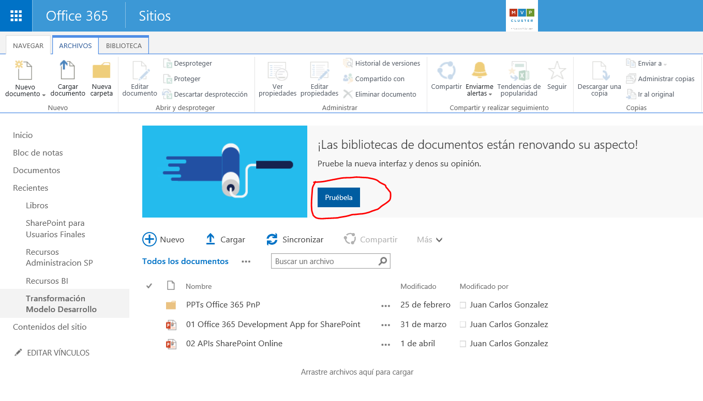
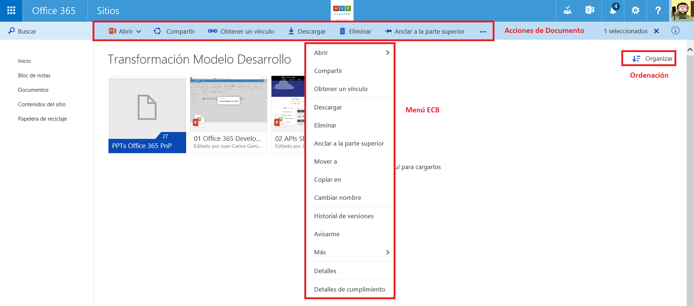

En este artículo vamos a hacer un recorrido por la nueva experiencia de usuario en bibliotecas de documentos de SharePoint Online (SPO) disponible para tenants de Office 365 configurados en modo First Release (Primera Versión), lo que permite que probar y testear de forma temprana nuevas funcionalidades y capacidades liberadas por Microsoft en Office 365 antes de que estén disponibles de forma global. Esta nueva experiencia supone, además de los cambios desde el punto de vista de usuario, una unificación en la forma de trabajar con documentos por parte del usuario final independientemente de si está accediendo a una biblioteca de documentos de un sitio de SPO, a los archivos de un Grupo de Office 365 o a los documentos de OneDrive para Empresas (ODFB). El objetivo de Microsoft es dotar al usuario de una experiencia unificada independientemente del entorno de trabajo (Sitios, Grupos de Office 365 u ODFB).

**Nueva experiencia de usuario en bibliotecas de documentos en SPO**

Para poder acceder a la nueva experiencia de usuario en bibliotecas de documentos, tenemos que activar la misma ya que por defecto Microsoft nos da la opción, por el momento, de elegir entre quedarnos en la experiencia clásica o bien cambiar a la nueva a través de hacer clic en el correspondiente botón que se muestra en un banner provisionado por Microsoft en todas las bibliotecas de todos los sitios de SPO de nuestro tenant.

En esta nueva experiencia de usuario, y si no se selecciona un archivo de la biblioteca, podemos encontrar los siguientes elementos (Imagen 2):

·          Una sección de búsqueda rápida e inteligente de información en la biblioteca que es la misma que conocíamos para ODFB.

·          La navegación vertical del sitio, que facilita el acceso al resto de secciones del sitio donde se encuentra la biblioteca (si se usa la navegación por defecto del sitio).

·          Una serie de acciones principales a nivel de biblioteca que reemplazan a la Ribbon de la vista clásica de una biblioteca que desaparece por completo en la nueva experiencia. Cómo se puede apreciar, el número de acciones disponibles es más reducido que en la Ribbon aunque esto cambiará conforme Microsoft sigue añadiendo cambios en la experiencia de usuario de bibliotecas. De las acciones disponibles, destacaría la acción “Nuevo” que permite crear documentos en la biblioteca de acuerdo a un Tipo de contenido asociado a la biblioteca o bien haciendo uso de las versiones online de Office (Excel, PowerPoint, Word y OneNote).

·          La vista por defecto de la biblioteca, que en este caso es la vista Todos los documentos.

·          Un menú desplegable de acciones de vista que permite realizar acciones como:

o      Cambiar de vista en formato Lista a formato Cuadricula.

o      Abrir el Explorador de archivos (sustituye la opción Abrir con el Explorador de la Ribbon).

o      Guardar vista si se han hecho cambios en la vista actual.

Acceder a la página clásica de administración de vistas de biblio​​tecas en SPO.​

Como se puede apreciar en la Imagen 2, las opciones disponibles a nivel de biblioteca son reducidas comparado con lo que tenemos en la Ribbon en la vista clásica. Por ejemplo, nos faltan opciones utilizadas habitualmente como por ejemplo la Edición rápida (Microsoft ha prometido que dispondremos de esta funcionalidad) de metadatos en la biblioteca, exportar a Excel los metadatos o Crear un nuevo paso rápido. Además, tampoco se muestra la navegación horizontal, aunque a este respecto el equipo de SharePoint ha comentado que se encuentra trabajando en un nuevo control de navegación horizontal.

Desde la vista en modo Lista o Cuadricula (Imagen 3), al seleccionar un documento o carpeta almacenado en la biblioteca de documentos se muestran un conjunto de acciones propias del documento. Además, si se hace clic con el botón derecho del ratón en un documento se muestran las distintas opciones disponibles a nivel de documento. Como se puede apreciar en la Imagen 3:

·          La vista Cuadrícula de la biblioteca nos permite ver los contenidos almacenados en modo miniatura (Thumbnail).

·          A nivel de documento, aparecen una serie de Acciones de documento que facilitan visualizar el documento (si se trata de un documento Office, se muestran las opciones para abrirlo con Office Online o de escritorio), compartir el documento a través del mismo diálogo de compartir conocido para OneDrive y ODFB, obtener un vínculo al documento, descargarlo, eliminarlo o bien anclarlo a la parte superior de la biblioteca. La opción de anclaje permite fijar hasta 3 documentos en la parte superior de la biblioteca o de la carpeta en la que se encuentre el usuario (Imagen 4). Junto con las opciones de documento visibles en el menú horizontal, el enlace “…” permite acceder a las siguientes acciones adicionales:

o     *Mover a* , para mover, por el momento, el documento entre carpetas en la biblioteca. Microsoft está trabajando en permitir que el documento se puede mover más allá de los límites de la biblioteca.

o     *Copiar en* , para copiar el documento dentro de la jerarquía de la biblioteca. Al igual que con *Mover a* , Microsoft ha comentado que permitirá copiar documentos fuera de los límites de la biblioteca.

o     *Cambiar nombre* , para cambiar el nombre del documento.

o     *Avisarme,* para crear una alerta del documento y recibir notificaciones de cambios que se puedan producir en el mismo.

o     *Historial de versiones* , para acceder a las versiones del documento.

o     *Extraer del repositorio* , que desprotege el documento (CheckOut). Al desproteger un documento, aparecen dos acciones adicionales: *Descartar desprotección* e *Insertar en el repositorio* .

·          Las opciones a nivel de documento incluyen las descritas hasta ahora, además de acciones adicionales:

o     *Más* , que a su vez da acceso a las siguientes 4 acciones: *Editar* (Editar las propiedades del documento en el formulario clásico de edición de propiedades), *Flujo de trabajo* (para acceder a la página de inicio de Flujos de trabajo), *Detalles de la conformidad* (abre un diálogo con el estado actual de retención del documento) y *Extraer del repositorio* ).

o     *Detalles* , opción que describiremos más adelante en el artículo.

o     *Detalles de cumplimiento* .

​

**Trabajo con metadatos y vistas de documentos**

Además de los cambios de experiencia de usuario en cuanto a acciones y cómo se organiza la documentación en una biblioteca y en sus carpetas, también nos encontraremos con cambios en cuanto a cómo trabajar con documentos en cuanto a personalizar vistas, crear nuevas vistas y editar los metadatos de un documento existente.

*Vistas de documentos en la nueva experiencia de usuario*

La edición de una vista en una biblioteca de documentos y la creación de nuevas vistas se simplifica notablemente en la nueva experiencia:

·          Basta con hacer clic en una de las columnas disponibles en la vista por defecto para acceder a funcionalidades de personalización de la vista (Imagen 5) como cambios en la ordenación de elementos, cambiar el nombre de la columna, cambiar de posición la columna, mostrar u ocultar columnas en la vista o bien añadir nuevas columnas en la vista.

·          De la misma forma, el botón “+” permite crear nuevas columnas o bien acceder a la opción de *Mostrar u ocultar columnas* . Si se hace uso de esta opción, se muestra un panel que permite no solo añadir u ocultar columnas en la vista, sino también cambiar el orden de las columnas a mostrar (Imagen 6).

​

Tras realizar los cambios en la vista, es necesario guardar los mismos en la vista para que no se pierdan. La operación de guardar los cambios en la vista permite que se apliquen en la vista actual o bien que se genere una nueva vista. El resultado final es el que se muestra en la Imagen 7.

*Edición de metadatos y trabajo colaborativo en documentos*

Para editar los metadatos de un documento y tener acceso a las capacidades colaborativas que proporciona la nueva experiencia de usuario hay que hacer uso de la opción *Detalles* disponible a nivel de documento. De esta forma, se abre un panel de detalles en el que (Imagen 8):

·          Para el caso de documentos Office y PDF, y gracias a la integración con Office Online, podemos pre-visualizar el documento y navegar por el mismo.

·          Se muestran los metadatos del documento que se pueden modificar a través del panel sin necesidad de tener que navegar a una ventana de edición de metadatos o de que se habrá una ventana modal. La opción *Editar todo* da acceso al formulario de edición de los metadatos del documento.

·          Se visualiza el historial de actividad del documento.​

​

·          Se puede compartir el documento enviando un correo electrónico con un enlace al documento.

·          Se muestra una sección con detalles del documento como tipo de documento, cuando se modificó, ruta de acceso al mismo y tamaño.

**Acceso a la administración de la biblioteca en la nueva experiencia**

Finalmente, para completar el artículo y aunque a priori parece que esta opción no está disponible, podemos acceder a la administración de la biblioteca de documentos a través de las opciones de configuración globales del sitio (Imagen 9):

​

Al hacer clic en *Configuración de la biblioteca* accederemos a su página clásica de administración.

**Lo qué falta (o parece que falta) en la nueva experiencia de usuario**

La nueva experiencia de usuario desplegada por Microsoft en tenants con First Release configurado se trata de una versión preliminar de la experiencia que tendremos finalmente desplegada en SharePoint Online. En la misma faltan elementos en los que Microsoft está trabajando o bien simplemente no estarán disponibles como, por ejemplo:

·          La edición rápida de metadatos en vistas de la biblioteca, funcionalidad que si será añadida por Microsoft en la nueva experiencia.

·          Acciones personalizadas que se hayan desarrollado y qué, aunque no se muestran en este artículo, se soportan en la nueva experiencia de usuario. No se soportan por el momento acciones personalizadas que inyecten bloques de script.

·          Barra de navegación superior, Microsoft está trabajando en un nuevo control que proporcione esta navegación superior.

·          Soporte de Tipos de Contenido personalizados, la nueva experiencia de usuario soporta los Tipos de Contenido que se hayan configurado en la biblioteca.

·          Posibilidad de aplicar branding a las bibliotecas de documento, Microsoft se ha comprometido a proporcionar mecanismos de proporcionar capacidad para personalizar las nuevas bibliotecas, aunque por el momento se desconoce cómo se podrán hacer dichas personalizaciones.

·          Soporte de varios niveles de agrupamiento, incluido de serie. En el momento en el que se dispone de columnas de tipo elección o lookup en la biblioteca se dispone de la opción de agrupar por dichas columnas a nivel de vista como muestra la Imagen 10.​

El resultado de definir un nivel de agrupamiento es el que se muestra en la Imagen 11.

**Conclusiones**

La nueva experiencia de usuario en bibliotecas de documento para SPO supone un cambio radical no solo en cuanto a aspecto, sino también en cuanto a forma de trabajar colaborativamente con documentos. La clásica Ribbon a la que estábamos acostumbrados desaparece y es reemplazada por un menú horizontal de acciones que facilita el trabajo a nivel de biblioteca y de documento individual. A nivel de documento, el nuevo panel de edición simplifica no solo la visualización de un documento, sino también cambiar sus metadatos y visualizar su historial de actividad.

**Juan Carlos González**
 Office Servers & Services MVP  | Cloud & Productivity Advisor
 jcgonzalezmartin1978@hotmail.com 
@jcgm1978
 [https://jcgonzalezmartin.wordpress.com/](https&#58;//jcgonzalezmartin.wordpress.com/)

