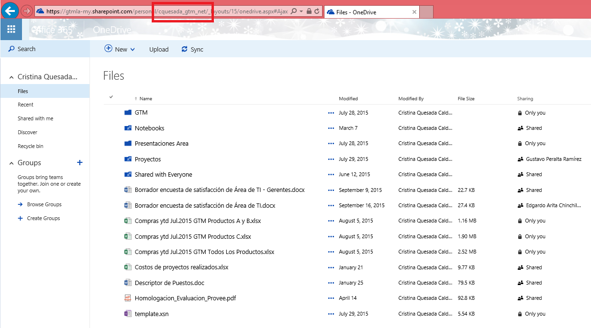

Lo primero que tenemos que hacer para resolver esta situación es mapear el OneDrive en una unidad de red en la máquina del usuario. Como se detalla a continuación:

**Configuración del OneDrive en una unidad de Red**

1. Se debe tomar el url del OneDrive del Usuario, [https://gtmla-my.sharepoint.com/personal/Username/documents/](https://gtmla-my.sharepoint.com/personal/Username/documents/) 
Lo marcado en amarillo es donde debe aparecer el usuario de la persona al que se le va a configurar el acceso.

2. Una vez que se tiene el link del OneDrive, hacemos clic derecho en el icono de “Computer” y escogemos la opción “Map Network Drive”.

3. Se selecciona la unidad y se copia el URL, se marcar los dos checks de “Reconnect at sign-in” y “Connect using different credentials” y se da clic en “Finish”.

4. Pedirá la autenticación del usuario

5. Una vez que el usuario se autentique tendrá el folder de su OneDrive mapeado como una unidad de red.

Cuando ya se tenga el OneDrive mapeado como una unidad de red, se actualizan los enlaces de los Excel por la ubicación nueva (unidad de red), con esto cada vez que se modifiquen las hojas de cálculo el Excel master se abrirá y se actualizarán los datos.

**Consideraciones**

a)       Si en el punto 4 al autenticarse le aparece este error:

Se necesitará editar un registro en la máquina del usuario de la siguiente manera:

I.              Ir a Inicio y en “Run” ejecutar el regedit.

II.              Ir al registro:

HKEY\_LOCAL\_MACHINE\SYSTEM\CurrentControlSet\Control\NetworkProvider\HwOrder\

III.              Dar click derecho en ProviderOrder para modificar e ingrese los siguientes valores en “Value Data”: WDNP32,SnacNp,RDPNP,LanmanWorkstation,webclient

IV.              Se da clic en     OK, se reinicia la máquina y se vuelve a intentar mapear la unidad de red.

b)  Si al autenticarse aparece el siguiente error:

Se necesitará revisar la siguiente información para resolverlo:

I.            En el Internet Explorer, ir a "Internet Option" y en el tab de "Security" seleccionar "Internet Zone" y si hay un check en "Enable Protected Mode" quitarlo.

II.            Revisar si el servicio de "Web Client" está iniciado en la máquina del usuario

III.            Validar que el sitio de OneDRive esté como "Trusted Sites" en el Internet Explorer.

**Conclusiones**

En este artículo vimos como configurar nuestro OneDrive en la máquina como unidad de red, con esto podremos apoyar a los departamentos de Finanzas, Contabilidad y Contraloría que son los que la mayoría de las veces tienen que lidiar con este tipo de documentos enlazados y al migrarse a OneDrive les da inconvenientes.

**Cristina Quesada Calderón**
Encargada del Área de Colaboración, GTM Servicios
cristi\_q@hotmail.com 

@cris\_quesada

 
 
import LayoutNumber from '../../../components/layout-article'
export default LayoutNumber
