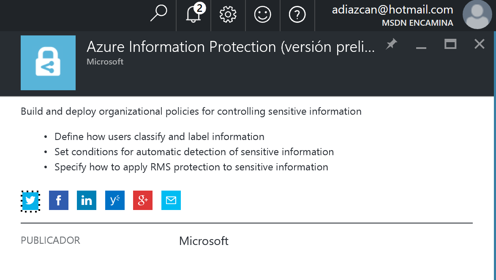
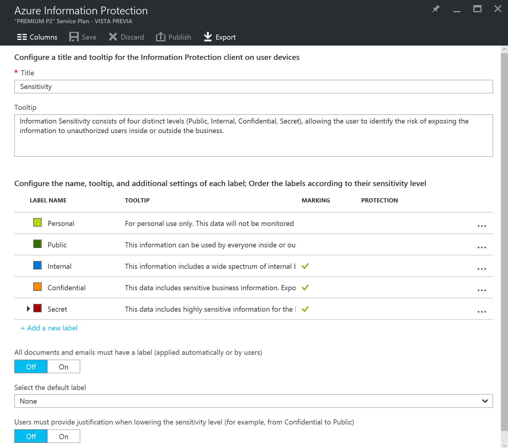
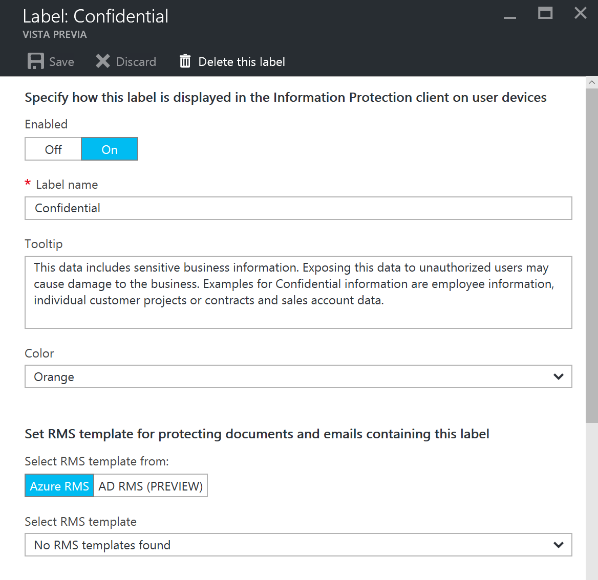
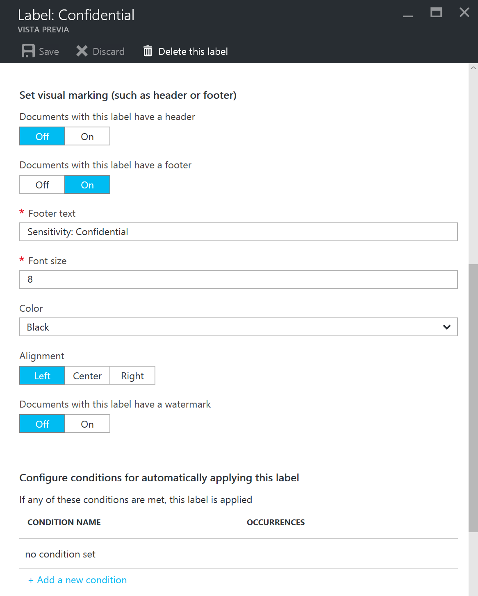
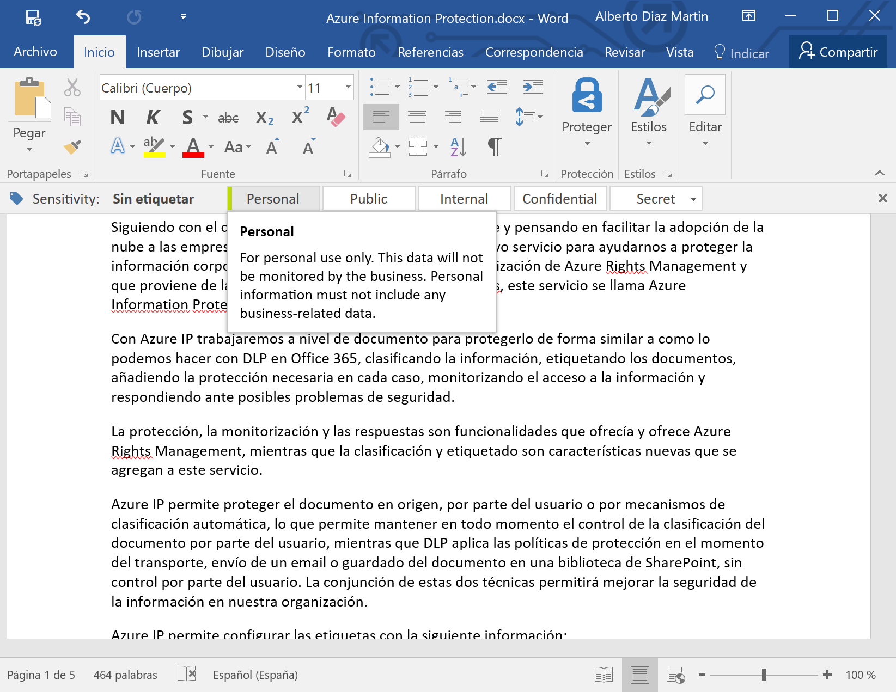
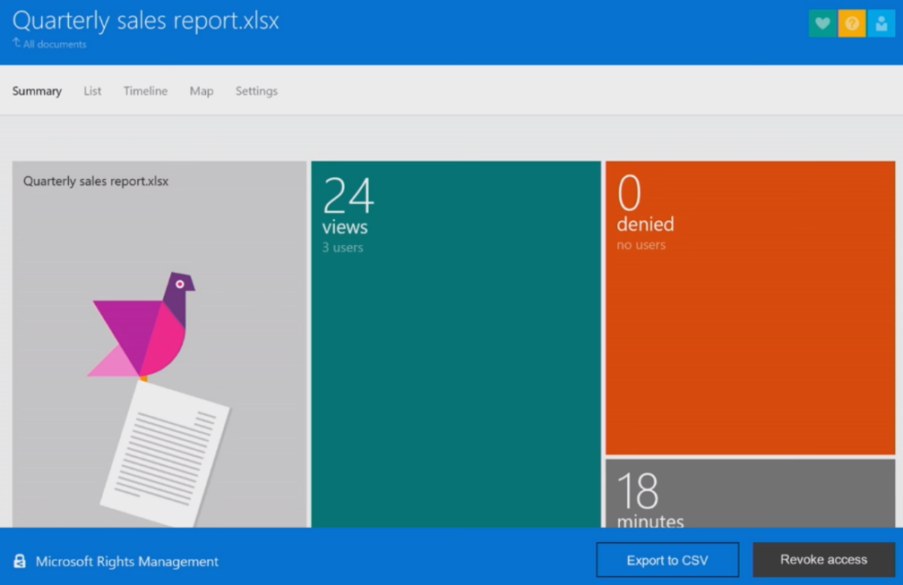

​Siguiendo con el continuo crecimiento de servicios en Azure y pensando en facilitar la adopción de la nube a las empresas, Microsoft recién ha publicado un nuevo servicio para ayudarnos a proteger la información corporativa que podemos ver como una actualización de Azure Rights Management y que proviene de la adquisición de la empresa Secure Islands, este servicio se llama Azure Information Protection.

Con Azure IP trabajaremos a nivel de documento para protegerlo de forma similar a como lo podemos hacer con DLP en Office 365, clasificando la información, etiquetando los documentos, añadiendo la protección necesaria en cada caso, monitorizando el acceso a la información y respondiendo ante posibles problemas de seguridad.

La protección, la monitorización y las respuestas son funcionalidades que ofrecía y ofrece Azure Rights Management, mientras que la clasificación y etiquetado son características nuevas que se agregan a este servicio.

Azure IP permite proteger el documento en origen, por parte del usuario o por mecanismos de clasificación automática, lo que permite mantener en todo momento el control de la clasificación del documento por parte del usuario, mientras que DLP aplica las políticas de protección en el momento del transporte, envío de un email o guardado del documento en una biblioteca de SharePoint, sin control por parte del usuario. La conjunción de estas dos técnicas permitirá mejorar la seguridad de la información en nuestra organización.

Azure IP permite configurar las etiquetas con la siguiente información:

- Plantilla de Azure RMS para esta etiqueta.
- Condiciones automáticas para aplicar esta etiqueta.
- Marcas visuales para aplicar al documento.

Para configurar estas etiquetas, primero tenemos que crear el servicio en una suscripción de Azure.

Una vez creado el servicio, tendremos un conjunto de etiquetas por defecto con las que ya podemos empezar a clasificar los documentos.

Para cada una de las etiquetas, vamos a poder configurar una descripción, un color identificativo y la plantilla de Azure RMS a aplicar.

Además de la marca visual y las condiciones de etiquetado automático.

Para las condiciones podemos usar reglas estándares, por ejemplo, tarjeta de crédito, o reglas personalizadas basadas en ocurrencias de texto o expresiones regulares.

Para usar el cliente de Azure IP, tenemos que instalar un complemento que se encuentra en la página de descarga [https://www.microsoft.com/en-us/download/details.aspx?id=53018](https://www.microsoft.com/en-us/download/details.aspx?id=53018).

Con este complemento instalado, un usuario podrá clasificar la información de sus documentos en Office etiquetando los mismos con la clasificación necesaria o editando aquellos documentos que se hayan autoclasificado por alguna regla establecida en el servicio en Azure.

​

Por último, desde el portal de RMS vamos a poder hacer el seguimiento y monitorización de los documentos, además de poder revocar el acceso de los documentos si encontramos algún problema de seguridad.

**Conclusiones**

Azure IP es más que un servicio nuevo de la nube de Microsoft ya que complementa o actualiza las funcionalidades del actual Azure RMS buscando mejorar la experiencia de los usuarios a la hora de clasificar la información y complementando las funcionalidades de DLP de Office 365, todo esto para ayudar a evitar fugas de información en las organizaciones o a cumplir las políticas o leyes de los países aplicables a las empresas.

**Alberto Diaz Martin**
 MVP Office Servers & Services
 adiazcan@hotmail.com
 @adiazcan

[http://blogs.encamina.com/negocios-sharepoint/](http://blogs.encamina.com/negocios-sharepoint/) 
[http://geeks.ms/blogs/adiazmartin](http://geeks.ms/blogs/adiazmartin)

 
 
import LayoutNumber from '../../../components/layout-article'
export default LayoutNumber
