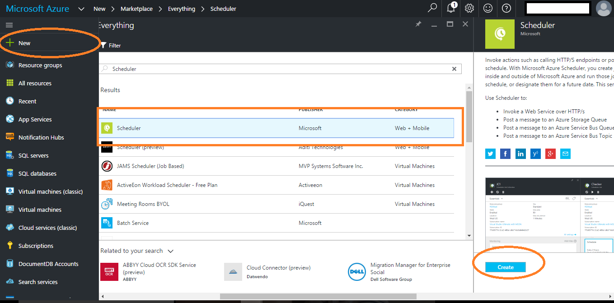
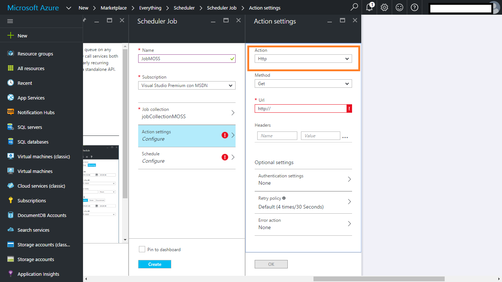
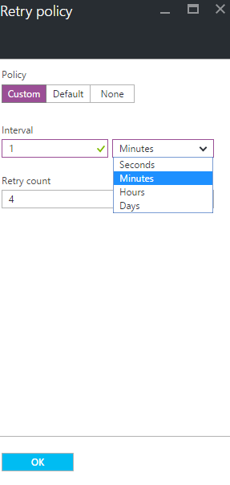
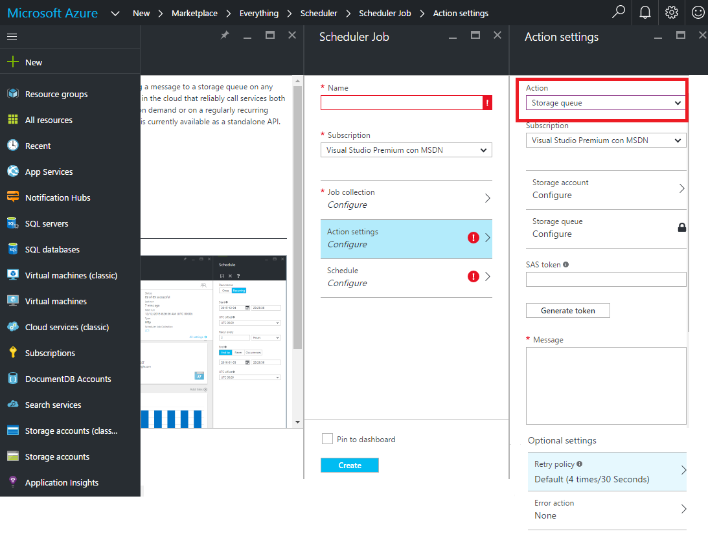
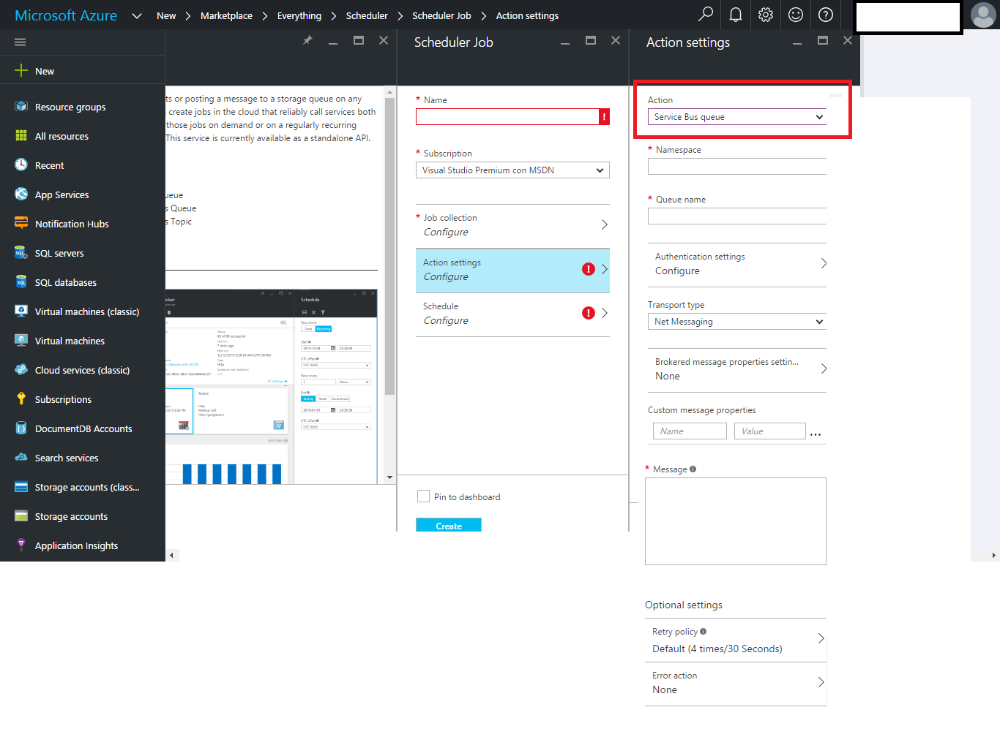
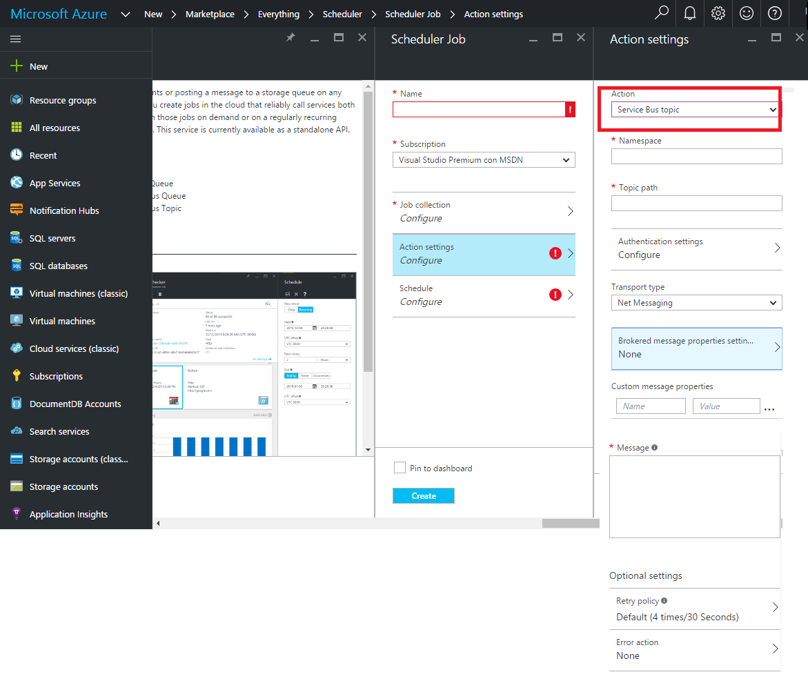

En el desarrollo de aplicaciones normalmente nos encontramos que debemos implementar tareas que deben ejecutarse periódicamente y que están fuera del entorno de nuestra aplicación. Estas tareas necesitan ser planificadas para su ejecución. En Windows utilizaríamos el Task Scheduler de Windows, y si tuviéramos muchas tareas utilizaríamos Frameworks como Quartz<sup>1</sup> que nos ayudan a planificar todas las tareas desde un solo punto y no una a una.

En entorno On-premise lo tenemos claro, pero si estoy en Azure, ¿cómo lo hago? La respuesta es Azure Task Scheduler.

**TERMINOLOGIA**

Antes de continuar es necesario conocer la terminología que envuelve a Azure Task Scheduler:

·       **Job** –&gt; Define la configuración de cómo y cuándo debe ejecutarse una tarea.
·       **Job Collection** –&gt; Colección de Jobs que permite compartir configuraciones y cuotas entre los **Jobs**.
·       **Job History** –&gt; Aquí encontraremos todos los detalles de las ejecuciones de los Jobs.

**¿QUE NOS OFRECE AZURE TASK SCHEDULER?**

1.       Planificar la ejecución de tareas según sea deseado: periódicamente, una sola vez o durante un intervalo de tiempo.
2.       Planificar tareas tanto que estén alojadas en Azure como fuera de Azure.
3.       Configuración de reintento en el caso de que no se haya podido ejecutar la tarea.
4.       Historial de ejecuciones donde se nos informa del estado del Job, detalles de la ejecución, número de reintentos, periodicidad y hora de inicio y fin de la ejecución.
5.       Realizar acciones correctoras al suceder un error y finalizar los reintentos.
6.       Cinco formas de ejecución: Http, Https, Sotrage Queues, Azure Service Bus Queues y Azure Service Bus Topics.
7.       Alta disponibilidad.

**AZURE TASK SCHEDULER EN DETALLE**

Ahora vamos a entrar en detalle de cómo podemos crear un Job, que opciones tenemos para hacerlo y entraremos en detalle en como configurar cada opción disponible.

Para crear y configurar un Job y/o su Job Collection tenemos tres opciones:

1.       Portal de Azure.
2.       API REST
3.       .NET SDK.

**Portal de Azure**

Los pasos para realizar la configuración desde el Portal de Azure son:

1.       Iniciamos sesión en el portal de azure<sup>2</sup>.
2.       Seleccionamos +Nuevo y en el buscador ponemos *scheduler* y seleccionamos la primera opción.



3.       Los campos a rellenar son:
  a.       Nombre del Job. 
  b.       Seleccionar la subscripción. 
  c.       Seleccionar o crear la Job Collection a la que queremos asociar el Job.
  d.       Configuramos el Job: Tipo de acción, autenticación, política de reintentos y acción a realizar frente al error.
  e.       Programamos el Job.

**API REST**

Es necesario realizar una llamada a la URL con PUT como HTTP Verb:

[https://management.azure.com/subscriptions/{subscriptionId}/resourceGroups/{resourceGroupName}/providers/Microsoft.Scheduler/jobCollections/{jobCollectionName}/jobs/{jobName}?api-version=2016-01-01](https&#58;//management.azure.com/subscriptions/%7bsubscriptionId%7d/resourceGroups/%7bresourceGroupName%7d/providers/Microsoft.Scheduler/jobCollections/%7bjobCollectionName%7d/jobs/%7bjobName%7d?api-version=2016-01-01)

Es obligatorio enviar la cabecera *Content-type,*donde


| Argumento | Descripción |
| --- | --- |
| subscriptionId | El identificador de la subscripción donde quieres crear el Job. |
| resourceGroupName | El nombre del *resource group* al que quieres vincular al Job. |
| jobCollectionName | El nombre de la Job Collection a la que pertenecerá el Job. |
| jobName​​ | El nombre del Job. |
| api-version | La versión de la API REST a la que quieres realizar la petición. |


Y en el *body* enviaremos la especificación del **Job**:

```
{  "properties": {    "startTime": "2016-08-09T00:0:00Z",    "action": {       "request": {            "uri": "http://yourURL.com",          "method": "GET",          "headers": {}       },       "type": "http",       "retryPolicy":{"retryType":"Fixed",  "retryInterval":"PT1H", "retryCount":5}    },    "state": "enabled",
```

```
    "recurrence":
```

```
    {
```

```
        "frequency": "minute",
```

```
        "interval": 30,
```

```
        "count": 10
```

```
    },
```

```
  }}
```


Donde:


| Parámet​​ro | Descripción | ​ |
| --- | --- | --- |
| startTime | Fecha supuesta de inicio.<br /><br />Si no se informa se considerará que el Job se ejecutará en el mismo momento de su creación. | Opcional |
| action | La acción del Job. | Obligatorio |
| type | El tipo de la acción con la que se ejecutará: http, https, storage que, azure service bus queue o azure services bus. | Obligatorio |
| request | Los parámetros necesarios para la ejecución del Job. Dependerá del tipo de acción a realizar. Más adelante explicaremos con más detalle estos parámetros. | Obligatorio |
| retryPolicy | Política de reintento.<br /><br />Se debe especificar:<br /><br />ü  retryType: Tipo de reintento: *Fixed* o *None*.<br />ü  retryInterval: Intervalo del reintento<br />ü  retryCount: Cuántas veces de debe reintentar. | Opcional |
| recurrence | Planificación del Job. | Opcional |
| state | El estado del Job. Puede ser Activado o Desactivado. | Obligatorio |


Antes de crear el Job con la API REST, y a diferencia de hacerlo por el portal, debéis tener creada la Job Collection, podéis ver cómo hacerlo en: [https://msdn.microsoft.com/en-us/library/mt629159.aspx](https&#58;//msdn.microsoft.com/en-us/library/mt629159.aspx)

.NET SDK

Por último, podemos crear el Job y su collection con C#. Para ello primero se debe instalar el paquete Nuget Microsoft.Azure.Management.Scheduler.

Una vez instalado podemos crear la *Job Collection*:

```
var schedulerServiceClient = new SchedulerManagementClient(yourCredentials);
```

```
var result = schedulerServiceClient.JobCollections.CreateOrUpdate("resourceMOSS", "jobCollectionMOSS", new JobCollectionDefinition()
```

```
            { 
```

```
                Location ="West Europe",
```

```
                Name = "jobCollectionMOSS",
```

```
                Properties = new JobCollectionProperties()
```

```
                {
```

```
                    Quota = new JobCollectionQuota()
```

```
                    {
```

```
                        MaxJobCount = 3,
```

```
                        MaxJobOccurrence = 5,
```

```
                        MaxRecurrence = new JobMaxRecurrence()
```

```
                        {
```

```
                            Frequency = RecurrenceFrequency.Minute,
```

```
                            Interval = 1
```

```
                        }
```

```
                    },
```

```
                    Sku = new Sku(SkuDefinition.Standard),
```

```
                    State = JobCollectionState.Enabled
```

```
                }
```

```
             });
```


Y después crear un Job a esta collection:

```
var schedulerClient = new SchedulerManagementClient(yourCredentials);
```

```
var resultJob = schedulerClient.Jobs.CreateOrUpdate("resourceMOSS", "jobCollectionMOSS", "JobMOSS", new JobDefinition()
```

```
           {
```

```
               Properties = new JobProperties()
```

```
               {
```

```
                   Action = new JobAction()
```

```
                   {
```

```
                       Type = JobActionType.Http,
```

```
                       Request = new HttpRequest()
```

```
                       {                          
```

```
                           Headers = new System.Collections.Generic.Dictionary<string,string>()
```

```
                   {
```

```
                       
```

```
                   },
```

```
                         Method = "GET",
```

```
                           Uri = new Uri("http://yourURL.com")
```

```
                       }
```

```
                   },
```

```
                   StartTime = DateTime.UtcNow,
```

```
                   Recurrence = new JobRecurrence()
```

```
                   {
```

```
                       Frequency = RecurrenceFrequency.Minute,
```

```
                       Interval = 1,
```

```
                       Count = 5
```

```
                   },
```

```
                   State = JobState.Enabled
```

```
               }
```

```
           });
```


En los ejemplos habréis visto muchos campos a configurar, no os preocupéis que ahora entramos en detalle a explicar para cada tipo de acción las opciones que hay disponibles.

Ahora veremos más en detalle como configurar el Job en base a la acción seleccionada y como planificarlo. Me basaré en cómo hacerlo en el portal de Azure, pero es extrapolable tanto a la API REST como al .NET SDK.

**CONFIGURACIÓN DEL JOB EN BASE A LA ACCION SELECCIONADA**

·       **Http Action:**



Utilizaremos este tipo de acción cuando nuestro proceso puedas ser ejecutado a través de URL, como por ejemplo si tenemos un Azure WebJob. Debemos seleccionar que tipo de Http Verb utilizaremos, las opciones son:

·       GET
·       POST
·       PUT
·       DELETE

Una vez seleccionado el Http Verb a utilizar añadimos la URL a la que queremos llamar. Para los Verbs POST y PUT podemos añadir un *body* a la petición. Al seleccionarlo en el menú nos aparecerá la opción *body* donde podremos poner está información. También tenemos la opción de añadir cabeceras (*headers*), por ejemplo:

·       Content-Type: text/plain.

Por último, tenemos una sección de propiedades opcionales que incluye: autenticación, política de reintentos y acción ante el error.

·       Autenticación à Si necesitamos que al realizar la llamada se envíe en la cabecera de la petición o en el *body* según el Http Verb elegido configuraremos esta opción que tiene cuatro opciones:
o   **None:** No necesita autenticación.
o   **Basic:** En esta opción realizaremos la autenticación mediante usuario, por lo que debemos rellenar los campos username y password.
o   **Client Certificate:** Realizamos la autenticación mediante certificado. Debemos informar los campos pfx y password.
o   **Active directory OAtuh:** La autenticación se realizará mediante OAuth contra Active Directory, para ello deberemos informar todos los campos necesarios para realizar ele OAuht sobre AD que son: Tenant, ClientId, Secret y Audience-
·       Política de reintentos à Configuraremos que queremos hacer en el caso que al realizar la petición haya un error. Tenemos tres opciones:
o   **None:** No realizaremos ningún reintento.
o   **Default:** Por defecto se reintenta cada 30 segundos y el número máximo de reintentos es 4. Estos valores no se pueden modificar.
o   **Custom:** Definimos cuantas veces queremos reintentar y cuál es el intervalo de reintento. En este caso podemos reintentar cada x segundos, minutos, horas o días.



·       Acción en caso de error àAcción que queremos realizar en caso de error. La acción que se pueden realizar es lanzar algún otro tipo de Job que tengamos para indicar este error o realizar alguna acción correctora, por lo que de nuevo tendremos que definir qué tipo de acción a realizar queremos con su respectiva configuración:
o   Http.
o   Https.
o   Storage queue.
o   Azure Service Bus queue.
o   Azure Service Bus topic.

Definiendo todas estas opciones ya tendríamos listo nuestro Job que llamaría a una URL concreta donde estaría nuestro proceso a ejecutar.

·       **Https Action**

La configuración para Https es exactamente la misma que la anterior con la diferencia que la URL a la que debemos llamar es https.

·       **Storage queue**

​

Utilizaremos este tipo de acción cuando nuestro proceso esté alojado en un WorkerRole por ejemplo. Para poder utilizar este tipo de acción primero debemos tener creado un Azure Storage account y tener creada una queue en este *storage account.*

Para este tipo de acción debemos seleccionar el *storage account*que queremos utilizar y acto seguido debemos seleccionar la queue que queremos usar. Después de esto para que el Job pueda insertar un mensaje en la queue debemos tener una Shared acces key (SAS) que le dé permiso para escribir en ella. Si no la tenemos disponemos de un botón que nos creará una por nosotros. Después insertaremos el mensaje que queremos enviar para que nuestro proceso sepa si debe ejecutarse o no. Este mensaje es un *string* del XML serializado de la clase StorageQueueMessage, donde nos viene información de ejecución (ExecutionTag y ClientRequestId), cuando se ha ejecutado (ExpectedExecutionTime), información sobre el Job (SchedulerJobId y SchedulerJobCollectionId), la región donde está alojada la Job Collection (Region) y por último el mensaje de la queue (Message).

```
<?xml version = "1.0" encoding="utf-16"?>
```

```
<StorageQueueMessage xmlns:xsd="http://www.w3.org/2001/XMLSchema"
```

```
                     xmlns:xsi="http://www.w3.org/2001/XMLSchema-instance">
```

```
   <ExecutionTag>c3b67e748b93b0bac3718f1058e12907</ExecutionTag>
```

```
   <ClientRequestId>2fb66b67-e251-4c09-8d61-8627b8bf9bfd</ClientRequestId>
```

```
   <ExpectedExecutionTime>2014-01-13T22:32:30</ExpectedExecutionTime>
```

```
   <SchedulerJobId>JobMOSS</SchedulerJobId>
```

```
   <SchedulerJobcollectionId>JobCollectionMOSS</SchedulerJobcollectionId>
```

```
   <Region>West Europe</Region>
```

```
   <Message>Message Job to execute</Message>
```

```
 </StorageQueueMessage>
```


Por último, tiene propiedades opcionales que son:

·       Política de reintentos.
·       Acción en caso de error.

Ambas opciones se configuran de la misma forma que está explicada en Http Action.

·       **Services Bus queue Action​**

****

Utilizaremos este tipo de acción cuando nuestro proceso esté alojado en un WorkerRole o tengamos un proceso On-Premise y necesitemos más potencia que Azure Storage queue  por ejemplo. En [https://azure.microsoft.com/en-us/documentation/articles/service-bus-azure-and-service-bus-queues-compared-contrasted/](https&#58;//azure.microsoft.com/en-us/documentation/articles/service-bus-azure-and-service-bus-queues-compared-contrasted/) explica qué características tiene cada una y cuando utilizarlas.

En este caso, primero necesitaremos tener creado un Azure Service Bus y una queue en este Service Bus. Una vez creado podemos introducir *Namespace* el namespace de nuestro Service Bus y en *Queue name* el nombre de nuestra queue.

Después debemos introducir la configuración de la autenticación para ello deberemos introducir dos campos:

·       **SAS key nam:** Nombre del Shared Acces Key que previamente habremos creado en nuestro Azure Service Bus.
·       **SAS Key**: Ser la Shared Acces Key generada.

Una vez definida la autenticación configuraremos que tipo de transporte queremos, las opciones son:

·       **Net Messaging**
·       **AMQP**

El siguiente paso es definir las propiedades de *Brokered message*, donde debemos definir:

·       **Content type:** el content type del mensaje.
·       **Correlation Id:** Identificador de correlación que nos servirá para filtrar los mensajes en el proceso, de forma que procese de golpe todos los mensajes de una mismo Correlation Id.
·       **Force persistence:** Indica si el mensaje se debe guardar en base de datos o en memoria. Disponemos de tres opciones:
o   **True:** Se guarda en base de datos.
o   **False:** Mantenemos en memoria.
o   **None:** No aplica persistencia ninguna.
·       **Label:** Etiqueta de la aplicación.
·       **Message id:** Identificador del mensaje que servirá para detectar mensajes duplicados.
·       **Reply To:** Define donde debe responder la aplicación en caso de aplicar la comunicación dúplex.
·       **Reply to sesión Id:** El identificador de la sesión que el receptor debe marcar en el mensaje de respuesta para que el remitente pueda relacionarlo con una sesión concreta.
·       **Session Id:** Identificador de la sesión.
·       **Tme to live**: Tiempo de vida que tendrá el mensaje en la queue. Tiene dos opciones:
o   **None**: No se define TTL.
o   **Set**: Se define el TTL en x segundos, minutos, horas o días.

Acto seguido podemos añadir propiedades definidas por nosotros al mensaje.

Una vez realizado todos estos pasos añadiremos el *Message*, que será el mensaje que se enviará en la queue.

Por último, tiene propiedades opcionales que son:

·       **Política de reintentos**
·       **Acción en caso de error**

Ambas opciones se configuran de la misma forma que está explicada en Http Action.

·       **Services Bus topic Action**

****

La configuración es igual que la opción de Service Bus queue, excepto que en vez de poner el nombre de la queue pondremos el *path* del *topic* que utilizaremos.

¿Cuándo debemos utilizar un *topic*? A diferencia de Azure Service Bus queue donde el mensaje solo es procesado por un subscriptor, en la opción *topic* el mensaje será procesado por todos los subscriptores a este *topic*. Entonces está opción la debemos usar cuando tengamos varios procesos, ya sea en WorkerRole o en On-Premise que queremos que se ejecuten todos al recibir un mensaje concreto.

**PLANIFICACIÓN DEL JOB**

Una vez introducido el nombre del Job, seleccionar la subscripción al que queremos vincularlo, vincular el Job a un Job Collection y selección el tipo de acción a realizar, solo nos queda planificar el Job.

**Azure Task Scheduler** nos ofrece dos opciones de planificación:

·       **Onc:** Definimos el día, hora y UTC offset que queremos que se ejecute. Solo se ejecutará una vez, la que hayamos definido.
·       **Recurring**: Seleccionaremos esta opción cuando queramos ejecutar de forma periódica nuestro Job, para ello es necesario definir los siguientes campos:
o   **Start**: Fecha y hora de inicio.
o   **UTC ofsset**: UTC en el que deseamos que se ejecute.
o   **End**: Tennos tres opciones:
§  **End by**: Seleccionamos fecha, hora y UTC de finalización.
§  **Never**: Se ejecutará infinitamente.
§  **Ocurrences**: Cuantas veces queremos que se ejecute: 1,2,3…
§  **Recur every**: Cuantas veces queremos que se ejecute, aquí tenemos cinco opciones:
·       **Minutes**.
·       **Hours.**
·       **Days**: Al seleccionar días nos da la opción de realizar una planificación avanzada donde podemos indicar a qué horas y minutos queremos que se lance el proceso. Por ejemplo: 10:30; 22:30. El proceso se lanzará cada día a las 10:30 de la mañana y a las 22:30 de la noche.
·       **Weeks**: En esta opción también tenemos la opción de planificación avanzada, además de las opciones avanzadas de días nos da la opción de seleccionar que día o días de la semana queremos que se lance. Por ejemplo: lunes; viernes; 10:30; 22:30. El proceso se lanzará cada lunes y cada viernes a las 10:30 de la mañana y a las 22:30 de la noche.
·       **Months:** Aquí también nos aparece la opción de planificación avanzada. Esta opción es la que más juego nos da, ya que nos permite planificar tareas a nivel de días del mes, a nivel del primer, segundo, tercer, cuarto o último día de la semana concreta, último día del mes…En definitiva un sinfín de posibilidades que cubren todas nuestras expectativas.

Destacar que siempre que deseemos podemos lanzar el Job de forma manual y que sigue las especificaciones ISO-8601 también en las fechas.

**ALTA DISPONIBILIDAD**

Para finalizar, Azure Task Scheduler proporciona alta disponibilidad dado que en el momento que se crea un Job en una región, automáticamente se crear una réplica en la región más próxima, de forma que si se produce algún error en la región solicitada automáticamente se ejecuta el Job replicado en la región más próxima garantizando la alta disponibilidad. Azure Task Scheduler aplica replicación geográfica para dar alta disponibilidad.

**CONCLUSIONES**

Azure Task Scheduler es una forma sencilla y rápida para planificar la ejecución de nuestras tareas y poderlas modificar. La opción de reintento en caso de error, de acción correctora cuando esta suceda y de tener un historial detallado de las ejecuciones hace de este servicio de Azure uno de los más atractivos y útiles que hay.


**Robert Bermejo**
 Arquitecto .Net

bermejoblasco@live.com
 @robertbemejo
 www.robertbermejo.com

Referencias:

·       1 - [http://www.quartz-scheduler.net/](http&#58;//www.quartz-scheduler.net/)
·       2 - [https://portal.azure.com/](https&#58;//portal.azure.com/)
·       [https://msdn.microsoft.com/en-us/library/azure/dn528937.aspx](https&#58;//msdn.microsoft.com/en-us/library/azure/dn528937.aspx)
·       [https://azure.microsoft.com/en-us/documentation/articles/scheduler-intro/](https&#58;//azure.microsoft.com/en-us/documentation/articles/scheduler-intro/)
·       [http://fabriccontroller.net/a-complete-overview-to-get-started-with-the-windows-azure-scheduler/](http&#58;//fabriccontroller.net/a-complete-overview-to-get-started-with-the-windows-azure-scheduler/)

