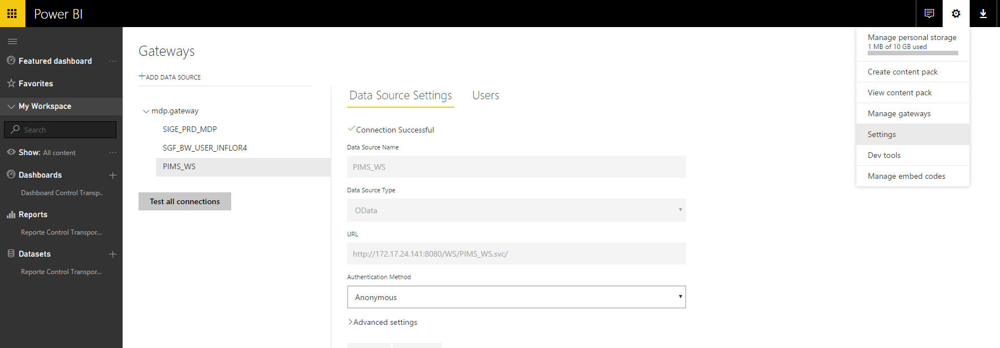

En el presente artículo se mostrarán los pasos a seguir para la correcta configuración de Gateway en Power BI, y la actualización de información de data sources utilizando dicha Gateway.

Un tema a tener presente es la finalidad del Gateway que proporciona una transferencia de datos rápida y segura entre los datos locales, y servicios. Se puede utilizar un único Gateway con diferentes servicios al mismo tiempo.

Recordar que se debe contar con una cuenta configurada de Power BI PRO y con la posibilidad de loguearse en plataforma Power BI Web.

Se recomienda instalar el Gateway en un servidor/máquina que cuente con las siguientes características (servicio):

·       El equipo debe permanecer encendido o tener ciclos cortos de apagado (que no coincidan con las actualizaciones programadas).
·       Se recomienda que la conexión a internet sea a través de una red física y no a través de redes inalámbricas.

**Instalación**

Para realizar la instalación del Gateway realizar las siguientes acciones:

1. Ingresar en el sitio de Power BI e ingresar en Download – Data Gateway

2. Una vez seleccionada dicha opción, se abrirá una pestaña con la opción para descargar el ejecutable de Gateway

3. Al ejecutar el programa se ejecutará un wizard de instalación del Gateway On-Premises. En la primera ventana se generarán recomendaciones de equipo necesario para llevar adelante la instalación del Gateway, así como también una explicación de funcionamiento y objetivos del mismo.

4. En la siguiente pantalla se debe seleccionar el tipo de Gateway a instalar, si será Enterprise o Personal. En este caso se seleccionará la opción Enterprise para continuar.​​

5. Luego comenzará la descarga del instalador de Gateway.
6. Una vez finalizada la descarga se presentará la siguiente pantalla:

7. En la siguiente ventana, deberemos especificar donde se instalará el Gateway y si se aceptan términos de uso y privacidad. Una vez seleccionado el path de destino y aceptado los términos y condición se selección la opción de Instalar.

8. La instalación puede demorar varios minutos. Se reflejará un control de avance en la siguiente pantalla:

9. El siguiente paso será la configuración del Gateway, y para ello nos solicitará que iniciemos sesión (se debe contar con una cuenta de Power BI PRO). Si contamos con los datos necesarios para iniciar sesión, seleccionar la opción *Iniciar Sesión.*

**

10. Una vez iniciada la sesión, debemos proporcionar el nombre al Gateway y una clave de recuperación asociada al mismo (esta clave no puede ser cambiada por lo que se recomienda guardarla en lugar seguro). Una vez completados los datos, elegir la opción de Configuración

11. Al completar la configuración, se mostrará el siguiente cuadro de confirmación. En esta etapa se finaliza la instalación y configuración del Gateway.

**Agregando orígenes de datos al Gateway**

Una vez configurado el Gateway, se debe asociar los orígenes de datos al mismo. Para asociar los orígenes de datos se debe realizar el siguiente procedimiento:

1. Ingresar al Sitio de Power BI, y dirigirse en el borde superior derecho a la opción Manage Gateways.

*2.*En la pantalla de administración de Gateways, se contará con un listado de gateways instalados y configurados. Para agregar un Data Source a un Gateway se debe seleccionar el mismo y elegir la opción de *Add Data Source*​

3. En la página de configuración de data source, se debe proporcionar el nombre de data source, y el origen de datos (una vez seleccionada el origen, se habilitarán otros campos a completar dependiendo el origen elegido).

**Configuración de Datasets**

Al contar con una cuenta de Power BI PRO y un Gateway configurado, podemos establecer un máximo de 8 actualizaciones diarias de los dataset. Para programar dichas actualizaciones, se debe realizar el siguiente procedimiento:

1. Ingresar en sitio de Power BI, y dirigirse a la opción Settings – Settings

2. Dentro de la página de Settings, dirigirse a la pestaña Datasets

3. En la página se listarán los datasets definidos, para los cuales se podrán configurar las siguientes opciones:
- Gateway Connection
- Schedule Refresh
- Q&A and Cortana
- Featured Q&A Questions

**Gateway Connection**

En Gateway Connection podremos especificar a partir de qué Gateway se actualizará el dataset. Podemos elegir entre uno nuevo (Power BI – Personal) y uno existente (en este ejemplo seleccionamos el creado anteriormente)

**Schedule Refresh**

En este caso se especificará la configuración de periodicidad de actualización de los datos del dataset respecto a los orígenes del Gateway establecido. Podremos especificar actualización diaria o semanal. Tomar en cuenta que se pueden establecer hasta 8 procesos de actualización diaria.

**Q&A and Cortana**

En la sección Q&A and Cortana se puede especificar si permitiremos consultas en lenguaje natural, a través de la utilización de Cortana.

**Featured Q&A Questions**

En esta sección podemos especificar un conjunto de preguntas que el usuario puede realizar, de forma de acceder a determinado comportamiento dentro del reporte.

**Gaston Gruz**

Business Intelligence Technical Manager en Arkano Software

MCSE: SharePoint
 MCSA: Office 365

 
 
import LayoutNumber from '../../../components/layout-article'
export default LayoutNumber
