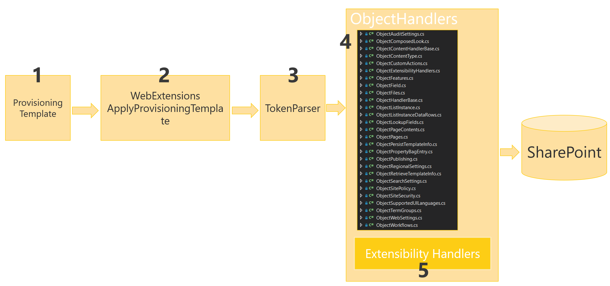

Continuando la serie de artículos hablando del framework de Provisioning del PnP, veremos cómo crear nuestros propios ExtensibilityHandlers, con los que podremos añadir nuestras propias acciones, tanto al exportar un sitio como plantilla, como al provisionar una plantilla a un nuevo sitio.

Antes de empezar, es necesario recordar un par de cosas con respecto al programa PnP. Primero, sabed que recientemente se ha liberado la reléase de agosto, que incluye numerosas mejoras en la parte de Provisioning, y que va acompañada de un nuevo Schema XML. Tenéis todos los detalles en el enlace [https://dev.office.com/blogs/PnP-August-2016-Release](https://dev.office.com/blogs/PnP-August-2016-Release)

Algunas de las novedades más destacadas son:

·          Soporte para configurar la Navegación, tanto Estructural, como por Metadatos.

·          Soporte para romper la herencia de roles en Sub sitios.

·          Soporte para User Custom Actions a nivel de listas.

·          Soporte para Terminos reusados y “deprecated”.

·          Eliminar Custom Action (hasta la fecha solo se podían añadir nuevas CustomActions).

La segunda cosa a recordar, sería, tanto el grafico con los diferentes componentes del programa PnP:


Así como el diagrama de arquitectura del proceso de provisioning, donde en el punto 5 de la imagen, podemos ver que se ejecutan los diferentes ExtensibilityHandlers que se hayan configurado en la plantilla:



Como último apunte antes de entrar en el código, cabe destacar que los Extensibility Handlers se pueden ejecutar tanto en el proceso de Provisioning, como en el de Export, (inicialmente, los Extensibilbity Handlers se llamaban Provisioning Extensiblity Providers, y solo se ejecutaban en el proceso de provisioning, por lo que no era posible ejecutar custom code a la hora de exportar un site como plantilla).

**Creando nuestro custom Extensibility Handler**

En el ejemplo del artículo, vamos a crear un custom Extensiblity Handler, que servirá para hace traza de las diferentes plantillas aplicadas a un sitio. Para ello, crearemos primero una sencilla plantilla PnP en XML, que provisionará una lista personalizada, que servirá como “tabla” de Log. Seguidamente, crearemos nuestro custom Extensibility Provider, que en cada acción de provisioning, insertara un nuevo ítem en la lista de Log, incluyendo cierta información de la plantilla. Finalmente, veremos cómo registrar nuestro Extensibility Provider dentro de la propia plantilla PnP, y ejecutaremos el provisioning para verlo en funcionamiento.

Para crear nuestro Extensibility Handler, basta con crear una nueva biblioteca de clases, y que nuestra clase, implemente la interfaz IProvisioningExtensibilityHandler definida dentro del PnP Core. Tras hacer esto e implementar la interfaz, tendremos el código de la siguiente imagen:​


El primer método Extract, se ejecutará cuando se haga el Export de un sitio existente a plantilla PnP. En nuestro ejemplo, nos vamos a centrar en la acción de provisioning, y no vamos a hacer nada en el momento de exportar el sitio, así que simplemente, devolveremos la misma plantilla que recibe el método:


El método GetTokens nos va a permitir ampliar la colección de Tokens que posteriormente recibirá la acción de Provision. El framework de Provisioning del PnP, hace uso de una clase TokenParser, que nos permite utilizar tokens en la definición de la plantilla. Dichos tokens son resueltos en tiempo de ejecución, y sustituidos por el valor real, dependiendo del contexto. Por ejemplo, podemos hacer uso del token ~sitecollectiontermstoreid que será remplazado por el ID del TermStore de la tenant, y que es muy útil para cuando queremos provisionar Site columns de metadatos administrados. El Framework dispone de muchos tokens, y seguramente cubra todo lo que necesitamos, pero si no es así, podemos utilizar este método para ampliar el listado de Tokens.

Para el ejemplo, vamos a crear un Token, que será reemplazado por el valor de una PropertyBag del web. Para ello, creamos una nueva clase, derivada de TokenDefinition


En el constructor de la clase, simplemente llamamos a su clase base, especificando el patrón de definición del Token: "\{\{webpropertybag:\{0\}\}\}". 
Esto define como se utilizará el token desde el XML de la plantilla. En este caso, si queremos usar el valor de una PopertyBag con Key "PnPTemplateVersion", desde el XML haremos algo como: "\{webpropertybag:PnPTemplateVersion\}"

Finalmente, sobrescribimos el método GetReplaceValue() donde se hace el remplazo del token por el verdadero valor. En dicho código, hacemos uso de una Extension del propio PnP, que nos facilita el trabajo para obtener una PropertyBag.

Una vez definido el token, es momento de volver al Extensibility Handler, y utilizarlo:


El último paso es rellenar el método Provision, donde insertaremos el nuevo ítem en la lista de Log

Pero antes de eso, vamos a ver como registrar nuestro custom Handler en la plantilla PnP. Para ello, usaremos el nodo Provider, disponible dentro del schema del PnP, y lo apuntamos a nuestra nueva clase custom Handler:


Hasta el nodo Configuration, todo sigue el schema del PnP. Dentro de dicho nodo, ya podemos añadir todo el XML que necesitemos, la única condición es que en el nodo raíz, definamos un NameSpace (xmlns), que será el que usaremos desde código para cargar el XDocument. En el ejemplo, lo hemos simplificado al máximo, y tan solo estamos usando el Token previamente definido, para comprobar que todo funciona bien. Dicho valor, lo insertaremos en el ítem de la lista Log.

**Bug en el PnP-Sites-Core dll**

Si ponéis un breakpoint en el método GetTokens, os daréis cuenta que dicho método no se está ejecutando nunca. Por lo que he podido comprobar, se trata de un bug en la propia dll del PnP Core. Voy a intentar hacer una Pull Request al proyecto de GitHub para corregir el error, y que esté resuelto para la siguiente reléase de septiembre, pero de no ser así, os pongo aquí como resolverlo, que obviamente pasa por tocar el código de la .dll del PnP, así que, si tenéis que hacerlo, no podréis usar el paquete de Nuget.

Para resolverlo, primero hay que editar el archivo *ExtensiblityManager.cs*, y cambiar la cabecera del método ExecuteTokenProviderCallOut

Quedando como:

```
public IEnumerable<TokenDefinition> ExecuteTokenProviderCallOut(ClientContext ctx, ExtensibilityHandler provider, ProvisioningTemplate template)
```

También necesitaremos editar el fichero *ObjectExtensibilityHandlers.cs* y modificar el método AddExtendedTokens cambiando la línea 28 como:

```
foreach (var handler in template.ExtensibilityHandlers.Union(applyingInformation.ExtensibilityHandlers))
```

Con ambos cambios resolveremos el bug, y nuestro Extensibility Provider funcionara tal y como esperamos.

Volviendo al método de Provision de nuestro custom Handler, tendremos el siguiente código para crear un nuevo ítem en la lista de Log.​


Como digo en el comentario, el parámetro de entrada *configurationData*, contiene el XML personalizado que hemos definido en la plantilla PnP, y además, este string llega con todos los tokens resueltos por el TokenParser, incluido los tokens personalizados que hemos añadido en la implementación del GetTokens.

Una vez creado nuestro Handler, podemos aplicar una plantilla PnP, y ver el resultado. La template PnP utilizada es la siguiente:


En dicha template se provisiona una property bag con el valor de la versión de la template que estamos aplicando. Además, se provisiona la lista de Log con un par de campos, y finalmente, se registra nuestro custom Handler.

Con el siguiente código podemos aplicar la plantilla desde el archivo XML y provisionarla a un sitio de SharePoint online:

```
AuthenticationManager authManager = new AuthenticationManager();var context = authManager.GetSharePointOnlineAuthenticatedContextTenant(                "https://tenant.sharepoint.com/sites/demo",                 "UserName",                 "Passw0rd");
```

```
XMLFileSystemTemplateProvider provider = new XMLFileSystemTemplateProvider("C:\\TemplateFolder", "");
```

```
var template = provider.GetTemplate("CompartiMOSS.PnP.HandlersDemo.xml");
```

```
context.Web.ApplyProvisioningTemplate(template);
```

Una vez aplicada la plantilla, podemos ver nuestra lista de Log, con un elemento con la versión de la plantilla.​


Si ahora re-aplicamos la plantilla, pero cambiamos el valor a la property bag, tenemos un segundo elemento en la lista, con el identificador que le hemos dado a la plantilla:


Nada más, ahora que ya sabemos cómo crear nuestros propios Extensibility Handlers, y siendo que estos sirven tanto para extracción de la plantilla, como cuando se aplica a un sitio, ya no hay excusa para no utilizar el Provisioning Framework del PnP, ya que cualquier necesidad especifica que no cubra el framework, se podrá desarrollar con custom CSOM.


**Luis Mañez**

SharePoint / Cloud Solutions Architect en ClearPeople LTD
 @luismanez
 [http://geeks.ms/lmanez/](http://geeks.ms/lmanez/)

