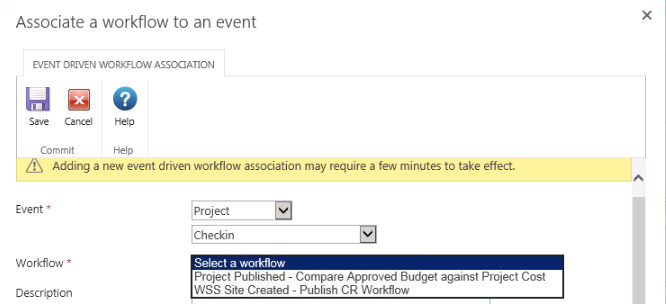

Hace tiempo que tenía ganas de hablar sobre las posibilidades que [Nintex](http://es-es.nintex.com/workflow-platform/nintex-products#Project-Server) ofrece para Project Server. Y es que no solo nos permite realizar flujos de Gestión de la Demanda de manera sencilla, al igual que lo haríamos para SharePoint, sino que, además, permite lanzar flujos que respondan a diversos eventos de Project Server: cuando se ha publicado un proyecto, cuando se ha creado un recurso. Hasta la aparición de [Microsoft Flow](https://flow.microsoft.com/es-es/), sólo Nintex permitía enlazar con estos eventos sin la necesidad de recurrir a desarrollos con Visual Studio.

**Flujos de Gestión de la demanda con Nintex**

Al habilitar Nintex Workflows en una colección de sitios de Project Server aparece una nueva opción en el apartado de configuración. Desde la misma podremos tanto crear un nuevo flujo de gestión de la demanda como asociar un flujo a un evento de Project:

En el caso de un flujo de gestión de la demanda, las acciones que tenemos disponibles son las siguientes:

·      
Cambiar un tipo de proyecto: no nativo con flujos de SPD.

·      
Comparar una propiedad de un proyecto.

·      
Publicar un proyecto.

·      
Hacer una consulta a Project Server: no nativo con flujos de SPD. Se utiliza la PSI.

·      
Leer una propiedad de proyecto.

·      
Leer un grupo de seguridad: no existente con flujos de SPD.

·      
Indicar la etapa del proyecto.

·      
Indicar información de estado.

·      
Actualizar propiedades del proyecto.

·      
Actualizar una propiedad del proyecto.

·      
Esperar a que se proteja el proyecto.

·      
Esperar a que se confirme el proyecto (en la gestión de la cartera).

·      
Esperar a que se envíe el flujo (a la siguiente etapa)

Como se ha podido comprobar, la mayoría de acciones disponibles ya existen en un flujo creado con SharePoint Designer (SPD) a excepción de las tres no nativas (las cuales, además, son muy interesantes.) Pero, además, el resto de acciones de Nintex para SharePoint también están disponibles, lo que nos permite ampliar la funcionalidad de nuestros flujos integrándola con otros que se ejecuten sobre los sitios de proyecto, por ejemplo.

Este podría ser un ejemplo sencillo de flujo de Gestión de la Demanda con Nintex:

En este caso, se leen las propiedades del proyecto "Sponsor" y "Nombre de la propuesta" y se genera una tarea para el Sponsor en la que debe decidir si aprueba o no el presupuesto del proyecto. En caso negativo se rechaza el proyecto y finaliza el flujo y, en caso afirmativo, se lee la propiedad "Presupuesto estimado" y se copia en la propiedad "Presupuesto Aprobado", continuando el flujo.

**Flujos de Gestión asociados a eventos con Nintex**

Como hemos comentado con anterioridad, hasta Microsoft Flow sólo Nintex ofrecía la posibilidad de sobre escribir los eventos de Project Server sin necesidad de desarrollos con Visual Studio. Esto lo hace especialmente potente ya que nos permite modificar u obtener datos de Project Server en respuesta a diferentes sucesos que suceden en el sistema.

En este caso, en la "Ribbon" aparecen las siguientes opciones, apareciendo los flujos y los eventos a los que se asocian bien diferenciados:

En ambos casos podemos hacer básicamente las mismas operaciones CRUD: crear, modificar y borrar tanto las acciones como los flujos. Lo primero que habría que hacer es crear un flujo para poder asociarlo a un evento. En este caso, las acciones propias de Nintex para Project Server quedan bastante reducidas:

·      
Hacer una consulta a Project Server.

·      
Obtener información del evento: por ejemplo, si el evento es el de publicación, el GUID del proyecto que se publica.

·      
Actualizar propiedades del proyecto.

En la siguiente imagen podemos ver un ejemplo de flujo orientado a eventos con Nintex:

Una vez hemos terminado nuestro flujo todavía nos falta asociarle un evento de Project Server que lo dispare. Para crear una nueva asociación, lo primero que hay que indicar es el tipo de evento que dispara la ejecución del flujo. Para ello, se debe seleccionar el objeto de Project Server sobre el que se desea ejecutar el workflow (Proyecto, Recurso, Calendario…):​

Una vez seleccionado el objeto, se despliegan los diferentes tipos de eventos correspondientes al mismo:

Finalmente, hay que indicar el flujo que se desea lanzar cuando se ejecute dicho evento:

**Conclusiones**

Como se ha podido comprobar, el uso de Nintex Workflow para Project Server nos permite aumentar las posibilidades que nos ofrece out-of-the-box Microsoft para el desarrollo de flujos sobre este producto. No sólo nos facilita el diseñador de flujos de Nintex la creación de los mismos si no que, además, nos ofrece algunas acciones adicionales que sólo están disponibles con esta herramienta. Y, lo que es mejor, nos permite lanzar flujos capturando los eventos que se producen en la herramienta pudiendo así acceder a la información en tiempo de ejecución. De esta forma, se pueden realizar cálculos tras un evento y solicitar una aprobación o cambiar el valor de un campo basándonos en los mismos. O transformar y guardar la información de un proyecto o recurso tras su edición o publicación para la realización de informes.

**Jose Rafael García**

josex1975@gmail.com

[https://projectservernotes.com/](https://projectservernotes.com/)

@jrgarcia1975

 
 
import LayoutNumber from '../../../components/layout-article'
export default LayoutNumber
