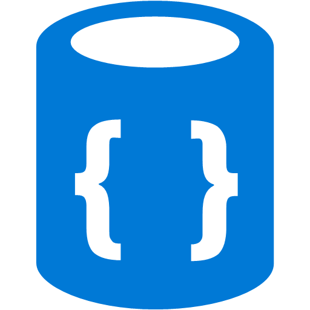
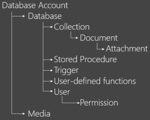
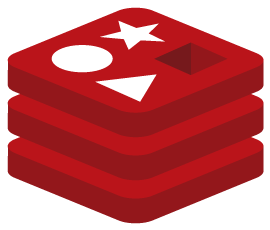
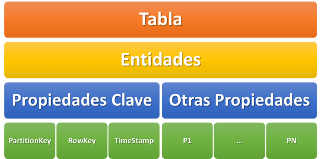
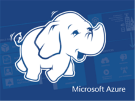

Cuando una persona se adentra en el mundo de tecnologías de información se dará cuenta que, en los proyectos de software, por lo general siempre existen estos dos componentes:

·       El software.
·       Medios de almacenamiento.

El software puede estar escrito en cualquier lenguaje de programación de nuestra preferencia como .Net o Java. Los medios de almacenamiento pueden ser desde simples archivos planos de texto hasta estructuras más complejas como bases de datos, estos elementos se deben visualizar por separado no como una sola entidad.

El primer contacto que un desarrollador o administrador de bases de datos puede tener con respecto a la gestión de información, es con una "Base de datos relacional".

Las bases de datos relacionales son aquellas que almacenan información y la mantienen en estructuras cuadradas tipo tabla. Las empresas que se mantienen líderes en este ramo son:

Comerciales (SQL Server de Microsoft, Oracle DB de Oracle) y Open Source (MySQL, PostgreSQL).

Con la llegada de Microsoft Azure como plataforma del cómputo en la nube, podemos encontrar una gran cantidad de servicios que se ofertan, entre muchos de ellos tenemos un grupo enfocado a la gestión de información.

Microsoft Azure ofrece almacenamiento con SQL Server y Oracle DB con máquinas virtuales, además de un servicio relacional en la nube llamado SQL Azure.

Una de las muchas razones por las que la nube fue concebida es: para almacenar grandes cantidades de información. Información que difícilmente podría ser guardada y procesada en servidores locales, esta información puede ser tanto relacional como no relacional.

Las bases de datos no relacionales, son aquellas que utilizan mecanismos internos de almacenamiento que no estructuran la información a manera de tabla. Su existencia se debe a necesidades de mejor performance y tiempos de respuesta que muchas veces en las bases de datos relacionales no se logran tan fácilmente.

Los servicios no relacionales que ofrece Microsoft Azure son:

**DocumentDB:** El servicio de DocumentDB ofrece un almacenamiento no relacional en texto plano con formato JSON. Las estructuras quedan categorizadas en contenedores llamados "Documentos".

Estas son algunas de sus características:

·          JavaScript Core: El motor de ejecución de consultas de DocumentDB está basado en JavaScript completamente. Objetos ya conocidos en SQL Server como procedimientos almacenados, funciones o triggers también se encuentran en DocumentDB.

·          Consultas con sintaxis SQL: DocumentDB soporta SQL tal cual como si trabajáramos desde SQL Server, por lo que al momento de extraer o procesar información, el ambiente nos será muy familiar.

·          Administración supervisada: Esto significa que podemos administrar roles y permisos para usuarios en particular.

·          Estructura: Todas las entidades almacenadas en DocumentDB mantienen el formato Json de manera nativa.

·          Escalabilidad: DocumentDB se encuentra en la nube de Microsoft Azure, por lo que almacenamiento y rendimiento se regulan a través del tiempo de acuerdo a las necesidades llegando al orden de petabytes sin problemas.

·          Tipo documental: Se utilizan elementos denominados documentos, no tablas.

El modelo de recursos por el cual funciona DocumentDB es el siguiente:

·       Data Base Account (Cuenta de base de datos)

Se refiere a la cuenta principal con lo que se administra la base de datos DocumentDB.
·       DataBase (Base de Datos)

Es el contenedor lógico de usuarios, segmentado por colecciones.
·       Collection (Colección)

Contenedor de documentos JSON.
·       Document (Documento)

Objetos CRUD (Create, Read, Update, Delete) por colección.
·       Attachments / Media (Archivos adjuntos)

Almacenamiento binario con Blobs.
·       Store Procedures, Triggers and Functions (Procedimientos almacenados, desencadenadores y funciones)

Lógica de la aplicación que se ejecuta en la base de datos, escrito completamente en JavaScript.
·       Users (Usuarios)

Nombre de espacio lógico para alcances de permisos.
·       Permissions (Permisos**)**

·       Control de acceso a recursos específicos por medio de tokens de autorización.

**Azure Redis**: El servicio de Redis ofrece un almacenamiento no relacional en memoria RAM, toda la información se va acumulando en memoria volátil y no en disco duro. Las maneras en que Redis almacena información son las siguientes:

·        [Strings](http://redis.io/topics/data-types-intro#strings)

·        [Lists](http://redis.io/topics/data-types-intro#lists)

·        [Hashes](http://redis.io/topics/data-types-intro#hashes)

·        [Redis Sets](http://redis.io/topics/data-types-intro#sets)

·        [Sorted Sets](http://redis.io/topics/data-types-intro#sorted-sets)

·        [Bitmaps](http://redis.io/topics/data-types-intro#bitmaps)

·        [Hyperloglogs](http://redis.io/topics/data-types-intro#hyperloglogs)

·        [Geospatial Indexes](http://redis.io/commands/geoadd)

Una de las principales limitaciones de Redis (en sí mismo) es la memoria, ya que las estructuras de datos no pueden ser mayores a esta, pero dado que Redis se encuentra en la infraestructura de Microsoft Azure, esa limitación se vuelve casi nula, los paquetes más básicos que podemos encontrar al momento de escribir este post, rondan en los 53 GB.

Ahora que nos queda más claro que es Redis, podríamos hacernos esta pregunta: ¿Por qué debería usar Redis a diferencia de una base de datos relacional?

Y bueno, la primera respuesta que podría ofrecer es: No debemos de usar Redis a menos que lo necesites, eso depende de la naturaleza de tu proyecto.

Aquí expongo algunas características de Redis:

·       Redis se maneja en memoria RAM, por lo que el tiempo escritura y lectura de datos es superior que al hacerlo en un disco duro físico o virtual.

·       Redis soporta replicación maestro-esclavo, por lo que los datos de un maestro pueden ser replicados a uno o varios esclavos, y estos a su vez también pueden actuar de maestros para otros esclavos.

·       Los datos en Redis no siempre serán aleatorios, también pueden ser persistentes (pasarlos a disco duro).

Estos son algunos ejemplos de proyectos que podrían usar Redis de manera ideal:

·       Videojuegos.

·       Proyectos que involucren mensajería instantánea.

·       Software que constantemente invoque consultas transaccionales SQL.

·       Aplicaciones de tiempo real.

**Table Storage:** El servicio de Table Storage ofrece un almacenamiento no relacional similar a una tabla de bases de datos relacionales. Sin embargo, los registros de estas tablas no tienen que tener el mismo número de columnas y tampoco necesitan de campos clave para hacer relaciones. Una sola tabla de tipo Table Storage dependiendo la arquitectura que se le dé, puede almacenar una o varias bases de datos simultáneamente.

Table Storage no es una base de datos relacional, pero es una alternativa al modelo de datos relacionales existente, estas son algunas de sus características:

·       Las tablas son independientes.

·       No existen llaves foráneas o joins.

·       No existen índices personalizados.

·       Una consulta de datos, se puede extender a más de un servidor, no limitándose a uno como normalmente existe en un modelo relacional.

Estos son los elementos que conforman una tabla:

·       Entidades: Puedes verlas como renglones o registros en una tabla.

·       Propiedades: Puedes verlas como las columnas de un registro en una tabla. Siempre deben existir tres propiedades clave:

·       PartitionKey: Tipo string, no mayor a 1 KB, comprende una ó varias entidades en una tabla.

·       RowKey: Tipo string, no mayor a 1 KB, identifica de manera única una entidad dentro de la partición de la tabla.

·       TimeStamp: Mantiene la hora en la que una entidad fue insertada o actualizada en la tabla.

·       Particiones: Es una colección de entidades en una tabla que tienen el mismo PartitionKey.

**HDInsight:** El servicio de HDInsight ofrece un almacenamiento no relacional dedicado al tratamiento de información a gran escala y no estructurada (que no tenga un tipo de dato definido), mejor conocido hoy en día como Big Data. Detrás de este servicio encontramos Hadoop.

Hadoop es un framework que permite el procesamiento de grandes volúmenes de datos a través de clusters. Su diseño permite empezar desde pocos hasta cientos de nodos. Hadoop es un sistema distribuido con arquitectura Maestro/Esclavo (Master/Slave), usando para almacenar información en su formato (HDFS) y algoritmos de tipo MapReduce. Clic aquí para conocer más de HDInsight: [http://bit.ly/2aQ0TZ2](http://bit.ly/2aQ0TZ2)

**Conclusiones**

Como te podrás dar cuenta, los medios de almacenamiento son muy diversos. Dependiendo de las necesidades y objetivos de nuestros proyectos deberemos elegir la mejor alternativa.

Espero que este artículo te sea de utilidad y aprovecho para invitarte a seguirme por social media.

**Víctor Moreno**

MVP Microsoft Azure

@vmorenoz | [http://blogs.itpro.es/eduardocloud](http://blogs.itpro.es/eduardocloud)​

 
 
import LayoutNumber from '../../../components/layout-article'
export default LayoutNumber
