Antes de adentrarnos en el mundo de Microsoft Flow y la integración de APIs personalizadas sobre PowerApp, debemos entender que solo en casos muy concretos vamos a necesitar utilizar estas herramientas. Es decir, tenemos que delimitar muy bien cuando utilizar conectores estándar que ya nos aporta PowerApp, y cuando tender a desarrollar APIs personalizadas que requieren de un tiempo de implementación.

A lo largo de este artículo veremos cómo integrar una WebApi en nuestras PowerApps como una conexión más dentro de nuestro catálogo de conexiones, y además veremos cómo integrar flujos de trabajos de Microsoft Flow con nuestras aplicaciones.

Dado que siempre es más intuitivo trabajar sobre un ejemplo, en los siguientes puntos vamos a desarrollar una app sencilla en PowerApp que consiste en una Agenda de usuarios que contenga la información de contacto, y la actividad en Twitter de cada usuario de la agenda. La particularidad de la aplicación es que todos los datos van a estar alojados en una base de datos de MongoDB.

**Agenda de Contactos: PowerApps y MongoDB**

Vamos a implementar una aplicación en PowerApp desde una plantilla en blanco (revisar artículos anteriores si surgen dudas), dejando un poco el diseño a elección propia. La idea de implementar esta APP es poder tener una agenda de contactos en el móvil, diseñar un listado de usuarios, un alta de contactos, una actualización de contactos y una vista de detalle.

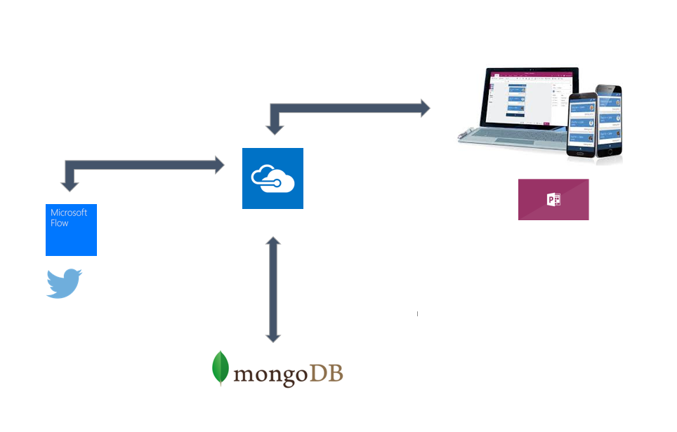

Además de almacenar los datos de contactos de un usuario, vamos a almacenar la actividad de Twitter relacionada con nuestra agenda utilizando el hastag  #AgendaPowerApps.  La actividad de Twitter la vamos a capturar por medio de un Microsof Flow, y la integración entre la Agenda y la base de datos la vamos implementar con un webApi. El api web lo podemos desplegar como un webSite o como un api App en Azure.

**WebApi gestión de contactos en la Agenda: AgendaController**

Vamos a implementar una webApi sencilla para desplegarla en nuestro entorno de Azure. Para ello desde el Visual Studio creamos una nueva solución y añadimos un proyecto del tipo Web Application / Web Api.

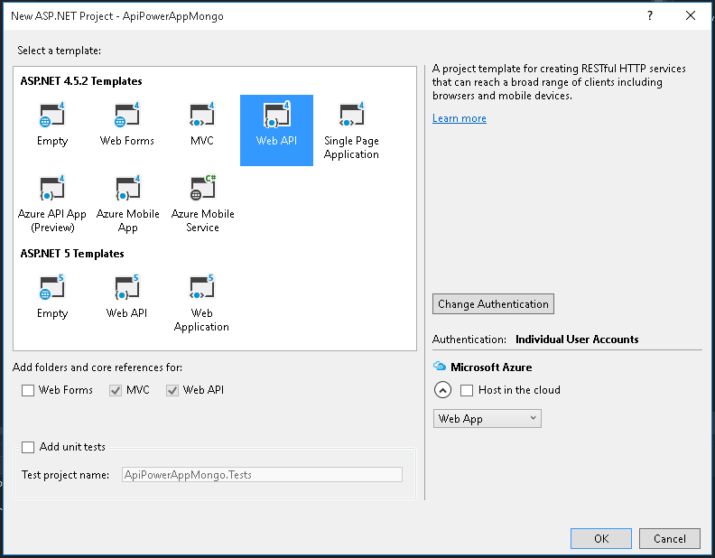

Lo vamos a hospedar en Azure por lo que podemos aprovechar a dejar configurado el despliegue antes de continuar. En cuanto a la autenticación no es relevante para este ejemplo, pero aclarar que PowerApps soporta autenticación con OAuth contra Azure AD.

Una vez creada la solución y la WebApi vamos a crear los métodos necesarios para gestionar la Agenda.

Lo primero es crear un nuevo controlador en la Api que llamaremos AgendaController, y yo recomiendo borrar todos los controladores que no vayamos a utilizar y que la plantilla base de Visual Studio nos ha generado.

AgendaController podría quedar algo de la siguiente forma:

[HttpGet]

[Route("GetAllContact")]

public IEnumerable&lt;BaseContact&gt; GetAllUser(){}


[HttpGet]

[Route("GetUserById")]

public ContactGetUser(string id){}


[HttpPost]

[Route("AddUser")]

public boolAddUser([FromBody]Contact contact){}


[HttpPost]

[Route("DeleteUser")]

public boolDeleteUser(string id){}


[HttpPost]

[Route("AddTweet")]

public boolAddTweet(Tweet tweet){}


Vamos a tener dos métodos GET para obtener el listado de usuarios y el detalle de un usuario por Id, y tres métodos POST para implementar el Añadir, Borrado y Añadir nuevo Tweet. Más adelante veremos que contienen los modelos BaseContact, Contact y Tweet y una posible implementación de la solución.


Supongamos que ya tenemos implementada la WebApi tal y<br />como necesitamos, y queremos proceder a registrar la API en nuestra PowerApp. Decir<br />que el primer punto que debemos cubrir es tener instalado Swagger en nuestra<br />Api. Este framework para API’s, nos va a permitir extraer la definición de<br />nuestra WebApi e integrarla en PowerApps.
<br />Para ello desde el visual studio necesitamos instalar el paquete Nuget<br />Swashbuckle, tal cual se aprecia en la siguiente figura.

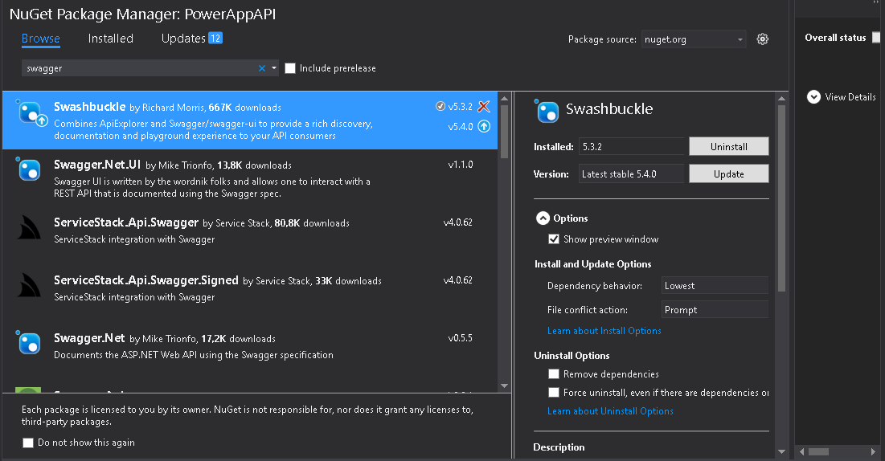

Una vez instalado el Swagger, y tras<br />haber implementado correctamente el controlador, podemos publicar el api en el<br />webSite de Azure. Si accedemos a  &lt;url<br />publicación api&gt;/swagger podremos ver la estructura de nuestra API, realizar<br />testeo de los diferentes métodos expuestos y lo más importante para el registro<br />obtener el fichero de definición.

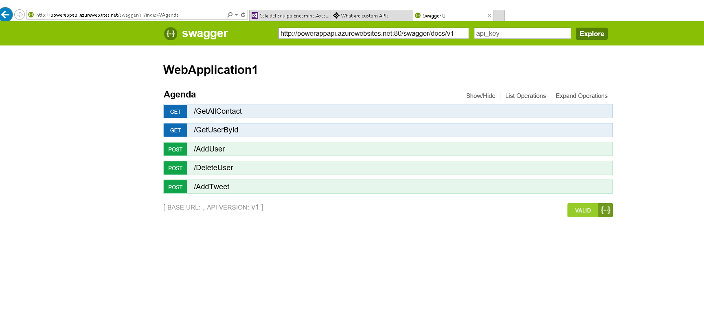

Para ello accedemos a &lt;url api&gt;/swagger/docs/v1, y descargamos el fichero .json que contiene toda la definición de la API que acabamos de desplegar. Este fichero no hace falta modificarlo ya que Swagger ha extraído todas las configuraciones y métodos que hemos ido definiendo desde el Visual Studio.

Una vez descargado el fichero vamos a acceder a [https://powerapps.microsoft.com/es-es/](https://powerapps.microsoft.com/es-es/) con nuestra sesión de usuario y seleccionamos “conexiones” y nueva conexión.

En la siguiente pantalla veremos que tenemos las conexiones estándar, y un apartado para conexiones “Custom”. Seleccionamos New Custom Api para registrar el API que hemos implementado.

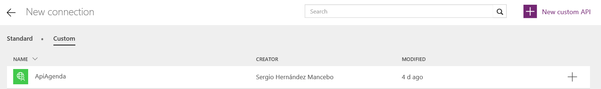

En este punto se nos solicitará el archivo de definición que nos ha generado Swagger, y algún dato de personalización como el nombre o una imagen personalizada. Una vez registrada la API, (veremos que es un paso casi instantáneo), debemos registrarla como nueva conexión, para que nuestras PowerApps puedan consumirlas.

Si vemos la imagen anterior, es tan fácil como seleccionar “+”,  y seleccionar “Add Connection”.

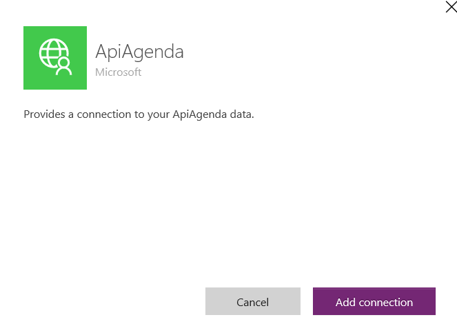

Desde este momento ya podemos añadir como nuevo "DataSource" nuestra API en la PowerApp, como veremos un poco más adelante.

**Capa de Acceso a Datos, Modelos y MongoDB**

Una vez elegido MongoDB como motor de base de datos, debemos estructurar bien la información para huir de los métodos de diseño de base de datos que utilizábamos en los modelos relacionales. Para conseguir esto, el primer objetivo que debemos cumplir es evitar los cruces entre nuestras entidades de datos, ya que en MongoDB este hecho nos podría penalizar, ya que nuestros datos están almacenados en documentos y no en tablas relacionadas.

Por tanto, para este ejemplo se ha desarrollado un modelo de documento que almacena el listado de todos los usuarios y la mínima información necesaria, y otro modelo de documento que almacena la información extendida del contacto y las entradas de Twitter que realice.

Podemos decir entonces que el documento Index (listado de contactos) va a ser único y se va a cruzar con nuestro modelo BaseContact, y el documento "Contacto" va estar replicado una vez por cada contacto y se va a mapear con el modelo de clase Contact.

Toda la información va ir serializada en formato JSON, para simplificar los mapper, y por seguir un estándar.

***Modelos***

**BaseContact**

```
public class BaseContact    {        public string Id { get; set; }        public string Name { get; set; }        public string UserName { get; set; }        public string Image { get; set; }    }
```

**Contact**

```
Public class Contact : BaseContact    {        public string Adress { get; set; }        public string Phone { get; set; }        public string Date { get; set; }        public List<Tweet> TweetMessage { get; set; }    }
```

El modelo contact contiene una lista de Tweet, que no es más que la información recogida desde Twitter como puede ser el nombre, usuario, fecha…..; un poco lo que necesitemos almacenar.

Los documentos que vaya almacenando el api en el MongoDB, deberán llevar un metadato adjunto al documento para poder hacer consultas contra la base de datos. En este caso vamos a utilizar el campo "Id" de BaseContact, que va a llevar la cuenta de Twitter asociada al contacto, y que sabemos a ciencia cierta que es única en el sistema.​

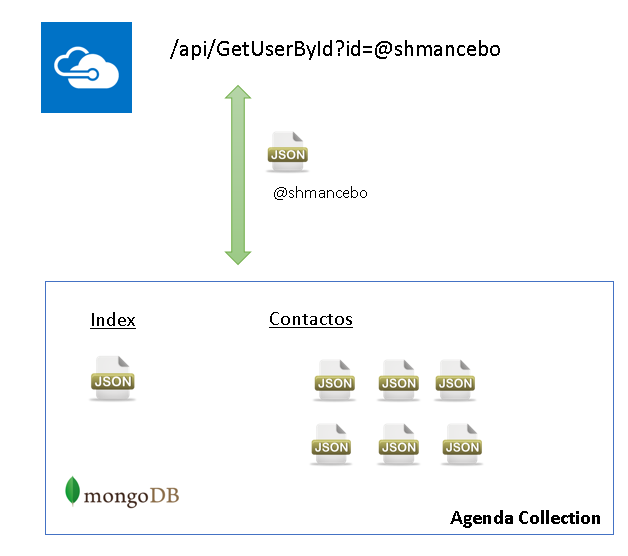

**Estructura de la solución**

Para consumir la base de datos en MongoDB vamos a implementar una clase repositorio que nos permita insertar, actualizar y obtener los ficheros JSON que necesitamos, así como mapearlos en los modelos de clases que hemos definido con anterioridad.

Como podemos ver en la imagen de la solución, se ha optado por un patrón repositorio para el acceso a datos, y un modelo de N-capas para distribuir la aplicación.

Lo importante del artículo no es la implementación de la solución, pero es un ejemplo de cómo podía quedar en caso de querer abordarla.

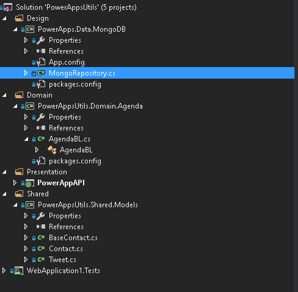

Para consumir la base de datos en MongoDB vamos a implementar una clase repositorio que nos permita insertar, actualizar y obtener los ficheros JSON que necesitamos, así como mapearlos en los modelos de clases que hemos definido con anterioridad.

Como podemos ver en la imagen de la solución, se ha optado por un patrón repositorio para el acceso a datos, y un modelo de N-capas para distribuir la aplicación.

Lo importante del artículo no es la implementación de la solución, pero es un ejemplo de cómo podía quedar en caso de querer abordarla.

No voy a profundizar en la capa de negocio, en mi caso he implementado una clase AngendaBL, que se encarga de orquestar las llamadas a la capa de acceso a datos y recibir las llamadas desde la API. Esta capa se puede implementar a medida de la solución que queramos dar, en mi caso podemos ver un ejemplo de cómo queda el método "AddIndexContact".

```
    public bool AddIndexContact(Contact contact)        {                       var users = GetContacts()?.ToList();            MongoRepository<BaseContact> mongoRepository = new  MongoRepository<BaseContact>();                       users = users ?? new List<BaseContact>();            var existUsers = users.Where(c => c.Id == contact.Id).FirstOrDefault();            if (existUsers != null)            {                users.Remove(existUsers);                DeleteContact(existUsers.Id);                DeleteContact("index");            }            users.Add(contact.GetMinContact());            var document = JsonConvert.SerializeObject(users);            var id = mongoRepository.UploadFileFromBytes(System.Text.Encoding.UTF8.GetBytes(document), "index");            return !string.IsNullOrEmpty(id);        }
```

Este método se encarga de "verificar" si el contacto ya existe en la colección de MongoDB, y si es así descarga el documento, borra de la lista el usuario para actualizarlo de nuevo, borra el documento index y lo sube de nuevo actualizado. Esto es porque MongoDB no aporta un update directo, por lo que debemos descargar el documento, incrementarlo y borrar la copia anterior antes de subirla, para no tener varios documentos con el mismo metadato asociado. Con este método actualizamos el documento Index.json
 Sería un proceso similar actualizar el documento contact.json

***MongoRepository: controla tu MongoDB***

Igual que la clase negocio no resulta interesante para este artículo, si merece la pena detenernos un poco más en la clase repositorio de MongoDB, y ver que paquetes necesitamos para manejar una base de datos no relacional de este tipo.

Para implementar MongoRepository hemos hecho uso principalmente de los paquetes NuGet

MongoDB.Driver.GridFS y MongoDB.Bson.​

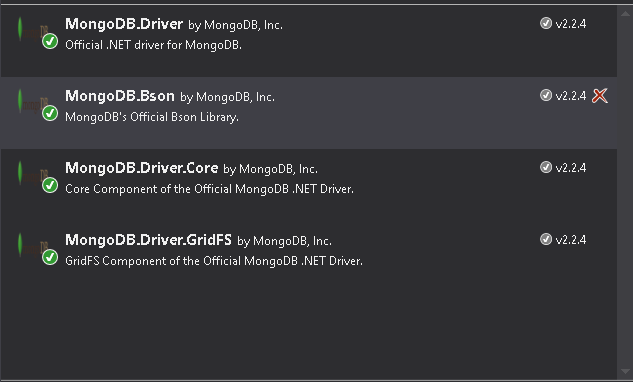

Con el paquete MongoDB.Bson controlamos todo el apartado de conexiones y consultas, y por el contrario con el paquete MongoDB.Driver.GridFS controlamos el tráfico de ficheros.

Lo primero que necesitamos para hacer una consulta o un uplodad de un documento en MongoDB desde código es instanciar una conexión contra el servidor de base de datos.

Una buena forma es implementar en el constructor de la clase repositorio la conexión a "MongoClient", y así tenerlo disponible desde el primer momento.

```
   public MongoRepository()        {            ServerMongoDb = ConfigurationManager.AppSettings["urlMongoDb"];            this.Database = ConfigurationManager.AppSettings["databaseMongoDB"];            this.Collection = ConfigurationManager.AppSettings["collectionMongoDB"];            this.CollectionInternalName = this.Collection + ".files";            Client = new MongoClient(this.ServerMongoDb);        }
```

No debemos preocuparnos de cerrar la conexión, porque en este caso MongoClient no es disposable.

Como apreciamos en el código necesitaremos la url al servidor, una base de datos en Mongo, y el nombre de la colección donde haremos las operaciones (aunque Mongo aporta una colección files por defecto si no se lo indicamos).

Para realizar una consulta contra MongoDB podemos fijarnos en el método GetDocument(string id), que vamos a implementar para obtener documentos desde el MongoDB.

```
  public dynamic GetDocument(string codDocumento)        {            try            {                var database = Client.GetDatabase(Database);                var bucket = new GridFSBucket(database);                var listaFiltros = new List<FilterDefinition<GridFSFileInfo>>();                var filtro = Builders<GridFSFileInfo>.Filter.Eq(fi => fi.Metadata["codDocumento"], codDocumento);                listaFiltros.Add(Builders<GridFSFileInfo>.Filter.And(filtro));                var filters = Builders<GridFSFileInfo>.Filter.Or(listaFiltros);                var files = bucket.Find(filters).ToList();                if (files.Any())                {                    var datos = bucket.DownloadAsBytesByNameAsync(files.FirstOrDefault()?.Filename).Result;                    var valueJson = System.Text.Encoding.UTF8.GetString(datos);                    return JsonConvert.DeserializeObject<T>(valueJson);                }                else return null;                   }            catch            {                throw;            }        }
```

En un primer paso recuperamos la base de datos con el método GetDataBase, y con esta vamos a crear una instancia de GridFSBucket, que nos va a permitir aplicar los filtros necesarios para realizar una consulta sobre la base de datos.

En este caso solo tenemos un campo metadato asociado al documento que es el "codDocumento", y que como dijimos antes será la cuenta de Twitter del usuario. Si obtenemos algún tipo de file relacionado al codDocumento consultado, basta con hacer una descarga del documento con el método "DowloadAsByteNameAync", que nos devuelve el fichero en bytes desde la bbdd.

Una vez tenemos descargado el fichero ya podemos trabajar con el tal y como necesitemos, como podemos ver en el código ejemplo nosotros necesitamos deserializarlo en un tipo anónimo que bien el caso puede ser BaseContact o Contact en función de la petición que necesitemos devolver.​

Por ultimo nos quedaría por implementar un Upload de un documento en MongoDB. Para ello necesitamos el siguiente código:

```
  public string UploadFileFromBytes(byte[] content, string codDocumento)        {            try            {                ObjectId result;                var database = Client.GetDatabase(Database);                var bucket = new GridFSBucket(database);                var options = new GridFSUploadOptions                {                    Metadata = new BsonDocument                {                    {"codDocumento", codDocumento},                }                };                result = bucket.UploadFromBytes($"loadFile{codDocumento}", content, options);                return result.ToString();            }            catch            {                throw;            }        }
```

Como vemos es muy sencillo, basta con asociar el metadato correcto al fichero que recibimos en el parámetro content en byte[] y realizar un UploadFromBytes.

**Anotar una entrada en Twitter: Microsoft Flow**

Para registrar en el modelo Contact los tweets de un usuario vamos a diseñar un pequeño flujo de trabajo. Para ello desde el mismo portal de PowerApps que hemos visitado en el punto de registro del api seleccionamos "Flows" en el menú global izquierdo y después "Create a Flow".

Esto nos lleva al diseñador de flujos de Microsoft Flow, y que como vemos es muy intuitivo. Podemos utilizar una plantilla base, o en nuestro caso una en blanco.

Se nos va a solicitar el evento que fuerza el arranque del flujo, en nuestro caso vamos a utilizar el conector de Twitter, y el evento "When a new tweet is posted", configurándolo como vemos en la imagen.​


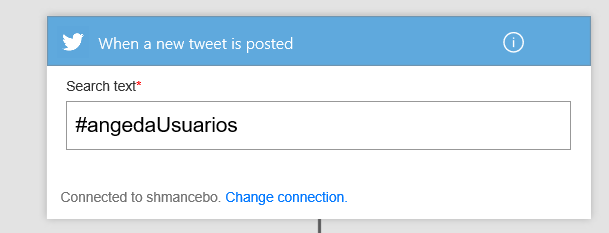

Esta primera caja, va a esperar a que alguien en Twitter escriba un nuevo mensaje con “#agendaUsuarios”, en caso de que esto suceda se iniciará una instancia del flujo.

Una vez iniciado necesitamos añadir un nuevo paso para registrar el Tweet en nuestra base de datos. Para conseguirlo vamos a aprovechar de que tenemos una API, y seleccionando en nuevo paso, buscamos el método “AddTweet” que tenemos expuesto como método POST en nuestra API (muy importante que sea un método post o no va a parecer en este tipo de caja).

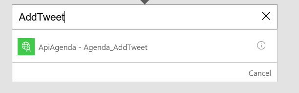

Como vemos podemos conectar un Flow directamente a un método de la API, sin necesidad de realizar ninguna petición compleja o configuración intermedia.

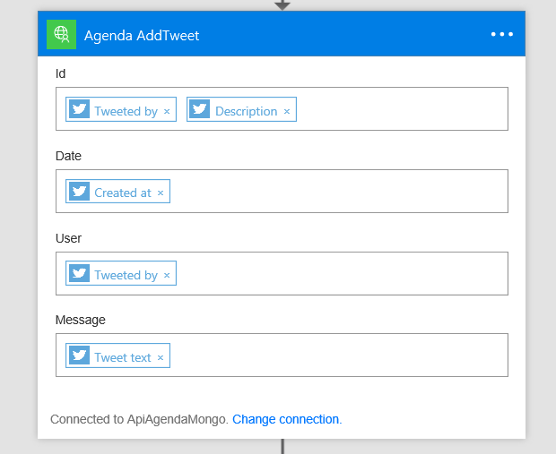

Añadimos la caja y la configuramos tal y como viene en la siguiente imagen. Como podemos deducir, se exponen los campos del modelo “Tweet” que si recordamos le pasábamos al método AddTweet de la apiAgenda.

Mapeamos estos campos del modelo con valores de Twitter de tal forma que la API reciba todos los parámetros necesarios para rellenar el modelo en base de datos. Por ultimo le damos un nombre al Flow, y lo guardamos para que pueda empezar a usarse.

Si escribimos un Tweet, podemos hacer un seguimiento de la ejecución de este trabajo desde el propio portal de flow, seleccionando en el apartado “info” que tenemos junto al flujo seleccionado.

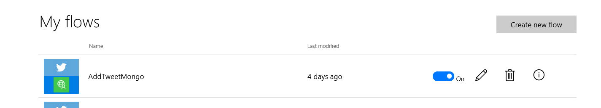

**App Agenda: Consumir una Api desde PowerApps**

Una vez tenemos los procesos y la Api implementados podemos centrarnos en implementar la propia aplicación. Para ello podemos crearla desde la aplicación PowerApps de Windows 10, o desde hace poco desde la versión preview del editor en versión web.

Como he adelantado al principio del artículo no me voy a detener mucho en la "implementación" de la app, ya que en artículos anteriores hemos hablado mucho de este punto, decir que solo se han utilizado controles básicos como Galerías personalizadas, Botones, eventos de Navegación y alguna colección de datos que repasaremos en este punto.

Lo primero que debemos hacer es añadir como DataSource la api que hemos implementado durante el ejemplo. Para ello desde la barra superior en el apartado content, seleccionamos DataSource y buscamos la apiAgenda seleccionando "Add data Source".

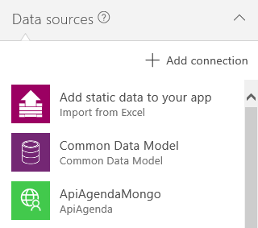

Como adelantamos al inicio la primera pantalla de la APP es el listado de usuarios.

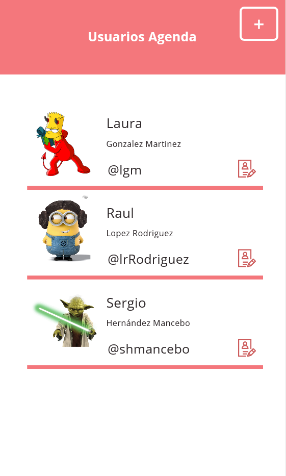

Esta pantalla se ha implementado con una galería personalizada que mapea un listado del modelo "BasicContact", de la forma que en el evento "OnVisible" de esta pantalla, se ha aprovisionado una colección de datos llamada Usuario.

**ClearCollect(usuarios,ApiMongo.AgendaGetAllUser())**

Esto nos permite almacenar la lista de usuarios en una colección propia de PowerApp, y en caso necesario poder trabajar con Filtros o Trasformaciones de datos. Además de este listado de usuarios se han implementado dos pantallas más como son AddContact y ViewContact.

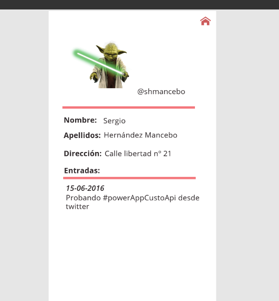

En el caso de la vista de detalle, en el evento de carga se crean dos colecciones de la forma:

·       **ClearCollect(usuarios,ApiMongo.AgendaGetUser(currentId));**
·       **ClearCollect(entradas,ApiMongo.AgendaGetUser(currentId).TweetMessage)**

Si vemos en la imagen los datos personales y la imagen se corresponden con la colección usuarios, y por otro lado la lista de entradas (Tweets) se corresponde con la colección entrada.

Solo falta por deducir que el parámetro "currentId", se envía desde la lista de usuarios de la forma Navigate (VistaDetalle,ScreenTransition.Fade,\{idUsuario:Id\}).

La función Navigate, además de permitir hacer enlaces entre las distintas vistas de la aplicación, permiten pasar en la petición parámetros, como puede ser el idUsuario.
Eso sí tenemos que recordar que en la carga de la página destino tenemos que capturar en el context de la página el parámetro enviado, 
tal y como hacemos en la página de detalle con la instrucción UpdateContext(\{currentId: idUsuario\}).

Si nos centramos en la página de "AddContact", poco interesante podemos deducir a nivel de implementación en PowerApps, es un formulario simple con un control de carga de imágenes, y múltiples TexBox, solo a destacar el evento Guardar, que muestra de forma muy visual lo rápido que es hacer peticiones post desde PowerApp contra una custom Api.

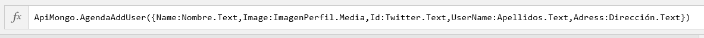

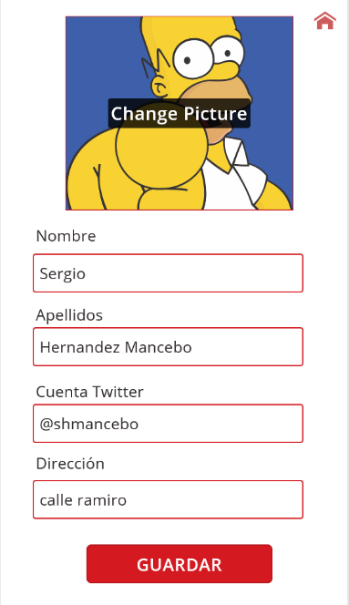

Como podemos ver en la imagen, basta con mandarle al método AgendaAddUser el modelo "Contact" que espera recibir entre {}. Si analizamos la petición el propio editor de fórmulas te indica que parámetros requiere la petición y basta con cruzarlos con los textBox de la pantalla.

**Conclusiones**

Bueno con este artículo hemos ido un paso más allá en nuestra serie de PowerApps. Posiblemente lo que hemos podido ver inquiete a los usuarios de negocio dado que hemos tratado conocimientos complejos, y motive a los desarrolladores a lanzarse a usar esta tecnología ya que este modelo de trabajo con PowerApps es mucho más flexible y libre que trabajar solo con fórmulas y conectores estándar.

Pero como casi siempre en la vida no todo es blanco o negro, y en este caso lo único complejo es "decidir" cuando optar más por un modelo basado en conectores estándar, formulas y controles básicos, o por otro lado optar más por implementar una API personalizada e impactar en horas de desarrollo un proyecto.

En nuestro caso es evidente, a día de hoy no podemos trabajar con MongoDB si no es con el segundo modelo, pero también hay otros factores como puede ser el rendimiento de una PowerApps a grandes volúmenes de información, o la complejidad de las consultas, que nos pueden hacer movernos a implementar una Api y aligerar así nuestros DataSource.

Lo que sí que es cierto, es que según avanzas con este producto ves que cada vez incluye más perfiles potenciales que pueden centrarse en su uso y desarrollo, y lo más importante se empieza a ver integrado en capa web, en listas de Sharepoint Online….; tenemos PowerApps para rato, así que empecemos a darles cariño.


**Sergio Hernandez Mancebo**

Team Leader en ENCAMINA

shernandez@encamina.com

 
 
import LayoutNumber from '../../../components/layout-article'
export default LayoutNumber
