import ArticleHeader from '../../../components/article-header'

<ArticleHeader frontmatter={props.pageContext.frontmatter} />

En el pasado //build/ Microsoft presentó Microsoft Bot Framework, una nueva tecnología que ofrece grandes posibilidades tanto para las empresas como para los desarrolladores ya que permitirá automatizar tareas como por ejemplo atención al cliente siendo capaz de interactuar por canales tan diversos como Skype, chat web, Slack, Telegram, etc.

**Construyendo nuestro primer Bot**

Dado que aún es una tecnología que está naciendo, los primeros pasos para construir nuestro Bot son algo engorrosos y manuales contrariamente a lo que nos tiene acostumbrados Microsoft, así que vamos a ver de forma muy esquemática cómo comenzar.

1.       Instalar VS 2015 (vale la versión Community).

2.       Instalar [la plantilla de Bots que podemos encontrar aquí](http&#58;//aka.ms/bf-bc-vstemplate).

3.       Descomprimir el contenido del archivo .zip que nos descargamos en la carpeta "%USERPROFILE%\Documents\Visual Studio 2015\Templates\ProjectTemplates\Visual C#\"

4.       Abrir Visual Studio.

5.       Crear un proyecto usando la plantilla "Aplicación Bot".

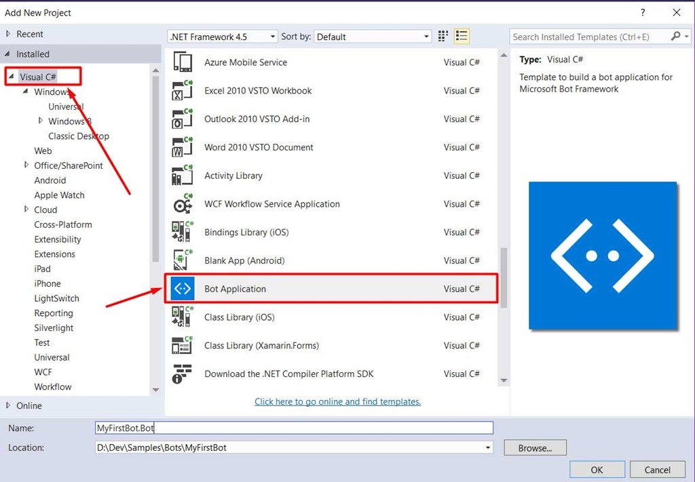

**Estructura del proyecto**

El proyecto, como podremos observar**,**se corresponde con WebApi lo que, a todas luces, es lógico dado que un Bot no será más que un servicio que se comunicará con los usuarios, respondiendo ante determinadas acciones que el controlador correspondiente, por defecto *MessagesController*, se encargará de procesar.

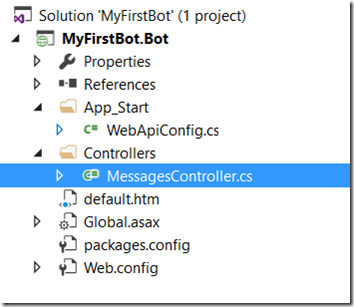

Como se puede observar en la imagen 2, disponemos también de una página por defecto, default.htm, que será la página donde deberemos definir los términos de uso además de indicarnos información para el registro de nuestro Bot para que pueda ser usado.

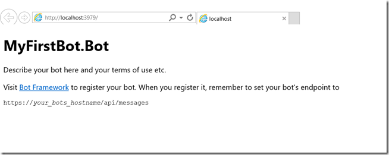

**Testeando el Bot localmente**

Para poder testear el Bot, disponemos de un emulador, Bot Framework Emulator, que podremos descargarnos desde [https://aka.ms/bf-bc-emulator](https&#58;//aka.ms/bf-bc-emulator) que nos permitirá comunicarnos con nuestro Bot de diversas formas como, por ejemplo, simular una conversación entre múltiples usuarios, testear diferentes tipos de comunicación, cambiar el lenguaje de comunicación, etc.

Para empezar, tenemos que establecer los parámetros correctos de comunicación con nuestro Bot de la siguiente forma:

·      
Local Port: 9000.

·      
Emulator Url: [http://localhost:9000/](http&#58;//localhost&#58;9000/)

·      
Bot Url: Bot Url: La dirección en la que se encuentra publicado el Bot que, en caso de realizar una prueba en local como la que estamos tratando, será http://localhost:{PORT}/api/messages. Para conocer el puerto en el que se está ejecutando, basta con mirar la dirección resultante a la hora de ejecutar el proyecto desde Visual Studio o, simplemente configurarlo en el proyecto tal y como se ve en la siguiente imagen.

·      
Microsoft App Id: El id de la aplicación relacionada con el Bot. Si lo estamos ejecutando en local y no establecemos nada en nuestro archivo de configuración “web.config”, debemos dejarlo vacío.

·      
Microsoft App Password: El password de acceso a la aplicación relacionada con el Bot. Si lo estamos ejecutando en local y no establecemos nada en nuestro archivo de configuración “web.config”, debemos dejarlo vacío.

​​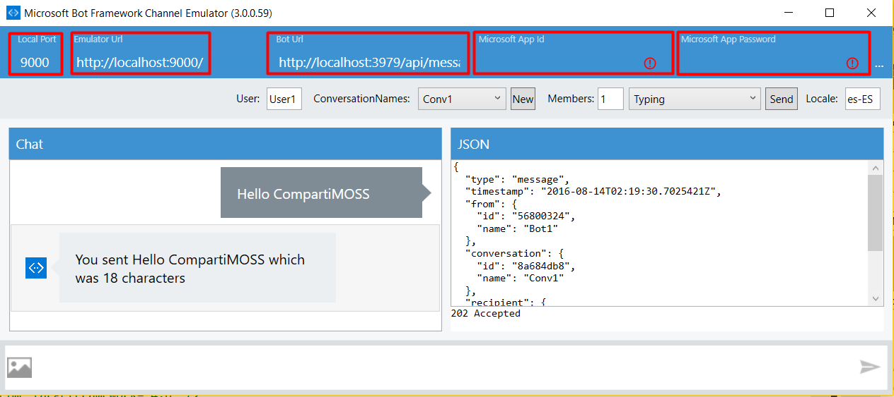

Por defecto, la plantilla de aplicación Bot viene configurada para respondernos con una cuenta del número de caracteres que hemos escrito como mensaje, además, en el panel derecho podemos visualizar el mensaje JSON que comunica el Bot.

**Publicación del Bot**

Una vez hayamos desarrollado la funcionalidad de nuestro Bot y testeado que todo funciona correctamente, tendremos que publicarlo para que pueda ser consumido por los usuarios.

Tal y como ya habíamos comentado, el Bot no es más que una aplicación WebApi y, por lo tanto, se publicará como Azure Web App.

1.       Seleccionamos publicar desde el menú contextual del proyecto.

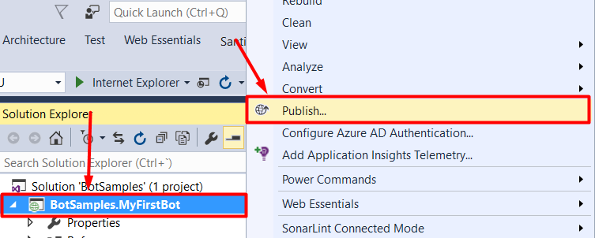

2.      
Seleccionamos Microsoft Azure App Service.

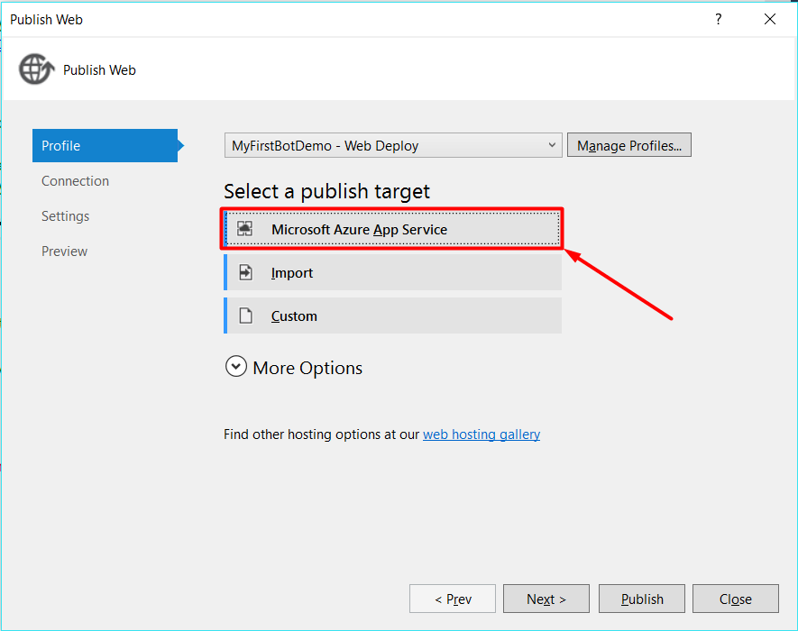

3.      
Si ya disponemos de una Web App creada, seleccionamos la cuenta, la suscripción, un grupo de recursos y finalmente la Web App donde queremos publicar el Bot. En caso contrario, seleccionamos nuevo.

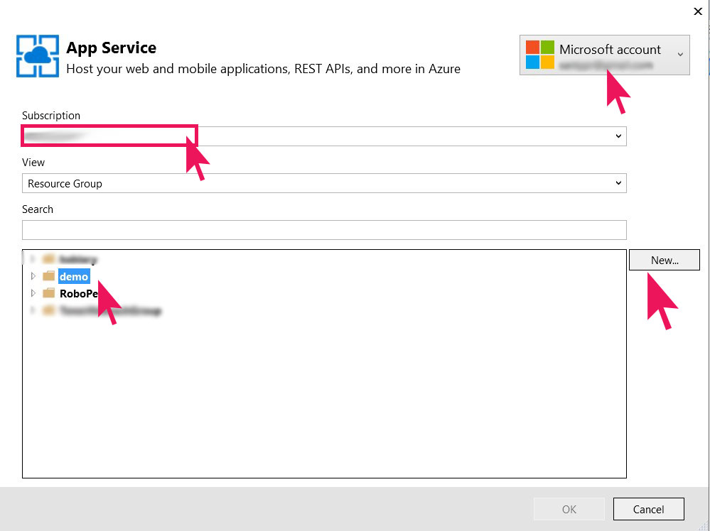

4.      
En caso de que hayamos seleccionado crear una nueva Web App, tendremos que seleccionar una suscripción, seleccionar o crear un grupo de recursos, seleccionar o crear un plan de servicio y establecer un nombre para la Web App.

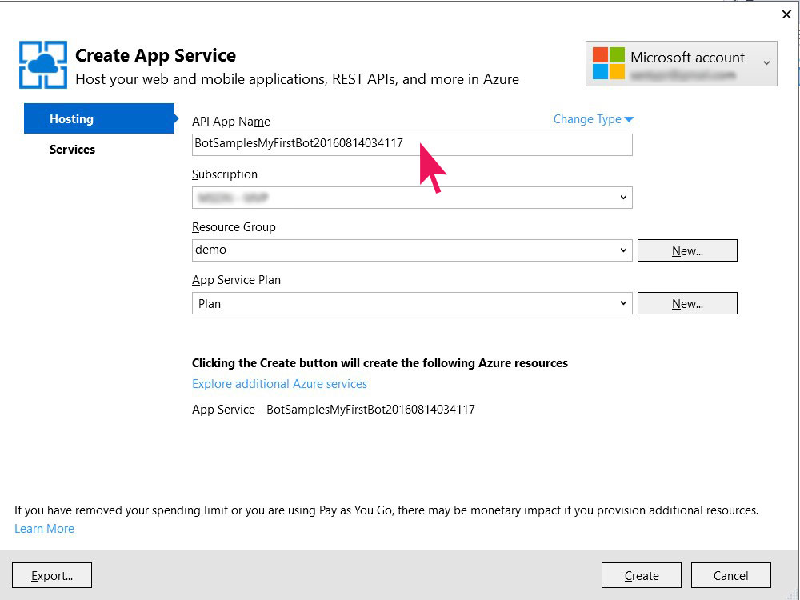

5.      
Una vez creada la Web App, tan sólo tendremos que publicar.

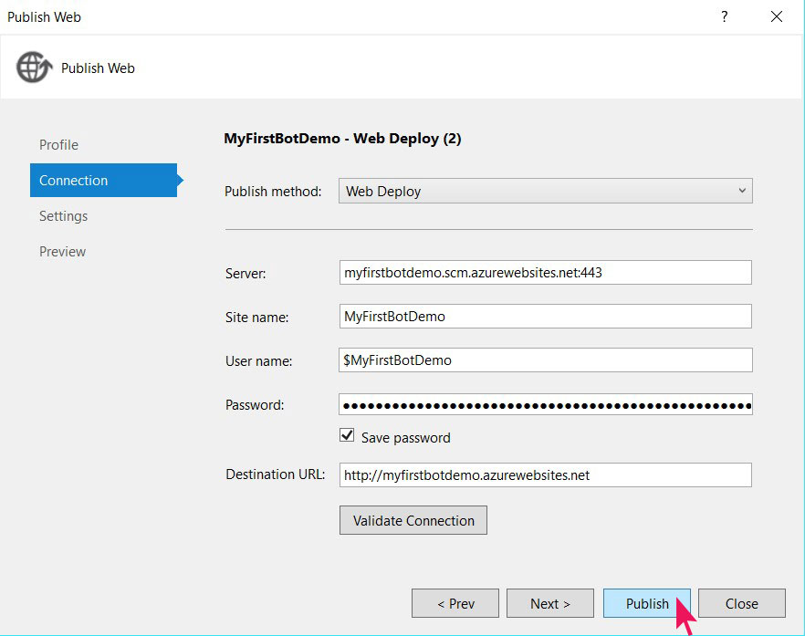

**Registrando el Bot**

No será suficiente con publicarlo, sino que, además, habrá que registrarlo en el propio servicio de Bots desde la url [https://dev.Botframework.com/Bots/new](https&#58;//dev.botframework.com/bots/new). En este formulario debemos rellenar todos los campos para que nuestro Bot sea accesible.​

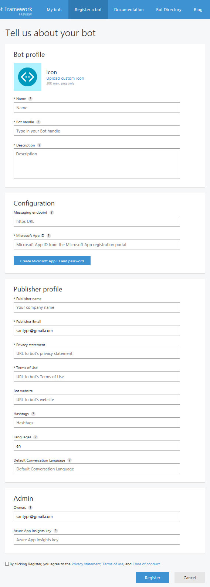

Es importante tener en cuenta que para publicarlo necesitamos crear un Microsoft App Id y su password correspondiente mediante el Botón “Create Microsoft App Id and Password” que estará directamente relacionado con el nombre de nuestro Bot, establecido en el primer campo del formulario. Una vez seleccionemos el Botón, nos aparecerá otro formulario donde podremos generar la contraseña.

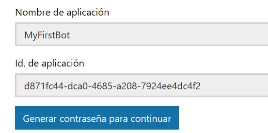

No debemos perder estos datos ya que habrá que introducirlos en el archivo “web.config” para poder comunicarnos con el Bot.

&lt;appSettings&gt;

&lt;!-- update these with your BotId, Microsoft App Id and your Microsoft App Password--&gt;

&lt;add key="BotId" value="[YourBotId]" /&gt;

&lt;add key="MicrosoftAppId" value="[YourBotAppId]" /&gt;

&lt;add key="MicrosoftAppPassword" value="[YourBotAppPassword]" /&gt;

&lt;/appSettings&gt;

Una vez completado el formulario de registro, podremos ver nuestro Bot en la pestaña “My Bots” o en la url [https://dev.Botframework.com/Bots](https&#58;//dev.botframework.com/bots).

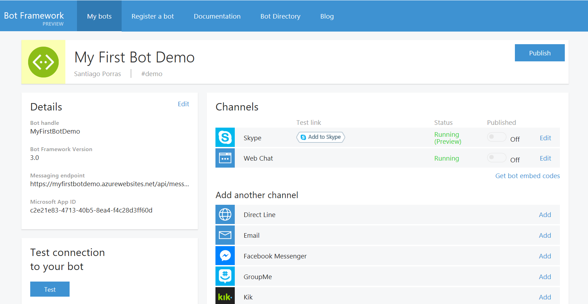

Por último, debemos volver a publicar la aplicación después de haber modificado el archivo “web.config” con los valores anteriormente indicados.

Una vez publicado de nuevo el Bot con la actualización de archivo “web.config”, podremos testear por fin la conexión al Bot que, de ir todo correcto, nos mostrará un mensaje de confirmación como en la imagen​

​​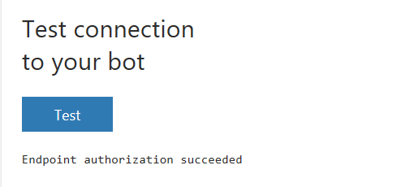

**Testeando el Bot en remoto**

También es posible testear de forma remota un Bot publicado, pero para ello tendremos que usar otra herramienta que nos permita comunicar el emulador con nuestro Bot. Microsoft recomienda el uso de ngrok, una herramienta de línea de comandos que nos permite exponer servidores locales, ya que es muy sencillo de usar. Los pasos a seguir para poder testear el Bot son los siguientes:

1.       Descarga de ngrok: Podemos descargar ngrok desde su sitio web [https://ngrok.com/](https&#58;//ngrok.com/). 
2.       Exponer el emulador por medio de ngrok ejecutando un simple comando: 
ngrok http -host-header=rewrite 9000
3.       Establecer el valor de "Emulator Url" del Bot Framework Emulator con la url https que nos indica ngrok.

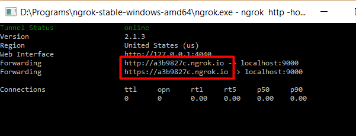

4.       Volver a configurar el emulador con los parámetros correspondientes para Bot Url, Microsoft App Id y Microsoft App Password**.**​

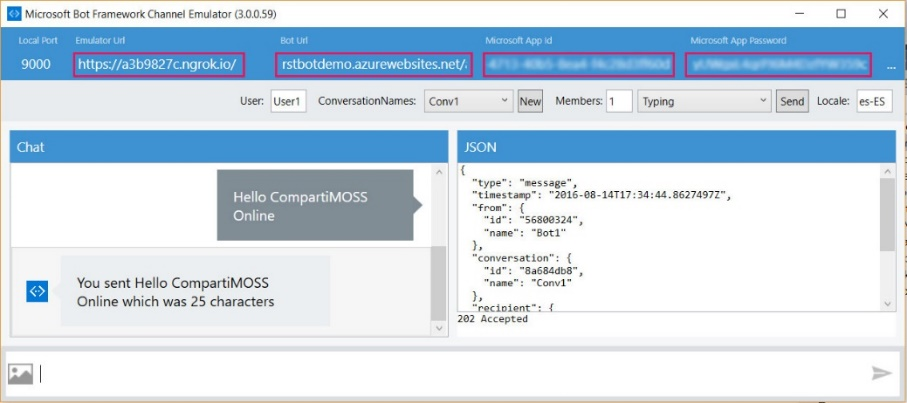

**Integración con Skype**

Por defecto, los Bots están preparados para integrarse con Skype y como Web Chat, así que será muy sencillo comenzar a interactuar con ellos.

En primer lugar, debemos configurar el bot según las características que queremos que tenga para interactuar con Skype.

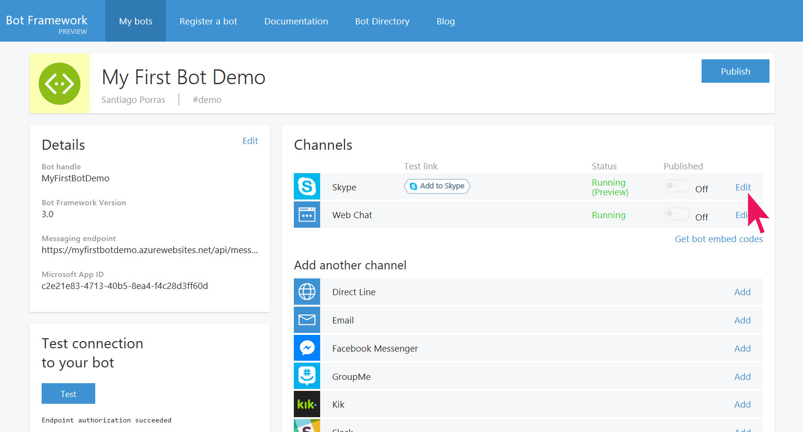

En el formulario debemos activar aquellas características que nos interesen y para las que hayamos preparado el Bot.

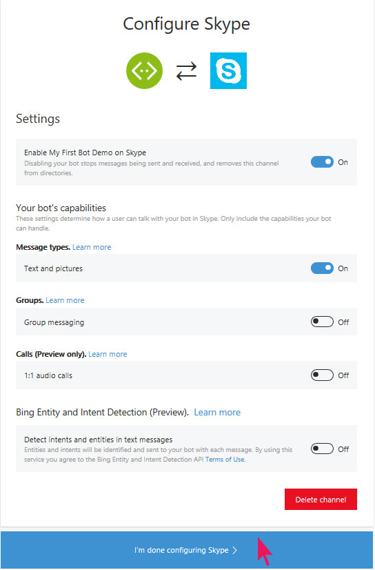

Una vez configurado el Bot, procederemos a **añadirlo como contacto en Skype** y así poder interactuar con él. En el panel de detalles del Bot, disponemos de un **botón "Add to Skype" que nos llevará a la página de aceptación de permisos** como podemos ver en la imagen 19.

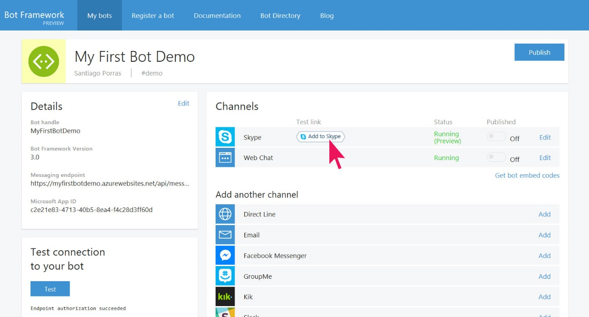

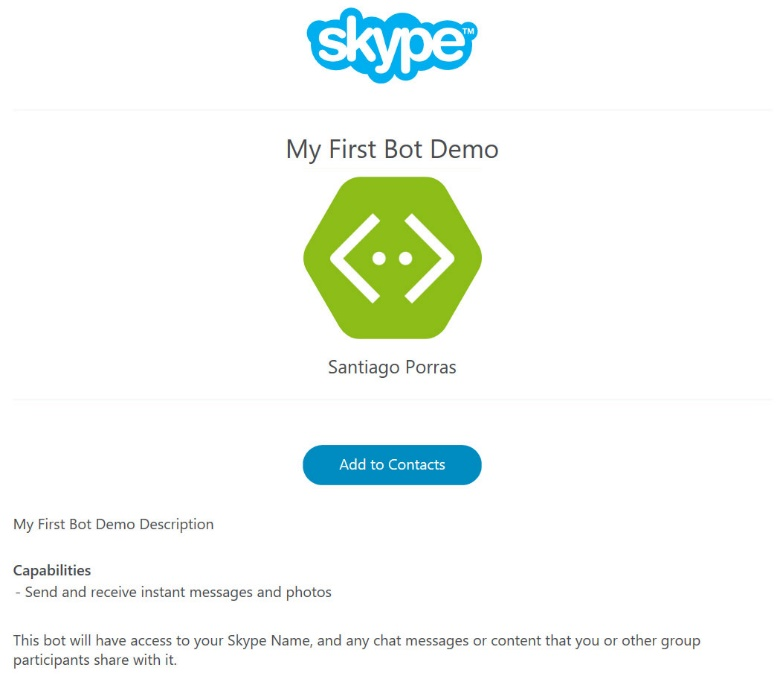

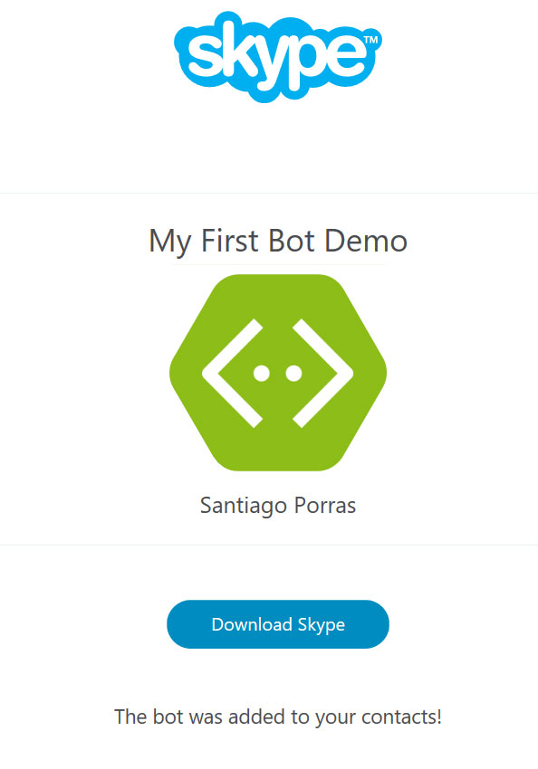

Una vez hemos añadido nuestro Bot a Skype, podremos interactuar con él como si de otra conversación se tratara. De esta forma, si hemos desarrollado nuestro Bot para que responda a determinadas palabras clave, podremos hacer que mantenga una conversación guiada con los usuarios.

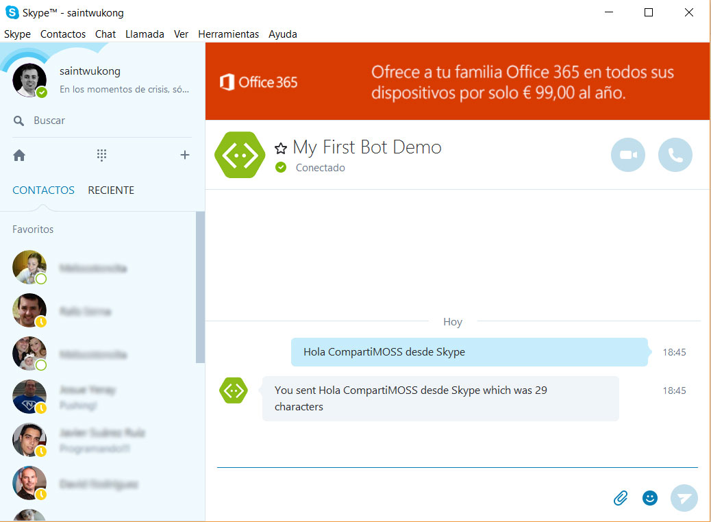

Finalmente, podremos embeber una conexión a nuestro Bot gracias a la opción "Get bot embed codes" que nos aportará el código necesario para integrarlo en un sitio web y que así los usuarios puedan conectarse de forma sencilla.

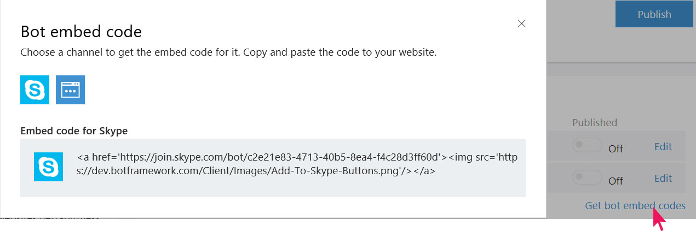

**Conclusiones**

Microsoft ha puesto en nuestras manos la posibilidad de automatizar conversaciones con los usuarios de una forma realmente sencilla y que, de esta forma, ciertas tareas como por ejemplo la atención al cliente puedan dar un salto de calidad.

**Referencias y más información**

·       Documentación oficial: [https://docs.botframework.com/en-us/skype/getting-started/](https&#58;//docs.botframework.com/en-us/skype/getting-started/)
·       Documentación ngrok: [https://ngrok.com/docs](https&#58;//ngrok.com/docs)
·       Skype bots: [https://developer.microsoft.com/en-us/skype/bots](https&#58;//developer.microsoft.com/en-us/skype/bots)

**Santiago Porras Rodríguez**

Mobile & Cloud Experience Lead at Encamina

MVP Windows Platform Development

MVP Visual Studio Technologies
 [http://blogs.encamina.com/desarrollandosobresharepoint](http&#58;//blogs.encamina.com/desarrollandosobresharepoint)
 [http://geeks.ms/santypr](http&#58;//geeks.ms/santypr)

@saintwukong

