Al igual que ha sucedido con las Bibliotecas de Documentos en SPO, Microsoft ha comenzado a liberar (para tenants de Office 365 en las que esté habilitado First Release) desde comienzos de agosto de 2016 la nueva experiencia de usuario para Listas de SPO completamente alineada con la experiencia ya disponible en Bibliotecas de Documentos. Se trata de una nueva interfaz fluida y rápida que además es responsive e incorpora integración en un solo clic con Microsoft Flow y Microsoft PowerApps. Adicionalmente, las denominadas “Listas modernas” de SPO son más “móviles” gracias a la aplicación móvil para SharePoint OnPremises y Online disponible actualmente para iOS.
Un paseo por la nueva experiencia de usuario en Listas de SPO
Para realizar un recorrido por la nueva experiencia de usuario en Listas de SPO, crearemos en un sitio de SPO una Lista de tipo personalizada denominada “Bibliografía” que almacenará información relativa a libros sobre Office 365, SharePoint y Azure:
• Desde el menú de Acciones del sitio o bien desde la nueva página de Contenidos del sitio, añadimos una aplicación de tipo “Lista personalizada” denominada “Bibliografía Recomendada” y navegamos a la misma. La primera vez que accedemos a una Lista que hace uso de la nueva experiencia, se muestra en un PopUp un resumen de las novedades que nos encontraremos en la nueva experiencia:
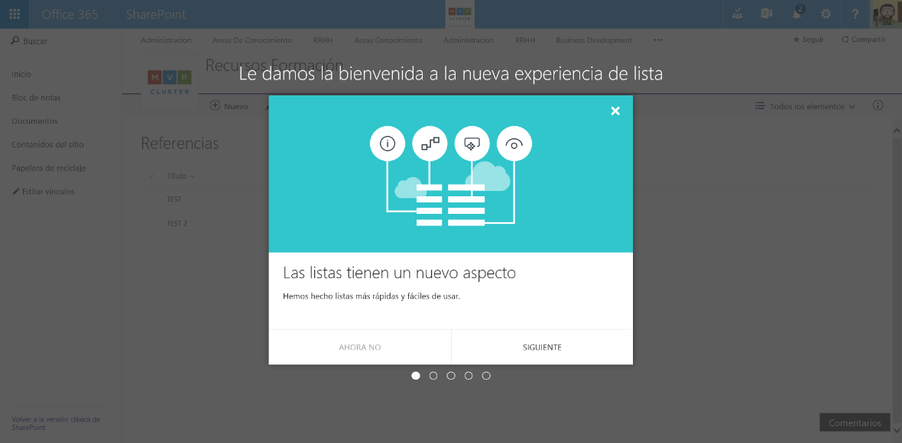

• En el nuevo aspecto de la Lista podremos encontrar las siguientes novedades (Imagen 2):
o Una caja de búsqueda ubicada sobre el menú vertical que facilita la búsqueda rápida de información en la lista.
o Una barra rápida de acciones que cuenta con las siguientes opciones por defecto:
 “Nuevo”, para crear un nuevo elemento en la Lista.
 “Edición rápida”, que facilita editar varios registros de forma directa en la Lista de la misma forma que modificamos contenidos en una hoja Excel. Esta opción permite mantener la misma funcionalidad que ya conocíamos en la experiencia clásica de Listas.
 “Exportar a Excel”, que permite exportar a Excel el contenido de la Lista (Nota: Esta opción se muestra sólo en Internet Explorer ya que a la fecha actual se sigue basando en el correspondiente control Active X).
 “Flujo”, que permite crear un Flujo de Microsoft Flow para la Lista. Al hacer clic en esta opción se muestra un panel en el que podemos seleccionar plantillas de Flujo disponibles por defecto, o que hayamos creado, o bien crear un Flujo desde cero.
 “PowerApps” que permite crear una aplicación de PowerApps para visualizar información de la Lista o bien interactuar con el contenido de la Lista para añadir. Esta acción muestra de nuevo un panel para crear la PowerApp.
 “Avisarme” que permite crear alertas en la Lista.
o Acceso a las vistas disponibles en la Lista, crear nuevas vistas a partir de modificar la vista actual o bien acceder a la administración de las vistas creadas para la Lista.
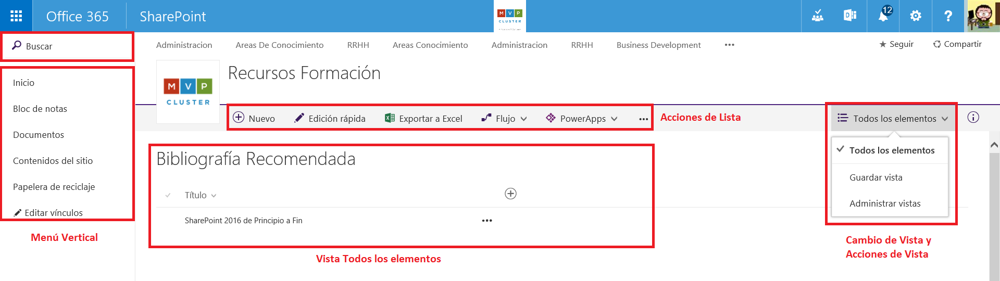

• Creamos un nuevo elemento en la Lista a través de la opción “Nuevo”, lo que nos redirige al formulario clásico de “Nuevo elemento” para su creación. De vuelta al nuevo aspecto de la “Lista”, si seleccionamos el elemento creado veremos que:
o Se muestra una barra de acciones específica para el elemento que contiene las siguientes acciones:
 “Editar” que permite editar el elemento de lista a través del formulario clásico de edición de elemento.
 “Compartir” que permite compartir el elemento a través del correspondiente diálogo. En este diálogo también podremos obtener un enlace al elemento y visualizar con quien se ha compartido.
 “Obtener un vínculo” que muestra el mismo diálogo que para “Compartir” pero con la opción de obtener un enlace al elemento.
 “Eliminar” que permite borrar el elemento seleccionado.
 “Avisarme” para crear una alerta del elemento seleccionado.
o Las mismas opciones de la barra de acciones del elemento de Lista y las siguientes acciones adicionales:
 “Copiar campo en el Portapapeles” que permite copiar el campo “Título” en el portapapeles.
 “Más”, opción que a su vez da acceso a las siguientes opciones:
• “Flujo de trabajo” para agregar un Flujo “legacy” al elemento de Lista.
• “Detalle de conformidad” que muestra una ventana en la que se visualiza la fase de retención en la que se encuentra el elemento.
o El “Panel de propiedades” del elemento en el que podremos editar los metadatos del Elemento de lista y además visualizar el historial de actividad reciente en el elemento, si se ha compartido y con quien e información adicional como el Tipo de Contenido del Elemento, cuándo se modificó y la ruta de acceso.

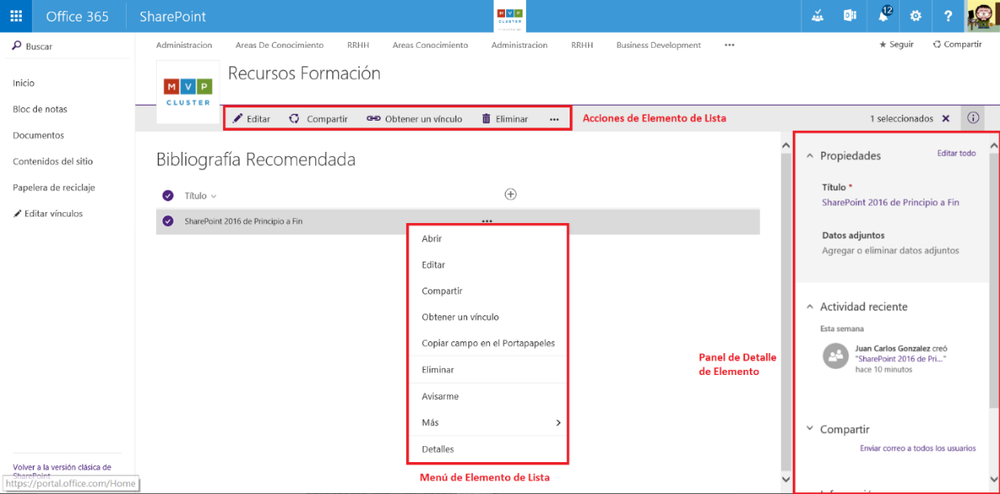

• Una vez que hemos creado una Lista, podemos extenderla rápidamente desde la vista por defecto añadiendo nuevas columnas o bien cambiando la configuración de las columnas a mostrar o no en la vista:

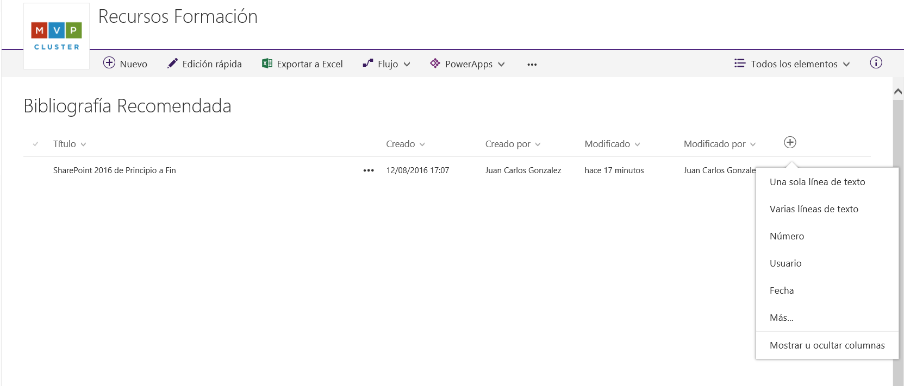

Por ejemplo, podemos añadir una columna de tipo elección para especificar la plataforma sobre la que trata el libro. Una vez añadida, podemos rápidamente configurar el orden de columnas y, como se indicaba antes, mostrar / ocultar otras columnas. Para que los cambios se guarden en la vista, tendremos que asegurarnos de que los mismos son guardados.​

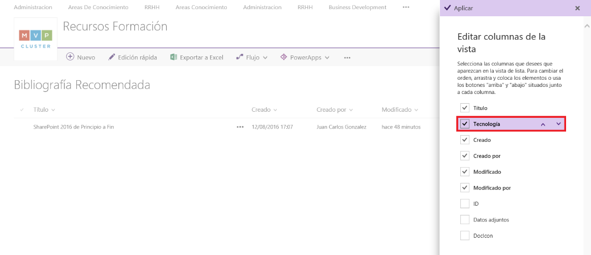

**Creación de Flujos y Aplicaciones para Listas**
Junto con la nueva experiencia de usuario, una de las novedades más importantes que se incorporan en las Listas de SPO es la integración con Microsoft Flow y PowerApps (Nota: Tanto Flow como PowerApps se encuentran actualmente en public preview):
• La integración con Flow permite automatizar tareas cuando se produce un suceso en una Lista (por ejemplo, se crea un elemento en la Lista) como puede ser crear información en otra Lista de otro sitio de SPO o en un sistema diferente como Microsoft Dynamics CRM Online, Salesforce o Project Online. Aunque en el momento de redacción de este artículo, Flow permite crear Flujos únicamente de tipo secuencial y no dispone de todas las posibilidades que SharePoint Designer 2013 (SPD 2013) provee para crear Flujos de Trabajo en Listas y Sitios de SPO, a futuro irá mejorando y permitiendo crear Flujos de Trabajo más complejos y que permitan dar respuesta a la necesidad de modelar procesos de negocio en Listas y Bibliotecas de Documentos de SPO.
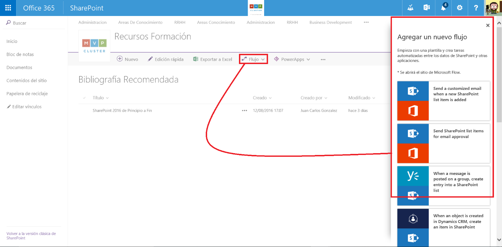

Cuando se hace clic en la opción “Flujo” de la barra de acciones de una Lista, se abre un panel en el que se muestran las plantillas de Flujos disponibles por defecto en Microsoft Flow o bien permite crear un Flujo desde cero.

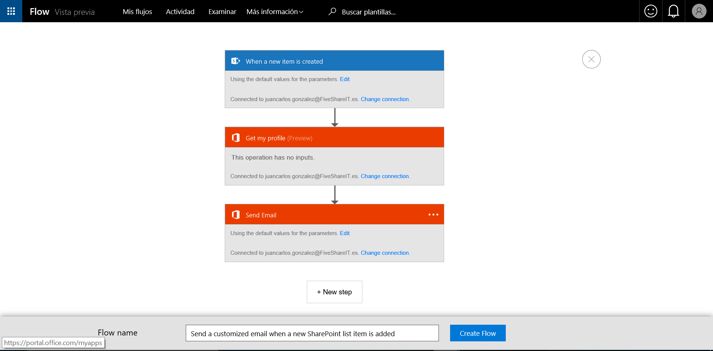

• La integración con PowerApps permite crear rápidamente aplicaciones de negocio listas para ser utilizadas en cualquier dispositivo sin necesidad de escribir código. Al igual que sucede con Microsoft Flow, PowerApps permite conectar los datos de la Lista con datos de otras fuentes de datos ya sean OnPremises o cloud como Exchange, Dynamics CRM, Salesforece, Google, etc.

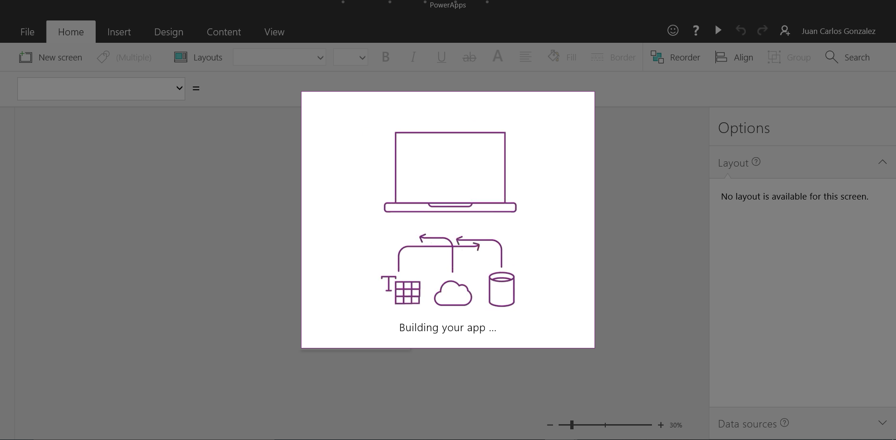

**Opciones de Administración de la nueva experiencia de usuario en Listas de SPO**
Al igual que sucede con la nueva experiencia de usuario en Bibliotecas de Documentos en SPO, en la página de Contenidos del Sitio y en la Papelera de Reciclaje, disponemos de distintas posibilidades para habilitar o no la nueva experiencia de usuario de Listas:
• Para cada Lista, podemos acceder a la página de “Configuración de la lista” y a continuación a la opción “Configuración avanzada”. Como se aprecia en la Imagen 10, podemos acceder a la administración de la biblioteca de documentos a través de las opciones de configuración globales del sitio.

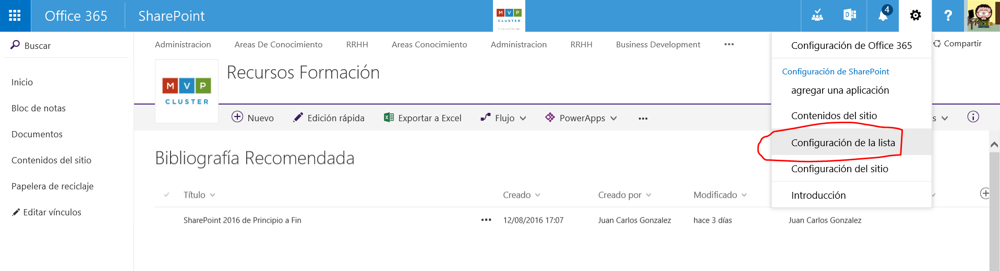

En la página de “Configuración avanzada” localizaremos una nueva sección que nos permite establecer el tipo de experiencia de Lista a utilizar: “Experiencia predeterminada establecida por el administrador”, “Experiencia nueva”, “Experiencia clásica”. La primera de las opciones es controlada por la configuración que se aplique de forma global a nivel de tenant de SPO como se verá en el siguiente punto.

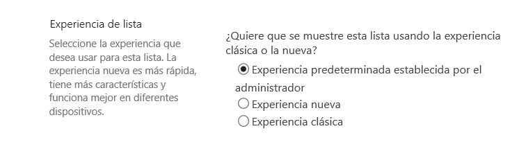

• A nivel de tenant de SPO, se puede configurar de forma global la experiencia de usuario tanto para Listas, como para Bibliotecas de Documentos, la página de Contenidos del sitio y la Papelera de reciclaje. Las opciones de configuración globales están disponibles en la página de “configuración” disponible en la administración del tenant de SPO:

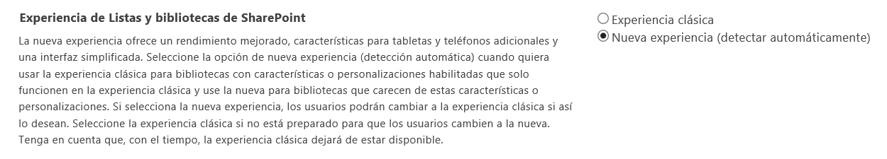

• Finalmente, la nueva experiencia puede ser habilitada/deshabilitada también de forma global a nivel de tenant de SPO haciendo uso de PowerShell tal y como se detalla en el siguiente artículo de soporte: https://support.office.com/en-us/article/Switch-the-default-experience-for-lists-or-document-libraries-from-new-or-classic-66dac24b-4177-4775-bf50-3d267318caa9

**Lo qué falta (o parece que falta) en la nueva experiencia de usuario de Listas**
Al igual que sucede con las Bibliotecas de Documentos, la nueva experiencia de usuario de Listas desplegada por Microsoft en tenants con First Release configurado se trata de una versión preliminar de la experiencia que tendremos finalmente desplegada en SPO. En la misma faltan elementos en los que Microsoft está trabajando o bien simplemente no estarán disponibles como, por ejemplo:
• En el momento de redacción de este artículo, no todos los tipos de Listas disponibles en SPO soportan la nueva experiencia. Como ejemplos, las Listas de tipo Calendario y Tareas por el momento no disponen de la misma.
• Para Listas existentes con un alto grado de personalización, no estará disponible la nueva experiencia. Por ejemplo, no se soportan todos los tipos acciones personalizadas que se hayan desarrollado como por ejemplo las acciones personalizadas que inyecten bloques de script.
• Soporte "completo" en la barra de navegación superior para que los distintos niveles de la misma se muestren independientemente de que se haya activado o no la característica de publicación en el Sitio.
• Posibilidad de aplicar branding a las Listas, Microsoft se ha comprometido a proporcionar mecanismos de proporcionar capacidad para personalizar las nuevas Listas, aunque por el momento se desconoce cómo se podrán hacer dichas personalizaciones.
• Soporte de varios niveles de agrupamiento, incluido de serie. En el momento en el que se dispone de columnas de tipo elección o lookup en la biblioteca se dispone de la opción de agrupar por dichas columnas a nivel de vista.

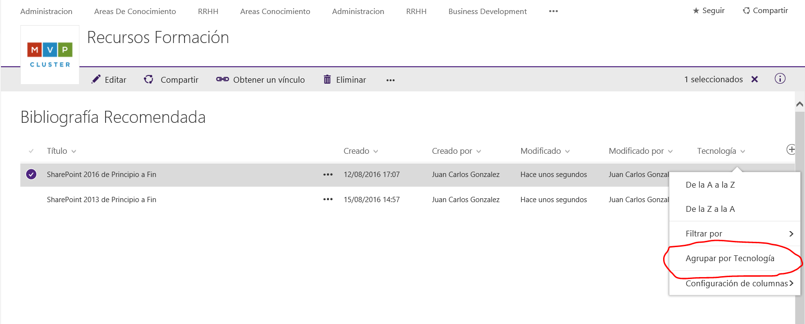

**Conclusiones**
La nueva experiencia de usuario en Listas para SPO supone un cambio radical no solo en cuanto a aspecto, sino también en cuanto a forma de trabajar colaborativamente con información contenida en las mismas. La clásica Ribbon a la que estábamos acostumbrados desaparece y es reemplazada por un menú horizontal de acciones que facilita el trabajo a nivel de Lista y de Elemento de Lista. A nivel de Elemento de Lista, el nuevo panel de edición simplifica no solo la visualización sus metadatos sino también visualizar su historial de actividad. Finalmente, la integración con Microsoft Flow y PowerApps permite extender la funcionalidad propia de las Listas con Procesos de Negocio y Aplicaciones Personalizadas que faciliten no solo visualizar la información almacenada, sino modificarla.

**Referencias**
• https://blogs.office.com/2016/07/25/modern-sharepoint-lists-are-here-including-integration-with-microsoft-flow-and-powerapps/

**Juan Carlos González Martín**
Office Servers and Services MVP
Cloud & Productivity Advisor en MVP CLUSTER
jcgonzalezmartin1978@hotmail.com 
@jcgm1978 | https://jcgonzalezmartin.wordpress.com/​

