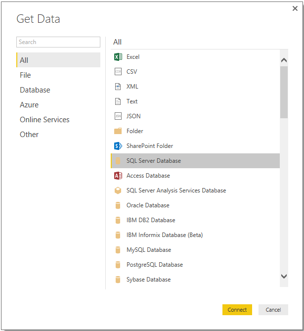

import ArticleHeader from '../../../components/article-header'

<ArticleHeader frontmatter={props.pageContext.frontmatter} />

Power BI ofrece múltiples servicios de conexión a diversos orígenes de datos. En este artículo nos centraremos en la conexión a bases de datos *On Premises* de *SQL Server* y *Oracle*. Como es de público conocimiento contamos con dos plataformas de desarrollo para Power BI (*Power BI Desktop* y *Power BI Web*), además del componente de refresco de información (Gateway).

**Power BI Web**

El componente Power BI Web, tal como lo dice su nombre es un componente accesible desde cualquier browser [1]. Este componente está orientado a la generación de Dashboards y reportes a través de la utilización de Servicios pre-establecidos a distintos orígenes de datos.

Dentro de estos orígenes se destacan los servicios para GitHub, Google Analytics, Azure, etc.

Al estar orientado a los servicios, este componente no ofrece soporte para la conexión a orígenes On Premises, aunque si permite (una vez creado los reportes en Power BI Desktop) realizar modificaciones sobre los reportes y estructuras derivados de estos orígenes.

**Power BI Desktop**

Por contraparte, Power BI Desktop, aplicación de escritorio de Power BI, permite la conexión con sources On Premises, en los cuales se destacan SQL Server y Oracle (existe una variedad de orígenes a los cuales se puede generar conexión de datos).

Debido a estas características, se detallará a continuación la interconexión de datos a través de Power BI Desktop.

**Conexión a SQL**

La conexión a una base de datos On Premises de SQL Server [2], consiste en tres simples pasos. El primero es elegir el origen de datos, el cual podemos establecer a través de la opción Get Data-&gt; SQL Server Database.

En el segundo paso debemos especificar la IP o HostName del servidor de la Base de Datos y el nombre de la misma. También se deberá especificar si la importación de datos se realizará de forma Directa (DirectQuery), es decir, live streaming de datos o se creará una importación de los datos (Import) al momento de creación y cada vez que se refresque el reporte.

De forma opcional, podemos realizar una consulta a la base de forma de traer la información necesaria de una manera ordenada y ya procesada. Esto lo podremos realizar utilizando la opción *Advanced options* y especificando la consulta en el cuadro de texto.

Una vez completados los datos de conexión debemos especificar las credenciales de ingreso a la base. Para ello contamos con dos opciones, a través de la utilización de Autenticación de Windows…

… o a través de autenticación directa sobre la base de datos.

Al completar los datos de ingreso, si los mismos son correctos, tendremos una pre-visualización de los datos de la base y sus estructuras.

**Conexión a Oracle**

Para realizar la conexión con una base de datos Oracle es necesario realizar ciertos pasos previos, debido a que se necesitan configuraciones específicas para poder establecer la conexión.

Como primer paso debemos descargar e instalar el Java Client[2], para ello debemos determinar que versión de Power BI tenemos instalada, si de 64 o 32 bits. Esto lo podemos obtener ingresando en Power BI Desktop, y dentro de la opción File -&gt; Help -&gt; About

Una vez instalado el Java Client, debemos configurar la conexión a la base de datos de Oracle, esto se logra modificando el archivo *TNSnames.ora* (La ubicación del archivo dependerá de dónde instalamos el Java Client, dentro de la carpeta del Client se encuentra bajo la ruta …\client\_1\Network\Admin). Dentro del archivo debemos especificar la conexión a través de la inserción de las siguientes entradas

[ALIAS]  = 
(DESCRIPTION = 
(ADDRESS = 
(PROTOCOL = TCP)
(HOST = [HOST\_NAME])
(PORT = [PORT])
) 
(CONNECT\_DATA = 
(SERVER = DEDICATED) 
(SERVICE\_NAME = [SERVICE\_NAME]) 
)
)
*[ALIAS] = Nombre a utilizar en el Connection string del Data Source*
*[HOST\_NAME] = Nombre o IP del servidor que contiene la Base de Datos*
*[PORT] = Puerto a utilizar*
*[SERVICE\_NAME] = Nombre del Servicio del servidor de la Base de Datos*
 
Al finalizar la configuración, estaremos en condiciones de realizar la conexión a la base de datos desde Power BI Desktop. Para ello debemos dirigirnos a Get Data-&gt; Oracle Database

Para realizar la conexión debemos ingresar la IP del servidor seguido de /[ALIAS] especificado en el archivo *TNSnames.ora*.

De forma análoga a SQL podremos especificar una consulta a la Base de datos en la sección *Advanced options.*

**Referencias**

[1]         Para ingresar a Power BI Web dirigirse a [https://app.powerbi.com](https&#58;//app.powerbi.com/)

[2]         En el momento sólo hay soporte para SQL Server 2012 y 2014, se está trabajando en la integración con SQL 2016

[3]         Para descargar el Java Client, ingresar a:

·       32 bits: [http://www.oracle.com/technetwork/topics/dotnet/utilsoft-086879.html](http&#58;//www.oracle.com/technetwork/topics/dotnet/utilsoft-086879.html)
·       64 bits: [http://www.oracle.com/technetwork/database/windows/downloads/index-090165.html](http&#58;//www.oracle.com/technetwork/database/windows/downloads/index-090165.html)

**Bruno Torterolo**

Software Developer en Arkano Software

Twitter: bruno\_torterolo

