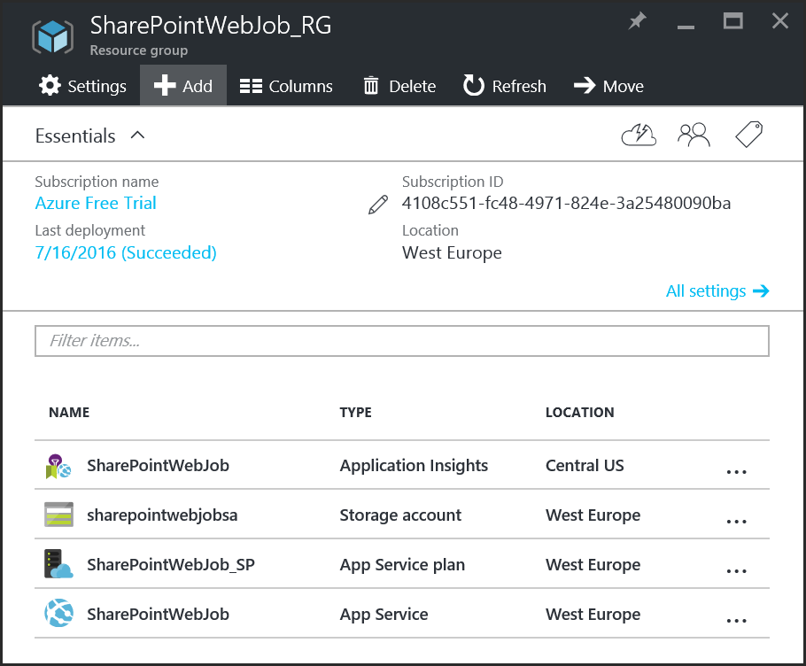
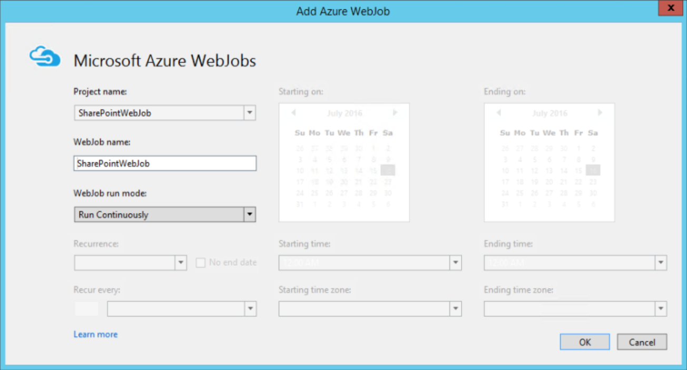
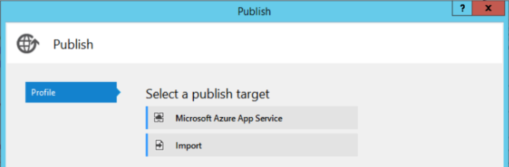
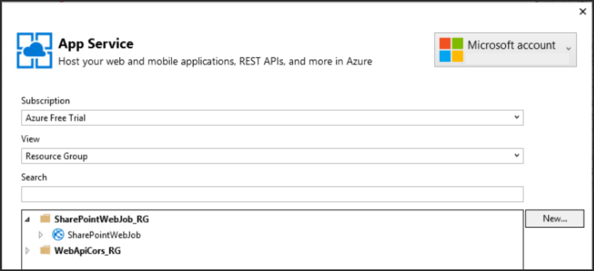
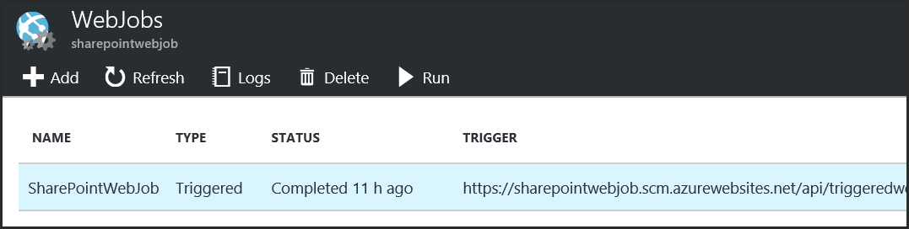
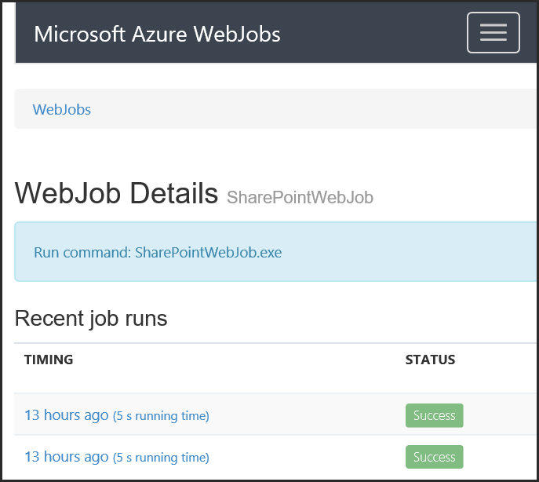
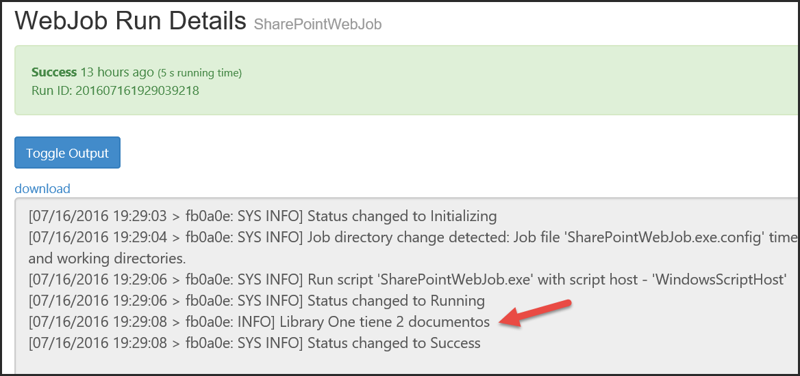
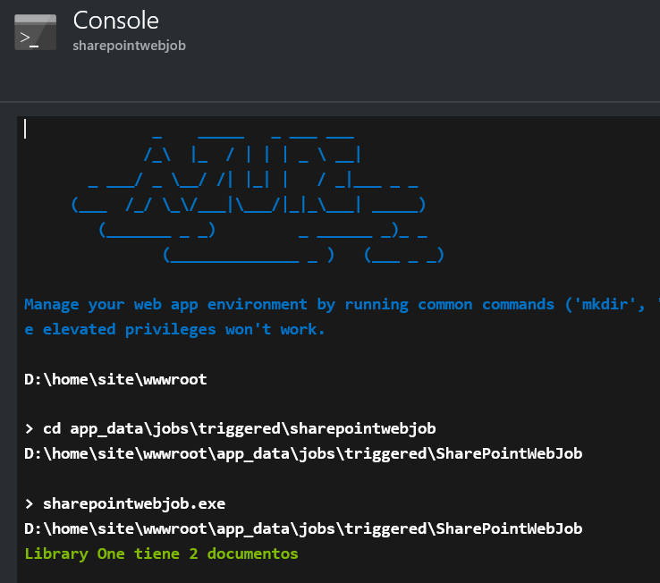

Muchos de los servicios ofrecidos por Azure se pueden utilizar para ampliar y mejorar el funcionamiento de SharePoint, tanto on-premises como en la nube. Uno de los servicios que ofrece Azure, parte de Azure Apps, es "Web Apps", que es una solución de Plataforma como Servicio (PaaS) que proporciona toda la infraestructura física más el software de base para servir como host de programas Web. Una de las alternativas de Web Apps es WebJobs, que utiliza toda la infraestructura de Azure Apps para ejecutar programas de forma automática basado en un esquema de tiempo.

**Como funciona Azure WebJobs**

Probablemente el servicio más importante de Azure para desarrollo de nuevas aplicaciones es Azure Apps, que consta a su vez de cuatro servicios: Web Apps, Mobile Apps, API Apps y Logic Apps. Por medio de Web Apps se pueden crear aplicaciones Web (ASP.NET, JavaScript, PHP, etc.) y hostearlas en Azure. Azure ofrece toda la infraestructura de Máquinas Virtuales, perfectamente configuradas y con todas las posibilidades de extensibilidad, mantenimiento y escalabilidad, de tal forma que lo único que es necesario es configurar el servicio y subir el código de la aplicación.

Web Apps permite crear dos tipos de aplicaciones: las aplicaciones que funcionan con una interface de usuario y realizan algún tipo de trabajo tal como las que se utilizan en sitios de Internet, y WebJobs, aplicaciones que no disponen de una interface de usuario y se ejecutan automáticamente basado en un esquema de tiempo (cada minuto, cada hora, un determinado día, continuamente, etc.). En SharePoint, los WebJobs se pueden comparar a cómo funcionan los Timer Jobs de SharePoint: realizan trabajos temporalizados de forma completamente automática y sin intervención de los usuarios.

Azure WebJobs se pueden utilizar en conjunción con SharePoint en dos escenarios típicos:

·       En SharePoint OnPremises para mover procesos que utilizan considerables cargas de recursos de los servidores de la granja (CPU y RAM) hacia servidores externos en Azure, que se pueden escalar de forma muy sencilla. También hay que hacer notar que la programación de Azure WebJobs es considerablemente más fácil que la programación de Timer Jobs de SharePoint.
·       En SharePoint Online no es posible crear Timer Jobs personalizados, por lo que Azure WebJobs constituyen su reemplazo.

Un WebJob no es más que un ejecutable del tipo cmd, bat, exe (.NET), ps1, sh, php, py, js o jar. Para el control del tiempo de ejecución se utiliza la infraestructura de Scheduling de Azure.

**Creación y configuración de un WebJob en Azure**

WebJobs se crean y configuran de la misma forma que Web Apps en Azure. También todas sus posibilidades de tipo de infraestructura a utilizar, escalabilidad, etc., son exactamente las mismas. Aunque toda la configuración se puede realizar desde Visual Studio, es recomendable hacerla antes de comenzar a programar y directamente desde el Portal de Azure pues se tiene mucho mejor control sobre los parámetros a utilizar. La creación que se indica a continuación también se puede automatizar por medio de PowerShell o utilizando un Template de Azure.

1.       Desde el Portal de administración de Azure (http://portal.azure.com) seleccione "Resource groups" à "Add". Defina un nombre para el Grupo de Recursos, la suscripción a utilizar y la localización deseada.
2.       Una Web App necesita tener un "App Service Plan", que define las características y capacidades que todas las Web Apps en el Grupo de Recursos van a compartir. Seleccione el Grupo de Recursos creado en el punto anterior, utilice el botón de "Add" y en la casilla de búsqueda escriba "app service plan" y seleccione "App Service Plan" en la lista resultados. Utilice el botón de "Create" en la nueva ventana.
3.       En la ventana de creación del Service Plan indique un nombre, la suscripción a utilizar y el Grupo de Recursos (si no ha sido seleccionado automáticamente). La localización del Servicio y el tipo de Máquina Virtual a utilizar también se pueden elegir o utilizar los predefinidos. Note que hay un "tier" que es gratis, el "F1", aunque ofrece la menor capacidad y alguna funcionalidad menos que los otros tiers.
4.       Regrese a la ventana del Grupo de Recursos creado en el punto uno y utilice el botón de "Add". Escriba "storage account" en la casilla de búsqueda y seleccione "Storage account – Web + Mobile" y "Create" en la ventana que aparece. Un Storage Account no es estrictamente necesario para el funcionamiento de un WebJob (no es indispensable), pero si se desean ven los logs creados por el WebJob, es necesario tenerlo pues Azure escribe todas las salidas del Job en un Blob del Azure Storage.
5.       Defina un nombre (todo en minúsculas y sin signos) para el nombre del Storage, la suscripción, Grupo de Recursos y Localización; utilice todos los otros parámetros por defecto. 
6.       Regrese de nuevo a la ventana del Grupo de Recursos, utilice el botón de "Add", escriba "web app" en la casilla de búsqueda y seleccione "Web App" y "Create". Defina un nombre, seleccione la Suscripción y el Grupo de Recursos y seleccione el Service Plan creado en el punto tres. Azure crea una instancia de "Application Insights" automáticamente por si es necesario monitorizar el funcionamiento de la aplicación web (si no es necesario el monitoreo, se puede eliminar sin problemas). Al final, el Grupo de Recursos aparecerá con los recursos creados:



**Ejemplo de utilización de Azure WebJobs con SharePoint**

El siguiente ejemplo simplemente lee el número de documentos en una Biblioteca de SharePoint. Aunque extremadamente sencillo en cuanto a funcionalidad, la idea del ejemplo es mostrar cómo crear y publicar un Azure WebJob y cuáles son las posibilidades de debugging y loging, no crear nueva funcionalidad. En el ejemplo se utiliza SharePoint Online, pero el código se puede utilizar sin ningún problema con una granja de SharePoint OnPremises, cambiando solamente el URL del servidor.

7.       Inicie Visual Studio (versión 2015 con Update 3 en el ejemplo, pero también se puede utilizar Visual Studio 2013).
8.       Si Visual Studio no tiene instalado el Azure SDK, es necesario descargarlo desde el sitio de Microsoft (https://azure.microsoft.com/en-us/downloads/) e instalarlo en Visual Studio.
9.       Seleccione en Visual Studio "New Project" y desde la sección "Visual C#" – "Cloud" seleccione "Azure WebJob". Asígnele un nombre al proyecto. Esta plantilla crea una aplicación de consola con todas las referencias a dlls de Azure necesarias.
10.       La forma más fácil para agregar todas las referencias necesarias para poder trabajar con SharePoint Online es utilizar NuGet. En Visual Studio seleccione "Tools à NuGet Package Manager à Manage NuGet Packages for Solution à Browse" y busque por "app for sharepoint online web toolkit". Seleccione "AppForSharePointOnlineWebToolkit" e instale el NuGet. Si se está trabajando con SharePoint OnPremises, se puede utilizar el NuGet "AppForSharePointWebToolkit", que produce los mismos resultados. Cuando la instalación termina, el NuGet descarga todos los dlls necesarios y crea los archivos "SharePointContext.cs" y "TokenHelper.cs" en el proyecto.
11.       En "Program.cs" elimine las líneas 17 (var host = new JobHost();) y 19 (host.RunAndBlock();) del código fuente creado por defecto pues no son necesarias para este ejemplo.
12.       Los datos para poderse logear en SharePoint se van a almacenar en el archivo de configuración del proyecto por simplificar el ejemplo, aunque esta no sea una buena práctica, y menos manteniendo la clave en texto simple. Una mejor opción es utilizar el Directorio Activo, si tanto Azure como SharePoint utilizan el mismo servicio, o el token de autorización de OAuth. Abra el archivo "App.config" y agregue las siguientes líneas al final del archivo, entre las líneas "&lt;/runtime&gt;" y "&lt;/configuration&gt;":

```
  </runtime>  <appSettings>    <add key="CuentaSharePoint" value="usuario@dominio.onmicrosoft.com"/>    <add key="ClaveSharePoint" value="clave"/>  </appSettings></configuration>
```


13.       En el mismo archivo "App.config", configure la cadena de conexión de la propiedad "AzureWebJobsDashboard" que se encuentra al principio del código. El parámetro "connectionString" es de la forma:

connectionString="DefaultEndpointsProtocol=https;AccountName=sharepointwebjobsa;AccountKey=s/JLuH/0tUYkM0zm6b3vPK0Ro6A/rWTWXrsnHUTzKrERZkChXcDuDFEgb9GYh59dR"

En donde "AccountName" es el nombre de la instancia de Azure Storage creado en el punto 4 y 5. "AccountKey" se puede encontrar en el portal de Azure, seleccionando el Storage creado y yendo a "All settings" à "Access keys" à "key1".

La configuración de "AzureWebJobsStorage" se puede utilizar si es necesario usar un depósito de información adicional de Azure. El "AzureWebJobsDashboard" se utiliza para guardar los logs del WebJob, como se indicó anteriormente

14.       Agregue las siguientes directivas using en la cabecera de "Program.cs":

```
using Microsoft.SharePoint.Client;using System.Security;using System.Configuration;
```

15.       Modifique el método "Main" para que contenga el siguiente código fuente:

```
static void Main(){    string mySharePointSiteUrl = "https://dominio.sharepoint.com/sites/test01";    string mySharePointBiblioteca = "Libreria Uno";    string myCuenta = ConfigurationManager.AppSettings["CuentaSharePoint"];    string myClave = ConfigurationManager.AppSettings["ClaveSharePoint"];
```

```
    using (ClientContext myContext = new ClientContext(mySharePointSiteUrl))    {        SecureString myClaveSegura = new SecureString();        foreach (char unChar in myClave)        {            myClaveSegura.AppendChar(unChar);        }
```

```
        myContext.AuthenticationMode = ClientAuthenticationMode.Default;        myContext.Credentials = new SharePointOnlineCredentials(myCuenta, myClaveSegura);
```

```
        try        {            List myLista = myContext.Web.Lists.GetByTitle(mySharePointBiblioteca);            myContext.Load(myLista);            myContext.ExecuteQuery();
```

```
            if (myLista != null && myLista.ItemCount > 0)            {                Console.WriteLine(myLista.Title.ToString() + " tiene " + myLista.ItemCount + " documentos");            }            else            {                Console.WriteLine("No hay documentos");            }        }        catch (Exception ex)        {            Console.WriteLine("Error: " + ex.ToString());        }    }}
```

Al inicio de la rutina se definen cuatro variables que contienen el URL del sitio con la Biblioteca de SharePoint a examinar, el nombre de la Biblioteca misma y los valores de la cuenta para acceder a SharePoint. Luego se crea el contexto de SharePoint utilizando su Modelo de Objetos de Cliente y se ensambla la cadena segura a utilizar para enviar las credenciales al sistema. Una vez obtenido el acceso a SharePoint, se utiliza el contexto para crear un objeto con la Biblioteca y se muestra en la consola el número de documentos que contiene. Aunque el ejemplo es muy básico en cuanto a funcionamiento de SharePoint, muestra claramente cómo se puede hacer contacto con el sistema y realizar alguna función en él.

16.   Es posible utilizar todas las funciones de debugging de Visual Studio: utilice "F5" o "Debug à Start Debugging" para que el programa sea compilado e iniciado localmente.
17.   Desde el Explorador de Soluciones de Visual Studio, seleccione el proyecto y desde su menú contextual seleccione "Publish as Azure WebJob". La primera ventana que se abre automáticamente permite configurar el momento en el que el Job iniciara su funcionamiento:



Hay múltiples formas para configurar esta función: continuamente, manualmente, cada determinado tiempo recurrentemente o en una fecha determinada. Por el momento seleccione "Run on demand" en la sección "WebJob run mode" y utilice el botón de "OK".

La siguiente ventana permite seleccionar el servicio en Azure. Haga clic sobre "Microsoft Azure App Service":



Y en la siguiente ventana seleccione la cuenta a utilizar (probablemente tiene que entrar de nuevo sus credenciales), lo mismo que la suscripción, Grupo de Recursos, etc., y seleccione la Web App que va a contener el WebJob:



Las dos ventanas siguientes permiten ver los diferentes parámetros de configuración. Acepte todos los valores por defecto y publique el Job. La ventana de "Output" de Visual Studio permite seguir el procedimiento de publicación, y si ha ocurrido algún error, cual ha sido.

18.          Una vez publicado el WebJob sin que se hayan detectado problemas, es posible ejecutarlo desde el portal de Azure (en el punto anterior se definió que el Job va a ejecutar "On demand"). Desde el portal de Azure seleccione la Web App que contiene el Job, abra la ventana de "All settings" y en la sección de "Web Jobs" haga clic sobre "WebJobs". En la ventana que abre se puede ver una lista con todos los WebJobs contenidos en la Web App. Seleccione el WebJob y utilice el botón de "Run". Después de unos segundos se puede ver el estado del Job:



Utilizando el botón de "Logs", el navegador abre una nueva pestaña mostrando información sobre las veces que el Job a ejecutado:



Y si se hace clic sobre una de las instancias, se puede ver la información completa de ejecución:



Note que la salida por consola que se programó en el código (línea 41)

Console.WriteLine(myLista.Title.ToString() + " tiene " + myLista.ItemCount + " documentos");

aparece correctamente en los logs. Cualquier información sobre errores atrapados o no atrapados también aparecerá en ellos.

19.          Otra forma para ejecutar el Job es seleccionando la App Web en el portal de Azure, seleccionar "Tools" (en lugar de "Settings") y utilizar la "Consola" de ejecución. El programa se encuentra en el directorio "D:\home\site\wwwroot\app\_data\jobs\triggered\[NombrePrograma]" y se puede ejecutar directamente desde la consola:



1.       La forma de temporizar el Job se definió en el momento de publicarlo en Azure (punto 16). Cuando se define el momento de ejecución, Visual Studio crea un archivo llamado "webjob-publish-settings.json" en el directorio "Properties" que contiene la configuración:

```
{  "$schema": "http://schemastore.org/schemas/json/webjob-publish-settings.json",  "webJobName": "SharePointWebJob",  "startTime": null,  "endTime": null,  "jobRecurrenceFrequency": null,  "interval": null,  "runMode": "OnDemand"}
```

Si se desea cambiar la configuración, elimine este archivo y publique el Job de nuevo, lo que obliga a Visual Studio a mostrar de nuevo la ventana de definición del tiempo de ejecución y crear un nuevo archivo. No es posible cambiar la forma o el tiempo de ejecución desde el portal de Azure.


**Conclusiones**

Dentro de las múltiples maneras de utilizar los servicios de Azure para complementar el funcionamiento de SharePoint, Azure WebJobs permite mover operaciones que requieren muchos recursos de CPU y/o memoria fuera de la granja de SharePoint hacia procesos remotos en Máquinas Virtuales, y ejecutar programas según un esquema de tiempo predefinido.

WebJobs se pueden utilizar en conjunto con instalaciones de SharePoint OnPremises como una alternativa a los Timer Jobs nativos, o con SharePoint Online para mimetizar el funcionamiento de los Timer Jobs personalizados que no son posibles de crear en SharePoint OnLine.


**Gustavo Velez**
 MVP Office Servers and Services
 gustavo@gavd.net
 [http://www.gavd.net](http://www.gavd.net/)​

