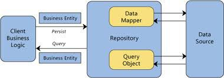
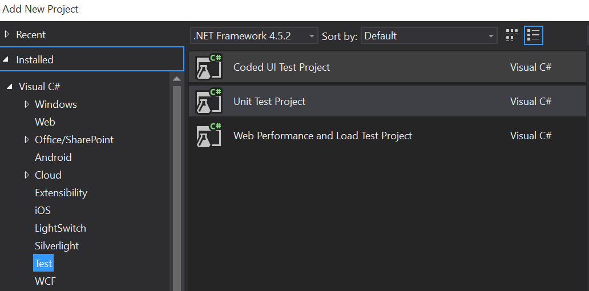
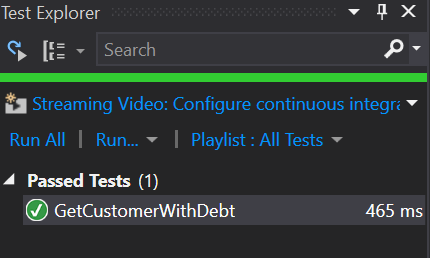

​​​Antes de empezar con el articulo vamos a definir algunos conceptos de Unit Testing para dejar aclarado algunos p​untos.

- Stub-&gt; Un trozo de código usado como sustituto de alguna otra funcionalidad. Un stub puede simular el comportamiento de código existente (tal como un procedimiento en una máquina remota) o ser el sustituto temporal para un código aún no desarrollado.
- Mock -&gt; Se usan para simular el comportamiento de objetos complejos cuando es imposible o impracticable usar al objeto real en la prueba. De paso resuelve el problema del caso de objetos interdependientes, que para probar el primero debe ser usado un objeto no probado aún, lo que invalida la prueba: los objetos simulados son muy simples de construir y devuelven un resultado determinado y de implementación directa, independientemente de los complejos procesos o interacciones que el objeto real pueda tener.


Los objetos simulados se usan en lugar de objetos reales que tengan algunas de estas características:

- Devuelven resultados no determinísticos (por ejemplo, la hora o la temperatura).
- Su estado es difícil de crear o reproducir (por ejemplo, errores de conexión).
- Es lento (por ejemplo, el resultado de un cálculo intensivo o una búsqueda en una BBDD).
- El objeto todavía no existe o su comportamiento puede cambiar.
- Debería incluir atributos o métodos exclusivamente para el testeo.


Otro de los conceptos que muchos desarrolladores tienen en la cabeza es que juntan un concepto como Test Driven Development (TDD) como hacer Test. Hacer Test no implica que necesariamente tengas que hacer TDD, TDD es una práctica que podemos decir que antes de empezar a tirar una línea de código ya implementas los Test que vas a hacer para que una vez vas implementando la funcionalidad vas comprobando si este es correcto o no. Y una vez es correcto podemos dedicarnos a refactorizar nuestro código y dejarlo como idealmente queremos.


**Hagamos Testing con SharePoint**

SharePoint como tal es una plataforma que ha ido evolucionando con el tiempo, principalmente por su mayor importancia dentro de grandes organizaciones. Esto ha provocado que versión a versión el producto haya ido mejorando más y más y de cara al desarrollador se ha ido haciendo mejoras en cuanto al ciclo de vida de la solución. Estas mejoras han sido adoptadas por la gran mayoría de equipos de desarrollo. Sin embargo, cuando se habla sobre temas como Unit Testing estos desarrolladores siguen igual que en sus inicios, es decir, no hay Test Unitarios en la mayoría de las ocasiones.  Muchos de estos desarrolladores indican que es imposible hacer Unit Test en SharePoint. Algunos de estos argumentos se basan en que el SDK de SharePoint se compone de innumerables clases "selladas" y que por este motivo no se pueden hacer mocks. Esta afirmación no es más que una verdad a medias ya que existen productos comerciales como TypeMock o JustMock que se encargan de generar los mocks (no comento los emuladores de SharePoint porque podemos decir la propia Microsoft no los ha evolucionado desde 2010). Si bien es cierto que para alguien que empiece a hacer testing, SharePoint no es una plataforma que lo facilite de una forma sencilla (se han de tener claros cada uno de los conceptos y una forma de desarrollar clara).

Por estos motivos cuando empezamos a trabajar en SharePoint, uno de nuestros principales objetivos fue seguir las buenas prácticas y consejos que se utilizan en todas las plataformas .NET. No debemos de tratar SharePoint como una plataforma distinta y en la que todo vale. De este conocimiento como hablamos en el artículo del número 27 surgió ENMARCHA.

Entre sus múltiples utilidades Enmarcha tiene una Capa de Acceso a las listas de SharePoint que facilita el aprendizaje sobre la plataforma. Esta clase surgió de intentar en la medida de lo posible seguir una arquitectura N-Capas en nuestros desarrollos y tener una capa de acceso a datos siguiendo el patrón Repositorio.   Este patrón lo podemos definir como un repositorio que es un mediador entre el dominio de la aplicación y los datos que le dan persistencia. Con este planteamiento podemos pensar que el usuario de este repositorio no necesitaría conocer la tecnología utilizada para acceder a los datos, sino que le bastaría con saber las operaciones que nos facilita este "mediador", el repositorio.



Este patrón en Enmarcha lo hacemos implementando la interfaz [IRepository](https&#58;//github.com/Encamina/Enmarcha-SharePoint/blob/Dev/Enmarcha.SharePoint.Abstract/Interfaces/Data/IRepository.cs), la cual tiene la siguiente definición.


```
public interface IRepository<T> : IPageable
```

```
    {
```

```
        T Get(int id);
```

```
        ICollection<T> GetAll();
```

```
        ICollection<T> GetAll(int page);
```

```
        ICollection<T> Query(IQuery query, int page);
```

```
        ICollection<T> Query(string query, int page);
```

```
        int Insert(T data);
```

```
        bool Save(int id, T data);
```

```
        bool Delete(int id);
```

```
    }​
```

Para el acceso a listas utilizando SharePoint Server Object Model hemos implementado la clase SharePointRepository de tal forma que dado una clase de C# podamos "mapearla" con una lista de SharePoint.

**Ahora bien, ¿cómo hacemos Unit Testing con Enmarcha?**

Partimos de la base de que tenemos un WebPart que nos muestran los clientes que tienen un saldo de más de 1.000 €.  Para ello en SharePoint lo que tendremos es una lista de SharePoint llamada cliente. Y dentro de nuestra solución de Visual Studio tendremos lo siguiente:

Una clase "Customer"(mapea la clase C# con la lista de SharePoint) con la siguiente definición:


```
public class Customer
```

```
    {
```

```
        [Enmarcha(AddPrefeix = false, Create = false, Type = TypeField.Text)]
```

```
        public string ID { get; set; }
```

```
        [Enmarcha(AddPrefeix = false, Create = false, Type = TypeField.Text)]
```

```
        public string CIF { get; set; }
```

```
        [Enmarcha(AddPrefeix = false, Create = false, Type = TypeField.Text)]
```

```
        public string Title { get; set; }
```

```
        [Enmarcha(AddPrefeix = false, Create = false, Type = TypeField.Text)]
```

```
        public string Direccion { get; set; }
```

```
        [Enmarcha(AddPrefeix = false, Create = false, Type = TypeField.Number)]
```

```
        public double Saldo { get; set; }
```

```
    }​
```

En la Capa de Servicio tendremos una interfaz ICustomerService con los siguientes métodos:

```
public interface ICustomerService
```

```
    {
```

```
        IList<Customer> GetCustomerWhitDebt();
```

```
    }
```

Esta interfaz la implementaremos de la siguiente forma:


```
  public class CustomerService : ICustomerService
```

```
    {
```

```
        IRepository<Customer> repository;
```

```
 
```

```
        public CustomerService(IRepository<Customer> repository)
```

```
        {
```

```
            this.repository = repository;
```

```
        }
```

```
        public IList<Customer> GetCustomerWhitDebt()
```

```
        {
```

```
            var customerCollection = this.repository.GetAll();
```

```
            return customerCollection.Where(x => x.Saldo > 1000).ToList();          
```

```
        }
```

```
    }
```

**NOTA:** Por lo general cuando programamos una arquitectura de N-Capas bien en una aplicación de escritorio, móvil o en un entorno web utilizamos un contenedor de inyección de dependencias como puede ser AutoFac. Estos contenedores de forma "mágica" son los encargados de resolver esta inyección de dependencias. Esto en SharePoint no es posible de una forma sencilla y sin que el rendimiento de la Granja de SharePoint se vea afectado por lo que cada vez que invoquemos a este método debemos de proporcionarle la definición de esta interfaz.

Una vez ya tenemos implementada la capa de negocio, lo que queremos hacer es comprobar que esta capa funciona según las especificaciones del cliente. Para hacer esta tarea vamos a utilizar Moq. Es una librería que lo que nos hace es implementarnos un Mock de una interfaz, en la que configuraremos los valores que espera que devuelvan cada método de la interfaz. De esta forma obtenemos varios beneficios:

- Verificamos que nuestra clase funciona tal y como esperamos.
- Desacoplamos las clases, de esta forma hacemos que nuestros desarrollos cumplan los principios SOLID y sean mucho más mantenibles.
- No dependemos de tener un SharePoint instalado para comprobar que nuestro código funciona. Con lo cual además tenemos mucha más agilidad a la hora de desarrollar, ya que no tenemos que desplegar en SharePoint.


**Como utilizar Moq.NET**

1. Creamos un Proyecto de Test utilizando la plantilla de Visual Studio (Proyectos-&gt; Visual C# Test-&gt; Unit Test Project).



2. Instalamos el paquete Nuget Moq.

3. En el proyecto de Test nos creamos un método Inicializador. Dentro de este inicializador lo que vamos a hacer es crearnos el Mock de nuestra Interfaz IRepository haciendo uso de Moq. Para ello se quedaría un código como el siguiente:​

```
IRepository<Customer> repository;
```

```
        [TestInitialize]
```

```
        public void Init()
```

```
        {
```

```
            var moqRepository = new Moq.Mock<IRepository<Customer>>();
```

```
            var customerCollection = new List<Customer>
```

```
            {
```

```
                new Customer {  CIF="AAAA", Saldo=2000, Direccion="Calle ...", Title="COMPARTIMOSS" }
```

```
            };
```

```
            moqRepository.Setup(moq => moq.GetAll()).Returns(customerCollection);
```

```
            repository = moqRepository.Object;
```

```
        }
```

Lo que hace este código es un objeto "simulado" que cada que en nuestro desarrollo se llame al método GetAll, devolverá el valor que hemos introducido. En este caso la variable customerCollection. En el caso de que tengamos la necesidad de que en nuestros métodos tengan varios parámetros se puede configurar que dado un parámetro devuelva unos datos y cuando se le pase otros parámetros se comporte de otra forma. De esta forma podemos testear todas las opciones que tiene nuestra función y hacer nuestra clase más robusta y con menos fallos.

4. Por último, implementaremos el test que compruebe el correcto funcionamiento. En este caso lo que vamos a verificar que el método "GetCustomerWhitDeubt" devuelve los clientes que tienen un saldo mayor de 1.000. Para ello implementaremos el siguiente Test.​

```
[TestMethod]
```

```
        public void GetCustomerWithDebt()
```

```
        {
```

```
            var customerService = new CustomerService(repository);
```

```
            var data = customerService.GetCustomerWhitDebt();
```

```
            Assert.IsTrue(data.Where(x => x.Saldo > 1000).Any());
```

```
        }​
```

5. Ahora ejecutamos el Test y si todo ha ido bien veremos la siguiente pantalla:



**Conclusión**

Hacer Unit Testing en SharePoint es posible y es muy necesario por muchos motivos:

- Garantizar que se cumplen los requisitos a nivel de negocio.
- Mantenibilidad de la aplicación.
- Facilitar la evolución y el posterior mantenimiento de la aplicación.


Hacer Test no es solo es hacerlo a nivel de código, sino que también es necesario hacerlos a nivel de la interfaz. Por este motivo, cada vez son más importantes los equipos de Q&A. Son los encargados de probar de arriba abajo la aplicación y de dotarle de una calidad a nuestros desarrollos haciendo posible que la aplicación llegue sin errores/bugs al cliente.

Pero además de los equipos de Q&A, los desarrolladores debemos de cumplir con nuestra parte y hacer las pruebas pertinentes para tener un desarrollo de calidad. En SharePoint, ya sea utilizando Enmarcha o no, es posible hacer Test y sin hacer uso de herramientas comerciales por lo que si no haces Test en SharePoint ya no tienes escusa :)


**Adrián Diaz Cervera -- Architect Software Lead at Encamina**

MVP Office Server and Services

[http://blogs.encamina.com/desarrollandosobresharepoint](http&#58;//blogs.encamina.com/desarrollandosobresharepoint)

[http://geeks.ms/blogs/adiazcervera](http&#58;//geeks.ms/blogs/adiazcervera)

adiaz@encamina.com @AdrianDiaz81​

