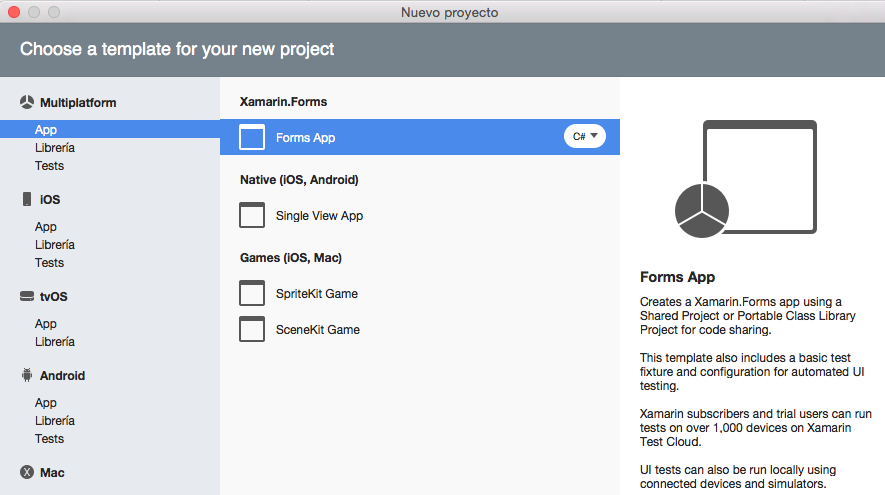
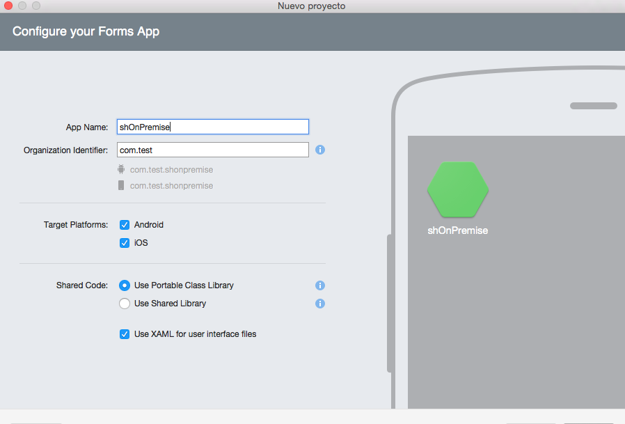
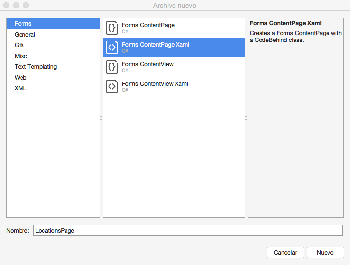
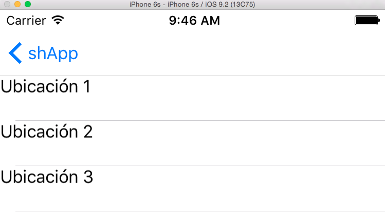

Los desarrolladores de aplicaciones multiplataforma para móvil estamos de enhorabuena, tenemos una plataforma como Xamarin y el Framework de Xamarin Forms que nos facilita el desarrollo para diferentes plataformas. Imaginemos que un cliente nos pide una aplicación para el móvil en la que se muestren datos procesados de su SharePoint On-Premises y que funcione en Android, en iOS y en Windows Phone. Ahora esto es una tarea bastante fácil y en este artículo vamos a ver un ejemplo de cómo acceder a datos de On-Premises desde una app Xamarin.

Lo primero es crear una nueva App de tipo Xamarin.Forms:



Elegimos el tipo PCL para portable class library aunque como luego veremos vamos a incluir un proyecto de tipo Shared Library.



Una vez creado el proyecto vamos a crear unas clases que nos van a servir para realizar peticiones a los servicios REST de SharePoint haciendo uso de la clase System.Net.HttpClient. El truco es que estas clases hay que crearlas en un nuevo proyecto que vamos a añadir a nuestra solución de tipo Shared project, la explicación para tener que hacer esto es doble:

·       por un lado, los proyectos de tipo Portable library no admiten operaciones Async (y queremos realizar las llamadas de forma Async), esto se puede solucionar añadiendo la librería BCL pero no es lo que queremos ahora mismo.
·       por otra parte, para acceder a SharePoint On-Premises vamos a utilizar credenciales de Windows, pero el tipo de proyecto Portable library no admite la librería System.Net.Credentials y para solucionarlo deberíamos utilizar extensores de código para cada tipo de proyecto (Android, IOS, etc).

Como digo la forma simple de solucionar esto es crear un proyecto de tipo Shared code y añadir estas dos clases:

```
#region Espacios de nombresusing System;using System.Collections.Generic;using System.Net.Http;using System.Net.Http.Headers;using System.Threading.Tasks;using Newtonsoft.Json;using Newtonsoft.Json.Linq;#endregionnamespace shApp{    /// <summary>    /// Cliente HTTP para SharePoint    /// </summary>    public class SPHttpClient : HttpClient    {        public SPHttpClient(Uri webUri, string userName, string password) : base(new SPHttpClientHandler(webUri, userName, password))        {            BaseAddress = webUri;        }        /// <summary>        /// Execute request method        /// </summary>        /// <param name="requestUri"></param>        /// <param name="method"></param>        /// <param name="headers"></param>        /// <param name="payload"></param>        /// <returns></returns>        public async Task< JObject> ExecuteJson<T>(string requestUri, HttpMethod method, IDictionary<string, string> headers, T payload)        {            try            {                HttpResponseMessage response;                switch (method.Method)                {                    case "POST": // Operaciones Insert/Update/Delete                        var requestContent = new StringContent(JsonConvert.SerializeObject(payload));                        requestContent.Headers.ContentType = MediaTypeHeaderValue.Parse("application/json;odata=verbose");                        DefaultRequestHeaders.Add("X-RequestDigest", GetDigest(this));                        if (headers != null)                        {                            foreach (var header in headers)                            {                                DefaultRequestHeaders.Add(header.Key, header.Value);                            }                        }                        response = await PostAsync(requestUri, requestContent);                        break;                    case "GET":                          response = await GetAsync(requestUri);                        break;                    default:                        throw new NotSupportedException(string.Format("Method {0} is not supported", method.Method));                }                response.EnsureSuccessStatusCode();                  var contenidoRespuesta = response.Content.ReadAsStringAsync().Result;                return String.IsNullOrEmpty(contenidoRespuesta) ? new JObject() : JObject.Parse(contenidoRespuesta);            }            catch (Exception ex)            {                return null;            }        }                 public async Task< JObject> ExecuteJson<T>(string requestUri, HttpMethod method, T payload)        {            return await ExecuteJson(requestUri, method, null, payload);        }             public async Task< JObject> ExecuteJson(string requestUri)        {            return await ExecuteJson(requestUri, HttpMethod.Get, null, default(string));        }         public string GetDigest(HttpClient client)        {            if (Common.Token != "")                return Common.Token;                        string retVal = null;            // string cmd = "_api/contextinfo";            var endpointUrl = string.Format("{0}/_api/contextinfo", BaseAddress);            HttpResponseMessage response = this.PostAsync(endpointUrl, new StringContent(string.Empty)).Result;            if (response.IsSuccessStatusCode)            {                string content = response.Content.ReadAsStringAsync().Result;                JToken t = JToken.Parse(content);                retVal = t["d"]["GetContextWebInformation"]["FormDigestValue"].ToString();                Common.Token = retVal;            }            return retVal;        }    }} ​
```


y el handler en el cual inyectamos las credenciales:

```
#region Espacios de nombresusing System;using System.Net;using System.Net.Http;using System.Security;using System.Threading;using System.Threading.Tasks;#endregionnamespace shApp{    public class SPHttpClientHandler : HttpClientHandler    {        public SPHttpClientHandler(Uri url, string usuario, string password)        {            this.Credentials = new NetworkCredential(usuario, password);        }     } } ​
```

Con esas dos clases ya tenemos el acceso a SharePoint mediante servicios REST y credenciales Windows. Ahora nos queda crear una clase que se corresponda con nuestra lista de SharePoint, en nuestro caso se trata de una lista llamada List\_Locations (lista de ubicaciones), esta lista solo tiene una propiedad Title y por tanto nuestra clase queda así…

```
using System;using System.Collections.Generic;using System.Threading.Tasks;using Newtonsoft.Json.Linq;using SQLite;namespace shApp{    public class List_Locations    {        public List_Locations()        {        }        public static async Task<List<LocationsItem>> getList()        {            List<LocationsItem> lista = new List<LocationsItem>();             // Variable para gestionar los resultados JSON            JObject datos;             try            {                using (var cliente = new SPHttpClient(new Uri(Common.urlSharepoint), Common.MasterUser, Common.MasterPassword))                {                    //cliente.Timeout = new TimeSpan(50);                    var urlPeticion = string.Format("{0}/_api/web/lists/getbytitle('{1}')/items", Common.urlSharepoint, "List_Locations");                    datos = await cliente.ExecuteJson(urlPeticion);                    if (datos != null)                    {                        foreach (var item in datos["d"]["results"])                        {                            lista.Add(new LocationsItem                            {                                ID = System.Convert.ToInt32(item["ID"].ToString()),                                Title = item["Title"].ToString()                             });                            //Console.WriteLine(item["Title"]);                        }                    }                }            }            catch (Exception ex)            {                return null; // new JObject(ex.Message);            }            return lista;        }    }    public class LocationsItem    {        public LocationsItem()        {        }        [PrimaryKey, AutoIncrement]        public int databaseId { get; set; }        public int ID { get; set; }        public string Title { get; set; }     }}​
```

Como veis es una clase muy simple con una función getList() que llama a SharePoint y carga la lista; pues ya tenemos todo listo para integrarlo con Xamarin.Forms, vamos a crear una página en Xaml:



Modificamos el XAML de la página para crear un listView (lo que queremos es sacar un listado de las ubicaciones de nuestra lista)

```
<?xml version="1.0" encoding="UTF-8"?><ContentPage xmlns="http://xamarin.com/schemas/2014/forms" xmlns:x="http://schemas.microsoft.com/winfx/2009/xaml" x:Class="shApp.LocationsPage"><ContentPage.Content>        <StackLayout>            <ListView x:Name="locationsList">                <ListView.ItemTemplate>                    <DataTemplate>                        <ViewCell>                            <ViewCell.View>                                <StackLayout Orientation="Horizontal">                                    <Label Text="{Binding Title}" />                                 </StackLayout>                            </ViewCell.View>                        </ViewCell>                    </DataTemplate>                </ListView.ItemTemplate>            </ListView>        </StackLayout>    </ContentPage.Content></ContentPage> ​
```

y en el código de la página llamamos a nuestra clase

```
using System;using System.Collections.Generic;using Xamarin.Forms;namespace shApp{    public partial class LocationsPage : ContentPage    {        public LocationsPage()        {            InitializeComponent();            bindData();         }        public async void bindData()        {            List<LocationsItem> lista = new List<LocationsItem>();            lista = await List_Locations.getList();            if (lista != null)                locationsList.ItemsSource = lista;        }    }} ​
```

y el resultado es el siguiente:



Como veis nuestro código queda bastante claro y limpio.

**Conclusiones**

He intentado que el artículo fuese lo más simple posible y por tanto he obviado operaciones de inserción y modificación, si queréis saber cómo modificar o insertar nuevos elementos en la lista tan sólo tenéis que echar un vistazo a este artículo [https://blog.vgrem.com/2015/04/04/consume-sharepoint-online-rest-service-using-net/](https://blog.vgrem.com/2015/04/04/consume-sharepoint-online-rest-service-using-net/) , es el artículo que he utilizado como base para mi código y en él hay ejemplos de diferentes operaciones sobre los items de una lista.


**Luis Molina Martinez**
 Software engineer
 micuentadecasa@gmail.com

 
 
import LayoutNumber from '../../../components/layout-article'
export default LayoutNumber
