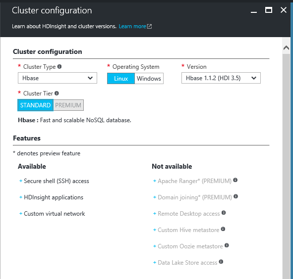
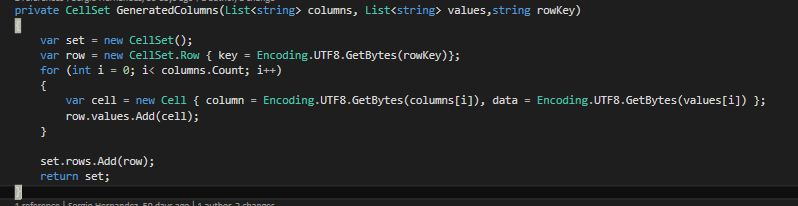

Es una evidencia que cada vez más tendemos a acumular cantidades muy grandes de datos, y que casi cualquier corporación media está pasando por este proceso. Si bien es muy normal que casi cualquier empresa haya abandonado ya los modelos relacionales, invirtiendo en otros modelos más dinámicos como modelos documentales o analíticos, se hace más complejo ver instaurado un modelo Big Data, bien por desconocimiento, por coste o por cultura.
 
 ¿Y si este escenario se convirtiere en un servicio de pago por uso?

**¿Qué es HDInsight?**

Aunque no es el objetivo de este artículo, si sería bueno tener nociones básicas de que es HDInsight y sobretodo adentrarnos un poco en la solución Hadoop que nos proporciona este servicio.


HDInsight no deja de ser un servicio PaaS que nos proporciona Microsoft desde Azure para instalar soluciones de Apache Hadoop que nos permiten entre otras cosas disfrutar de Spark,Hive,MapReduce, R o HBase entre otras utilidades.

Para el que nunca haya trabajado con Hadoop el párrafo anterior le puede haber sonado a chino como es lógico, y siento anticipar que en este artículo no voy a profundizar en esta herramienta, aunque sí puedo referenciar que Apache Hadoop es un proyecto Open Source que se define como un Framework que permite el procesamiento de grandes cantidades de datos en sistemas distribuidos. O lo que es lo mismo está pensado para en base a un sistema distribuido en un cluster (pensado para un crecimiento horizontal y vertical), podamos manejar cantidades elevadas de datos, por lo que podemos empezar a pensar en Gigabytes o TeraBytes de información.


Dentro de toda esta gran herramienta nos vamos a centrar en como instalar y manejar un cluster con el objetivo de utilizar HBase que por definición es una base de datos distribuida no relacional modelada a partir de Google BigTable y escrita en Java.

**HBase: datos orientados a columnas**

Apache HBase no es más que una base de datos NoSQL de código abierto que encontramos dentro del proyecto Hadoop y que está pensado para almacenar gran cantidad de datos no estructurados y semiestructurados. HBase es un ejemplo de base de datos que tiene una organización de datos Orientado a Columnas. Esto quiere decir que almacena la información por columnas o familia de columnas permitiendo almacenar una gran cantidad de datos ya que la búsqueda de un valor de una columna en concreto evita tener que ir recorriendo cada una de las filas.

Por ejemplo, para guardar la información de un usuario que podría ser de la siguiente forma:


| ID | Nombre | Apellidos | Teléfono | Cargo | Centro de Trabajo | Rango Salarial |
| --- | --- | --- | --- | --- | --- | --- |
| 10000 | Sergio | Hernández | 60xxxxxx | Team Leader | Madrid | A1 |


En HBase dejaríamos a un lado este modelo tabular y tendría una forma parecida a la siguiente:


|  | Familia de columnas: Personal | Familia de columnas: Profesional |
| --- | --- | --- |
| ID | Nombre | Apellidos | Teléfono | Cargo | Centro de Trabajo | Rango Salarial |
| 10000 | Sergio | Hernández | 60xxxxxx | Team Leader | Madrid | A1 |


HBase está optimizado para que crezca el número de columnas frente el crecimiento por filas, pudiendo agrupar estas columnas por familias agrupando así la información que necesitemos filtrar.

Cada **f** ila es única y se asignará una única RowKey por lo que toda la información de un usuario se almacenará en una única fila. Este modelo de datos está pensado para escenarios con una cantidad de datos elevada en escenarios como blogs, foros o logging.

**Primer Paso, crear nuestro cluster de Hadoop**

Para empezar a trabajar con Hadoop o en nuestro caso con HBase lo primero que tendremos que hacer es acceder al portal de Azure y crear un servicio de HdInsight.


Lo vamos a encontrar en la categoría de “Intelligence & analytics” y para configúralo correctamente seguiremos los siguientes pasos:

·          Nombre del cluster. Lo primero es dar un nombre “reconocible” y que recordemos a nuestro nuevo cluster. Es importante recordar este paso ya que lo vamos a utilizar a futuro para conectarnos. El nombre del ejemplo será CompartimossCluster.azurehdinsight.net .

·          Configuración del cluster. Este paso posiblemente sea uno de los más importantes ya que estamos dándole forma a nuestro cluster, deberemos decidir el tipo de cluster (Hadoop, Hbase, R Server), si lo queremos en base Linux o Windows y la versión del Hbase. Este paso es importante ya que no podremos modificarlo una vez creado.​

​

·          Credenciales de acceso **.** Este paso nos permitirá configurar tanto las credenciales de acceso a nuestro Cluster y por tanto al portal del cluster, como el acceso remoto por SSH (Secure Shell) como veremos más adelante.


·          Origen de datos. Podremos crear una nueva cuenta de almacenamiento donde se dejarán nuestros datos, o por el contrario utilizar una ya existente en nuestra suscripción.

·          Plan de precios. Posiblemente el paso más importante ya que nos va a marcar por un lado la potencia de nuestra instalación, y por otro cuando nos vamos a gastar (importante en un modelo de pago por uso). Aclarar que una instalación de Hadoop o HBase es costosa ya que implica la instalación de un nº elevado de máquinas. Deberemos escoger el nº de regiones siendo el mínimo una región que implicará la creación de 6 máquinas para distribuir nuestra instalación.

Cada máquina es configurable pudiendo añadir “Cores”, o discos sólidos. En nuestro caso vamos a usar el plan mínimo tanto de regiones como de máquinas, y podréis observar que el coste ya es de 1,47€ por hora.​


Es cierto que la instalación requiere de más indicaciones ya que se nos permite añadir aplicaciones extra o elegir el grupo de recursos. Una vez que terminemos este proceso, la **creación es automática** , pero se deben saber dos cosas. La primera es que es relativamente lenta dado que el caso mínimo es aprovisionar 6 máquinas en un cluster, y por otro lado a día de hoy no se puede detener el cluster, por lo que se debe borrar si no queremos gastar más de lo debido ya que el pago es por uso y hora de encendido.

**Diseña y trabaja con bases de datos sobre HBase**

Hasta aquí ya podemos decir que tenemos una idea general de que es HBase, de que es HDInsight y tenemos un cluster distribuido de datos listo para empezar a trabajar con él.

**¿Pero cómo empiezo a trabajar con mi HBase?**

Para empezar, deberemos diseñar un modelo de datos ajustado a columnas como vimos en la explicación de HBase, y en nuestro caso usaremos el ejemplo de los datos de un Usuario que vimos en el primer ejemplo.

**HBase Shell con Secure Shell (SSH)**

La primera forma que vamos a ver para comunicarnos con HBASE es hacer uso de HBase Shell y para ello lo primero es conectarnos al cluster vía SSH, para poder aplicar de forma remota las distintas sentencias que necesitemos. Para comunicarnos vía SSH vamos hacer uso de una herramienta gratuita como Putty, que podemos descargar desde su página oficial [http://www.putty.org/](http://www.putty.org/) .

Una vez descargada la aplicación, necesitaremos configurar la conexión contra nuestro cluster de HDInsight. El nombre de la conexión es fácil de deducir ya que es &lt;Nombre\_Cluster  -ssh.azurehdinsight.net&gt;.

Ahora debemos recuperar las credenciales que escogimos en la instalación del cluster y en concreto el nombre de usuario SSH y contraseña que escogimos.

Si no recordamos el nombre de que escogimos tenemos todos estos datos en el portal de Azure y en concreto en la configuración de nuestro servicio de HDIsight.


No es necesario cambiar el puerto que por defecto viene configurado en el 22. Seleccionaremos en tipo de conexión, la opción SSH.

Siguiendo todos estos pasos deberíamos tener todo configurado, y bastaría con seleccionar “Open” para que de forma casi instantánea se nos pidan las credenciales de SSH que configuramos.

Si todo ha ido de forma correcta deberíamos tener acceso a la consola tal cual se ve en la siguiente imagen.


Una vez aquí debemos instanciar HBase Shell con la instrucción “hbase Shell” **,** y desde aquí ya podemos hacer uso de las distintas instrucciones que encontramos en este lenguaje, con el que podemos hacer cualquier operación que necesitemos.

**Crear Tabla Usuario**

Deberemos ejecutar la instrucción **“** create *‘Nombre Tabla’,’Nombre Familia Columnas’,’Nombre Familia de Columnas’”***.**

****

**Introducir usuario y definir columnas**

Una vez tenemos definida la tabla vamos a introducir un primer dato de prueba para definir el contenido de la familia de columnas y las columnas con las que vamos a organizar la información. Para ir añadiendo a las columnas ejecutaremos el comando “put ‘ *tabla’* , ‘rowKey’ ’familia:columna’, ‘ *valor’* ”


Deberemos ir ejecutando esta instrucción por cada una de las columnas que queramos ir definiendo. Decir que el rowKey es único, no pueden existir dos filas con un mismo RowKey en HBase.

**Recuperar los datos de una tabla**

Tenemos dos instrucciones para ver el contenido o la estructura de una tabla. La primera es “describe ‘tabla’”, que nos expone el contenido y la estructura completa de una tabla. 
Y por otro lado podemos ejecutar tanto la instrucción “get ‘tabla’, ‘rowKey’”, que nos devuelve el contenido de una fila por clave de fila o bien ejecutar una instrucción “scan ‘tabla’, ‘\{familia=&gt;[columnas]\}”.


La diferencia de una consulta u otra, es que hacer un get por clave de fila recupera toda la información de una fila, y realizar un scan nos permite no filtrar por fila sino por “columna”, sacando el máximo partido al modelo orientado a columnas que nos aporta HBase.

**C# y HBase**

Aunque Hadoop está desarrollado sobre Java, nos es posible comunicarnos y hacer todas las operaciones que hemos visto con HBase Shell desde código en C#. Para ello debemos hacer uso de un paquete NuGet que podemos descargarnos desde el Visual Studio y añadirlo a nuestras soluciones, y que se llama Microsoft HBase Client.


Para poder manejar esta librería necesitamos manejar los siguientes conceptos, tal y como vemos en los siguientes fragmentos de código.

·         **Inicializar la conexión:​**

​

Lo primer que necesitamos es por un lado instanciar “ClusterCredentials”, para poder instanciar una nueva instancia de HBaseClient que nos dará acceso a la base de datos.

·         **Crear Tabla:​**

​

Si revisamos este código podemos ver como se parece bastante a como lo creamos vía Shell, ya que debemos por un lado especificar el nombre de la tabla que vamos a crear, como un listado de familia de columnas. 
Con esto conseguimos definir el schema de la tabla e invocar la creación de la misma. Un ejemplo de uso de este método puede ser    CreateTable("Usuario", new List&lt;string&gt;() \{"Profesional","Personal"\}).


·         **Get fila:**

****

​

Como vemos la librería de HBase.Client nos expone un método GetCellsAsync, que, especificando el nombre de la tabla y la clave de fila, nos devuelve el contenido de toda la fila, de forma muy similar a como vimos en el método Get de Hbase Shell.

·         **Insertar:**

****

​​

Este método es muy sencillo de implementar, ya que basta con instanciar el método         StoreCellAsync que nos proporciona la libe

ría.

Lo interesante es construir “los datos” que queremos insertar dentro de HBase y que son del tipo CellSet. Para ello podemos utilizar el siguiente método que construye un CellSet en base a un listado de valores, una lista de columnas y la clave de fila.​

​

Si analizamos el código debemos setear CellSet.Row con la clave escogida, y por otro lado ir construyendo el objeto CellSet, añadiendo a la fila cada una de las columnas que hemos ido definiendo. Una forma de generar nuestras columnas sería muy parecida a esta    List&lt;string&gt; columnasUsuario = new List&lt;string&gt;() \{ "personal:Nombre", "personal:Apellidos", "profesional:Sede", "profesional:Antiguedad"\},  y que deberemos pasar a nuestro método GeneratedColumns.
 
·         **Scanner**


Posiblemente este sea el método más complejo de instanciar de esta librería, ya que se nos permite hacer infinidad de filtros.

Lo primero que necesitamos es definir el filtro o filtros que vamos a aplicar, y en este caso queremos filtrar por nombre de la familia de columnas.

SingleColumnValueFilter filtro = new SingleColumnValueFilter(Encoding.UTF8.GetBytes(columnFamilyFilter),

Encoding.UTF8.GetBytes(keyColum), CompareFilter.CompareOp.Equal, comparer);

Una vez se tiene el filtro definido se puede crear el scanner que ejecutaremos para obtener los datos.

```
var scanSettings = new Scanner()

{

filter = filtro.ToEncodedString(),

};
```

Una vez definido el Scanner, basta con ejecutarlo con la instrucción ScannerGetNextAsync, que devuelve una lista de filas que cumplen los criterios. Si observamos bien los métodos que se han implementado son asíncronos, y deberemos instanciarlos de esta forma u obtendremos error al ejecutarlos.


 
**Conclusiones**

Una vez más los servicios PaaS de Azure nos demuestran que si no lo es ya, este modelo de consumo por uso va a ser muy útil en el futuro. Por ejemplo, lanzarnos a usar Hadoop sin saber si es nuestra solución indicada, o aun sabiéndolo implementar toda esta infraestructura es muy costoso, cuando en pocos pasos podemos crear un servicio de HDInsight y empezar a trabajar.

Por otro lado, usar HBase es muy recomendable para casos en los cuales vayamos a tener infinidad de datos, y podamos tener información organizada en columnas, sin duda el rendimiento de esta base de datos es muy superior a otras como puede ser una base documental en MongoDB. Eso sí tenemos que analizar bien nuestro modelo de datos, ya que en algunas ocasiones no es sencillo adaptarnos a un modelo orientado a columnas, o simplemente no nos va a ser útil.

Sin duda Hadoop es una herramienta enorme, que podemos empezar a saborear con HDInsight, y que nos permitirá ir introduciendo el Big Data en nuestro día a día sin suponer una gran inversión de inicio tanto en conocimiento como en costes, sin duda muy recomendable empezar a darle uso.


**Sergio Hernández Mancebo**

Team Leader de Soluciones Microsoft en Encamina

@shmancebo

 
 
import LayoutNumber from '../../../components/layout-article'
export default LayoutNumber
