Antes, en máquinas virtuales de tipo *classic* era muy fácil hacer una captura de una máquina virtual para luego utilizarla como plantilla para luego desplegar instancias.

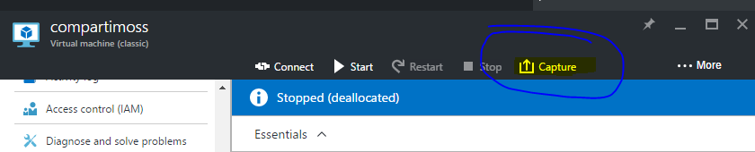

Era tan fácil como darle al botón ‘ *capture’* . Pero el cuento ha cambiado…En el formato ARM, la cosa se complica un poco, ya que desde el portal de Azure no aparece el botón.

Voy a explicar a continuación como preparar una imagen de forma sencilla. También podemos hacerlo desde PowerShell, pero como veréis más adelante, Azure tiene un portal web dedicado a la gestión de los recursos Azure, que con tres clics nos va a permitir generar una imagen de nuestra máquina. Comencemos.

Para empezar, vamos a crear una máquina de tipo ARM en el portal de Azure.

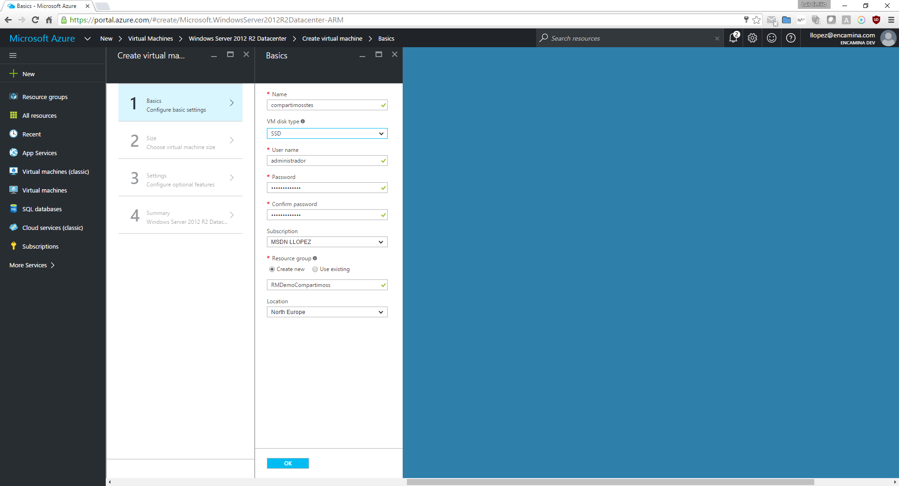

Mientras que la estamos creando, podemos ajustar los diferentes parámetros para que se ajuste a nuestras necesidades. Yo lo dejo por defecto, porque es una demo.

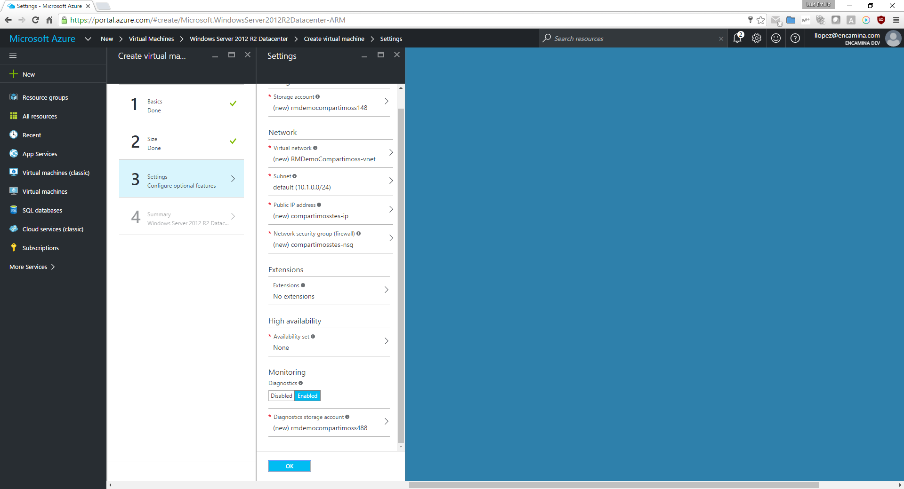

Una vez que aceptamos los parámetros de la máquina, viene la primera parte de la magia.

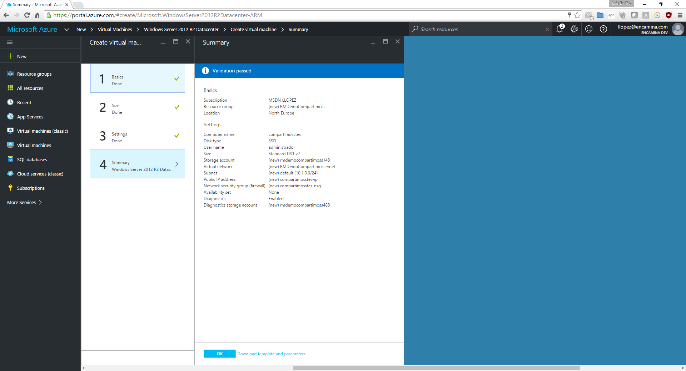

En la pantalla de resumen, tenemos abajo un enlace a:

Si pulsamos sobre él se despliega otro panel

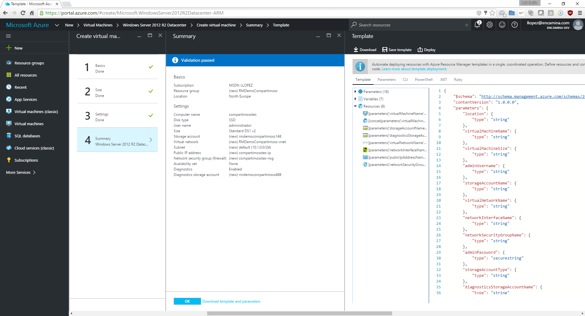

Desde este panel podemos observar lo JSON y scripts que va a usar Azure para desplegar la máquina. Si pulsamos sobre ‘Download’ se nos descargara un ZIP con los JSON y los scripts PowerShell, Ruby, bash y el código de C# para replicar la máquina. Almacenamos este ZIP porque lo usaremos posteriormente para desplegar instancias desde la imagen que capturemos.

Una vez guardado el ZIP podemos proceder a implementar nuestra máquina pulsando en OK. Esperamos un ratito y cuando se levante la máquina, nos conectamos a ella e instalamos el software que necesitamos. Ahora que ya la tenemos lista para plantillarla, le pasamos un sysprep y la apagamos.

Una vez la maquina se ha apagado tras ejecutar el sysprep, nos vamos al portal [https://resources.azure.com](https&#58;//resources.azure.com/) nos logamos con la misma cuenta que en el portal de Azure.

En primer lugar, marcamos la casilla ‘ *READ/WRITE’* y seleccionamos la suscripción donde está la máquina.

Una vez ubicada, desplegamos las suscripciones, y los grupos de recursos, y seleccionamos el grupo de corresponda.

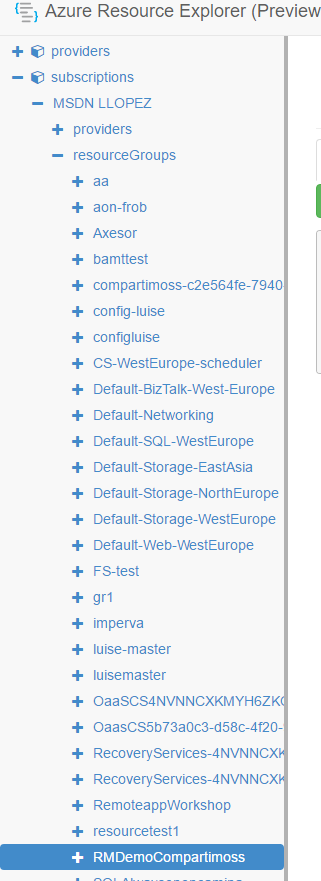

Lo desplegamos, hasta llegar hasta la máquina que queremos usar como plantilla.

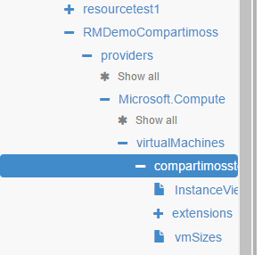

Una vez sobre la máquina, pulsamos sobre el botón ‘Actions (Post/Delete)’.

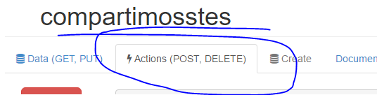

Con lo que se nos desplegaran un montón de opciones a la izquierda:

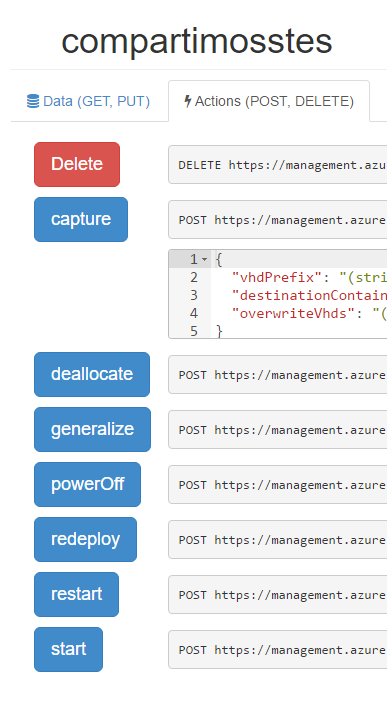

Desde esta ubicación, es donde capturaremos la maquina como plantilla. En primer lugar, le daremos al botón DEALLOCATE

Con esto apagaremos para Azure a la máquina.

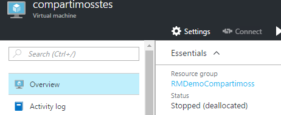

Una vez la maquina este en estado '*deallocated'*le pulsaremos al botón '*Generalize'*. Esto dejara a la maquina en el estado óptimo para capturarla como snapshot.

Es el momento de rellenar el formulario de la web en la sección '*Capture'*. Yo suelo usar los valores reseñados, pero cada uno tiene sus gustos y necesidades.

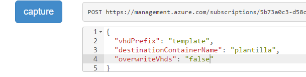

Una vez pulsado el botón ‘ *capture* ’, en unos minutos tendremos nuestra plantilla lista dentro del ‘Storage Resource’ donde ubicamos la máquina inicialmente en la ruta que se indica en la plantilla. Siempre es: system/Microsoft.Compute/Images/&lt;destinationContainerName&gt;

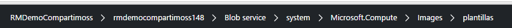

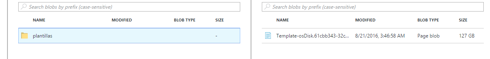

A partir de aquí, tenemos una imagen de plantilla de nuestra máquina virtual de origen y estamos en condiciones de instanciarla mediante scripting, usando los archivos que descargamos antes; pero eso os lo contare en futuras entregas.

**Luis Emilio López**

Responsable de Infraestructuras en Encamina

