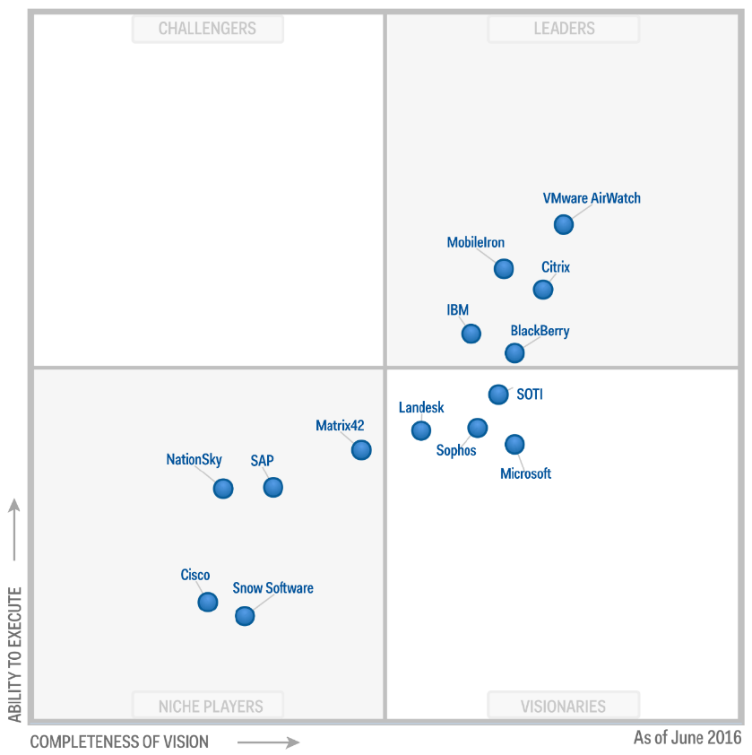
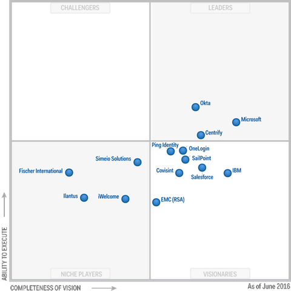
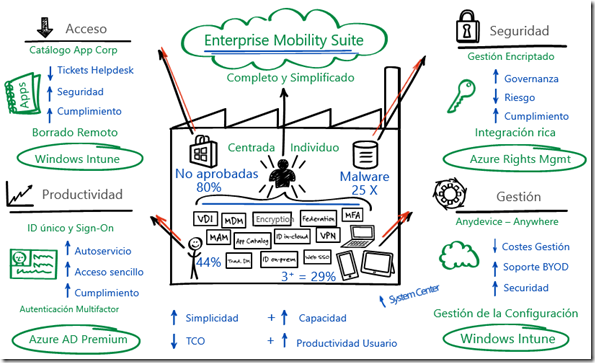

**Enterprise Mobility Suite** (EMS), Es un conjunto de productos hospedados por Microsoft para un mejor precio. Individualmente, la suma del coste de estos servicios asciende a casi 3 veces el coste de tener todo incluido, haciéndolo más atractivo para ir con todo el paquete. Para una buena ejecución de la estrategia de movilidad completa de su cliente, ayudando así a los usuarios a ser productivos en los dispositivos y proteger los activos corporativos.

Gartner ha publicado este año 2016 el [Cuadrante Mágico de Gestión de la Movilidad empresarial](https://info.microsoft.com/EMS-EMM-MQ-2016.html) (EMM) y, en base a la integridad de visión y capacidad de ejecución en el mercado de la movilidad empresarial, que han posicionado a Microsoft en el Cuadrante Visionario.

La suite consta de los siguientes productos:

**1.****Azure Active Directory Premium (AAD Premium)** es una solución de administración de identidades y acceso con un conjunto de funcionalidades que tienen como objetivo proteger el acceso a las aplicaciones locales y en la nube, así como ayudar a mantener la seguridad de los datos corporativos. Este servicio incluye entre otras características:
o   **Inicio de sesión único (SSO):**    Puedes gestionar y unificar identidades entre múltiples plataformas, dispositivos y servicios en la nube (o en local) para lograr un inicio de sesión único. Esto permite que los empleados utilicen una única credencial de acceso, corporativa y segura para acceder a aplicaciones OnPremise y servicios Cloud.
 Post de la    [configuración del AD Connet](http://jorgecastanedac.com/configuracin-express-de-active-directory-connect/) . 
o   **Autoservicio:**    Ofrece un portal de autoservicio a través del cual los propios usuarios que olviden una contraseña o bloqueen una cuenta, pueden restablecerlas a partir de una pregunta de seguridad o un código enviado a su dispositivo móvil. 
o   **Autenticación Multifactor (MFA):**    Integra una funcionalidad que ayuda a prevenir el acceso no autorizado a datos en la nube a través de una segunda autenticación mediante una App móvil, una llamada telefónica automatizada o un mensaje de texto.

Gartner publicó su Cuadrante Mágico de **Gestión de Identidad y Acceso como Servicio** (IDaaS) para 2016 y Azure Active Directory se colocó en el cuadrante de “líderes”, y se coloca muy fuertemente

en la integridad de la visión. Copias gratuitas disponibles se pueden acceder [aquí](https://info.microsoft.com/EMS-IDaaS-MQ-2016.html) .​

​​

**2.****Azure Rights Management (Azure RMS)** Ayuda a datos confidenciales seguros y archivos donde quiera que vayan. Con esta funcionalidad, se adjunta un certificado a cada archivo que tenga un correo electrónico o en SharePoint Online para limitar el acceso al archivo(s) de la persona(s) en el correo electrónico e incluso impedir la impresión del archivo.

o   **Crear políticas de seguridad:**    Tanto de identidad y autorización, tales como requerir la contraseña de usuario corporativo para trabajar con el documento, no permitir capturas de pantalla y muchas otras todas destinadas a evitar el acceso a usuarios no autorizados y asegurar el cumplimiento de las políticas de la empresa. 

o   **Establecer directivas:**   Para proteger tus archivos (SharePoint Online) y correo electrónico (Exchange Online) en cualquier dispositivo y con las que podrás aplicar restricciones tales como no permitir el copiar, cortar y pegar, así como protección frente a la impresión de documentos o la descarga de archivos.

o   **Define reglas de transporte:** Para cifrar mensajes de correo electrónico saliente y descifrar respuestas cifradas entrantes o para evitar que un destinatario externo a la organización pueda realizar alguna de estas funciones: acceder y reenviar el contenido de un correo electrónico.

**3.****Microsoft Advanced Threat Analytics** Ayuda a identificar las infracciones y las amenazas utilizando análisis del comportamiento y proporciona un informe claro y aplicable en una simple línea de tiempo de ataque.

**4.****Microsoft Intune** proporciona gestión de dispositivos móviles, gestión de aplicaciones móviles, y las capacidades de gestión de la PC en la nube. Usando Intune, las organizaciones pueden proporcionar a sus empleados con acceso a las aplicaciones corporativas, datos y recursos desde prácticamente cualquier lugar en casi cualquier dispositivo, mientras que ayuda a mantener la información corporativa segura.
o   **Dispositivos autorizados:** Puedes gestionar todo tipo de dispositivos (iOS, Android, WP y PC’s ) así como establecer políticas de seguridad para los que pueden acceder a la información corporativa. Con esta función, tanto emails como documentos de todo tipo sólo pueden ser utilizados por dispositivos autorizados por la compañía e incluso es posible bloquear el uso de conexiones USB.
o   **Borrado selectivo de datos:** Con esta función, si un dispositivo se pierde, ha sido robado o si el empleado ya no forma parte de la organización, los administradores pueden borrar los datos corporativos que había dentro del dispositivo, pudiendo opcionalmente hacerlo sin eliminar los datos personales del usuario.
o   **Despliegue automatizado de aplicaciones:** Permite instalar de manera automatizada nuevas aplicaciones y actualizaciones de las mismas, así como de los sistemas operativos.

**5.****Microsoft Identity Manager (MIM)** Ofrece en las instalaciones de gestión de identidad y acceso. Permite sincronizar identidades entre diferentes directorios, bases de datos y aplicaciones. MIM ofrece la posibilidad de dar acceso privilegiado en la forma de acceso Just-In-Time, que permite a los usuarios adquirir los privilegios necesarios para sus tareas al tiempo que limita el día para el acceso de la cuenta.

6.       Microsoft Cloud App Security Este componente proporciona una visibilidad más profunda de la seguridad de sus aplicaciones en la nube con controles completos y una mayor protección.

Como se p​uede observar, el paquete es muy amplio y añade una gran cantidad de funcionalidad en torno a la gestión de la seguridad y la identidad. La mayoría de los clientes sólo van por un par de estos productos a la vez, pero una vez que el adquiera toda la suite, la implementación de la funcionalidad sólo añade valor a la experiencia del usuario final, manteniendo la seguridad.

**Conclusión**

EMS es el servicio para proteger, prevenir fuga de información y tener control sobre la documentación de la empresa o de los dispositivos.

**Jorge Castañeda**
 MVP Office Servers & Services
 jcastaneda@asr.pe
 @xorxe
 http://www.asr.pe

