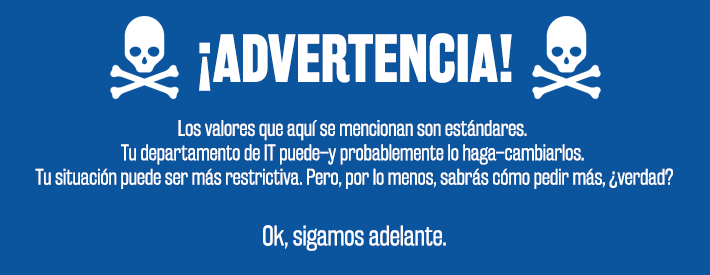
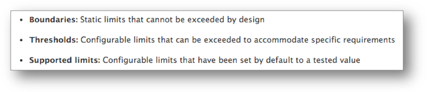
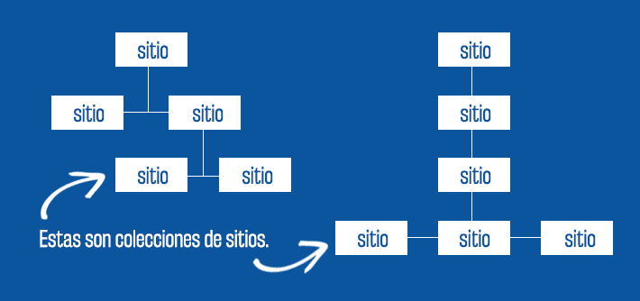
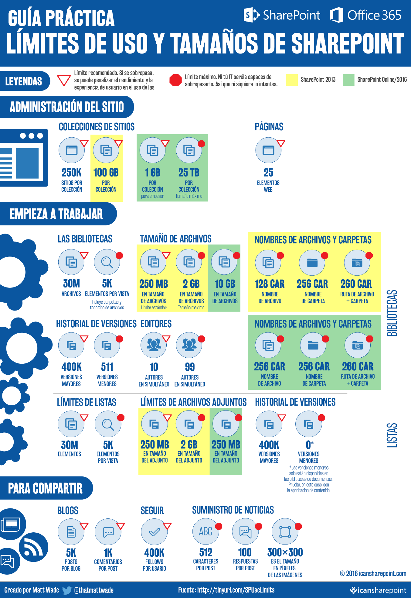

Hay algo que todos los usuarios de SharePoint deben tener en cuenta: los límites de la herramienta que están utilizando. Algunos de ellos pueden ser realmente molestos, pero la mayoría no te darán problemas…al menos en gran medida.

Eso es así hasta que descubres su existencia justo en el momento en que estás terminando un proyecto, o quizás cuando lo quieres compartir o cuando necesitas enviarlo. Si conoces estas limitaciones de antemano, puedes evitarte un mal rato en el futuro. En caso en el que te encuentres con uno de estos límites en una situación importante, seguramente lo recordarás por siempre. Pero es mejor seguir la regla de oro: revisa bien antes de darle uso. SharePoint no es infinito.

Permíteme repetirlo:

Cada sistema tiene sus propios límites, pero, en general, los estándares son similares o incluso los mismos. Tu departamento de IT quizás pueda cambiar algunos de estos valores; de todos modos, debes asegurarte de que sabes bien todo lo que está implementado, para que así no descubras –otra vez, demasiado tarde– que los límites que menciono aquí no son realmente los que se debieron establecer para ti.

(Muchos de los límites pueden ser restringidos más adelante por tu equipo de IT, y por lo tanto, no se pueden expandir– ten en cuenta que si hacen algún cambio, generalmente no será a tu favor).

Microsoft ofrece una [lista en profundidad de sus límites](https://technet.microsoft.com/es-es/es/library/cc262787.aspx), pero es un recurso que puede llegar a agobiar. Además, casi todo el artículo es irrelevante para los usuarios habituales de la herramienta. Es este el motivo por el que decidí hacer una selección de aquellos límites que pueden afectar el día a día de un usuario de la plataforma.

Quizás el día en que te topes de frente con un límite, no sea tan traumático, pues recordarás las perlas de sabiduría que viste en este post. Porque, por supuesto, ¡tú eres un SharePointer muy bueno y consciente!

Un último recordatorio:​

**Tipos de límites**

Microsoft define [tres tipos de límites](https://technet.microsoft.com/es-es/es/library/cc262787.aspx#Boundaries) en SharePoint 2013 y SharePoint Online:

- **Límites      máximos:**son límites      estáticos que no se deben exceder en el diseño.
- **Umbrales:**son límites configurables que se pueden      sobrepasar para atender requerimientos específicos.
- **Límites      admitidos:**son límites      configurables que se establecieron por defecto en base a valores ya      probados.

Estoy en desacuerdo–de forma respetuosa, creo–con la necesidad de hacer estas tres definiciones, aunque los umbrales y los límites admitidos son prácticamente lo mismo. Aquí está mi interpretación de esos conceptos:

- **Límites máximos:**Estos son límites que no pueden cambiar ni tú      ni el propietario del sitio ni el equipo de IT. El hecho de que sea más o      menos estricto depende de qué tipo de sistema SharePoint fue implementado      por el departamento de IT:
    - *SharePoint       On-Premises 2013:*Si       tu compañía usa SharePoint 2013 en sus propios servidores, entonces las       revisiones y actualizaciones de la plataforma pueden producir mejoras en       los límites. Pero, generalmente, una actualización completa de tu sistema       (por ejemplo, de SP2010 a SP2013) es necesaria para producir cambios       positivos en relación con esas limitaciones.
    - *SharePoint       Online:*Si usas       SharePoint Online en Office 365, se pueden conseguir mejoras en los       límites cuando Microsoft decida hacerlo. Es algo así como cuando tienes       una cuenta en Gmail: el límite se incrementa cuando Google quiere ser       competitivo al ofrecer más espacio a sus usuarios. Así que sonríe, pues       podrías llegar un lunes en la mañana a la oficina y sorprenderte con una       buena cuota de espacio adicional.
- **Umbrales**y **límites admitidos:**ambos      son límites sugeridos que se pueden cambiar o sobrepasar, pero que      Microsoft recomienda no modificar en base a los resultados de las baterías      de pruebas realizados sobre la plataforma. ¿Quieres romper un límite?      Entonces, tendrás que asumir que puedes penalizar el rendimiento de tu      Granja. Los límites se basan en la habilidad de SharePoint para      desarrollar una determinada acción: por ejemplo, *puedes* subir      un archivo de 2GB –a SharePoint no le va a importar–, pero es posible que      se tarde mucho en cargarlo, y quizás el motor de búsquedas dé un error      durante el proceso; por eso, el límite se establece en un sentido      práctico, y muchas veces es algo que ni el propio SharePoint puede      controlar. También se pueden establecer estos límites para controlar los      problemas de rendimiento desde el lado del usuario: tener millones de      archivos en una biblioteca afectará la rapidez de carga cada vez que      intentes acceder a la misma.

A veces pienso que las recomendaciones de Microsoft no tienen mucho que ver con las pruebas, sino con su capacidad para solucionar esas situaciones por sus propios medios. Bueno, ¿sabes qué? Redmond prefiere estar seguro que lamentarlo después. Esos límites los protegen de cualquier acción legal que quieran emprender los clientes. Por supuesto, eso no quiere decir que [Microsoft esté a salvo de demandas.](https://en.wikipedia.org/wiki/United_States_v._Microsoft_Corp.)

**SharePoint 2013 vs. SharePoint Online**

En primer lugar, si no tienes clara la diferencia entre SharePoint y Office 365, puedes revisar mi artículo anterior [aquí](http://icansharepoint.com/explained-sharepoint-versus-office-365/). Con seguridad, te ayudará a entender cómo estos límites pueden afectarte.

En caso de que  tú organización disponga de una infraestructura SharePoint 2013 propia, las limitaciones que experimentes serán estáticas mientras dure su vida útil o hasta que el sistema se actualice a SharePoint 2016. También puedes contar con estos límites hasta que migres a SharePoint Online como parte de una migración/actualización a Office 365. SharePoint se actualiza de forma frecuente, generalmente cada trimestre, y tu departamento de IT también puede hacerlo sin que te enteres. Desafortunadamente, esas mejoras escalonadas no te darán todos los beneficios que puedes obtener con una actualización de la versión completa.

De todos modos, SharePoint Online–que es gestionado y administrado por Microsoft, se beneficiará en ocasiones de las actualizaciones de rendimiento y características a medida que Microsoft mejora el producto y despliega releases más pequeñas y segmentadas quelas que habitualmente se realizan cada 3 años para SharePoint On-Premises (SharePoint 2007, 2010, 2013, 2016. ¿Te das cuenta del patrón?).

Eso significa que si tienes Office 365 con SharePoint Online y OneDrive para Empresa, podrás ver las mejoras gracias a las actualizaciones de funciones que se hacen de forma más periódica; así, no tendrás que esperar a que el departamento de IT actualice SharePoint. Aunque te parezca adecuado actualizar una plataforma como SharePoint cada 3 años, en muchas ocasiones ocurre que la actualización puede llevar dos ciclos de producto: todo depende del equipo de Tecnología. Por ejemplo, tu compañía puede estar trabajando con SharePoint 2007 por tanto tiempo que en IT decidan saltarse  SharePoint 2010 e ir directamente a SharePoint 2013. Lo más seguro es que sea bien recibido por los usuarios, pero significaría estar estancado con la versión de 2007 por mucho tiempo.

SharePoint Online es una mejor opción cuando se trata de obtener mejoras en las funciones, pero también significa que tendrás que estar al día de los cambios que se publican en los blogs de Microsoft y SharePoint. Así podrás saber todo sobre esas novedades, y también sobre la degradación o eliminación de alguna función, que quizás esté sucediendo justo bajo tus pies.

**Sitios y colecciones de sitios**

Todos los sitios de SharePoint forman parte de una familia de sitios, denominada colección de sitios. Usualmente, el departamento de IT es el que crea las colecciones de sitios. Los sitios hijos, nietos, bisnietos, etc., que se encuentran dentro de esa colección (piensa que son como las ramas de un único árbol), muchas veces son creados por el equipo de IT y otras, por cualquier usuario que lo necesite. Todo depende de las reglas que establezca tu departamento de IT.

El departamento de IT puede crear una gran cantidad de colecciones de sitios. Generalmente, designan una para cada organización de tu compañía (por ejemplo, departamento, oficina geográfica, ese tipo de cosas). Planificar esto con tiempo es un buen ejemplo arquitectura de información (AI) inteligente, algo que, aunque no esté entre tus pensamientos cotidianos, realmente incide en la forma en la que buscas lo que necesitas para hacer tu trabajo. Una arquitectura de información eficiente es aquella que no se nota, simplemente porque tiene sentido.

Las colecciones de sitios y los sitios son dos cosas diferentes, y funcionan de manera distinta. Por lo tanto, sus límites varían.

Microsoft recomienda que las colecciones de sitios no deben:

1. Contener más de      250.000 sitios (límite admitido), algo que, por cierto, es un número      alucinantemente grande.
2. Contener más de:
    1. [100 GB de información](https://technet.microsoft.com/es-es/es/library/cc262787.aspx#SiteCollection) (una cantidad relativamente pequeña,       en comparación con los sitios que se pueden admitir) en SharePoint 2013;       o
    2. [1 TB de información](https://support.office.com/en-us/article/SharePoint-Online-software-boundaries-and-limits-8f34ff47-b749-408b-abc0-b605e1f6d498?ui=en-US&amp;rs=en-US&amp;ad=US) en SharePoint Online (la cantidad       estándar empieza en 1 GB, así que debes solicitar un incremento a tu       administrador de IT).
3. Tener más      de [2 millones de usuarios](https://technet.microsoft.com/es-es/es/library/cc262787.aspx#Security) (límite admitido), lo que es, otra vez,      un número gigantesco (y probablemente sólo sea importante para IT, porque      ellos controlan quiénes son esos usuarios).
4. Tener más      de [5.000 usuarios en un grupo de      SharePoint](https://technet.microsoft.com/es-es/es/library/cc262787.aspx#Security) (límite      admitido), algo que, en realidad, se contradice con el elemento anterior;      y
5. Utilizar más      de [10.000 grupos de SharePoint](https://technet.microsoft.com/es-es/es/library/cc262787.aspx#Security).

Estos no son límites máximos. Si decides ir más allá, puedes hacerlo, pero el rendimiento y las operaciones de respaldo podrían afectarse de forma negativa, como explica Redmond.

No se mencionan de forma explícita los límites para sitios individuales, excepto que las páginas de SharePoint están limitadas a 25 elementos web por página (umbral). Esto me sorprendió porque he creado páginas que probablemente se acerquen a ese límite. Definitivamente, hay casos en los que pueden estar justificados los 25 elementos web. Así que ten esto en cuenta si eres propenso a usar muchos elementos web en tus páginas de SharePoint.

Algo que hay que tener en cuenta es que los sitios comparten el tamaño permitido para toda la colección. Eso significa que un sitio extremadamente pesado puede “robar” espacio a otros que estén dentro de la misma colección. He visto que esto ocurre en la práctica y créeme que no es nada bonito. Especialmente porque, muchas veces, los propietarios de los sitios “que compiten” ni siquiera saben sobre la existencia del otro hasta que se dan cuenta de que está acaparando espacio. No seas esa persona.

Sólo hay dos soluciones para este problema: 1) borrar contenido, o 2) mover alguno de los sitios (sea el agresor o la víctima). Ambas opciones son terribles. Muchísimo. Nadie quiere revisar contenido y borrarlo. Y mover los datos puede ser una verdadera pesadilla si no tienes una herramienta costosa para hacer la migración. E, incluso, si la tuvieras, puede seguir siendo complicado.

**Bibliotecas de documentos**

Una biblioteca de documentos es, a los ojos de SharePoint, como una gran carpeta. Contiene el historial de versiones, los metadatos personalizados (por ejemplo, las categorías y otros elementos similares), la estructura de la carpeta y otras herramientas. Aquí probablemente invertirás la mayor parte de tu tiempo, pues se trata de la elaboración, edición y eliminación de archivos que se publican en SharePoint. El dueño de un sitio puede crear un montón de bibliotecas en un sitio determinado.

Microsoft recomienda que:

1. Las bibliotecas      de documentos no contengan más de 30.[000.000 documentos](https://technet.microsoft.com/en-us/library/cc262787.aspx) (límite admitido). Se trata de una      cantidad extremadamente grande. Puedes obtener una capacidad mayor, pero      Microsoft no lo aconseja.
2. Por defecto, el      límite de tamaño de los archivos se establece así:
    1. [SharePoint 2013](https://technet.microsoft.com/en-us/library/cc262787.aspx#ListLibrary): 250 MB (límite admitido), pero tu       departamento de IT puede incrementar esa cantidad hasta 2GB (límite       máximo). Ese valor de 2GB es el máximo absoluto. A diferencia del límite       admitido de 30.000.000, sugerido en el punto anterior, el tamaño de 2GB       puede ser muy limitante en ciertas ocasiones, especialmente cuando       hablamos de elementos multimedia y videos.
    2. [SharePoint Online](https://blogs.office.com/2016/02/17/auditing-reporting-and-storage-improvements-for-sharepoint-online-and-onedrive-for-business/): 10 GB (límite máximo). Ahí lo tienes.

Los nombres de los archivos y las carpetas tienen los siguientes límites de caracteres:

1. Los nombres de      los archivos no pueden superar los [128 caracteres](https://technet.microsoft.com/es-es/es/library/ff919564%28v=office.14%29.aspx) en SP2013 (límite máximo) y 256      caracteres en SPO (límite máximo).
2. Los nombres de      las carpetas no pueden tener más de [256 caracteres](https://technet.microsoft.com/es-es/es/library/ff919564%28v=office.14%29.aspx).
3. Y algo      importante: la combinación de la ruta de la carpeta *más*el      nombre del archivo se limita a [260 caracteres](https://technet.microsoft.com/es-es/es/library/ff919564%28v=office.14%29.aspx). Todos estos son límites máximos. ¡Ten mucho      cuidado con las carpetas anidadas! Puede traerte verdaderos      problemas en el futuro.

*(Nota: la fuente de este límite se basa en un artículo de SP 2010, pero, después de una investigación, parece que no hubo cambios en SP2013/SPO).*

¿Y por qué este último asunto es importante? Porque a la gente le encantan las carpetas. Por alguna razón, un árbol interminable de carpetas parece dar calor a los corazones de muchas personas. Y eso puede llevarte a tener un *muy*mal día. ¿Por qué?

Piensa en este ejemplo: un árbol de carpetas que tiene la siguiente estructura

- *Presupuesto      Anual del Departamento de Finanzas para 2016*
    - *Documentación       de apoyo para el Presupuesto 2016*
        - *Borrador        inicial del Presupuesto 2016 para revisión del Comité Ejecutivo*
            - *Documentos         de borrador firmados del Presupuesto 2016 para compartir internamente*
                - *Comentarios          iniciales de Mary sobre el Presupuesto*
                    - *DocumentoInicialRevisionParaFirmarPosteriorRevisionCFO-Mary.docx*

Esto no abrirá de forma correcta en tu navegador, así busques en los niveles más profundos. En total, se sobrepasa el límite de 260 caracteres.

Si crees que esa estructura de carpetas es una locura, está bien. Ahora mira a tus compañeros. La mayoría de ellos no lo piensa así. Créeme. Esto pasa *todo el tiempo.*

Ahora, el historial de versiones [permite](https://technet.microsoft.com/es-es/es/library/cc262787.aspx#ListLibrary) hasta 400.000 versiones mayores (límite admitido) y 511 versiones menores (límite máximo). Ambos números son altísimos. Puedes leer mi artículo completo sobre el historial de versiones en este [post del blog](http://icansharepoint.com/the-absolute-basics-of-version-history/).

Cuando haya coautores de un documento, Microsoft [recomienda](https://technet.microsoft.com/es-es/es/library/cc262787.aspx#ListLibrary) que no más de 10 autores trabajen en simultáneo (límite umbral) en un mismo documento de Word o en una presentación de PowerPoint. De todos modos, se puede cambiar ese valor para que 99 personas trabajen al mismo tiempo (límite máximo). Microsoft señala que el rendimiento se puede convertir en un problema. Pero, es evidente que se trata de un asunto de logística: imagina que una docena de personas editen un documento a la vez. Si no afrontas conflictos en plena edición, sería un verdadero milagro.

Por último, las vistas en SharePoint están limitadas a [5.000 elementos](https://support.office.com/en-us/article/Manage-large-lists-and-libraries-in-SharePoint-2013-and-SharePoint-2016-b8588dae-9387-48c2-9248-c24122f07c59?ui=en-US&amp;rs=en-US&amp;ad=US#__toc330996252). Eso incluye archivos y carpetas. Eso quiere decir que puedes tener 30.000.000 documentos en una biblioteca, pero no puedes mostrar más de 5.000 de ellos (o las carpetas en las que están alojados) en una vista. Este es, decididamente, el talón de Aquiles de SharePoint, conocido como el Umbral de Vista de Lista. Y si no sabes nada sobre eso, asegúrate de buscarlo en Google. Internet estará feliz de explicarte ese pequeño inconveniente. Parece que no es gran cosa, pero puede afectarte en algún momento.

**Herramientas para compartir en SharePoint**

Las fotos de perfil de Delve (Office 365) se cargan mejor si tienen una resolución de [96x96 píxeles](https://support.office.com/en-us/article/View-and-edit-your-profile-in-Office-Delve-4e84343b-eedf-45a1-aeb9-8627ccca14ba?ui=en-US&amp;rs=en-US&amp;ad=US). SP2013 sugiere 300x300 píxeles, pero hay un [problema conocido](https://spsawyer.wordpress.com/2013/07/31/sharepoint-2013-user-profile-photo-sizes/) con estas imágenes: se ven borrosas. De todas formas, hacer un recorte cuadrado siempre será la mejor alternativa.

Los posts del suministro de noticias no pueden sobrepasar los [512 caracteres](https://technet.microsoft.com/es-es/es/library/jj219700.aspx) (no es ni Twitter ni Facebook). Las imágenes deben ser de [300 x 300 píxeles](https://social.technet.microsoft.com/Forums/office/en-US/17ea5516-aae3-488c-9be7-12acb608625a/newsfeed-image-size?forum=sharepointgeneral), así se comience con un tamaño más grande. Cada post puede tener un máximo de [100 respuestas.](https://technet.microsoft.com/es-es/es/library/jj219700.aspx)

Algo de interés: si usas un blog, hay un límite de 5.000 posts por blog y 1.000 comentarios por post. [Los documentos](https://technet.microsoft.com/en-us/library/cc262787.aspx#Blog) dicen que este es el límite admitido, así que, técnicamente, puede ser superior. Pero el uso del término “número máximo” en la descripción me hace pensar que realmente es un límite máximo. No se dice nada sobre si este asunto tiene un impacto similar en tu blog Mi Sitio. Asumo que sí, pero no hay nada explícito al respecto. Para saber más sobre hacer blogs en el trabajo –y por qué es algo bueno para ti y para tus empleados–, lee [mi post anterior.](http://icansharepoint.com/why-blogging-at-work-makes-sense/)

Adicionalmente, puedes [seguir](https://technet.microsoft.com/en-us/library/cc262787.aspx#Velocity) hasta 400.000 “cosas” en SharePoint, sea a un compañero, un documento, un sitio, un elemento de una lista, etc. Eso es muchísimo. Si te preocupa la posibilidad de sobrepasar esa cantidad, quizás es momento de replantearte la forma en la que trabajas.

**Tamaño de archivos en Office 365 Video**

Desde febrero de 2016, se pueden subir [videos de hasta](https://blogs.office.com/2016/02/17/auditing-reporting-and-storage-improvements-for-sharepoint-online-and-onedrive-for-business/) 10GB en el portal de Office 365. El portal de video es, esencialmente, una biblioteca más grande, por lo que funciona bajo las mismas reglas que las bibliotecas de documentos, al menos en su mayor parte.

De forma notable, el techo de 10GB es 5 veces mayor que el límite máximo de 2GB que se mencionó anteriormente. Por cierto, es un tamaño realmente pequeño para archivos de video, pero me doy cuenta de que SharePoint no se preocupa por saber si el archivo es un elemento multimedia que consume mucho espacio, o si es un típico documento pequeño.

**Conclusión**

SharePoint puede ser muy útil para un sinfín de cosas. Pero, como cualquier otro producto, tiene sus limitaciones. Y, a veces, esos límites son muy molestos, especialmente cuando estás acostumbrado a otras herramientas menos restrictivas, como Google Drive y DropBox.

En ese sentido, los límites no te molestarán si sabes de qué se tratan o, al menos, te dedicas a revisarlos antes de hacer algo tonto, como crear una estructura profunda con 15 carpetas, para incluir un solo documento que *sabes*que debe ir ahí. Pero, un momento, ya eso no me incumbe.

Para terminar, algo muy importante: ¿Me falta algo? ¿Presenté un dato incorrecto? ¡Dímelo! Lo arreglaré. Te lo prometo. Contáctame a través de mi cuenta de Twitter @icansharepoint.

**Nota del autor**

Este artículo ha sido traducido a partir del artículo original en inglés del blog del autor.

Matt Wade
 Digital workforce expert and consultant
thatmattwade@gmail.com
 @ thatmattwade
[http://icansharepoint.com/](http://icansharepoint.com/)

 
 
import LayoutNumber from '../../../components/layout-article'
export default LayoutNumber
