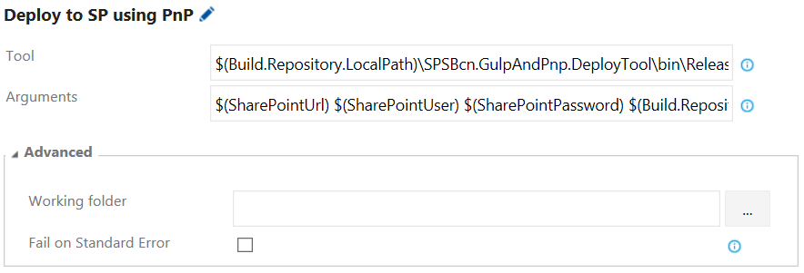

En el siguiente artículo veremos cómo podemos hacer uso del framework del PnP junto a Visual Studio Team Services, para configurar una Build de Integración Continua en proyectos de SharePoint. La mayor parte de lo comentado en este artículo, es igualmente válido para SharePoint On Premises, si bien las diferentes imágenes o fragmentos de código, están orientados a SharePoint Online.

**Entornos en proyectos SharePoint Online**

Históricamente, y sobre todo a estas alturas, todos tenemos claro cómo trabajar a nivel de entornos con SharePoint On Premises. Para entornos de desarrollo, cada developer dispone de una Máquina Virtual (en su desktop, hospedada en Azure, en algún servidor de la organización, etc.). Además, existirá otra granja específica para Integración Continua y QA.

Sin embargo, con la llegada de SharePoint Online, este modelo no es todo lo válido que nos gustaría, y tenemos que buscar otras opciones. Mi recomendación pasa por algo parecido a la siguiente imagen, que explicare justo debajo de ella:

Para el entorno de desarrollo, contaremos con una Tenant de Office 365, en un plan que sea suficiente para el proyecto que estamos desarrollando (E3, etc.). Dentro de esa tenant, asignaremos una Site Collection específica a cada Developer, pudiendo incluso crear una Site Collection para cada Developer-Modulo/Producto, en el caso de que nuestro proyecto sea muy grande y este dividido en diferentes Modulos o Productos, como, por ejemplo, un Módulo específico para Noticias, o para Búsqueda, o para Localizaciones, etc. Haciendo uso de herramientas como Gulp, podemos hacer fácilmente que cada desarrollador, “apunte” a la Site Collection propia, y los cambios de un desarrollador, no afecten a los de otro. Para esta tenant de desarrollo, podemos contar únicamente con una licencia valida, que compartirán todos los desarrolladores.

Para el entorno de QA, tendremos una tenant diferente de Office 365. En este caso recomiendo que el plan contratado sea el mismo que tendrá la tenant de Producción. Además, como será el entorno para el equipo de QA, lo aconsejable será tener distintas licencias/usuarios, para que al menos se puedan probar los diferentes roles que necesita nuestro proyecto (al menos 3, para poder hacer pruebas con un usuario Visitor, Contributor y Admin). En la tenant de QA, crearemos una Site Collection para cada módulo: Raiz, News, Offices… lo que necesite nuestro proyecto. Además, es muy importante que consigamos un juego de datos muy similar al que nos encontraremos en producción, ya que será vital para las pruebas. Para esto, el propio PnP puede ser de utilidad, ya que las plantillas pueden contener datos de prueba para insertar ítems en listas, archivos, etc.

Finalmente, el paso de desarrollo a QA, estará totalmente automatizado usando una Build de Team Services. Así, la build estará programada para que, o bien cada cierto tiempo (i.e: diaria), o bien en cada commit al Control de código, se ejecute la build, actualizando así el entorno de QA con los últimos cambios desarrollados.

**Configurando la Build de CI para SharePoint Online**

**Nota**: Este articulo asume cierta familiarización con el Framework PnP, de no ser así, puedes leer alguno de mis artículos previos referentes al PnP en la web de CompartiMOSS. Además, nada de esto es válido para proyectos SharePoint en modo Farm Solutions.

Llegados a este punto, veamos cómo podemos configurar una Build en Team services que despliegue nuestra solución en una tenant de SharePoint Online. Antes de continuar, para este ejemplo y las imágenes a continuación, podéis descargar el siguiente proyecto desde mi repositorio de GitHub: [https://github.com/luismanez/sp-saturday-barcelona-2016](https://github.com/luismanez/sp-saturday-barcelona-2016).

Antes de nada, lo primero que necesitamos en la solución, es un proyecto de consola que utilice el Framework del PnP para desplegar nuestra plantilla o plantillas. Esta acción es muy sencilla usando el PnP, y aquí tenéis el snippet de código para hacerlo:

Llamaremos a esta aplicación de consola desde nuestra build, para lanzar el proceso de provisioning remoto a través del PnP.

**Nota**: Lo idea en este punto, seria utilizar los propios comandos PowerShell del PnP. Sin embargo, dichos comandos necesitan una instalación (o registro manual) dentro de la máquina. Desafortunadamente, en el momento de escribir este artículo, no parece que haya manera de hacer algo así en la maquina donde se ejecuta el Agente cloud, por lo que necesitamos ejecutar nuestra propia aplicación para aplicar la plantilla PnP.

**Creando una nueva Build en Team Services**

Primero de todo, al pulsar en el botón de Nueva Build, tenemos disponibles diferentes plantillas, según el tipo de proyecto que tengamos. Inicialmente, trabajaremos con la plantilla de Visual Studio.

**Compilando nuestra solución de VS**

Nuestro siguiente paso, será elegir con que control de código estamos trabajando (GitHub, VSTS, Subversion…), así como la rama por defecto que utilizaremos. Además, seleccionaremos el tipo de Agente que queremos utilizar. El Agente es donde toda la magia sucede, y tenemos 2 opciones, podemos usar un servidor local como Agente (este será el caso de trabajar con SharePoint On Premises), o bien usar un Agente hospedado en el mismo Team Services (esto se conoce con el nombre de Cloud Agent, ya que como TS, correrá en la nube).

Una vez creada la Build, nuestro siguiente paso será configurar las diferentes acciones a ejecutar.

Nuestra primera acción, y que vendrá configurada por defecto por haber elegido la plantilla de VS, será la de restaurar todos los paquetes Nuget necesarios en nuestra Solución.

Dicha tarea no requiere ninguna configuración adicional a la que trae ya por defecto (básicamente le decimos que archivo de tipo VS Solution queremos utilizar). El siguiente Build step, será simplemente compilar todos los proyectos de nuestra solución. Para ello, la plantilla también nos ha configurado un Step de Build Solution.

En nuestro caso, le especificamos la Solution que queremos utilizar:

**Ejecutando Tareas de Gulp**

El siguiente paso, será ejecutar ciertas tareas Gulp que tenemos en nuestro proyecto. Os aconsejo que reviséis el código del ejemplo utilizado en el artículo. Allí veréis que hacemos uso de Gulp para ciertas tareas, como por ejemplo, concatenar todos los ficheros JS en un único .min.js, y además, comprimirlo para mejorar el rendimiento. Además, tenemos otras tareas Gulp, como aplicar reemplazos de tokens en las plantillas XML del PnP, compilar SASS a CSS, etc.

Por lo tanto, el primer paso para usar Gulp en nuestra Build, será restaurar los paquetes requeridos por Gulp. Para ello, usaremos el Step de NPM

Y configuraremos el Step para que apunte a nuestro proyecto (Working directory) donde hacemos uso de Gulp:

Una vez restaurados los paquetes que necesita Gulp, crearemos un nuevo Step de Gulp:

Y lo configuraremos para ejecutar la tarea de Gulp que queremos, así como la ubicación del proyecto que se require de Gulp:

**Remote Provisioning usando el PnP**

El último paso, será utilizar nuestra aplicación de consola para lanzar el Provisioning remoto de nuestra plantilla PnP. Para ello, utilizaremos el Build Step del Command Line:​

Y lo configuraremos para usar la aplicación de consola de nuestra solution, además de pasar varios argumentos necesarios para la consola:

Donde:

·       **Tool**: Es la ubicación de la aplicación de Consola ya compilada en un paso previo. Aquí podemos hacer uso de diferentes Tokens que nos proporciona Team Services. En este caso, necesitaremos:

*$(Build.Repository.LocalPath)\SPSBcn.GulpAndPnp.DeployTool\bin\Release\SPSBcn.GulpAndPnp.DeployTool.exe*

·      
**Arguments**: Diferentes parámetros que necesita la aplicación de consola. En nuestro caso, necesitamos los datos de conexión a SharePoint: Url, Usuario, Password, así como la ubicación del fichero XML con la plantilla PnP.

*$(SharePointUrl) $(SharePointUser) $(SharePointPassword) $(Build.Repository.LocalPath)\SPSBcn.GulpAndPnp.Package\dist\src\pnp\ProvisioningTemplate.Package.xml*

En este caso, además de hacer uso de los Tokens predefinidos en Team Services, hacemos uso de Variables definidas a nivel de Build. Podemos configurarlas desde la Tab de Variables:

Fijaros como podemos marcar una variable como tipo “Password” (icono del candado), de tal forma que el valor no aparece en pantalla, pero Team Services lo descifrará y enviará en la ejecución del Step.

**Build Triggers**

Como último paso, configuraremos de qué modo queremos ejecutar la Build. Para ello iremos a la tab de Triggers, y elegiremos la opción que mejor se adapte a nuestras necesidades:

Con estos sencillos pasos, y siempre haciendo uso del framework del PnP, podemos tener rápidamente configurado un entorno de Integración Continua para proyectos de SharePoint Online.

**Seguimiento del programa PnP**

Recordad las siguientes maneras de estar al día con el programa PnP, ya que ha habido cambios respecto a lo publicado en artículos anteriores:

·       **MS Tech Community**: Pretende reemplazar la red de Yammer previa. [https://techcommunity.microsoft.com/t5/SharePoint-Developer/bd-p/SharePointDev](https://techcommunity.microsoft.com/t5/SharePoint-Developer/bd-p/SharePointDev)

·       **Canal PnP en YouTube**: Reemplazando también el canal existente en Channel 9. [https://www.youtube.com/channel/UC\_mKdhw-V6CeCM7gTo\_Iy7w](https://www.youtube.com/channel/UC_mKdhw-V6CeCM7gTo_Iy7w)

·      
**Blog del PnP**: [http://dev.office.com/blogs](http://dev.office.com/blogs)

·       **Community call**: [https://github.com/OfficeDev/PnP/wiki/Community-call](https://github.com/OfficeDev/PnP/wiki/Community-call)
 Apunta esta cita en tu calendario. Cada mes el equipo de PnP hace un meeting donde informa del estado del programa, el roadmap, muestra ejemplos, etc.

**Luis Mañez**

**SharePoint / Cloud Solutions Architect en ClearPeople LTD**
 @luismanez
[http://geeks.ms/lmanez/](http://geeks.ms/lmanez/)

