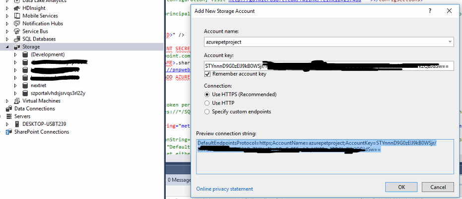
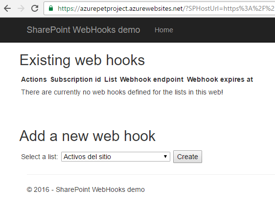
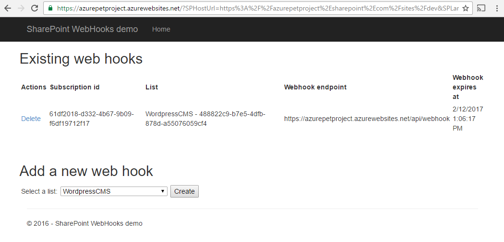

import ArticleHeader from '../../../components/article-header'

<ArticleHeader frontmatter={props.pageContext.frontmatter} />

SharePoint Online es una plataforma madura y en continua evolución que ofrece un amplio abanico de soluciones para la colaboración de personas.     Por diversos motivos Microsoft abandonó la posibilidad de disponer de un Sitio Web público ( [https://support.microsoft.com/en-us/kb/3027254](https&#58;//support.microsoft.com/en-us/kb/3027254) ), lo que obliga a emplear otras herramientas para poder dar solución a la publicación de contenidos en internet (usuarios anónimos).

Tradicionalmente para conectar SharePoint Online con otros sistemas se empleaban, dependiendo del año y versión, diferentes aproximaciones que se pueden dividir en dos tipos:

1.          Las que lanzaban algún tipo de tarea que recorría SharePoint para detectar cambios de forma periódica.

2.          Y las que estaban basadas en patrones y técnicas específicas de SharePoint, como los Receptores de Eventos Remotos (RER) o los flujos de trabajo con sus llamadas HTTP entre otras técnicas.

​​En este artículo veremos cómo puede emplearse la característica de webhooks de SharePoint (actualmente en desarrollo) para facilitar un escenario de integración con Worpress, que suele ser un requisito de la gente de Comunicación y Marketing, al ser este el estándar de facto para blogs y webs corporativos y por tanto una opción deseable en empresas con SharePoint Online y presencia online. Para realizar esta implementación vamos a usar el código del repositorio de SharePoint de Microsoft en Github: [https://github.com/SharePoint](https&#58;//github.com/SharePoint)

**¿Qué son los webhook?​**

Los webhooks son un patrón de arquitectura usado precisamente para facilitar la integración entre sistemas web.

Sendgrid ([https://sendgrid.com/docs/API\_Reference/Webhooks/event.html](https&#58;//sendgrid.com/docs/API_Reference/Webhooks/event.html)) o Github ([https://developer.github.com/webhooks/](https&#58;//developer.github.com/webhooks/)) disponen de ellos, permitiendo que suscribamos nuestras propias aplicaciones a determinados eventos de sus plataformas.
Para ampliar información sobre Webhooks hay bastante donde elegir debido al tirón que han tenido en los últimos años, pero para empezar sugeriría leer el post que hizo Sendgrid en 2014: [https://sendgrid.com/blog/whats-webhook/](https&#58;//sendgrid.com/blog/whats-webhook/) , el del padre del patrón, Jeff Lindsay: [http://progrium.com/blog/2012/11/19/from-webhooks-to-the-evented-web/](http&#58;//progrium.com/blog/2012/11/19/from-webhooks-to-the-evented-web/) y si eres desarrollador ASP.NET el de Microsoft el año pasado: [https://blogs.msdn.microsoft.com/webdev/2015/09/04/introducing-microsoft-asp-net-webhooks-preview/](https&#58;//blogs.msdn.microsoft.com/webdev/2015/09/04/introducing-microsoft-asp-net-webhooks-preview/)
La aparición de los webhooks para SharePoint son un paso más en la apertura y estandarización de las tecnologías Microsoft, siendo el reemplazo de soluciones menos optimas o más a medida, lo que debería permitir soluciones más robustas y fáciles de desarrollar tras su adopción.

**¿Qué tenemos en Wordpress?**
Al margen de si usamos un Wordpress de Azure (de Wordpress, Bitnami o incluso en un contenedor Docker) o una cuenta de pago o gratuita en Wordpress.com, disponemos de 2 APIs diferentes para gestionar contenidos en el sistema: XML-RPC y REST. Y por supuesto dos formas de acceder a nivel de seguridad: oAuth o el típico usuario y password.
La elección de REST y oAuth nos evitaría tener que mantener las credenciales del sistema, aunque quizá sea más fácil usar XML-RPC con credenciales de usuario si confiamos en la seguridad de nuestros sistemas y usuarios o si no queremos trabajar con oAuth por alguna razón.
Quien desee probar el API REST dispone de una consola de desarrollo en el propio Wordpress.com [https://developer.wordpress.com/docs/api/console/](https&#58;//developer.wordpress.com/docs/api/console/)

**Requisitos previos**
Antes de ponernos a desplegar código, recomiendo empezar con el aprovisionamiento de lo que vamos a necesitar, debido a que ciertos elementos pueden requerir un tiempo para completar su configuración y provocar parones en la puesta en marcha del código de ejemplo. Advierto esto tras haberse llegado a juntar durante la implementación de todo el sistema, errores personales, errores en el portal y bugs de producto, provocando un retraso importante sobre el tiempo estimado inicialmente.
Lo primero que necesitaremos será disponer de lo siguiente:

·          Un SharePoint Online de desarrollo, con la característica de First Release activada a nivel de suscripción.

o      Ojo con esto que en el portal antiguo de administración de O365 es sencillo de encontrar. En el nuevo está en *Settings -&gt; Organization profile -&gt; Release preferences -&gt; Release track* .

o      Y de nuevo ojo que la aplicación de “First Release” puede durar algún tiempo (1 día).

o      Además, deberíamos disponer de un catálogo de aplicaciones configurado y un sitio de desarrollador con una nueva lista simple de nombre reconocible (ej: Wordpress) que contenga una lista con campos para Título y Contenido de tipo texto plano de una línea y multi-línea respectivamente.

·          Una suscripción de Azure. La de desarrollador nos vale ya que los elementos a emplear son muy, muy baratos. Los elementos a crear dentro de esta se detallan más adelante. 
 ·          Un Wordpress. Sugiero usar uno gratuito en Wordpress.com por facilidad a la hora de implementar la configuración necesaria. 
 o      Recomendaría probar que el API está configurado y funcionando mediante la herramienta que nos ofrece la compañía. Para hacer un post podemos usar esta URL (siempre que estemos autenticados, claro): [https://developer.wordpress.com/docs/api/1.1/post/sites/\[NOMBREDELBLOG\].wordpress.com/posts/new/](https&#58;//developer.wordpress.com/docs/api/1.1/post/sites/%5bNOMBREDELBLOG%5d.wordpress.com/posts/new/)
 ·          El código del repositorio Github clonado, y compilado en un Visual Studio 2015: [https://github.com/SharePoint/sp-dev-samples/tree/master/Samples/WebHooks.List](https&#58;//github.com/SharePoint/sp-dev-samples/tree/master/Samples/WebHooks.List)
 o      Podría ser necesario instalar las  Office Tools Extension de [https://www.visualstudio.com/es/vs/office-tools/](https&#58;//www.visualstudio.com/es/vs/office-tools/)
 o      Y necesitaremos instalar las características necesarias mediante el botón derecho “Install Missing Features” en el proyecto correspondiente para que compile todo. 
 ·          Un SQL Management Studio o cualquier otro cliente que nos permita lanzar algo de SQL contra un Azure SQL Database.

**Manos a la obra**
Una vez obtenido todo lo anterior podemos empezar a seguir paso a paso la guía de despliegue que también encontraremos en el repositorio de Github, en el típico archivo Markdown: [https://github.com/SharePoint/sp-dev-samples/blob/master/Samples/WebHooks.List/Deployment%20guide.md](https&#58;//github.com/SharePoint/sp-dev-samples/blob/master/Samples/WebHooks.List/Deployment%20guide.md)
Dado que la propia guía ya contiene imágenes paso a paso, y dado que podría haber cambios cuando la característica salga en release, me limitaré a hacer un resumen de las acciones necesarias, aunque recomendaría automatizar el despliegue en un script de PowerShell, si no entero, al menos de las partes más básicas.
1.       Creamos una Web App con el nombre que queramos.
   a.          Descargamos su perfil de publicación. 
 2.          Creamos una Azure SQL Database con el nombre que queramos en un Azure SQL Server existente o nuevo. 
   a.          Añadimos nuestra IP actual para poder acceder a la instancia desde nuestro equipo. 
 3.          Creamos una cuenta de Azure Storage. 
   a.          Obtenemos la cadena de conexión.  Nota:   yo me topé con un problema en el Portal, que provocaba que no se cargase la pestaña con la cadena de conexión, pero esta puede generarse sin problemas obteniendo la Key en el portal antiguo o desde el propio Visual Studio, como se aprecia en esta imagen:

4.          Registramos una app en el sitio de desarrollo, mediante la URL  https://.../sites/NOMBREDELSITIO/\_layouts/15/appregnew.aspx

5.          Conectamos con el SQL Management Studio a la base de datos creada y:

a.          Ejecutamos el Script SharePointWebHooks.sql de la carpeta SQL\Scripts alojada en el proyecto SharePoint.WebHooks.Common.

b.          Sobre la base de datos MASTER, ejecutamos (preferiblemente con otro password):

CREATE LOGIN WebHooksAdmin WITH PASSWORD = 'Pass@word1'

c.          Sobre la base de datos WebHooks generada en 5.a, ejecutamos:

CREATE USER [WebHooksAdmin] FOR LOGIN [WebHooksAdmin] WITH DEFAULT\_SCHEMA = dbo

EXEC sp\_addrolemember 'db\_datareader', 'WebHooksAdmin'

EXEC sp\_addrolemember 'db\_datawriter', 'WebHooksAdmin'

6.          En la solución de Visual Studio reemplazamos la configuración existente para que cuadre con la nuestra. Es decir, nuestro Client ID, urls, usuario y passwords, cadenas de conexión de Storage y SQL…

a.          Recomiendo llevar a cabo este paso con calma. :-).

7.          Desplegamos el Add-In que contiene el proyecto SharePoint.WebHooks.MVCWeb en Azure.

a.          Esto requiere el perfil de publicación de nuestra Web App y algunos retoques detallados en la guía de despliegue.

8.          Desplegamos el Add-in que contiene el proyecto SharePoint.WebHooks.MVC en SharePoint.

a.          Ojo que se trata de un add-in a desplegar como paquete, es decir cargando el archivo .app en el catálogo de aplicaciones.

9.          Desplegamos el Web Job que contiene el proyecto SharePoint.WebHooks.Job como web job (botón derecho Publish as Azure Web Job).

a.          Lo debemos publicar en modo de ejecución continua, mediante el perfil de publicación de nuestra Web app del punto 1.a. y cambiando de http a https.

b.          Mucho ojo con le Web Job, debemos asegurarnos de que esté “Running”. Bajo ciertas circunstancias publicamos y ese no es el estado. Podemos reiniciarlo sin piedad si es necesario.

10.          Para terminar el despliegue, creamos una nueva App desde Contenidos del Sitio, del tipo que hemos cargado en el punto 8: SharePoint.WebHooks.MVC. Se nos pedirá que aceptemos la aplicación con los permisos que establece.

Una vez realizados estos “ *pocos* ” pasos deberíamos tener corriendo el sistema de tal modo que, al pulsar en la App que hemos añadido al sitio de SharePoint, se nos redirigirá a la aplicación de nuestra Web App

Y seleccionando la lista que creamos para publicar en Wordpress, podemos generar una subscripción a esa lista.

Y ahora sí, tenemos lista una aplicación suscrita a eventos de SharePoint suministrados mediante la característica de webhook de SharePoint, lo que nos ofrece de una forma más robusta y estándar de integrar SharePoint que en con las herramientas actuales.

Con todo el sistema funcionando, recibimos la notificación de forma rápida, no perdemos información gracias a la mecánica de reintento implementada en este patrón webhook, podemos guardarlas para tratarlas en lotes (lo que tiene sentido para ciertas integraciones), disponemos de un histórico de todo lo ocurrido gracias al almacenamiento en Azure… y todo ello de forma muy barata si establecemos adecuadamente los niveles de nuestros elementos (Pricing Tier).

Ya solo nos queda configurar la acción o acciones que queramos realizar al recibir la notificación. En nuestro caso: publicar un post en Wordpress. Para ello deberemos proceder a configurar nuestro Wordpress y añadir el código necesario en el proyecto SharePoint.WebHooks.Common.

**Conclusiones de la primera parte**

Desgraciadamente, la cantidad de pasos necesarios para poner en marcha todo sistema es más extensa de lo que me gustaría (a mi o a cualquiera), y podría haber algunos cambios en la versión *release* de los webhooks de SharePoint, por lo que prefiero dejar para la segunda parte del artículo la publicación de contenidos desde Azure hacia Wordpress en el próximo número de CompartiMOSS.

En cualquier caso, espero que esta primera parte haya dado una idea de la potencia de los web hooks en escenarios de integración entre plataformas, y en particular para nuestros desarrollos con SharePoint.

Continuará…

**José Ángel Bolaño**

Solutions Architect en NexTRET

@noradrex

