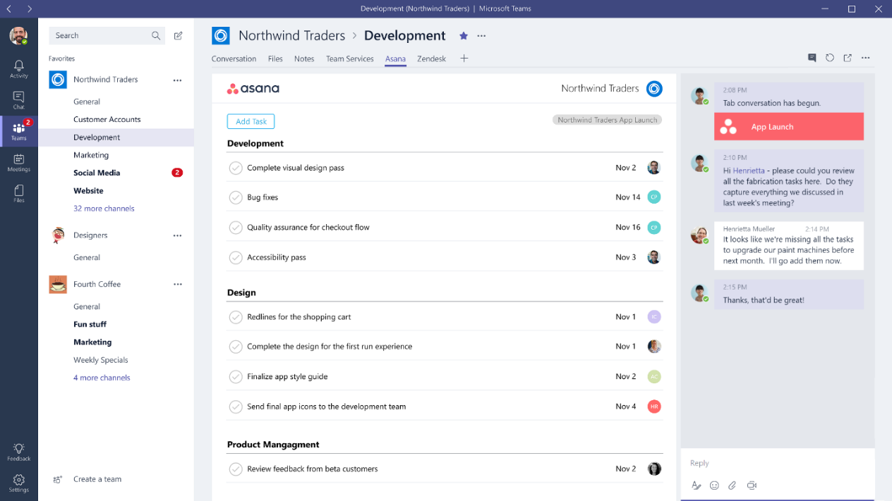

**Nuevas necesidades de colaboración**

La colaboración y el trabajo en equipo son dos factores claves en el día a día de gran parte de las empresas. La tecnología nos proporciona herramientas fantásticas, ajustadas a nuestras necesidades, con las que poder colaborar con nuestros compañeros de trabajo y conseguir ser extremadamente productivos.

No obstante, un problema muy importante es el conseguir ser eficiente trabajando con multitud de servicios y aplicaciones, desarrollados por multitud de fabricantes, con diferentes tecnologías y formas de usar. Es por ello que, en los últimos años, han surgido aplicaciones que nos permiten aglutinar en un único punto multitud de servicios y orientarlos al trabajo en grupo.

Cuando Microsoft quiso pagar 8.000 millones de dólares por comprar Slack y, finalmente, se echó atrás argumentando que preferían invertir esa cantidad en potenciar Skype para hacerlo más útil y amigable para el mundo empresarial, comenzamos a sospechar que estaba trabajando en su propia herramienta colaborativa. Durante meses se rumoreó sobre un supuesto “Skype Teams” que permitiría acceder a todos los servicios de Microsoft desde un único punto.

Finalmente, el pasado mes de noviembre se presentaba Microsoft Teams, una herramienta de trabajo en grupo, basada en chat, desde la que se puede acceder no sólo a los servicios de Office 365, sino a otros servicios externos a la plataforma y externos a Microsoft.

**¿Qué es Microsoft Teams?**

Microsoft Teams llega como un nuevo servicio de Office 365 orientado al trabajo en grupo y a la colaboración. El objetivo de Microsoft Teams es que podamos utilizar todos los servicios de nuestro día a día desde una única aplicación donde el chat, las conversaciones y el trabajo en equipo sean el centro del trabajo.

Si pensamos en los servicios de Office 365, Microsoft Teams nos permite tener en un único punto nuestras conversaciones, videollamadas, archivos del Team, blocs de OneNote, sitios de SharePoint, documentos de Office, planificaciones de Planner y paneles de Power BI. No será necesario ir saltando de servicio en servicio para poder consumir toda la información de cada uno de los servicios.

Adicionalmente, Microsoft Teams permite o va a permitir conectar a muchos otros servicios como Visual Studio Team Services, Zendesk, Asana, Hootsuite, los servicios de Intercom, Jira, Twitter, Wunderlist, Trello, GitHub, etc.

**¿Cómo funciona?**

Microsoft Teams puede utilizarse desde el navegador integrado en Office 365 (teams.microsoft.com), desde aplicaciones de escritorio (Windows y Mac) y desde apps para teléfonos móviles (Windows, iOS y Android).

La interfaz de trabajo contiene distintas secciones sobre las que trabajar (Imagen 1):

·         **Actividad** : en ella veremos notificaciones sobre nuestras interacciones con los compañeros de trabajo, menciones, respuestas y avisos de servicios a los que hayamos conectado.

·         **Chat** : podremos establecer conversaciones individuales con usuarios, conversaciones de grupo y conversaciones con bots.

·         **Equipos** : el centro neurálgico de la aplicación, en la que podremos crear nuestros equipos y trabajar con ellos en los distintos servicios.

·         **Reuniones** : nos permitirá ver las próximas entradas en nuestro calendario y en los calendarios de todos los equipos de los que formamos parte.

·         **Archivos** : permite acceder a los archivos de nuestro OneDrive y a los archivos del resto de equipos de los que formamos parte.

​

​ La pantalla de Equipos es, sin duda, la zona principal de trabajo de Microsoft Teams (Imagen 2). En ella, los usuarios podrán crear nuevos equipos de trabajo. Los equipos se pueden dividir en canales, que serán distintos espacios de trabajo dentro de un equipo.

Cada canal tiene un espacio de chat y una serie de pestañas. En el chat se podrá iniciar nuevas conversaciones, responder, hacer likes, programar videoconferencias y comentar sobre contenido interactivo que se añada al canal (como documentos, imágenes, vídeos y contenido generado desde conectores a servicios externos).

Las pestañas nos permiten acceder a contenido adicional del equipo. Por defecto veremos las pestañas de conversaciones, archivos y notas. La pestaña “Archivos” (Imagen 3) nos permite visualizar los archivos del canal, cargar nuevos archivos y editarlos desde Office Online o desde Office cliente. La pestaña “Notas” permitirá acceder, visualizar y editar un bloc de notas compartido para todo el canal.​

Además de las tres pestañas por defecto, es posible insertar nuevas pestañas. Con el tiempo se irán añadiendo nuevas pestañas, de momento se dispone de las siguientes:

·         **Excel** , **PowerPoint** y **Word** : permiten anclar un documento importante directamente en una pestaña para que los miembros del equipo tengan acceso a él.

·         **OneNote** : permite anclar blocs de notas adicionales al canal.

·         **SharePoint** : permite visualizar los documentos de un sitio concreto de SharePoint, además de los documentos propios que ya existen en el canal.

·         **Planner** : permite crear planes con tareas del servicio Planner de Office 365, lo que permitirá organizar el trabajo en equipo de una forma más eficiente (Imagen 4).

·         **Power BI** : permite añadir uno o varios informes del servicio Power BI a la pestaña.

·         **Team Services** : sin duda una gran utilidad para desarrolladores. Consiste en un panel de Visual Studio Team Services para que el equipo pueda colaborar en la supervisión y el seguimiento del trabajo.

​

Los canales admiten el uso de conectores, que permitirán conectar a multitud de servicios externos como Twitter, Trello, Wunderlist, RSS, Asana, GitHub, Jira, Zendesk, Dynamics 365, MailChimp, BitBucket, Google Analytics, Jenkins, Salesforce, Yammer, etc. Estos conectores se pueden desarrollar y publicar y permiten integrar notificaciones de los distintos servicios dentro del área de conversaciones para que el equipo pueda trabajar con esta información. La lista cada vez es más grande (Imagen 5).

Los chats están adaptados a las necesidades que tienen los equipos actualmente. Se organizan por hilos de conversación y permiten insertar textos enriquecidos, contenido dinámico, Emojiis y GIFs, texto resaltado y adjuntar imágenes y archivos. Es posible participar en los chats del equipo y sus canales o acceder a la sección “Chats” en la que se puede hacer chats privados con una persona o con varias.

Además de chats con personas, es posible hacer chats con bots inteligentes. Los desarrolladores podrán programar y publicar sus propios bots en Microsoft Teams. Para probar el chat con bots, es posible, de momento, iniciar una conversación con T-Bot, el chat de ayuda de Microsoft Teams (Imagen 6). T-Bot contiene opciones de conversación y pestañas con ayuda, vídeos y notas adicionales.

También es posible realizar videollamadas a varias personas. Las videollamadas se pueden iniciar desde las conversaciones del canal y los demás usuarios podrán verlas y unirse al momento. También se puede añadir manualmente a nuevos miembros y se podrá ver a la vez el vídeo de hasta cuatro conversaciones (Imagen 7). Cabe destacar que, una vez finalizada, la videollamada quedará grabada en el canal y los usuarios podrán verla y comentar sobre ella en el chat del canal.

**Microsoft Teams vs Office Groups**

Cuando uno comience a utilizar Microsoft Teams, seguramente se preguntará qué va a pasar con los Grupos de Office 365 ya que muchas funcionalidades son propias de los grupos (conversaciones, archivos, OneNote, sitio de SharePoint…).

En realidad, los equipos de Microsoft Teams y los grupos de Office 365 están mucho más unidos de lo que puede parecer, ya que Microsoft Teams se basa internamente en los grupos de Office 365. Es bueno saber que cada equipo de Microsoft Teams es un grupo de Office 365.

Cuando creemos un nuevo equipo en Microsoft Teams, se aprovisionará internamente un grupo de Office 365 con el mismo nombre, descripción y miembros. Varios de los servicios que ofrece Microsoft Teams utilizan servicios de los grupos. Algunos ejemplos interesantes son:

·         **Archivos** : los archivos de un equipo de Microsoft Teams se almacenan en la biblioteca del sitio del Frupo de Office 365. En la biblioteca principal del sitio se creará una carpeta por cada canal del equipo. En Microsoft Teams, veremos en cada canal el contenido de la carpeta.

·         **OneNote** : los espacios de notas de un equipo de Microsoft Teams se almacenan en el bloc de notas OneNote del grupo de Office 365. En el OneNote se creará una sección por cada canal del equipo. En Microsoft Teams, veremos en cada canal el contenido de su sección.

·         **Planner** : el contenido de Planner que podemos añadir al equipo en Microsoft Teams serán planes del grupo de Office 365. A diferencia que el uso clásico de Planner (1 grupo = 1 plan), en Microsoft Teams se nos permite añadir distintos planes por canal (1 grupo = múltiples planes).

Aunque el tener grupos y equipos y que ambas cosas puedan ser lo mismo puede prestar a confusión, puede ser muy útil a la hora de trabajar. En Microsoft Teams tendremos todo el contenido en un único lugar, lo que es práctico para trabajar de forma mucho más efectiva. En cambio, cuando nos movamos por los distintos servicios de Office 365, tendremos mucho más a mano los grupos para trabajar con nuestro contenido y hacer cosas como sincronizar los archivos con el cliente de OneDrive, conectar blocs de notas a OneNote de escritorio o acceder rápidamente a archivos.

**Opciones de administración**

Los administradores de IT de Office 365 podrán activar la preview de Microsoft Teams y controlar el uso de determinadas características del servicio. Aunque las opciones son limitadas, se irá disponiendo de más control a medida que el servicio evolucione y salga de la preview.

De momento, es posible hacer las siguientes tareas (Imagen 8):

·          Activar/desactivar el servicio.

·          Controlar determinados aspectos que se muestran en el perfil.

·          Permitir notificaciones por correo.

·          Activar el envío de información de diagnóstico a Microsoft.

·          Permitir vídeo y compartir pantalla en las conversaciones.

·          Permitir el uso de imágenes animadas informales en las conversaciones.

·          Asignar un nivel de moderación del contenido que se publica.

·          Añadir imágenes editables en las conversaciones.

·          Activar/desactivar la posibilidad de añadir nuevas pestañas en los equipos.

·          Activar/desactivar el uso de bots en el servicio.

Adicionalmente, como un equipo es un grupo de Office 365, se dispone de las mismas opciones de administración y control de grupos para un equipo.

También es bueno que los administradores de IT conozcan que Microsoft Teams cumple con las siguientes características de seguridad:

·          Los datos están cifrados tanto en reposo como en tránsito.

·          Se cumple con todas las características de cumplimiento que el resto de servicios (EUMC, HIPAA, etc.).

·          Se soporta la autenticación multi-factor, al igual que el resto de Office 365.

·          El servicio se sirve desde los mismos centros de datos de Office 365 que el resto de la suscripción.

·          La administración está y estará centralizada en Office 365 y se irá ampliando y dotando de más opciones de seguridad, control y administración.

**Posibilidades de desarrollo**

Actualmente, se ha abierto un programa “Developer Preview” para que los desarrolladores puedan ampliar el servicio de Microsoft Teams con su propio contenido o contenido de otros servicios. Microsoft ha invitado a desarrolladores de todo el mundo a unirse a este programa y comenzar a desarrollar contenido adicional para el servicio mediante la creación de pestañas, bots y conectores.

Por un lado, es posible crear pestañas para Microsoft Teams en las que los usuarios podrán visualizar una web o servicio desde su equipo o canal y podrán trabajar con la información en el contexto adecuado.

El desarrollador tendrá un lienzo sobre el que exponer su servicio, sobre el que se podrá interactuar. Este servicio se podrá añadir en un canal como una nueva pestaña. Para más información sobre desarrollo y publicación de pestañas, se puede consultar [https://msdn.microsoft.com/en-us/microsoft-teams/tabs](https://msdn.microsoft.com/en-us/microsoft-teams/tabs)

Servicios como Asana ya están creando sus propias pestañas y muestran sus ejemplos en Office Dev Center (Imagen 8)​

También es posible escribir bots que puedan interactuar con usuarios y equipos proporcionándoles ayuda, servicios y acciones. Estos bots se podrán desarrollar mediante el [Microsoft Bot Framework](https://dev.botframework.com/) , también usado para desarrollar bots en otras plataformas de Microsoft como Skype o el correo de Office 365. Los bots se pueden usar para dar consejos a los miembros del equipo, contestar con lenguaje natural a determinadas preguntas o a gestionar tareas y planificaciones. También se pueden usar para retirar información inteligente del Office Graph y mostrarla a los usuarios.

Para más información sobre desarrollo y publicación de bots, se puede consultar [https://msdn.microsoft.com/en-us/microsoft-teams/bots](https://msdn.microsoft.com/en-us/microsoft-teams/bots)

Y si ya tienes un bot creado y publicado para servicios como Slack, es posible migrarlo con poco esfuerzo a Microsoft Teams [gracias a Message.io](http://hello.message.io/welcome/) .

Finalmente, es posible crear conectores para enviar notificaciones de nuestros propios servicios a los canales de los equipos y publicarlos como conversaciones. Si quieres ver ejemplos de cómo funcionan los conectores, puedes añadir a un canal alguno de los conectores ya existentes (Twitter, Trello, Wunderlist, RSS, Asana, GitHub, Jira, Zendesk, Dynamics 365, Google Analytics, Salesforce, Yammer, etc.).

Para más información sobre desarrollo y publicación de conectores, se puede consultar [https://msdn.microsoft.com/en-us/microsoft-teams/connectors](https://msdn.microsoft.com/en-us/microsoft-teams/connectors)

Y si quieres más información sobre el programa Developer Preview de Microsoft Teams, puedes visitar [https://dev.office.com/microsoft-teams](https://dev.office.com/microsoft-teams)

**Comenzar a probar Microsoft Teams**

Microsoft Teams ya es una realidad y cualquier cliente empresarial de Office 365 puede comenzar a usar la preview. Para ello, un administrador debe activar el servicio desde el Centro de Administración de Office 365 (en la sección Configuración  à   Aplicaciones).

Hasta que aparezca un icono oficial en el lanzador de aplicaciones de Office 365, se puede utilizar accediendo a [teams.microsoft.com](http://teams.microsoft.com/) o descargando las aplicaciones de escritorio (Windows y Mac) o móviles (Windows, iOS y Android) desde [teams.microsoft.com/downloads](https://teams.microsoft.com/downloads)

**Miguel Tabera Pacheco**
 Office 365 Lead en NECSIA
 MVP de Office Servers and Services 
 miguel.tabera@outlook.com 
 @migueltabera
 [http://docs.com/migueltabera](http://docs.com/migueltabera)

