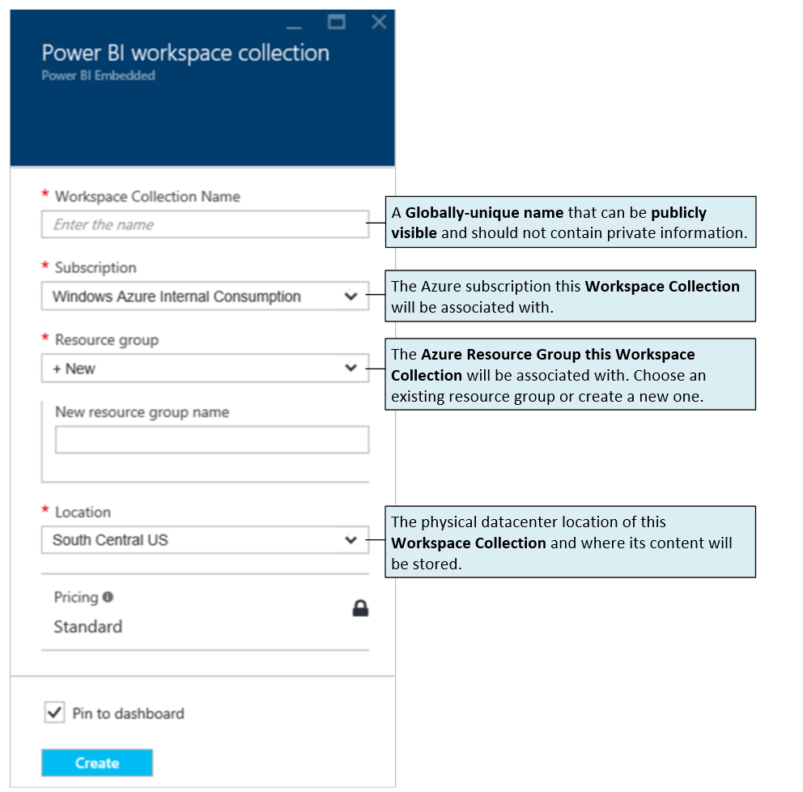
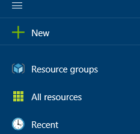
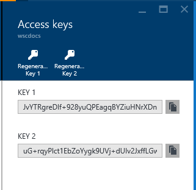
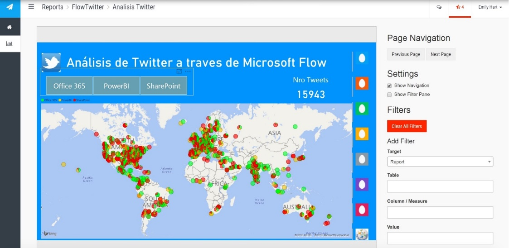

En el presente artículo vamos a presentar una solución de Power BI Embedded con la finalidad de dejar claro de qué se trata este nuevo servicio que se ofrece sobre la plataforma Azure. En primer lugar, definamos cual es el público objetivo de utilización de este servicio. Soluciones y aplicaciones que deseen mostrar reportabilidad son las que justamente podrán explotar este servicio, con la funcionalidad principal de mostrar reportes en aplicaciones web.

Cuáles son los requerimientos para configurar una solución utilizando Power BI Embedded:

·          Aprovisionar un nuevo Workspace Collection en Azure.

·          Generar un nuevo Workspace en Worspace Collection previamente creado.

·          Importar un reporte de Power BI Desktop con formato PBIX en un Workspace existente.

·          Utilizar la siguiente información e incorporar la misma en el Web Config de nuestra aplicación Web:

o      Access Key.

o      ApiURL.

o      Workspace Collection.

o      Workspace ID.

A continuación, haremos un recorrido sobre cada uno de los puntos anteriormente mencionados para guiar los mismos en una solución web.

**Creación de Workspace Collection**

En primer lugar, debemos ingresar al portal de Azure a través de: [https://portal.azure.com](https://portal.azure.com/) .  En este caso vamos a generar un nuevo recurso, y seleccionamos la opción de Power BI Embedded. Debemos definir datos tales como el nombre de Workspace Collection Name, Subscripción, Grupo de Recurso, Location, y Pricing.



Al generar un nuevo Workspace Collection deberemos tener presente dado que serán utilizados en nuestra solución web de Visual Studio datos de dicho elemento tales como: WorkSpace Collection Name, Access Keys.



**Access Keys**

Las claves de acceso para el Workspace las obtendremos al hacer clic en la opción AccessKey:



**Definición o Aprovisionamiento de Workspace**

En el siguiente paso lo que vamos a definir es la generación de un Workspace que nos va a proveer de un contenedor de soluciones de Reportería de Power BI. Por un tema de gobernabilidad es buena idea generar un Workspace que pertenezca al Workspace Collection que anteriormente definimos.

Con esta pequeña sintaxis en una aplicación de Consola se define un Workspace:

```
var workspace = await CreateWorkspace(workspaceCollectionName);
```

```
                     workspaceId = workspace.WorkspaceId;
```

```
                     Console.ForegroundColor = ConsoleColor.Cyan;
```

```
                     Console.WriteLine("Workspace ID: {0}", workspaceId);
```


**Importación de Reporte de Power BI Desktop**

En la secuencia que estamos manejando, ahora es momento de tomar el archivo con el reporte que hayamos generado en Power BI Desktop. En este paso lo que estamos logrando es importar un archivo de formato PBIX a nuestro WorkSpace, esto permitirá embeber finalmente nuestro reporte en una aplicación Web.

```
if (string.IsNullOrWhiteSpace(workspaceCollectionName))
```

```
                        {
```

```
                            Console.Write("Workspace Collection Name:");
```

```
                            workspaceCollectionName = Console.ReadLine();
```

```
                            Console.WriteLine();
```

```
                        }
```

```
 
```

```
                     if (string.IsNullOrWhiteSpace(workspaceId))
```

```
                        {
```

```
                            Console.Write("Workspace ID:");
```

```
                            workspaceId = Console.ReadLine();
```

```
                            Console.WriteLine();
```

```
                        }
```

```
 
```

```
                        Console.Write("Dataset Name:");
```

```
                        var datasetName = Console.ReadLine();
```

```
                        Console.WriteLine();
```

```
 
```

```
                        Console.Write("File Path:");
```

```
                        var filePath = Console.ReadLine();
```

```
                        Console.WriteLine();
```

```
 
```

```
                        var import = await ImportPbix(workspaceCollectionName, workspaceId, datasetName, filePath);
```

```
                        Console.ForegroundColor = ConsoleColor.Cyan;
```

```
                        Console.WriteLine("Import: {0}", import.Id);
```


**Embebiendo en Aplicación Web**

Luego de que hayamos generado la Aplicación Web en Visual Studio tal como hacemos con cualquier aplicación Web lo que deberemos configurar es el Web Config de dicho aplicativo.

Mediante el siguiente código lograremos setear correctamente la información que se requiere para nuestro reporte:

```
<appSettings>
```

```
    <add key="powerbi:AccessKey" value="O+U8vwfS/nXpT/KjT3m+D/JcPEUQSVWlPoATENl/TmIJBvZ55Xq5ig4bE8/fngc/3tyzz1eT/k0YE7hLUL7LrA==" />
```

```
    <add key="powerbi:ApiUrl" value="https://api.powerbi.com" />
```

```
    <add key="powerbi:WorkspaceCollection" value="GastontPoweBI" />
```

```
    <add key="powerbi:WorkspaceId" value="8d7dcf4f-34c3-4158-a220-b5050d2b7a2c" />
```

```
  </appSettings>
```

Como vemos en la información anterior los datos necesarios para dicho Web.config son:

·          Access Key – ver en Portal Azure.

·          Api URL – dirección/URL de Power BI.

·          WorkspaceCollection – Nombre del WorkspaceCollection creado anteriormente (también visible en nuestro Portal Web de Azure).

·          WorkSpaceID – Este requerimiento es el ID del WorkSpace que deseamos embeber. También es un dato que podemos extraer de nuestro portal de Azure.

**Conclusiones**

De esta manera logramos embeber un reporte de Power BI en una aplicación web. Al compilar nuestra aplicación contaremos con todo el backend de la aplicación, y además la posibilidad para el usuario de visualizar todos los reportes generados: ​




**Gastón Cruz**

Businnes Intelligence Tecnical Manager | Arkano Software​

