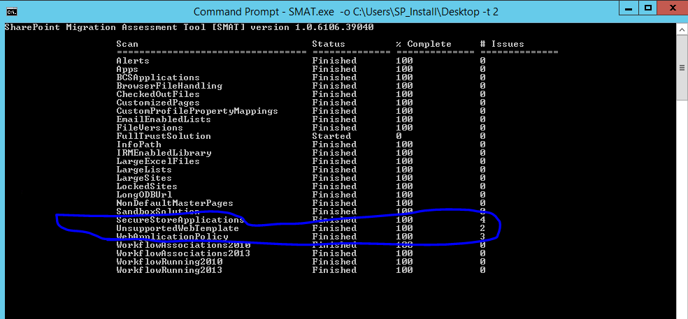

La herramienta SharePoint Migration Assesment Tool (SMAT) es una utilidad de línea de comandos que escanea los contenidos y personalizaciones de una Granja de SharePoint 2013 con el objetivo de identificar posibles problemas que se pueden dar, así como elementos no soportados en un escenario de migración a SharePoint Online. SMAT realiza un escaneo con impacto mínimo sobre la Granja y genera una serie de informes detallados sobre los posibles impactos en una migración potencial a SharePoint Online.

**Configuración y Uso de SMAT**

La configuración y uso de SMAT en una Granja de SharePoint 2013 es realmente sencilla:

·          Lo primero que haremos es descargarnos SMAT desde [este enlace](https://www.microsoft.com/en-us/download/details.aspx?id=53598) . La descarga de SMAT consiste en un archivo .zip que contiene los siguientes elementos:


o      Una serie de ensamblados que son utilizados por el ejecutable de SMAT.

o      Dos archivos de configuración que son modificables. Uno de ellos, *scandef.json* , permite habilitar o deshabilitar configuraciones particulares de escaneo mediante SMAT como por ejemplo habilitar / deshabilitar el escaneo de listas grandes en la Granja modificando la sección del archivo que se incluye en el siguiente fragmento de código.

```
{    "Name": "LargeListViews",    "Type": "LargeListViewsScanner",    "SupportedVersions": [      "2013",      "2016"    ],    "ReportCategoryType": "SPSite",    "Property": {          "ListItemThreshold": 3000,          "LookupColumnThreshold" : 12    },    "Enabled": false  }
```

El otro archivo, *SkipSitesList.csv* , permite indicar que sitios de la granja no van a ser escaneados por SMAT. Este archivo tiene la estructura que se muestra en la Figura 2.


o      Un archivo tipo Readme con la descripción de SMAT y cómo utilizarla.

o      Los ejecutables de SMAT.

·          Para comenzar a utilizar SMAT, creamos en primer lugar una carpeta en la que almacenar los archivos de log generados por SMAT. A continuación, tenemos que abrir el símbolo del sistema y acceder a la ubicación de la herramienta para ejecutar SMAT de la siguiente forma:

SMAT.exe [-o] &lt;SMAT\_LOGS\_FOLDER&gt; [-t] &lt;NUMBER\_PARALLEL\_THREADS&gt; [-sv]

Dónde:

o      El parámetro -o indica la carpeta dónde generar los archivos de log e informes generados por SMAT. En el caso en el que la carpeta ya contenga archivos de ambos tipos, serán sobre-escritos en cada nueva ejecución de SMAT.

o      El parámetro -t indica el máximo número de hilos en los que SMAT se ejecutará en paralelo. El valor mínimo de este parámetro     1 y el máximo el total de procesadores de la máquina dónde se ejecute SMAT.

o      Finalmente, el parámetro -sv permite saltarse algunos chequeos previos realizados por SMAT.

·          Supongamos que ejecutamos SMAT configurando los parámetros -o y -t que admite.  A continuación, SMAT empieza a realizar su trabajo recopilando la información relativa a nuestra granja e identificando posibles problemas para una potencial migración a SharePoint Online.



- En mi escenario particular la ejecución de SMAT ha encontrado potenciales problemas con Web Templates no soportadas, aplicaciones en el Secure Store Service y Políticas de Aplicación Web. Además, SMAT nos permite indicar el dominio de nuestro tenant de SPO y con esto concluirá la ejecución de SMAT.
- Como resultado de la ejecución de SMAT, se generan los siguientes archivos y carpetas:


    - Un archivo SMAT.txt con todas las operaciones de escaneo realizado.
    - Dos archivos CSV globales denominados SummaryReport.csv y SiteAssesmentReport.csv. El primero contiene un resumen de los resultados de la ejecución de SMAT en la Granja identificando las características en distintos ámbitos (Granja, Aplicación Web, Colección de Sitios) que causarán problemas en la migración. Y el segundo un resumen detallado por cada sitio de los problemas encontrados como muestra la Imagen 4.


    - Una serie de informes almacenados en la carpeta ScannerReports con los distintos problemas potenciales que nos podemos encontrar en una migración. El detalle de los distintos tipos de informes que se pueden generar y su contenido lo tenéis en el siguiente artículo de soporte (Nota: Además se indican las pautas para remediar estos problemas en un escenario real de migración):


[https://support.office.com/en-us/article/Migration-Assessment-Scan-Reports-Roadmap-5bf2619b-14fd-421c-8b84-869743f1eca2?ui=en-US&rs=en-US&ad=US](https://support.office.com/en-us/article/Migration-Assessment-Scan-Reports-Roadmap-5bf2619b-14fd-421c-8b84-869743f1eca2?ui=en-US&amp;rs=en-US&amp;ad=US "https://support.office.com/en-us/article/Migration-Assessment-Scan-Reports-Roadmap-5bf2619b-14fd-421c-8b84-869743f1eca2?ui=en-US&amp;rs=en-US&amp;ad=US")

Por citar algunos, SMAT presenta informes relativos a Add-Ins desplegados e instalados en la Granja, páginas personalizadas, Soluciones de tipo Full Trust, Listas con más de 20.000 elementos, etc.


    - Un conjunto de informes detallados almacenados en la carpeta Internal y consistentes en archivos .txt y .csv con el detalle de las Soluciones de Tipo Full Trust encontradas por SMAT. Por ejemplo, los archivos WebParts.csv y WebParts.txt contienen información relativa a WebParts desplegadas en la Granja: nombre del WebPart, característica que despliega el WebPart, Solución Full Trust.


- Como muestra de informes generados, a continuación, os dejo dos capturas de pantalla relativas a:
    - Por un lado, al informe UnsupportedWebTemplate-detail.csv que contiene aquellos sitios que han sido creados con plantillas no soportadas en SPO (en mi caso Centro de Inteligencia Empresarial y MySite). Como podéis ver, para cada Sitio detectado se muestra información relativa al Id del Sitio, Url del Sitio, Propietario, # de Subsitios que contiene, etc.


    - Y por otro el informe SecureStoreApplications-detail.csv que contiene el listado de las Aplicaciones creadas en la Aplicación de Servicio de Almacenamiento Seguro y cuya migración a SharePoint Online no está soportada.


**Conclusiones**

SMAT es una herramienta gratuita desarrollada por Microsoft que permite escanear una Granja completada de SharePoint 2013 para facilitar encontrar situaciones problemáticas e incompatibilidades en un escenario de migración desde SharePoint 2013 OnPremises a SharePoint Online en Office 365.


**Juan Carlos González Martín**
 Office Servers and Services MVP
 Cloud & Productivity Advisor 
jcgonzalezmartin1978@hotmail.com
 @jcgm1978 | [https://jcgonzalezmartin.wordpress.com/](https://jcgonzalezmartin.wordpress.com/)

