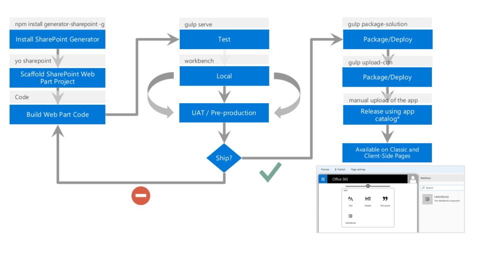

El nuevo SharePoint Framework, “SPFX” de aquí en adelante, supone un cambio brutal en cuanto a la forma de desarrollar sobre nuestro servidor preferido. Uno de los puntos más críticos tradicionalmente en SharePoint ha sido llevar una ALM de forma correcta. Ahora con el nuevo SPFX se han facilitado las cosas, de una forma un tanto diferente, facilitando bastante dicho  ciclo  .        Este proceso quedaría de la siguiente forma:

1.          Crear plantilla del SPFX con Yeoman.

2.          Desarrollo de los WebParts en local utilizando NodeJS.

3.          Testeo y pruebas en local.

4.          Generación de los CDN (lugar donde va a estar ubicado el JavaScript).

5.          Generación de un fichero .sapp e instalarlo en el catálogo de aplicación.

6.          Testeo y pruebas en el entorno de producción.

En este artículo vamos a centrarnos en el proceso del despliegue y que es lo que debemos de conocer dentro de la solución para poder pasar nuestro desarrollo de un entorno NodeJS a un entorno de Office 365 con el menor número de inconvenientes posibles.

**El empaquetado de la solución**

| $ gulp package-solution |
| --- |

Una vez se ha terminado el desarrollo, pasamos a crear el fichero .sapp     para ubicarlo en el catálogo de aplicaciones. Para ello disponemos de una tarea de Gulp que se encarga de este proceso. La instrucción es la siguiente:

Una vez termina este proceso, tendremos una carpeta “sharepoint” dentro de nuestra solución. En esta carpeta tendrá un fichero “nombredelasolucion”.spapp.

**¿Que contiene este fichero?**

El contenido de este fichero es:

·          AppManifest.xml, en el que está el Identificador de esta App, así como las propiedades del mismo.

·          Un xml con el Identificador de la característica dentro de SharePoint junto con un fichero con el mismo nombre, pero con la extensión .config. Dentro de estos ficheros tendremos las características básicas de la característica: Title, Description, ID, Scope, Web.

·          Una carpeta con el identificador de la característica en la que dentro de ella hay un fichero .WebPart y .xml.     En el fichero .WebPart se dispone todas las características propias del WebPart implementado. El fichero .xml sustituye a los antiguos “Modules” e indica la información de donde se va a ubicar el WebPart y que es el contenido del mismo.

Una vez, subimos este fichero a nuestro catálogo de aplicaciones, lo instalamos y lo desplegamos en una página., la primera vez no nos funcionará. ¿Por qué? El motivo es que se están buscando el/los ficheros js resultantes en un directorio local. En los tutoriales iniciales que mostró el equipo de producto indicaba que si levantábamos nuestro servidor NodeJS en local y arrancábamos nuestra solución visualizábamos nuestro desarrollo. Esta acción puede valernos en determinadas circunstancias en las que necesitemos ver que está ocurriendo, pero mi opinión es que si necesitamos realizar esto para depurar/ probar nuestro desarrollo por lo general en algo nos estamos equivocando.

**¿Dónde dejó los ficheros JS para utilizarlos en Office 365/SharePoint?**

El equipo de producto ha intentado atender a todas las sugerencias que les ha realizado la Comunidad, indicándole que el tiempo de descarga de un fichero JS en SharePoint Online era demasiado elevado e inaceptable en muchas ocasiones. Por este motivo la solución que ha propuesto es que estos ficheros estén alojados en un CDN (Common Delivery Network), que es un punto de acceso público cuya función es servir estos servicios de la forma más rápida posible.

Ahora bien, esto tiene un “pequeño” problema. Estamos hablando de que toda la lógica de nuestros desarrollos está en un sitio “publico” y esto puede provocar ataques y fugas de conocimiento en productos/proyectos realizados sobre esta nueva plataforma. Para solucionarlo Microsoft lo que ha optado es por incluir un CDN dentro de tu Tenant de Office 365 de tal forma que este solo pueda ser accedido desde el propio tenant y no responda a petición que no sean de tu tenant. Este proceso también está en Preview y aún no sabemos cómo será este proceso.

En la versión del SPFX que hay ahora, está preparada para poder alojar el desarrollo dentro de un CDN de Azure.     No es objeto de este articulo ver cómo crear un CDN en Azure, pero por si alguien necesita ayuda basta con seguir los pasos del siguiente artículo:    [https://dev.office.com/sharepoint/docs/spfx/web-parts/get-started/deploy-web-part-to-cdn](https&#58;//dev.office.com/sharepoint/docs/spfx/web-parts/get-started/deploy-web-part-to-cdn)

Lo que sí que es objeto de este artículo es ver cómo debemos de configurar nuestra solución para cuando generemos el paquete tenga todas las rutas bien puestas y configuradas. Para ello el equipo de producto lo que ha creado dentro del template de Yeoman es una carpeta “config” el sentido de la misma es que dentro de la misma agrupemos todos los ficheros de configuración de las tareas de Gulp. Por defecto, SPFX ya tiene una tarea Gulp que se encarga de subir nuestro WebParts a los CDN de Azure. Para ello vamos al fichero deploy-azure-storage.json ubicado en dicha carpeta y configuramos los datos del mismo. Si todos los datos los hemos introducido correctamente ejecutamos la siguiente instrucción y en unos segundos el bundle en el CDN de Azure:
 

| $ gulp deploy-azure-storage |
| --- |

 
En caso de que no utilices el CDN de Azure, puedes utilizar el que prefiera, SPFX es agnóstico tanto a la hora de la elección de framework que utilizar, como entorno de desarrollo y cloud que utilices. Eso sí, en caso de utilizar otros CDN se deberá de implementar dicha tarea.

Una vez tenemos ya tenemos el JavaScript ubicado en el CDN, todavía nos queda un paso más y es indicarle en el proceso de generación de paquete cual es la ruta donde se encuentran JS, ya que como hemos podido ver por defecto sino se indica nada los buscará en la máquina de desarrollo.

Para indicarle al spapp la ubicación de los ficheros, debemos de abrir el fichero write-manifest.json ubicado en la carpeta “config” y configurarle la ruta de donde tenemos nuestros ficheros JS.

**¿Dónde está ubicado los ficheros de los frameworks JavaScript de nuestro desarrollo?**

Por poner un poco de contexto, la solución de Yeoman está basada en WebPack.     Es una herramienta para ayudarnos a empaquetar nuestro código JavaScript. Por decirlo de una forma sencilla, se encarga de unificar todos nuestros ficheros en un único fichero. De esta forma conseguimos tener menos tamaño de descarga de los ficheros JS y de esta forma nuestro desarrollo puede ser más rápido. Ahora bien, dentro de este código no se incluye por defecto las librerías de terceros. Tenemos dos opciones:

·          Utilizar la instrucción requiere que nos indica que ese fichero lo tiene que cargar, y lo agrega en el bundle

·          Invocar al CDN del propio framework en nuestro desarrollo.

**¿Aún queda algo que tengamos que tener en cuenta?**

Hemos cargado los ficheros JS y CSS dentro de nuestro bundle pero todavía nos queda ver cómo resolvemos la carga de los templates HTML que muchos Frameworks JavaScript utilizan. La técnica puede ser algo similar a la carga de los CDN de los Frameworks JS, podemos incluirlos dentro del bundle junto con el resto de JS y CSS utilizando requiere o bien ubicarlos en un CDN de forma manual. Para más detalles de las formas de carga de los templates dentro del SPFX este artículo de Waldek     es de obligatoria lectura    [https://blog.mastykarz.nl/load-angular-templates-sharepoint-framework-client-side-web-parts/](https&#58;//blog.mastykarz.nl/load-angular-templates-sharepoint-framework-client-side-web-parts/)

**Conclusión**

Esta nueva forma de desarrollo o el nuevo Framework de desarrollo abre un abanico importante a personalizar SharePoint de una forma estable y sin temor a un problema de actualización. Es un cambio que todos los usuarios de SharePoint estábamos esperando. Pero este cambio conlleva muchos cambios y el principal es entender de una forma correcta el nuevo Tooling de desarrollo y sacarle todo su partido. Como toda novedad tiene una curva de aprendizaje, pero una vez se pasa esta curva estoy seguro que os va a gustar mucho.

**Adrián Diaz Cervera**

Architect Software Lead at Encamina

MVP Office Server and Services

[http://blogs.encamina.com/desarrollandosobresharepoint](http&#58;//blogs.encamina.com/desarrollandosobresharepoint)

[http://geeks.ms/blogs/adiazcervera](http&#58;//geeks.ms/blogs/adiazcervera)

adiaz@encamina.com @AdrianDiaz81

