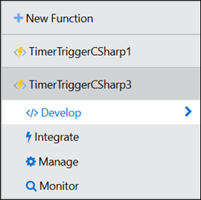

​​​SharePoint y Azure forman una poderosa combinación. Los dos productos de Microsoft, el uno, SharePoint, que forma el corazón de las herramientas de colaboración y manejo de conocimiento, y el otro, Azure, que representa la estrategia de servicios en la nube de la compañía, se pueden combinar de múltiples formas para solucionar numerosos problemas empresariales. Esta serie de artículos analiza una por una, varias de las posibilidades en las que los dos productos de Microsoft se complementan y amplían su marco de operación.

Muchos de los servicios ofrecidos por Azure se pueden utilizar para ampliar y mejorar el funcionamiento de SharePoint, tanto on-premises como en la nube. Uno de los servicios que ofrece Azure son las "Funciones de Azure", que es una solución de Plataforma como Servicio (PaaS) que proporciona microservicios y toda la infraestructura física más el software de base para crear unidades independientes de software que realizan algún tipo de servicio especializado. Las Funciones de Azure puede realizar para SharePoint un trabajo muy parecido al de los WebJobs que se describieron extensivamente en el artículo "SharePoint y Azure - Azure WebJobs" en el número 29 de CompartiMOSS.

**Cómo funcionan las Funciones de Azure**

Las Funciones de Azure permite crear y ejecutar pequeñas piezas de código ("Funciones") en la nube. Solamente es necesario crear el código en alguno de los lenguajes ofrecidos (CShare, FSharp, Node.js, Python, PHP, Batch, bash, Java) sin tener que pensar en la infraestructura para alojarlo o hacerlo ejecutar, pues de eso se encarga Azure, lo mismo que de escalar el sistema si se necesita más CPU y/o RAM. También solo se debe pagar por el tiempo que el código ejecuta, no por toda la infraestructura que necesite.

Dependencias tampoco son un problema pues la infraestructura de Funciones permite utilizar NuGet y NPM, de tal forma que se puedan utilizar librerías externas. Para proteger el acceso se puede utilizar OAuth junto con el Directorio Activo de Azure, Facebook, Google, Twitter o cuentas de Microsoft. Para escribir el código no es necesario disponer de Visual Studio pues las Funciones se pueden codificar directamente desde el Portal de Azure, aunque Integración Continua se puede lograr por medio de GitHub, Visual Studio Team Services. Por supuesto, si es preferible, el código se puede desarrollar en Visual Studio utilizando el Azure SDK, aunque otras suites de desarrollo (XCode, Eclipse, IntelliJ IDEA) también están soportadas.

Si se utiliza Visual Studio, el despliegue hacia Azure se puede realizar utilizando FTP, Git o por medio de despliegue directo usando la Web. En este caso, una de las ventajas es poder debuggear y utilizar el IntelliSense de Visual Studio, el que no está disponible si se desarrolla el código utilizando el Portal de Azure. El despliegue utilizando PowerShell también es posible, y existe toda una colección especializada de cmdlets de PowerShell que utilizan el Azure REST Management API para realizar la tarea.

Las Funciones de Azure permiten procesar datos, integrar sistemas, trabajar con sistemas externos (como SharePoint) y construir APIs y microservicios. El sistema de Funciones provee plantillas para facilitar la creación de código para sistemas de Azure Storage, reaccionar a eventos del Hub de Eventos de Azure, Queues del Bus de Azure, GitHub o HTTP lo mismo que ejecutar por medio de un esquema de tiempo predefinido.

El precio a pagar por las Funciones de Azure es muy económico y se debe costear solamente por el tiempo de ejecución y los recursos utilizados (RAM) durante ella, no por el sistema cuando no se está utilizando. El primer millón de ejecuciones y los primeros 400.000 GB de RAM por segundo utilizados es gratis; de ahí en adelante, cada millón extra de ejecuciones cuesta 20 centavos de dólar más 0.000008 dólares por cada GB de memoria utilizada por segundo.

Como se indicó anteriormente, las Funciones de Azure pueden substituir perfectamente los Azure WebJobs utilizados tradicionalmente para trabajar en conjunción con SharePoint en los siguientes escenarios típicos:

·           Como reemplazo de Jobs en SharePoint OnPremises y para mover procesos que utilizan considerables cargas de recursos de los servidores de la granja (CPU y RAM) hacia servidores externos en Azure, que se pueden escalar de forma muy sencilla. También hay que hacer notar que la programación de Funciones de Azure, lo mismo que Azure WebJobs, es considerablemente más fácil que la programación de SharePoint Jobs.

·           En SharePoint Online no es posible crear SharePoint Jobs customizados, por lo que Funciones de Azure y los Azure WebJobs forman su reemplazo.

**Creación y configuración de una Función de Azure**

Aunque toda la creación y configuración de Funciones de Azure se puede realizar remotamente desde Visual Studio o PowerShell, las siguientes instrucciones indican como hacerla directamente desde el Portal de Azure (lo mismo que su programación) para simplificar el proceso.

1.           Desde el Portal de administración de Azure (http://portal.azure.com) seleccione "Resource groups"    à  "Add". Defina un nombre para el Grupo de Recursos, la suscripción a utilizar y la localización deseada.

2.           Seleccione el Grupo de Recursos creado en el punto anterior, utilice el botón de "Add" y en la casilla de búsqueda escriba "functions" y seleccione "Function App" en la lista resultados. Utilice el botón de "Create" en la nueva ventana. Una "Function App" es un contenedor de Funciones de Azure utilizado para agregar y organizar diferentes Funciones de una manera lógica.

3.           En la ventana de creación de la Function App indique un nombre, la suscripción a utilizar y el Grupo de Recursos (si no ha sido seleccionado automáticamente). El plan de servicio (seleccione "Dinámico" para que las funciones puedas escalar automáticamente), la localización del Servicio y la cantidad de memoria total que se pondrá a disposición de las Funciones en la Function App. Una Function App guarda la definición y configuración de sus funciones en un depósito de Azure Storage que es creado automáticamente, aunque se puede seleccionar alguno de los que ya existen en la Suscripción si así se desea

4.           Una vez creado el contenedor, su pantalla principal ofrece dos opciones para crear Funciones:

a.           Utilizando la ventana principal, se puede seleccionar si se desea crear una Función que utilice un esquema de tiempo (Timer), para procesar datos simplemente (Data processing) o para utilizar con aplicaciones Web o como un API (Webhook + API). También se puede seleccionar C# o JavaScript para crear la Función.


> b.           Se puede utilizar también el botón de "New Function" en el menú al lado izquierdo, lo que ofrece un numero de plantillas que crean el código básico. Las plantillas se pueden filtrar por lenguaje de programación y/o tipo de escenario. Allí se puede crear una Función sin código si es necesario ("Empty - C#", por ejemplo).


​​​​​

**Ejemplo de utilización de una Función de Azure para SharePoint**

El siguiente ejemplo simplemente lee el número de documentos en una Biblioteca de SharePoint y es exactamente igual al ejemplo utilizado en el artículo sobre WebJob Apps en el número 29 de CompartiMOSS. Aunque extremadamente sencillo en cuanto a funcionalidad, la idea del ejemplo es mostrar cómo crear y publicar una Función de Azure, no crear nueva funcionalidad. En el ejemplo se utiliza SharePoint Online, pero el código se puede utilizar sin ningún problema con una granja de SharePoint OnPremises, cambiando solamente el URL del servidor.

5.           Haga clic sobre "New Function" en el menú vertical izquierdo del portal de la Function App, y seleccione "TimerTrigger - C#". En la parte inferior de la página se puede definir el nombre de la Función y su esquema de tiempo; más información sobre la sintaxis del esquema se dará más adelante en este artículo, pero por el momento deje el valor por defecto ("0\*\*\*\*\*") que hace que la Función dispare automáticamente cada minuto

6.           El editor de código de Funciones de Azure permite trabajar en diferentes formas:

a.           El menú al lado izquierdo permite abrir las ventanas para escribir el código ("Develope"), definir disparadores, variables de entrada y de salida ("Integrate"), manejar la Función ("Manage") y monitorear su funcionamiento ("Monitor").




> b.           El ​área principal de trabajo en la página permite (cuando se selecciona "Develop") crear el código, ver los logs, ejecutar y detener la Función y ver los valores de las variables.


7.           El código en este caso (C#) es muy parecido al código que se utiliza en una aplicación de consola normal de Windows, y consiste de la declaración de directivas "using" al principio, y una función "Run" que contiene el código a ejecutar. Como se utiliza DotNet 4.6, toda la estructura interna de C# se puede utilizar en el código, incluyendo definiciones de variables, clases, rutinas, herencia, etc.

Los ensamblados básicos de .NET Framework son referenciados automáticamente (System, System.Collections.Generic, System.IO, System.Linq, System.Net.Http, System.Threading.Tasks, Microsoft.Azure.WebJobs y Microsoft.Azure.WebJobs.Host). Si se desea utilizar un dll propio, se puede subir el archivo con el dll al directorio donde se encuentra el archivo "run.csx" (como se indica en el siguiente punto del articulo) y referenciarlo utilizando la directiva.

#r "AssemblyName"

Como se indicó anteriormente, también se puede utilizar NuGet para subir todos los archivos con referencias necesarios. NuGet ofrece, además de la facilidad para referenciar todos los dlls necesarios en una operación, la posibilidad de mantener los dlls actualizados.

8.           Como el objetivo del ejemplo es trabajar con SharePoint, la forma más fácil para agregar todas las referencias necesarias es utilizar NuGet. En la sección principal del Editor de código haga clic sobre "View files" (en el borde inferior de la casilla de "Code"), lo que abre el explorador de archivos.
  


Como se puede ver, el archivo "run.csx" es el que contiene el código de la Función. El archivo "function.json" contiene por defecto la definición del disparador, aunque se pueden agregar más definiciones para el uso interno de la Función si es necesario.

9.           Los paquetes NuGet que se deseen aplicar se definen en un archivo adicional. Utilizando el "+" del explorador cree un nuevo archivo llamado "project.json" (es obligatorio que ese sea el nombre). En la zona de código copie el siguiente fragmento:

```
 { "frameworks": { "net46": {     "dependencies": { "AppForSharePointOnlineWebToolkit": "3.1.5" } } } ​
```

​Este código indica que se va a utilizar el NuGet "AppForSharePointOnlineWebToolkit" versión 3.1.5 que utiliza .NET Framework 4.6. Los NuGet y las versiones disponibles se puede encontrar en el sitio de bibliotecas NuGet en Internet ( [http://www.nuget.org](http://www.nuget.org/) ). Si se está trabajando con SharePoint OnPremises, se puede utilizar el NuGet "AppForSharePointWebToolkit", que produce los mismos resultados. Al utilizar el botón de "Save", note en la ventana de Logs que el NuGet es descargado e instalado:


10.           Seleccione el archivo run.csx y reemplace el código por defecto con el siguiente fragmento:

```
 using Microsoft.SharePoint.Client; using System; using System.Security;   public static void Run(TimerInfo myTimer, TraceWriter log) {     string mySharePointSiteUrl = "https://dominio.sharepoint.com/sites/teamsiteone";     string mySharePointBiblioteca = "NombreBiblioteca";     string myCuenta = "usuario@dominio.onmicrosoft.com";     string myClave = "clave";       using (ClientContext myContext = new ClientContext(mySharePointSiteUrl))     {         SecureString myClaveSegura = new SecureString();         foreach (char unChar in myClave)         {             myClaveSegura.AppendChar(unChar);         }           myContext.AuthenticationMode = ClientAuthenticationMode.Default;         myContext.Credentials = new SharePointOnlineCredentials(myCuenta, myClaveSegura);           try​         {             List myLista = myContext.Web.Lists.GetByTitle(mySharePointBiblioteca);             myContext.Load(myLista);             myContext.ExecuteQuery();               if (myLista != null && myLista.ItemCount > 0)             {                 log.Info(myLista.Title.ToString() + " tiene " + myLista.ItemCount + " documentos");             }             else {                 log.Info("No hay documentos");             }         }         catch (Exception ex)         {             log.Info("Error: " + ex.ToString());         }     }     log.Info($"C# Timer trigger function executed at: {DateTime.Now}");    } 
```
​ 
Inicialmente se crean las directivas "using" para trabajar con el dll cliente de SharePoint y con las clases de System. Dentro de la rutina de "Run" se definen primero variables con el URL del sitio de SharePoint Online donde se encuentra la Biblioteca con los documentos, el nombre de la Biblioteca y los datos para logearse en el sitio (usuario y clave). Luego, utilizando el Contexto del sitio de SharePoint, se logea al usuario, se crea un objeto para contener la Biblioteca y, luego de ejecutar la consulta, se muestra por pantalla el número de documentos en ella. Note que se utiliza el objeto "log" en lugar de "Console" para mostrar la información en la ventana de Logs. Aunque el ejemplo es muy básico en cuanto a funcionamiento de SharePoint, muestra claramente cómo se puede hacer contacto con el sistema y realizar algún tipo de trabajo en él.

11.           Utilice el botón de "Save", y revise el funcionamiento de la Función en la ventana de Logs. Note que la función dispara automáticamente cada minuto.​


12.           Haga clic sobre "Monitor" en el menú al lado izquierdo para ver la información sobre el funcionamiento de la Función, incluyendo el tiempo que demora cada ejecución (importante para calcular el precio final a pagar por el uso de Función en Azure):


13.       La Función se puede detener (y reiniciar) utilizando el botón "Pause" y "Start" que se encuentra al lado derecho de "Logs".
14.       La forma de temporizar la Función se definió en el momento de creación en Azure (punto 5). El archivo llamado "function.json" contiene la definición del temporizador como una expresión CRON 
([https://en.wikipedia.org/wiki/Cron](https://en.wikipedia.org/wiki/Cron)) que incluye seis campos: \{segundo\} \{minuto\} \{hora\} \{día\} \{mes\} \{día de la semana\}.  Algunos ejemplos de expresiones se pueden encontrar en la sección de "Integrate" (menú izquierdo en la definición de la Función). El valor se puede configurar directamente en el archivo "function.json", parámetro "schedule" o utilizando la casilla de "Schedule" de la sección "Integrate"


**Conclusiones**

Dentro de las múltiples maneras de utilizar los servicios de Azure para complementar el funcionamiento de SharePoint, las Funciones de Azure permiten mover operaciones que requieren muchos recursos de CPU y/o memoria fuera de la granja de SharePoint hacia procesos remotos en Máquinas Virtuales, y ejecutar programas según un esquema de tiempo predefinido, tal como lo hacen los Jobs nativos de SharePoint y las aplicaciones de WebJob de Azure.

Funciones de Azure se pueden utilizar en conjunto con instalaciones de SharePoint OnPremises como una alternativa a los SharePoint Jobs nativos, o con SharePoint Online para mimetizar el funcionamiento de los Timer Jobs personalizados que no es posible de crear en SharePoint Online.


**Gustavo Velez**
 MVP Office Servers and Services
 gustavo@gavd.net
[http://www.gavd.net](http://www.gavd.net/)

 
 
import LayoutNumber from '../../../components/layout-article'
export default LayoutNumber
