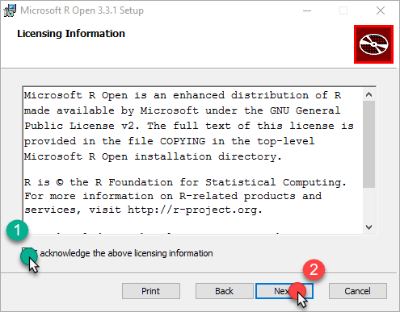
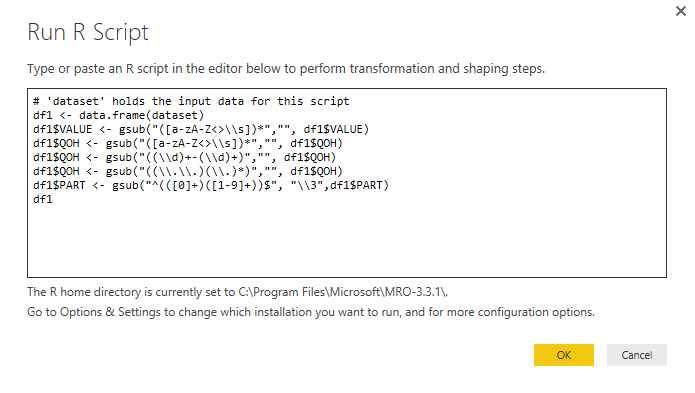
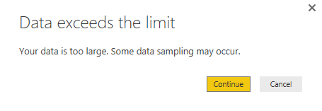

import ArticleHeader from '../../../components/article-header'

<ArticleHeader frontmatter={props.pageContext.frontmatter} />

**¿Qué es R-script?**

R es un lenguaje y entorno utilizado para informática estadística y gráfica. Es una modificación del lenguaje S, por lo que existe código escrito en S, que es capaz de ser implementado en R sin modificaciones.

R proporciona una amplia variedad de modelos estadísticos (modelos lineales y no lineales, pruebas estadísticas clásicas, análisis de series de tiempo, clasificación, agrupación, etc.) y técnicas gráficas, lo que la convierte en una herramienta muy extensible y manipulable por parte del usuario.

Una de las fortalezas de R es la facilidad con la que se pueden producir gráficos de publicación con buena calidad y diseño, incluyendo símbolos matemáticos y fórmulas donde sea necesario.

R está disponible como Software Libre bajo los términos de la GNU General Public License de la Free Software Foundation en forma de código fuente. Compila y ejecuta en una amplia variedad de plataformas UNIX y sistemas similares (incluyendo FreeBSD y Linux), Windows y MacOS.

Por mayor información acerca de R y sus capacidades referirse a la página oficial [R-project](https&#58;//www.r-project.org/) .

**Habilitar R en Power BI**

Como primer paso para tener disponible R en Power BI, será realizar su instalación. Al tratarse de un software libre, el mismo puede ser obtenido de múltiples orígenes y repositorios; siguiendo las recomendaciones de Microsoft, se recomienda obtener los ejecutables desde la página [Revolution Open](https&#58;//mran.revolutionanalytics.com/download/) o el repositorio [CRAN](https&#58;//cran.r-project.org/bin/windows/base/) .

**Instalación desde Revolution Open:**

Descargar la última versión estable disponible:

Una vez descargado el msi, ejecutarlo y seguir los siguientes pasos (marcados con el cursor y los steps):

Una vez iniciado el instalador, aceptar los términos y condiciones y continuar con la instalación

Este paso es opcional, aunque se recomienda la descarga de *Intel MKL*, debido a que mejora el rendimiento de ejecución de cálculos y medidas. De desear descargar el componente, dejar marcada la opción *Install Math kernel Library (Intel ® MKL)*, en caso contrario desmarcar la opción y continuar con la instalación.

Si se eligió descargar *MKL*, aceptar los términos y condiciones y proseguir con la instalación.

Especificar la carpeta destino de la instalación (se recomienda dejar la que viene por defecto, de forma de que Power BI la pueda detectar automáticamente)

Una vez completados los pasos anteriores, se encuentran configuradas todas las opciones necesarias para realizar la instalación.

Una vez finalizada la instalación cerrar el dialogo de instalación.

**Referenciar R desde Power BI**

Al completar la instalación, Power BI identificará automáticamente la instalación realizada (siempre y cuando se haya dejado la carpeta de destino la predefinida).     Para verificar la referencia o cambiar la carpeta de destino realizar los siguientes pasos:

·          Ingresar a Power BI Desktop.

​ ·          Una vez en la aplicación dirigirse a *Archivo (File) -&gt; Options and Settings -&gt; Options* .

·          Dentro de las opciones dirigirse a la pestaña *R script* . En la pestaña podremos ver la carpeta destino de la instalación de R-script.

**Importación de módulos**

La instalación por defecto de R, incluirá ciertos módulos, pero resultará imperativo el obtener funcionalidades extras. Estas importaciones se pueden realizar directamente desde la consulta R que se está ejecutando a través de la utilización del comando:

install.packages(‘[NOMBRE MODULO]’)

Todos los módulos de R disponibles pueden hallarse en [Available CRAN Packages By Name](https&#58;//cran.r-project.org/web/packages/available_packages_by_name.html)

**Problemas de permisos**

Es común encontrarse con problemas de permisos al intentar instalar módulos de R directamente desde Power BI. Estos errores de permisos se deben a que la carpeta *library* (carpeta en donde se guardan las referencias de los módulos importados) de R no está habilitada para escritura por defecto. Para solucionar el incidente, debemos modificar la seguridad de la carpeta y habilitar la escritura de la misma.

**Módulos y sentencia require**

Las consultas R, a menudo incluyen sentencias de *require* , las cuales especifican que para ejecutar la porción de código contiguo es necesario utilizar uno o más módulos específicos.

En el siguiente ejemplo, se utiliza la sentencia *require* , para que se realice la importación del módulo timeDate (módulo que habilita funcionalidades de manejo de fechas).

Si el modulo necesario no existe o no se ha importado, Power BI mostrará el siguiente error en la ejecución del script.

Para solucionar el incidente es necesario agregar la sentencia de instalación del módulo previa a la sentencia de requerimiento *require* , tal como se muestra a continuación.

**Utilización de R-script**

El lenguaje R puede ser utilizado en Power BI para diversas funcionalidades, ya sea para modelar data sources, crear visualizaciones o simplemente crear un data source de cero a partir de comandos de R.     La posibilidad de utilizar este lenguaje es lo que le da una flexibilidad extra a Power BI y es lo que más cautiva a los programadores a la hora de ver a Power BI como algo más que una herramienta de reportería.

**R-script como source de entrada**

Dentro de las opciones de data sources se encuentra la opción de utilizar una consulta R-script. La misma viene integrada por defecto a PowerBI Desktop y puede ser accedida desde la opción *Get Data -&gt; More*

En los orígenes disponibles tendremos la opción *R script.*

Una vez elegida la opción tendremos un recuadro en donde especificar la consulta R.

**R script en modelado de información**

Power BI ofrece la posibilidad de modelar la información de cualquier origen a través de la utilización de R. Esta opción se encuentra disponible en la sección Queries de Power BI, bajo la pestaña *Transform* . Partiendo de un reporte con cierto origen estipulado:

·          Debemos acceder a *Edit Querie:​*

​

·          Bajo la pestaña *Transform* , en la sección *Scripts* , encontraremos la opción R

**R script para crear visuales**

Sin duda una de las opciones más utilizadas, debido a las características del lenguaje, es el utilizarlo para crear visualizaciones personalizadas dentro de Power BI. La utilización de R dentro de Power BI para las visuales es muy simple, solo hay que elegir el tipo de visualización R y especificar el origen de datos, para que se nos habilite un IDE de R embebido en la página de Power BI Desktop.​

**Aplicaciones prácticas de R-script en Power BI**

Muchos ejemplos pueden ser encontrados en el foro de [Power BI](https&#58;//powerbi.microsoft.com/en-us/search/?q=R+script) . Nosotros nos centraremos en dos experiencias personales que hemos tenido, la primera a la hora de modelar entradas de archivos de texto con formatos aleatorios a lo largo del tiempo y la utilización de R para exportar grandes volúmenes de datos de una visual a un csv (Power BI solo posibilita la exportación de hasta 1500 entradas)

**Modelado de un TXT**

En este caso vamos a reflejar cómo obtener información de un archivo de texto que genera un sistema ERP, el cual no sigue un pre-modelado, sino que la estructura del archivo depende de la cantidad de información exportada. Para poder llevar la entrada a un formato específico y de esa forma crear las estructuras necesarias para crear los reportes solicitados, se requirió la utilización de scripts en R.

·          Lo primero realizado fue importar el archivo de texto como data source y se procedió a editar la consulta a través de la inserción de un R-script.

·          Power BI ofrece la tabla de entrada como un dataset, el cual puede ser accedido a través de la invocación de *dataset* . A través de esto lo primero en efectuar es pasar el dataset a un frame el cual posibilite la modificación de las columnas y celdas de la tabla como una matriz. Esto se puede efectuar a través de la utilización de la sentencia:

df1 &lt;- data.frame(dataset)

En este paso, hemos convertido la tabla en un frame el cual está guardado en la variable df1. El siguiente paso será modelar la información de las entradas a través de la utilización de la formula *gsub* .

La fórmula *gsub* permite a través de la utilización de regex, reemplazar sub cadenas de una cadena. La fórmula se aplica individualmente a cada una de las celdas de la columna especificada como entrada. El formato de la fórmula es el siguiente:

gsub(“[REGEX PATTERN]”,”[REPLACEMENT STRING/PATTERN]”,[INPUT COLUMN])

Una vez modeladas las entradas de las columnas *VALUE* (accesible a través de df1$VALUE), *QOH* (accesible a través de df1$QOH) y *PART* (accesible a través de df1$PART), especificamos el valor de retorno *df1* , de forma de que se auto genere la tabla resultado con las entradas modeladas y listas para ser utilizadas en el modelo.

**Exportación de grandes registros a csv**

Power BI nos ofrece la posibilidad de exportar a un csv las entradas utilizadas en una visual (la exportación contendrá los filtros y transformaciones realizadas) de forma de manipular las entradas fuera del ámbito del programa.

Para exportar las entradas de una visual debemos posicionarnos sobre el vértice superior derecho y seleccionar la opción *Export Data*

Esta funcionalidad cuenta con una limitante de registros a exportar, si el mismo supera el umbral permitido, se nos presentará el siguiente mensaje indicando que se exportará la información con errores.

Ante estos casos podemos utilizar un script R para exportar hasta 150000 registros a un csv. Para efectuar esto debemos elegir la visualización R y utilizar el siguiente script.

write.table(dataset, file="[PATH OF FILE]", sep = "[SEPARATOR]", row.names = FALSE)
plot(dataset);

**Conclusión**

Esto es solo un punto de partida para demostrar la flexibilidad que ofrece Power BI a través de este lenguaje, esperamos que con esto se motiven a seguir investigando e inventando nuevas funcionalidades con el lenguaje R y su aplicación en Power BI.

**Bruno Torteloro**

Software Developer en Arkano Software

