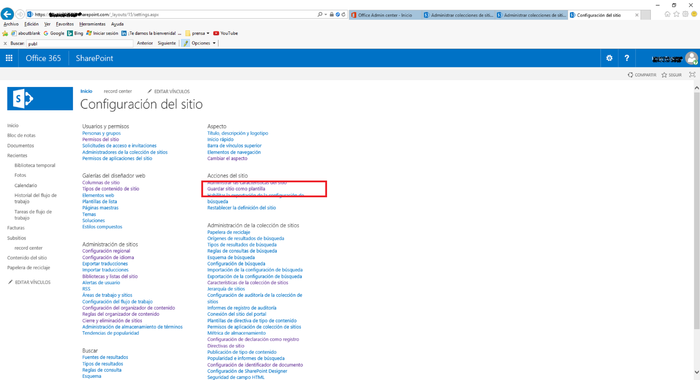

import ArticleHeader from '../../../components/article-header'

<ArticleHeader frontmatter={props.pageContext.frontmatter} />

En SharePoint desde la versión 2007 existe la posibilidad de guardar Sitios, listas o bibliotecas de documentos como plantillas para su posterior reutilización.

Esto nos permite crear rápidamente nuevos sitios o listas con la misma estructura e incluso el mismo contenido que el sitio original que se guardó como plantilla y es una buena opción para crear rápidamente funcionalidad nueva con la misma estructura que la existente lo que nos permite guardar la homogeneidad.

En SharePoint Online, sin embargo, os podéis encontrar con que estas opciones no estén disponibles por defecto.

Para conseguir que la opción de guardar como plantilla aparezca hay que realizar los siguientes pasos:

·          En la colección de sitios donde queremos activar el guardado como plantilla ir a Configuración de sitio.

·          En la sección administración de la colección de sitios Ir a administrar las características del sitio.

·          Ir a Características de la colección de sitios y desactivar la característica: Infraestructura de publicación de SharePoint Server. Si nuestro sitio debe utilizar esta característica, no podremos guardarlo como plantilla

·          A continuación, ir a Configuración de sitio. En la sección Acciones de sitio ir a Administrar las características del sitio.

·          Desactivar si están activadas las características:

o      Característica de sitio de la comunidad.

o      Publicación de SharePoint Server.

·          De nuevo, si nuestro sitio necesita estas características no podremos guardarlo como plantilla.

·          A continuación, abrir la web de administración central de SharePoint Online (https://midominio-admin.sharepoint.com), ir a Configuración.

·          Dentro de todas las configuraciones globales a nuestro tenant, buscar la sección Script personalizado   que contiene dos opciones deshabilitadas por defecto:

o      Permitir que los usuarios ejecuten scripts personalizados en sitios personales.

o      Permitir que los usuarios ejecuten scripts personalizados en sitios creados por los mismos usuarios.

·          Activamos las dos opciones. IMPORTANTE: Esta configuración tarda 24 horas en ser efectiva.

·          Después de seguir estos pasos y esperar las 24 horas, tendremos disponibles las opciones en la configuración de sitio. ​

·          Y en la configuración de una lista o biblioteca:

**Alberto Escola Fiz**

Ingeniero de Sistemas

