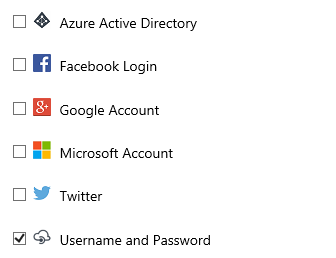
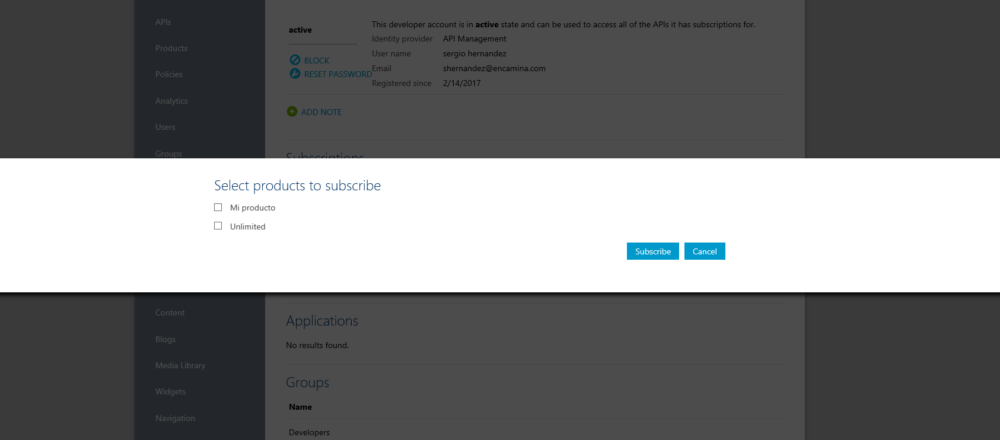

import ArticleHeader from '../../../components/article-header'

<ArticleHeader frontmatter={props.pageContext.frontmatter} />

Es cada vez más normal, que nos encontremos casos de integración entre múltiples sistemas que poco tienen que ver unos con otros, y tendamos a exponer servicios web o APIs como si no hubiera un mañana.
Esta situación lleva a tener que programar integraciones de punto a punto entre los distintos servicios, dificultando mucho el mantenimiento y la evolución de todos estos sistemas. Sin contar que por momentos el inventariado de todos estos servicios, viene a ser prácticamente imposible.

Si ya es bastante conocido el poder de “Integración” de Azure Logic Apps entres sistemas, que decir que, si lo sumamos a Azure Api Management, podemos tener un Bus de Integración muy potente gracias a las funcionalidades que veremos a continuación.

**¿Por qué lo definimos como Bus de integración?**
Me he permitido el lujo de referirme siempre al matrimonio de conveniencia entre Logic App y Api Management como una solución válida para implementar un “Bus de Integración”, huyendo un poco de decir bus de servicios. El motivo no es otro que Azure ya proporciona el servicio Service Bus (MaaS), que evidentemente está pensado para interconectar distintos sistemas, desacoplar sistemas y distribuir mensajes y transacciones haciendo uso de un complejo sistema de Colas.

La principal diferencia la podemos encontrar en que con Azure Logic App podemos integrar sistemas de una forma más sencilla sin recurrir tanto a desarrollos a medida, gracias al diseñador de procesos.
Si además envolvemos con Api Management nuestras APIs y nuestros procesos tenemos un sistema 100% fiable, seguro y sobretodo muy mantenible.

Con todo esto decimos que esta peculiar pareja de servicios, nos permiten construir un bus de integración muy potente.

**Diseña procesos con Logic App**
La idea de incluir Logic App, es el concepto integración con el menor esfuerzo posible. Para ello podemos crearnos desde el portal de Azure una Logic App y definirnos desde el diseñador un pequeño proceso de integración para combinar por ejemplo un par de APIs que tengamos implementadas.

Como un ejemplo base podemos definir el siguiente flujo de trabajo:

Si analizamos el proceso la primera acción es un request, que nos permite definir un punto de entrada a nuestro proceso, y exponer una URL a la cual podemos realizar la petición de arranque, en logic app esto se denomina “trigger o desencadenador”.

Después debemos incluir las llamadas a nuestras APIS, que por ahora las insertaremos como una petición HTTP. Logic App nos permite hacer una petición http del tipo que necesitemos, añadir las cabeceras necesarias (por ejemplo, si necesitamos algún parámetro de autenticación), y añadir el body necesario para realizar la petición. Además de que Logic App permite realizar la petición con múltiples protocolos de autenticación como podría ser OAUTH de Azure Active Directory. ​

El paso clave dentro del proceso, es unificar el resultado de ambas llamadas a las API, y para ello debemos hacer uso de la vista código que nos proporciona Logic App (por simplificar el proceso). Lo que necesitamos es editar la caja de salida o Respose que hemos añadido como punto de salida de nuestro proceso.

Para ello necesitamos añadir al body, la estructura de salida JSON que esperamos devolver, y además mapear a los campos del JSON, los resultados de las llamadas a ambas APIs de los pasos anteriores, para que quede algo parecido a la imagen siguiente.

La forma de conseguir este mapeo, es cruzar desde la vista código la salida de API1 y API2 con los campos del JSON definido como salida. Para ello añadimos el siguiente código:

La instrucción clave es "@body('Nombre caja consulta api')['Campo a mapear']" .

Con este simple código conseguimos devolver de forma unificada, los resultados de la llamada a dos servicios, sin la necesidad de que estos tengan integración ninguna, simplemente necesitamos conocer el modelo del resultado que nos devuelven para poder hacer bien la construcción de la salida.

**Controla tus APIs, ¿Por qué api Management?**

Hasta ahora con el proceso de Logic App que hemos desarrollado hemos conseguido integrar dos APIs, pero podríamos si quisiéramos, integrar un CRM con un SharePoint, o un Directorio Activo con una tabla SQL. Pero ¿Es suficiente esto para definir Logic App como un bus de integración completo?

Respondiéndome a mí mismo, diré que no, y por ello vamos añadir otro servicio PaaS como es Azure Api Management.

Api Management nos va a permitir publicar nuestros servicios y APIs de una forma directa con la idea de que estos servicios se puedan consumir por usuarios internos o externo, y además nos aporta:

·       Securización y control de acceso a nuestros servicios y APIs.
·       Permite escalar verticalmente, para adaptarse al tráfico de llamadas.
·       Monitoriza las ejecuciones y los errores.
·       Nos aporta un portal del desarrollador para testear nuestras APIS.

**Registrar un servicio en API Management**

Para empezar a trabajar con API Management deberemos crearnos en Azure un servicio de este tipo y accederemos a un amplio menú de funcionalidad que nos aporta el producto. El primer paso será empezar a registrar nuestros servicios, de modo que podamos empezar a consumirlos.

Desde el menú de configuración de Api Management en el portal de Azure ya podemos empezar a ver el concepto “Portal de Publicación”, y “Portal de Desarrollador”.

Desde el portal de publicación digamos que vamos a poder administrar el servicio al completo, y el portal del desarrollador está pensado para los “usuarios con rol desarrollador” que no son otros que con los que hemos compartido un servicio o producto y desde este portal podrán aceptar esta invitación y empezar hacer uso del servicio compartido.

Si accedemos al portal de la publicación, deberemos acceder al apartado APIs, en el cual por defecto veremos creado un par de ejemplos como vemos en la imagen.

En este punto tenemos dos opciones, añadir una API o servicio de forma manual, o bien crearlo importando la definición de un servicio ya existente.

Para ello necesitaremos en el caso de ser un servicio web pues el contrato con el fichero WSDL o si por ejemplo es una API REST, necesitaremos el JSON de definición que nos proporciona Swagger.

Deberemos especificar la url para nuestro servicio, que acabará teniendo una forma parecida a *“URL\_API\_MANAGEMENT/URL\_NUEVA\_API”*

Decir por último que API Management trabaja con “Productos”, que podemos definir y asignarles un plan de uso (límite en el uso de llamadas), y a estos productos les asignaremos las APIS o servicios que nosotros elijamos.

Lo adelanto para que nos suene el concepto, ya que cuando demos acceso a un usuario a nuestros servicios, realmente le estamos compartiendo el producto al completo.

Una vez creada registrada la API o servicio, ya podríamos empezar hacer uso desde la nueva URL que nos ha generado el producto.

**Securiza tus servicios**

Este punto es bastante interesante, ya que además de la posible autenticación que tenga cada uno de nuestros servicios, Api Management permite aplicar diferentes medidas de seguridad para acceder a los productos.

Para añadir seguridad a una API, deberemos acceder a la pestaña Seguridad del servicio y aquí podemos añadir la autenticación que necesitemos como una básica por HTTP o por protocolo Oauth 2.0 si es lo que necesitamos.

Si vamos a utilizar Oauth 2.0, necesitaremos añadir un servidor de autenticación válido previamente a configurarlo en la API, y para ello necesitaremos acceder a la opción Seguridad de todo el servicio de API Management.

Para ello deberemos proporcionar los datos de nuestro servicio de Azure AD, que podemos obtener desde el portal antiguo de Azure accediendo al servicio de Azure AD. (Proceso 100% documentado en los manuales de Azure).

Una vez configuremos nuestra API con autenticación, recordar que al hacer las llamadas pertinentes desde fuera o desde, por ejemplo, una Logic App, necesitaremos proporcionar las credenciales o el token de sesión en función del tipo de autenticación seleccionada. Recordar que hemos visto que Logic App soporta autenticación por Oauth, por lo que bastaría con configurar correctamente la llamada.

**Facilita el acceso a los usuarios / portal del desarrollador**

Un punto que para mi gusto distingue API Management de otras soluciones, es la facilidad para dar acceso a nuestros consumidores a una API. Para ello debemos saber que el proceso que usa para compartir un API, es el concepto suscripción, podremos invitar a un usuario a utilizar un servicio y este recibirá una invitación de suscripción al producto y si lo acepta podrá empezar a hacer uso de él.

Debemos recordar en este punto el concepto "Producto" que hemos nombrado anteriormente. Para ver el funcionamiento vamos a crear un nuevo producto, y lo vamos a sumar a los dos que viene por defecto "Starter" y "Unlimited".

Una vez creado podemos añadir tantas APIs como necesitemos, eso sí que estén previamente registradas.

El producto lo podemos hacer público, con subscripción, y con subscripción con aprobación de un responsable.

Una vez tenemos algún API registrada podemos publicar el producto, para que puede empezar a consumirse.

Por defecto en el servicio tendremos tres tipos de usuario Administradores, Desarrolladores e Invitados, pero podremos crear tantos tipos o grupos como necesitemos.
  Los usuarios siempre pertenecerán a un grupo, y se podrán añadir usuarios desde diferentes fuentes:

Una vez tenemos los usuarios dados de alta en nuestro servicio, y les hemos añadido al grupo que nos interesa, vamos a acceder al perfil del usuario para poder suscribirlo a un producto en concreto. Debemos asegurarnos de que el producto está visible para el grupo al que pertenece el usuario, es decir si queremos subscribir a Sergio Hernández y este está en el grupo desarrolladores, el producto que hemos creado debe tener visibilidad para este grupo (Product -&gt; Visibility).

Una vez se ha suscrito al usuario en el producto, ya podría acceder al portal del desarrollador y comprobar que tiene acceso 100% al api y podría hacer uso del servicio.

Nosotros como proveedores le daremos acceso al portal del desarrollador, y el usuario con sus credenciales privadas, podrá acceder a los servicios y productos que le hemos compartido.

Aun así, el usuario siempre recibirá a su cuenta de correo electrónico un mail con la confirmación de la suscripción al producto.
  Nota importante el usuario deberá aceptar la suscripción para poder empezar a hacer uso de los servicios del producto.

Por último y no menos importante, el usuario tendrá asignada una serie de claves propias, o claves de suscripción, que deberá incluir en las llamadas a los servicios para poder consumirlos. Esta seguridad se sumaría a las ya existentes en el API Management y en las propias API’s de Origen.

Esta clave se añadiría en las cabeceras de petición a los servicios como vemos en el siguiente ejemplo en c#.

**Monitorización y rendimiento**

Con Api Management podremos monitorizar y controlar las ejecuciones y los errores, que se produzcan.

En la página principal del portal de publicación encontramos un dashboard general con toda la información en cuanto al uso, rendimientos, usuarios suscritos a los productos, etc.

Así mismo podremos ir navegando por los distintos servicios y productos para focalizar la información de estos informes para un producto o servicio en concreto.

Podemos obtener datos muy interesantes como tiempos de respuesta, número de llamadas, número de llamadas acabadas en error…, que nos pueden entre otras cosas permitir ver el consumo de nuestros servicios, y poder plantear tendencias de uso y en función de esto estudiar políticas de escalado.
  Además, tenemos una utilidad de análisis en el propio portal que amplia aún más toda esta información, bajando incluso al nivel de usuario o de suscripciones.

En la pestaña de uso podremos incluso ver desde donde se realizan las peticiones a los productos. Por ejemplo, en mi grafica vemos que he desplegado servicios en varias regiones distintas.

En resumen, podemos monitorizar, y controlar la salud de nuestros servicios y productos, así como controlar picos de actividad.

**Volviendo al diseñador de procesos de Logic App**

Por concluir, decir que una vez que se han registrado los servicios como API en API Management, podemos beneficiarnos de ello también en el diseño de los procesos en Logic App

Como tenemos definidas nuestras API's, incluyendo métodos, parámetros, protocolos de autenticación, cabeceras, cuerpos de los mensajes…, con esta información Logic App nos expone una serie de acciones que nos facilitan un poco más si cabe las consultas.

En vez de realizar peticiones HTTP podemos tender a usar la acción de API Management, y directamente llamar a los servicios expuestos por el producto. Que decir que haciendo así las peticiones nos aseguramos de que sea la propia API Management la que gestione las peticiones, monitorice y exponga los criterios de seguridad en cuanto a suscripciones (claves).

**Conclusiones**

Una vez más los servicios PaaS de Azure, nos demuestran mucho con muy poco, es decir parece que por separado son procesos muy completos pero que no terminan de representar un producto, en cambio combinándolos volvemos a la misma conclusión de siempre. Podemos construir sistemas muy complejos y encima beneficiarnos de todas las ventajas de este tipos de servicios (pago por uso, SLA garantizado del 99% por Microsoft, reducción de costes en implementación…).

En este caso hemos dado con un bus de integración completo, escalable, que podemos hacer crecer de forma casi infinita, porque ¿No es cierto que si añadimos Azure Function podemos integrar con casi cualquier cosa y sin necesidad de tener el coste de gobernar una infraestructura compleja?

Como dice el refrán, "La unión hace la fuerza", y llevado a Azure no es poner servicios por ponerlos, pero haciendo una combinación sensata de funcionalidad conseguimos sistemas antes impensables sobre todo si nos referimos a costes y tiempos de desarrollo.

**Sergio Hernandez Mancebo**
Principal Team Leader 
ENCAMINA
@shmancebo

