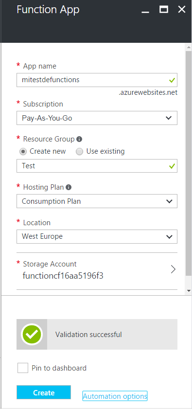
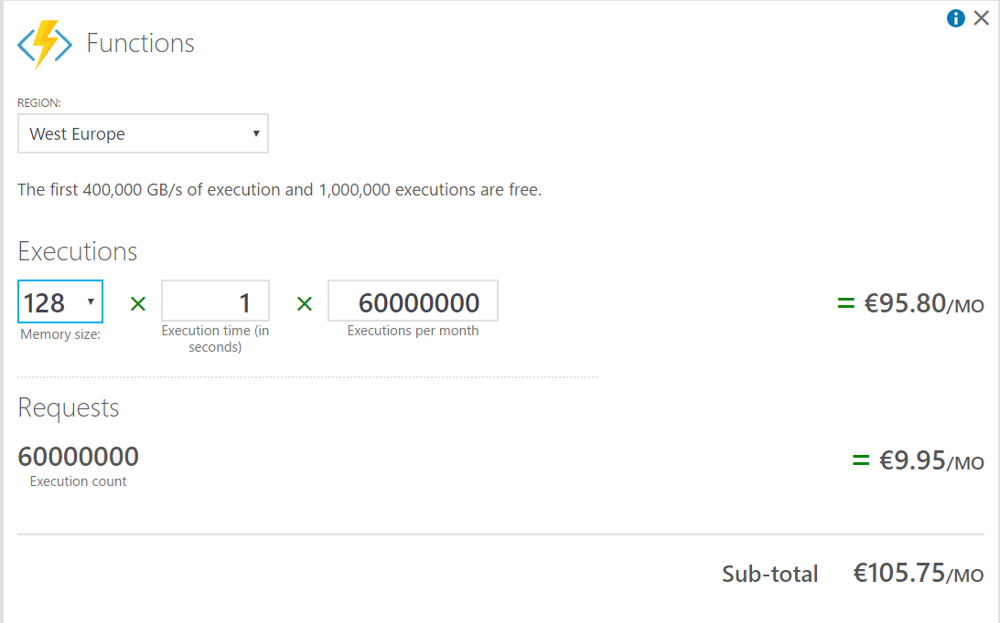
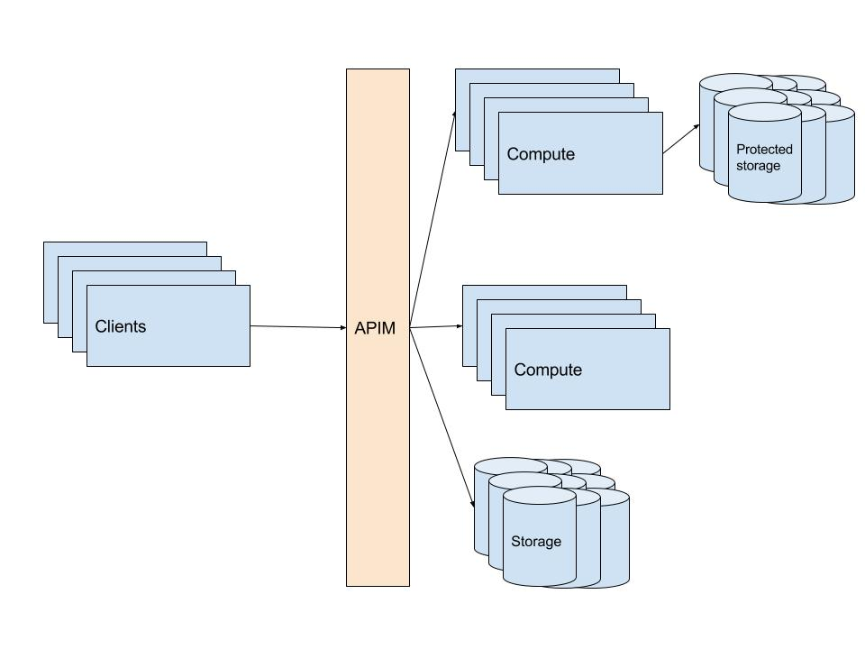

No, no es una nueva feature de Azure de la que no te hayas enterado. En este artículo vamos a entender que es "serverless" ese concepto tan en boca de todos, y los componentes de Azure que se pueden considerar parte de esta moda.

**¿Qué es "serverless"?**

"Serverless", por supuesto, quiere decir "sin servidor". Para cualquiera de nosotros es muy difícil pensar en algo en Internet que no tenga servidor, al menos servidor como ese ente al que le pedimos cosas y nos devuelve cosas: le hacemos preguntas, nos devuelve respuestas; le pedimos páginas, nos devuelve páginas; le pedimos fotos, nos devuelve fotos; le enviamos un archivo, nos devuelve su permalink; le pedimos dinero, nos devuelve un 404.

El serverless que está tan de moda se refiere más a servicios con los que no te tienes que parar a pensar en servidores, aunque sepas que en el fondo ahí estarán.

En general, todo el mundo lo defines como la unión de dos "aaS": el BaaS (Backend as a Service) y el FaaS (Functions as a Service).

El primer concepto, BaaS, se refiere a los servicios que pueden hacer de backend. Obvio. Esto quiere decir que son aquellos servicios de back a los que, sin preocuparte demasiado de su gestión o dimensionamiento, podrías acceder desde tu aplicación móvil, por ejemplo.

El segundo, FaaS, se usa para servicios que ejecutan tu código sin necesidad de que dimensiones ni te preocupes de escalar. Le dan lógica al BaaS, manteniendo su misma filosofía.

Tal vez no os hayáis quedado muy a gusto con estas definiciones, así que os daré la mía propia:

*Serverless es todo aquel servicio para el que no me tengo que preocupar prácticamente nada de su infraestructura subyacente, que por defecto escala elásticamente y que se me cobrará por volumen de tráfico.*

Estas son las tres condiciones que creo que hay que tener en mente para hablar de serverless, pero si queremos añadirle un "aaS" por ser más cool, yo diría que es MaaS (Management as a Service), ya que son servicios en los que la gestión propia de los servicios queda reducida a la nada, y pensando como DevOps sólo nos preocuparíamos de ella en el deployment.

**Azure Functions**

Cuando se habla de Azure y de serverless, lo que sale siempre a colación es Azure Functions. Esta es una de las features de Azure que te permite ejecutar el código que tú quieras de un modo independiente a los servidores. Es algo así como unos webjobs evolucionados que autoescalan. De hecho, el motor subyacente es el mismo que el de los webjobs.

Lo que es Azure Functions ya lo expuso claramente en su momento Gustavo Velez en esta revista [1], por lo que sólo nos fijaremos en nuestras tres condiciones:

*¿Me he de preocupar de su infraestructura?*

La respuesta corta es "no", la larga es un "más o menos no".

Para despreocuparnos de la infraestructura subyacente, hay dos cosas que tenemos que tener en cuenta. La primera es el Hosting Plan, en el que deberemos dejar la opción por defecto (Consumption plan) que hará que se nos cobre por consumo. La alternativa es vincularlo a un App Service Plan, y que nuestras funciones se ejecuten en las máquinas de ese App Service Plan... esto sería prácticamente igual que hacer unos webjobs, y estando esa parte mucho más madura no veo motivos para hacerlo. Con el consumption plan, nos contarán uno cada vez que se lance el disparador que asociemos a la función y que hace que se ejecute y nos cobrarán por el número de veces que se haya ejecutado.

Como curiosidad, podremos ver que cuando creamos una cuenta de Functions con este plan, se nos creará un App Service Plan sobre el que se ejecutará, pero este será del Pricing Tier “Consumption”, que es uno que nosotros no podemos seleccionar cuando creamos un service plan... tal vez algún día nos den esa opción para otras cosas.

La segunda cosa a tener en cuenta es los recursos que consume nuestra función. No es lo mismo una ejecución de un segundo que de un minuto, al igual que no es lo mismo que necesite cien megas o mil. El tiempo de ejecución es una métrica bastante evidente, pero la memoria no tanto tal y como la necesitamos calcular. Si vemos la calculadora, observaremos que viene en tramos de 128MB y nuestro servicio se englobará en el menor de los que pueda contenerle. Por ejemplo, si nuestro servicio necesita 200MB para ejecutarse, se nos aplicará el precio de 256.

*¿Escala dinámicamente y se me cobrará por tráfico?*

Teniendo en cuenta las puntualizaciones que hemos hecho en el apartado anterior, podemos decir que sí a todo. No nos tenemos que preocupar de que escale. En función del número de ejecuciones, Azure se preocupará de alojarlo en más o menos máquinas, sin que nosotros tengamos que estresarnos por picos que no sabemos si algún día llegarán.

Con la salvedad del tiempo y de la memoria, la única otra variable que nos aplica a la hora de calcular el precio es el volumen de ejecuciones, por lo que si tengo mucho pagaré más y si tengo pocas no pagaré. Con Azure Functions puedes tener servicios desplegados a coste cero.

**¿Qué otras cosas hay?**

Ahora que ya hemos visto lo que es serverless y un ​ejemplo detallado del porqué un servicio es serverless, toca pararse a pensar en la arquitectura de una solución completa:

Como podemos ver en la imagen 3, no sólo de Functions puede vivir el informático, y en una arquitectura serverless es raro que vayamos a tener sólo una solución de computación como es Functions.

Functions nos puede dar un conjunto de microservicios, pero muy posiblemente necesitaremos algún tipo de almacenamiento de datos, al que con suerte podremos acceder directamente desde el cliente. "Con suerte", porque es muy fácil pensar en casos en los que es prácticamente impensable que el cliente acceda directamente al almacenamiento sin más validaciones, como por ejemplo una base de datos de ventas ¿nos fiaríamos de no validar que las compras no hayan sido enviadas con un importe de 0?

Pero no sólo son estos servicios, ya que si pensamos en una solución muy grande y distribuida que pueda emplear servicios muy dispares es muy posible que nos interese usar algún servicio de gestión de APIs para unificar todo nuestro backend.

Tirando del hilo que hemos empezado con las Functions, podríamos llegar a la mayoría de los componentes de Azure que se pueden considerar serverless, sobre todo si nos fijamos en sus bindings y triggers [2]. Para que no se nos escape nada, sin embargo, creo que es mejor darse un paseo por la calculadora e ir fijándose en todos los elementos, ya que la forma en la que se facturen nos dirá mucho.

·       **Remote App:** es lo primero que nos encontramos en la calculadora cuyo modelo de precios nos indica que podría ser uno de estos servicios serverless. Es un servicio que permite ejecutar aplicaciones de escritorio remotamente mediante RDP... podríamos entrar en una discusión de si a este servicio de tan alto nivel lo incluimos o no en nuestro abanico de opciones, pero la verdad es que no tendría sentido ya que es un servicio que dejará de existir en el futuro cercano de Azure.

·       **Storage:** tablas, colas y blobs. No necesitas saber cuál es su infraestructura, no te tienes que preocupar por el escalado y el precio es en función del tamaño total de lo guardado, los accesos, la transferencia y el tipo de réplica de los datos. Además, puedes acceder directamente desde tu aplicación (es un ejemplo muy claro de BaaS).

·       **Media Services:**es un servicio de alto nivel para trabajar con audio y video de varias maneras. Como todos los servicios de alto nivel de Azure lo podemos considerar serverless, ya que desde el principio están pensados para que resulte sencillo y que el coste sea en base al consumo.

·       **Azure Search:** es otro de esos servicios de alto nivel, y por tanto también podemos considerarlo como uno de los componentes de Azure serverless, que podremos usar siempre que queramos indexar información y meter capacidades de búsqueda a nuestras aplicaciones.

·       **Mobile Engagement:** otro de estos servicios de alto nivel, en este caso para proveer de un servicio integral de gestión de aplicaciones móviles.

·       **API Management:**ya hablé de él en esta misma revista [3]. Es un servicio con un coste elevado pero imprescindible cuando necesitas aunar múltiples servicios de distintas fuentes, o quieres evitar el vendor locking por ejemplo. Muy útil en arquitecturas serverless.

·       **Notification Hubs**: otro servicio de alto nivel que permite mandar notificaciones a dispositivos móviles (que no teléfonos móviles, ya que incluye dispositivos que no son teléfonos).  Se parte 10 millones de push y luego se paga por cada millón. Es cierto que el hecho de tener un mínimo no cumple del todo con el pago por uso, pero en general creo que también cumple nuestras tres premisas para formar parte de nuestro set de servicios serverless.

·       **DocumentDB:**es una base de datos orientada a documentos en la que puedes elegir que se te cobre por el uso (almacenamiento y velocidad que quieres), por lo que es otro de estos servicios que podemos sumar a nuestro conjunto de herramientas.

·       **Machine Learning:**es un servicio que no manejo apenas por lo que no me atrevo ni a definirlo, pero por lo poco que lo conozco creo que es uno de esos servicios que se pueden considerar como serverless.

·       **Cognitive Services:**son un montón de servicios inteligentes que empezó a mover Microsoft el año pasado con el boom de la IA. Depende del servicio concreto se paga un fijo o se paga por uso, por lo que en cada caso habría que ver si nos vale o no para un sistema serverless en el que queramos pagar única y exclusivamente si se usa.

·       **Hubs:**tanto el IoT Hub como los Event Hubs, son elementos a tener muy en cuenta cuando se está montando una arquitectura serverless que quieras que pueda escalar hasta el infinito. Tienen sus costes mínimos, por lo que se podría discutir si los metemos o no en el saco, pero de cualquier modo necesitaremos tenerlos en mente de cara a plantear una nueva solución.

·       **Logic Apps:** son aplicaciones que se pueden definir con un sistema de drag and drop y unir los puntos para hacer flujos de datos con distintos triggers y distintas acciones. Está pensado principalmente para que un usuario final avanzado, pero no técnico (alguien de marketing por ejemplo), pueda definirse sus propias funcionalidades. Se cobra completamente por uso, y se integra con muchos de los servicios que hemos enumerado, por lo que lo podremos considerar para la arquitectura de cualquier aplicación serverless que queramos.

**Conclusión**

Hay otros servicios que no he metido en la lista, como son los servicios para desarrolladores como Team Services o HockeyApp, o los servicios que están pensados más para los grandes sistemas corporativos como ServiceBus o  Active Directory, que perfectamente se podrían considerar como serverless. Además, aunque muchas veces se nos olvide, hay multitud de servicios en el marketplace que cumplen con nuestras tres premisas del serverless.

Con todos estos, estamos en disposición de decir que Azure Serverless no es sólo Functions y desde luego no acaba de llegar porque hay multiples servicios y algunos de ellos están aquí desde el primer día.

[1]: [http://www.compartimoss.com/revistas/numero-30/sharepoint-y-azure-azure-functions](/revistas/numero-30/sharepoint-y-azure-azure-functions)

[2]: [https://docs.microsoft.com/en-us/azure/azure-functions/functions-triggers-bindings](https://docs.microsoft.com/en-us/azure/azure-functions/functions-triggers-bindings)

[3]: [http://www.compartimoss.com/revistas/numero-28/introduccion-a-azure-api-management](/revistas/numero-28/introduccion-a-azure-api-management)

**Javier López González**
 mail@javilopezg.com
 @javilopezg
 https://javilopezg.com​​

