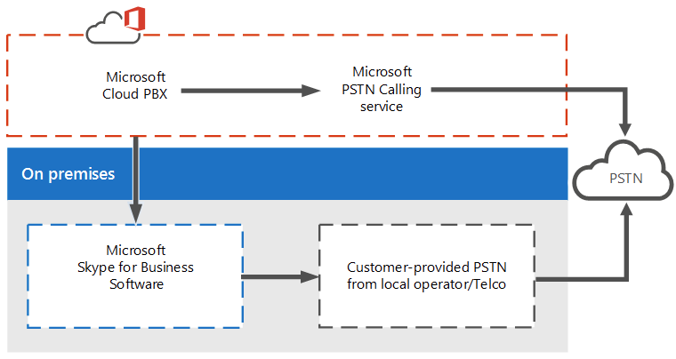
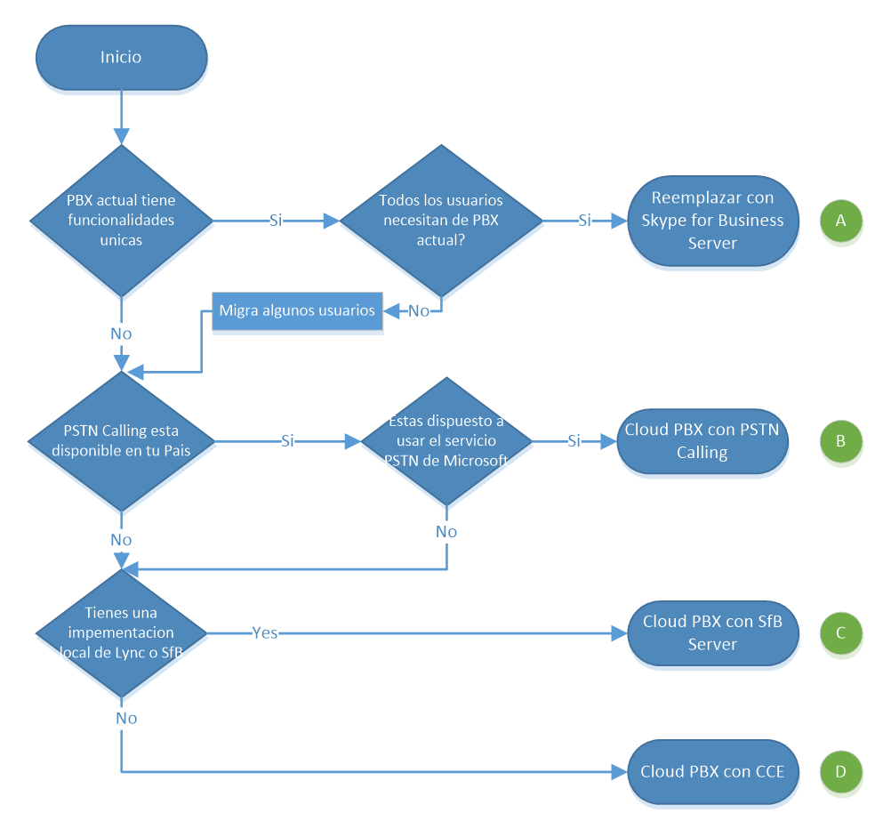

import ArticleHeader from '../../../components/article-header'

<ArticleHeader frontmatter={props.pageContext.frontmatter} />

La voz empresarial con Microsoft es totalmente basada en Voz sobre IP (VoIP por sus siglas en ingles) y se utiliza mediante solución de software, con el cliente de Skype for Business (anteriormente Lync, anteriormente OCS, anteriormente LCS y mejor aquí nos detenemos). Esta solución puede aplicarse 100% OnPremises, ofreciendo una gama amplia de funcionalidades tales como Grupos de Respuesta, Parqueo de Llamadas, etc.

Muy bonito, pero ¿en donde entra la oferta de Cloud PBX? La oferta de **CLOUD** PBX, y remarco la palabra cloud, porque como imaginan es solamente para cuando los usuarios se encuentran en la nube. Y como con la mayoría de los productos Microsoft tenemos diferentes opciones para elegir.

**Cloud PBX con Servicio de llamadas a la PSTN (PSTN Calling).** Solución 100% en la nube, los usuarios están hospedados en la nube al igual que es servicio de PSTN. Cuando se adquiere este servicio (ya sea mediante licencia E5 o E3 + Add on) Microsoft será nuestro proveedor de servicios de telefonía. Y solamente debemos elegir los números que necesitamos dentro de una lista disponible para cada país, asignarlos a nuestros usuarios y serán capaces de realizar y recibir llamadas desde su cliente de Skype for Business.

**Cloud PBX con conectividad local a la PSTN (PSTN on-premises connectivity).**Con esta opción las llamadas son realizadas y recibidas a través de nuestro proveedor de servicio de telefonía localmente. Aunque los usuarios viven en la nube, todo el tráfico de voz se enruta para hacer uso de la solución de telefonía actual (PBX, Gateway, SBC o Direct SIP). Para ello también es necesario contar con alguno de los siguientes.

·       **Skype for Business Server existente.**Para poder conectar los usuarios de la nube a la infraestructura de voz local, necesitamos un punto de conexión entre ambos. Si ya se cuenta con una implementación de Skype for Business Server, y se está realizando la migración de los usuarios a la nube, podemos ocupar esta infraestructura para que sirva como "puente" entre ambos servicios.
·       **Skype for Business Cloud Connector Edition.**Caso contrario, no tenemos una implementación de Skype for Business local, pero necesitamos hacer uso de los servicios de PSTN locales. Es suficiente con hacer uso del Cloud Conector Edition, que no es más que los servicios básicos necesarios para poder funcionar como "puente" entre la nube y el servicio local, en lugar de realizar una implementación completa de Skype for Business Server, CCE (su abreviatura) es un conjunto de máquinas virtuales con los requerimientos mínimos para realizar la conexión. 
 
**NOTA:****Esta solución es solo para organizaciones que no cuenta con alguna implementación existente de Lync o Skype for Business.**
**\*Al día de publicación de este artículo no está soportado aún no está soportado la coexistencia entre CCE y alguna implementación de Lync o Skype for Business.**

****

Ya que tenemos todos los escenarios definidos, ¿cómo elegir cual es el mejor para mí? Para esto podemos basarnos en el siguiente diagrama.

Si eres parte de **escenario A.** Aun tienes servicios que necesitas utilizar que solo una solución local puede ofrecerte y por lo tanto la nube no es una solución adecuada para ti. También un punto determinante que les recomiendo que revisen es los casos de uso que necesitan, algunas de las funcionalidades de Cloud PBX se encuentran aún en preview o dentro de Road Map, tales como Auto Attendant, Grupos de Respuesta o el soporte para teléfonos de Área común. Entonces analicen con suficiente tiempo todos los escenarios donde utilizan telefonía y busquen si Cloud PBX puede ofrecerlo. En caso contrario vean si Skype for Business Server lo puede ofrecer, y planeen reemplazar su PBX actual con Skype for Business Server.

Si después de seguir el diagrama quedas en el **escenario B.**¡Felicidades! Formas parte de los afortunados que tienen el privilegio de utilizar el servicio de PSTN de Microsoft. Actualmente este servicio solo se encuentra disponible para los siguientes países. **Francia, Puerto Rico, España, Estados Unidos y Reino Unido.**Si, por el contrario, estas fuera de esta lista, ya sabes que el escenario B no está hecho para ti.

Aquí es interesante resaltar que puedes tener a algunos usuarios en la nube con funcionalidad "limitada" que ofrece PSTN Calling, y otros usuarios localmente utilizando los servicios avanzados con tu solución de PSTN on prem. (Configuración Hibrida)

Aquellos que terminaron en el **escenario C,** por alguna razón no están convencidos de utilizar PSTN Calling con Microsoft como proveedor, o porque no está disponible en sus países (la mayoría de nosotros) y cuentan actualmente con una infraestructura de Lync o Skype for Business Server. Para ustedes ya tienen la mayoría de trabajo realizado. Recomiendo asegurarse que tengan actualizados sus servidores para que no exista algún problema, y que tengan adicional al Front End Server, los roles de Mediation Server (puede ser colocado en el Front End) y Edge Server. Basta con que inicien la configuración de su ambiente hibrido para mover a los usuarios que necesiten a la nube, y utilizar la implementación actual para la PSTN.

Y para aquellos con el **escenario D**como resultado, por alguna u otra razón no pueden hacer uso de la oferta de PSTN de Microsoft, y no tienen una solución actual de Skype for Business. No se preocupen, para no invertir en una solución completa la cual no van a necesitar al 100, ustedes pueden implementar Cloud PBX con CCE. La serie de máquinas virtuales diseñadas por Microsoft solamente para esta solución. Necesitan contar con Hyper V para poder configurar estar maquinas (por el momento es el único Hypervisor soportado) y realizar su ambiente hibrido. Dentro de estas máquinas se encuentran los siguientes roles. AD, Mediation, Edge y CMS.

Espero que con esto puedan tener una visión más clara sobre qué solución es adecuada de acuerdo al escenario que tienen, cabe mencionar que una empresa puede tener PSTN Calling en un sitio y Cloud PBX con PSTN Connectivity en otros, todo se adapta a las necesidades de la empresa.

**Rodolfo Castro Aguilar**
 MVP Office Server and Services
 @ucblogmx
 http://ucblogmx.com​

