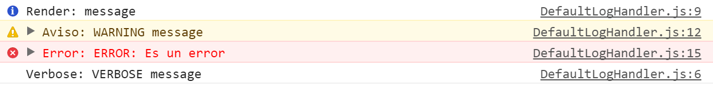
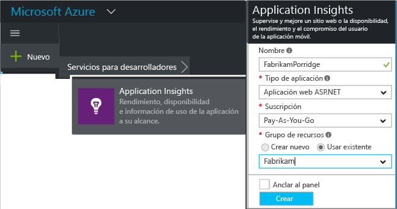
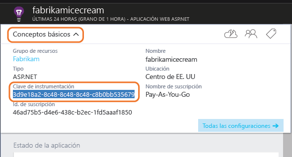

import ArticleHeader from '../../../components/article-header'

<ArticleHeader frontmatter={props.pageContext.frontmatter} />

A pesar de que existe una gran cantidad de documentación sobre el SPFx hay algunos elementos que existen, pero los desarrolladores no los utilizamos debido a que no los conocemos. Todo lo que contiene el SPFx lo podemos encontrar en la siguiente dirección: https://sharepoint.github.io/. En la misma se encuentra todos los métodos, clases, funciones que hay disponibles así como la librería en la que se encuentra y la cual deberemos de importar en nuestra solución.

| &gt;yo @microsoft/sharepoint |
| --- |

En este artículo vamos a ver uno de esos métodos ocultos: la clase "Log".  En primer lugar, vamos a crear un proyecto utilizando la plantilla de Yeoman de SharePoint.

| &gt;npm install @types/lodash@4.14.50 |
| --- |

Para este caso no hace falta seleccionar ningún Framework en particular dentro de la selección del Framework JavaScript que deseemos utilizar. Hay que tener en cuenta que en caso de que se seleccione la opción de "No Framework JavaScript" hay un error en la última actualización de dicho código. Este error es debido a que hay una librería fuera de versión y para solucionarlo (mientras el equipo de producto lo soluciona) hay que lanzar la siguiente instrucción:

Una vez ya tenemos la aplicación funcionando, lo que debemos hacer para poder utilizar el Framework es importar la referencia donde está el LOG, para ello hay que añadir el siguiente fragmento de código en la clase:

| import {  Log } from '@microsoft/sp-core-library'; |
| --- |

**Nota:**  Dado que el Framework lo estamos adoptando desde una fase muy temprana, en anteriores versiones la referencia del log (y de otras utilidades) estaba ubicada en la librería @microsoft/sp-cliente-base

Esta clase Log tiene los siguientes métodos:

·       error(source: *string*, error: *Error*, scope?: [*ServiceScope*](https&#58;//sharepoint.github.io/classes/_sp_client_base_.servicescope.html)): *void* 
·       info(source: *string*, message: *string*, scope?: [*ServiceScope*](https&#58;//sharepoint.github.io/classes/_sp_client_base_.servicescope.html)): *void*
·       verbose(source: *string*, message: *string*, scope?: [*ServiceScope*](https&#58;//sharepoint.github.io/classes/_sp_client_base_.servicescope.html)): *void*
·       warn(source: *string*, message: *string*, scope?: [*ServiceScope*](https&#58;//sharepoint.github.io/classes/_sp_client_base_.servicescope.html)): *void*

Dependiendo del nivel de criticidad elegiremos un método u otro, estos métodos no tienen mucho misterio salvo el parámetro opcional "scope", esta variable es interesante añadírsela ya que nos puede proporcionar más información del error que se ha producido, ya que proporciona información del contesto de ejecución del propio "WebPart".

| Log.info("Render","Empezamos a renderizar el contenido");  Log.warn("Aviso","Esta arrancando");  Log.error("Error", new Error("Es un error"));  Log.verbose("Verbose","Logueo Verbose"); |
| --- |

Si dentro del método Render (que hay por defecto en la solución generada) añadimos las siguientes líneas de código:

Compilamos la solución de nuevo, arrancamos el Workbench y abrimos la consola del navegador veremos efectivamente que se ha registrado los logs tal y como esperábamos.

Esta utilidad está muy bien, cuando estamos desarrollando ya que podemos depurar de una forma controlada nuestra aplicación; sin embargo, el mayor problema que nos encontramos es el momento en el que tenemos que la aplicación está en el cliente, este nos reporta un error y no conseguimos dar con la tecla. Y claro está, no le vamos a decir que abra las herramientas de desarrollo y que nos muestre los mensajes que hay en la consola de depuración.  Existen librerías/soluciones complejas en la que todos los errores se guardan en una base de datos local y posteriormente esta se sincroniza con una base de datos central.

Para evitar todo este sobre coste y para tener un control de errores de cualquier aplicación vamos a utilizar Application Insight.

**Applicaction Insight**

Application Insight es un producto PaaS ofrecido dentro de Azure, que se puede utilizar en todos los desarrollos que nos planteemos. Tiene un SDK para casi cualquier plataforma y si no, también dispone de una API REST con la que interactuar.

Además de ser una herramienta para almacenar los log, se puede establecer un mecanismo para saber que elementos de tu aplicación son más usados o menos. De esta forma obtenemos importante información sobre los gustos del usuario. Lo cual se puede utilizar para tomar decisiones sobre la evolución del producto/solución: mejorar aspectos más usados, eliminar características que no se utilizan, etc.

Además, otra de las ventajas que tiene es la posibilidad de extraer los datos obtenidos e integrarlos con otras herramientas como pueda ser Power BI para hacer informes personalizados.

**Como empezar a utilizarlo**

En primer lugar, vamos al portal de Azure y creamos un nuevo recurso de Application Insights (en Azure un recurso es una instancia de un servicio). Para ello seleccionamos Servicio Para Desarrolladores à Applicattion Insight.

Donde pone Tipo de Aplicación, en nuestro caso deberemos de poner Otro tipo de Aplicación. Esta elección solamente afecta a los paneles por defecto que se visualizarán cuando se empiecen a capturar los datos de la aplicación.

Una vez el servicio se a aprovisionado, deberemos guardarnos la Key (que es lo que identifica nuestro servicio). Esta clave la podemos encontrar en la siguiente pantalla:​

| &gt;npm install applicationinsights --save |
| --- |

A continuación, tendremos que instalar Applitation Insights en nuestra aplicación. Para ello cuando estamos en un entorno de .NET hacemos uso de Nuget como gestor de las librerías externas. Dentro del mundo JavaScript se hace uso (de momento) de NPM, que es un gestor de paquetes de NodeJS. Por lo que para instalar Application Insight dentro de nuestro desarrollo, nos deberemos ir a la biblioteca donde tenemos la solución y ejecutar la siguiente instrucción:

Una vez ejecutado automáticamente dentro del fichero package.json ha debido añadir la siguiente línea   "applicationinsights": "^0.18.0"

Application Insight lo podemos utilizar de dos formas: una en la que el propio Application Insight obtiene los datos de forma automática o la forma más normal en la que nosotros le indicamos que aspectos debe de guardar para analizar posteriormente.

| var appInsights = require("applicationinsights");  appInsights.setup("&lt;instrumentation\_key&gt;").start(); |
| --- |

Para el primer caso bastaría con añadir en el siguiente código:

En el segundo caso, tendríamos que añadir el siguiente código:

| import appInsights = require("applicationinsights");  var client = appInsights.getClient();  client.trackEvent("custom event", {customProperty: "custom property value"});  client.trackException(new Error("handled exceptions can be logged with this method"));  client.trackMetric("custom metric", 3);  client.trackTrace("trace message"); |
| --- |

Dependiendo del tipo de evento que invoquemos este se visualizará en un panel u otro de Application Insight.

**Consideraciones a tener en cuenta**
 Este SDK por defecto hace peticiones REST a dos url:

·       dc.services.visualstudio.com:443
·       f5.services.visualstudio.com:443

Por lo que en caso de que en el entorno en el que lo estemos utilizando tenemos que tener en cuenta que estas direcciones no estén bloqueadas por ningún "firewall".

**¿Cuándo utilizo el LOG de SPFX y cuando Application Insight?**

Desde mi punto de visto se deben utilizar ambos, la solución que implementamos nosotros es crearnos una Interfaz LOG en la que tiene los métodos más comunes de un LOG por ejemplo:

| interface ILog {  Error(Source:string, Exception:any);  Info(Source:string);  Warm(Source:string);  Verbose(Source:string);  } |
| --- |

Con esta interfaz, implementaremos una definición del LOG que consuma el Log de SPFx y posteriormente implementaremos una definición del LOG que tenga ambas. La implementación del LOG de SPFx la implementaremos la utilizaremos cuando nuestro desarrollo este en fase de desarrollo, ya que es mucho más sencillo para la persona que está desarrollando. Mientras que Application Insights lo vamos a utilizar cuando la aplicación ya esté en un entorno productivo para poder extraer información de lo que sucede cuando la aplicación la está utilizando otros usuarios.

Para hacer esta distinción utilizaremos la clase EnvironmentType que viene de serie, para saber cuándo estamos en el Workbench local o bien cuando estamos en un Tenant de Office 365. Para utilizar esta clase tendremos que añadir el siguiente código:

| import {  Environment,  EnvironmentType  } from '@microsoft/sp-core-library'; |
| --- |

Para saber en qué entorno esta tendremos que poner el siguiente código:

| if (Environment.type === EnvironmentType.Local) {   |
| --- |

**¿Por qué motivo utilizar una Interfaz y no consumir directamente la clase?**

En primer lugar, es por tener desacopladas las clases y no tener una dependencia de ninguna librería externa (lo cual en un futuro nos puede costar un quebradero de cabeza). Muchas veces hacemos uso de una librería de terceros y la tratamos como si fuera nuestra. Pero qué pasa si esta librería se deja de actualizar por su creador o bien encontramos otra librería que funciona mejor. Le respuesta es clara, en la mayoría de casos continuamos dependiendo de la vieja clase hasta que es estrictamente necesario y cuando cambiamos proyecto ya actualizamos a la nueva clase que hemos decidido.

**Resumen**

Como estamos comprobando, este nuevo modelo de desarrollo a pesar de estar en una fase muy temprana en su evolución, es bastante completo y tiene muchas utilidades requeridas por los "Developers". A todo esto, si se complementa con todos los servicios que ofrece el Cloud observamos que estamos en un tiempo muy divertido e interesante para los desarrolladores.

Uno de los puntos débiles a lo largo del tiempo, es el control de errores en la parte Front-End de la aplicación ahora con todas estas herramientas de las que disponemos NO hay excusa para no hacerlo.

**Adrián Diaz Cervera**

**Architect Software Lead at Encamina**

MVP Office Development

[http://blogs.encamina.com/desarrollandosobresharepoint](http&#58;//blogs.encamina.com/desarrollandosobresharepoint)

[http://geeks.ms/blogs/adiazcervera](http&#58;//geeks.ms/blogs/adiazcervera)

adiaz@encamina.com @AdrianDiaz81

