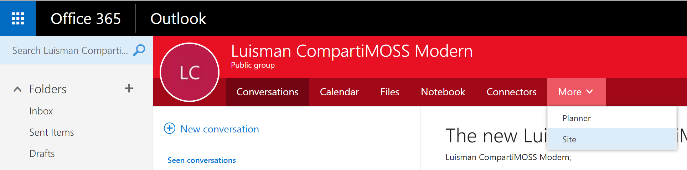
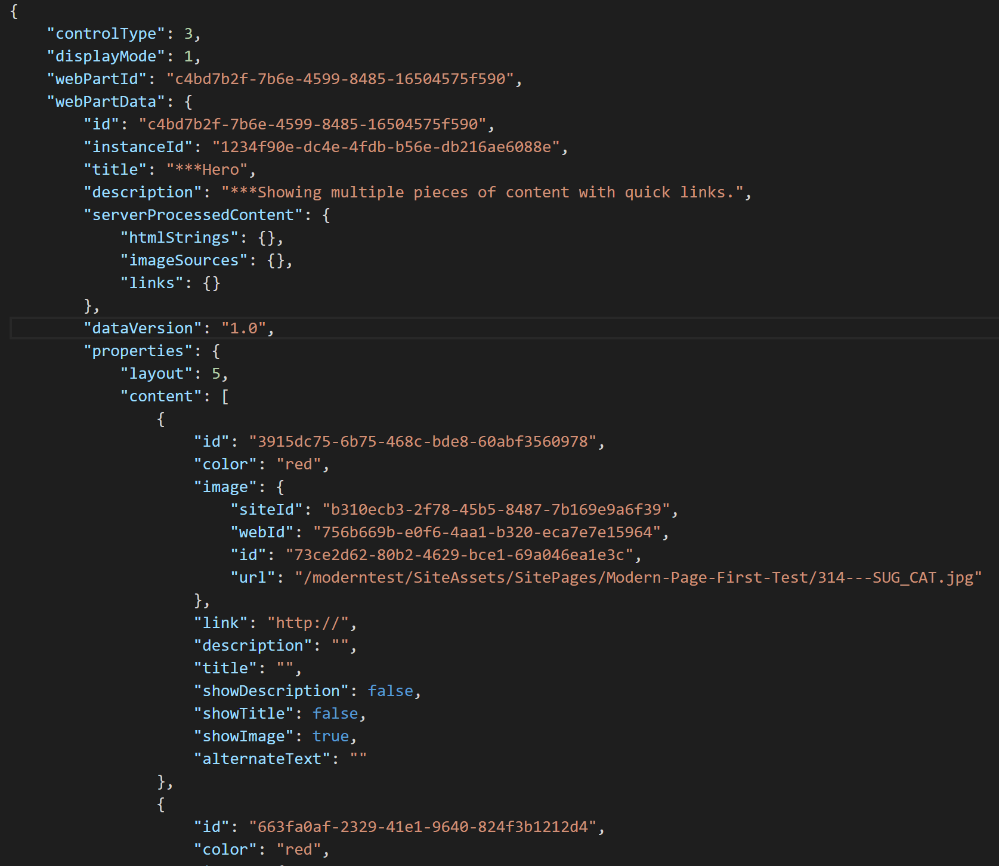

En el siguiente artículo hablaremos de los Modern Sites y Pages, que desde hace poco tenemos disponibles en nuestra tenant de Office 365. Primero haremos una rápida introducción a las "Modern experiences" y luego entraremos a ver con más detalle las "tripas" de cómo estas Modern experiences se almacenan en SharePoint.

**Introducción a las "Modern Experiences"**

Las "Modern experiences" es una nueva experiencia de usuario disponible actualmente a 3 niveles:

1.       Modern team sites.
2.       Modern list and library experiences.
3.       Modern site pages.

Esta nueva experiencia se caracteriza por ser mucho más amigable para el usuario, más sencilla para el autor, mucho más rápido, y lo que en principio es su principal característica: totalmente responsive, multi-dispositivo y multi-navegador.

**Qué está soportado y qué no con los Modern Sites**

Sinceramente, a día de hoy, los Modern Sites están bastante limitados en cuanto a posibilidad de personalizaciones. Poco sabemos sobre el roadmap, pero parece que Microsoft está trabajando en ofrecer alguna solución a las limitaciones actuales.

**Creando Modern Sites**

A la hora de crear un Modern Sites tenemos varias opciones. Teniendo en cuenta que un Modern Site va (siempre) asociado a un grupo de Office 365, podemos crear un grupo de Office 365 desde la interfaz de Outlook web, tal y como vemos en la siguiente imagen:

Una vez creado el grupo, podemos acceder al Modern site desde la opción “Site” del grupo.

También podemos crear un Modern site desde código, y aquí, de nuevo, el PnP nos ayuda con una serie de comandos PowerShell que nos lo ponen fácil:

**Creando Modern Pages**

Una vez creado nuestro Modern Site, ya podemos crear Modern Pages desde la propia interfaz SharePoint y disfrutar de la nueva experiencia, mucho más rápida y sencilla.

Las Modern pages, se almacenan en la biblioteca “Site pages”, como cualquier otra página de un Team Site. Sin embargo, las Modern pages tienen un tipo de contenido propio “Site page” y diferentes Fields.

Además, una Modern Page tiene un "*Page Layout Type*" también diferente, en este caso "*Article*".

Pero, ¿cómo almacena el contenido de una Modern Page?, pues toda la información de la página se guarda en un mismo Field, llamado "*Authoring Canvas Content*", y el contenido en este campo es puro HTML, donde cada Widget se engloba en un tag DIV, con un atributo "*data-sp-controldata*".​

Y es, en ese “ *data-sp-controldata* ” atributo, donde con cierto encoding, se almacena la información de cada widget, en formato JSON, por ejemplo, en la siguiente imagen, podemos ver un fragmento JSON del “Hero” widget:

**Resume​n**

Las Modern Experiences han llegado para quedarse. Ofrecen una experiencia de usuario mucho más agradable, rápida y multi-dispositivo, y aunque actualmente tiene muchas limitaciones a nivel de personalización, Microsoft sigue trabajando para ofrecer opciones y alternativas. Además, el PnP nos ofrece algunas utilidades para provisionar y trabajar con Modern sites.

**Luis Mañez**

SharePoint / Cloud Solutions Architect en ClearPeople LTD
 @luismanez
 [http://geeks.ms/lmanez/](http://geeks.ms/lmanez/)​

 
 
import LayoutNumber from '../../../components/layout-article'
export default LayoutNumber
