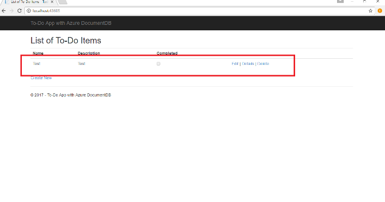
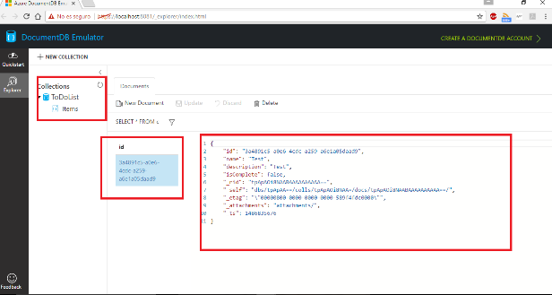

Cuando desarrollamos aplicaciones que serán hospedadas en Azure y utilizarán sus servicios, son de mucha utilidad los emuladores. Estos nos permiten desarrollar en nuestro entorno local sin necesidad de tener que montar la infraestructura necesaria en Azure, así como no depender de tener conexión para realizar los desarrollos.

Uno de los últimos emuladores que nos ha proporcionado Microsoft es el emulador de DocumentDB, en las siguientes líneas vamos a ver cómo podemos instalarlo y utilizarlo.

**Instalación**

Lo primero que deberemos hacer es bajarnos el instalador ([https://aka.ms/documentdb-emulator](https&#58;//aka.ms/documentdb-emulator)) e instalarlo. Para poderlo instalar es necesario que nuestro equipo cumpla las siguientes características:

·       Software: Windows Server 2012 R2, Windows Server 2016 o Windows 10
·       Hardware: 2 Gb de RAM y 10 Gb de espacio en el disco duro.

Una vez instalado lo podemos ejecutar:

**Administración**

Cuando ejecutamos el emulador, automáticamente se nos abre el panel de control de DocumentDB en el navegador. Por defecto, la dirección del panel de control del emulador es https://localhost:8081/\_explorer/index.html, donde podemos crear nuestras colecciones, hacer *querys* o bajarnos *quickstarts*.

También podemos administrar nuestro DocumentDB local desde la línea de comando. Para ello debemos abrir la línea de comando desde la carpeta donde tengamos instalado el emulador y escribir DocumentDB.Emulator.exe seguida de la opción que deseemos, para saber las opciones escribiremos DocumentDB.Emulator.exe /?

**¿Qué podemos hacer?**

·       Crear documentos (recordemos que los documentos de DocumentDB son en formato JSON).
·       Realizar *query's*sobre los documentos.
·       Crear colecciones.
·       Escalar colecciones.
·       Ejecutar *stored procedures* y *triggers.*

**¿Qué NO podemos hacer?**

·       Simular la replicación.
·       Latencia de milisegundos de un solo dígito para lecturas/escrituras.
·       Al no tener replicación no se nos permite seleccionar el nivel de consistencia.

Como podemos observar lo que podemos y no podemos hacer tiene su lógica dado que debemos tener en cuenta que estamos ejecutando nuestro DocumentDB sobre una máquina local.

Ahora bien, ¿Qué diferencias nos encontramos entre el emulador y el servicio de Azure?

**Diferencias que nos encontramos entre el emulador y el servicio de Azure**

·       El emulador solo soporta una cuenta y una clave, además está no puede ser regenerada.
·       El emulador no es un servicio escalable y no permite un gran número de colecciones, por defecto 25 colecciones o 1 colección con partición. El máximo son 250 colecciones o 10 colecciones particionadas.
·       Como ya hemos comentado anteriormente, el emulador no nos permite simular los diferentes niveles de consistencia ni nos permite la replicación.
·       El emulador puede no contener todas las últimas novedades que tenga el servicio de Azure.

En este punto ya tenemos una idea de cómo funciona, si bajamos uno de los *quickstart*, veremos cuál es el *endpoint* y la *key* de nuestro emulador.

En este caso utilizaremos el *quickstart* de .NET. Si vamos al web.config en la sección *appSettings* veremos la configuración de conexión a nuestro emulador:

&lt;add key="endpoint" value="https://localhost:8081/" /&gt;
    &lt;add key="authKey" value="C2y6yDjf5/R+ob0N8A7Cgv30VRDJIWEHLM+4QDU5DE2nQ9nDuVTqobD4b8mGGyPMbIZnqyMsEcaGQy67XIw/Jw==" /&gt;
El ejemplo que nos baja es el típico *ToDoList*, si añadimos un elemento a nuestra lista veremos que se nos crea la colección y se inserta el documento en el emulador:

Ahora si quisiéramos usar el servicio real de DocumentDB, lo único que debemos hacer es crearlo en nuestra subscripción, cambiar los *settings* y listo.

&lt;add key="endpoint"value="https://yourdocumentdb.documents.azure.com:443/" /&gt;

&lt;add key="authKey" value="CdHe9nEje1VLn5…yourkey" /&gt;

**lusion**

**es**

Utilizar el emulador es fácil y sencillo, y utilizarlo es tan similar al servicio que hace que su utilización se intuitiva si estás acostumbrado a trabajar con DocumentDB. Y en el caso de no haberlo utilizado, es un forma fácil y sencilla en adentrarse en este servicio y que el paso a Azure se transparente.

**Robert Bermejo**
 Arquitecto .Net & Azure lead en Sogeti España, SLU

roberto.bermejo@sogeti.com
 @robertbemejo
 www.robertbermejo.com

**REFERENCIAS**

[https://docs.microsoft.com/en-us/azure/documentdb/documentdb-nosql-local-emulator](https&#58;//docs.microsoft.com/en-us/azure/documentdb/documentdb-nosql-local-emulator)

