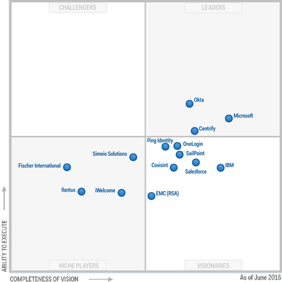
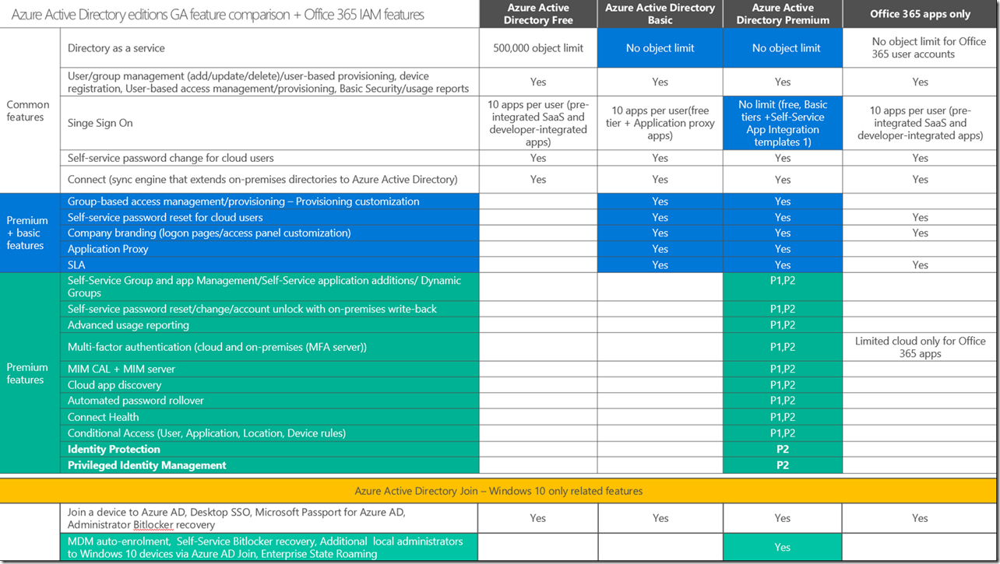
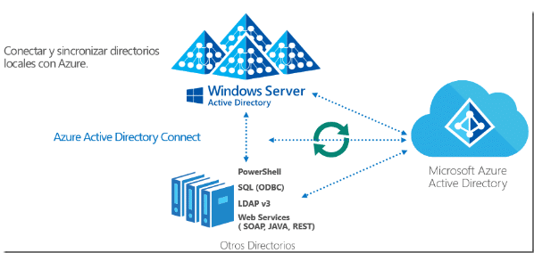
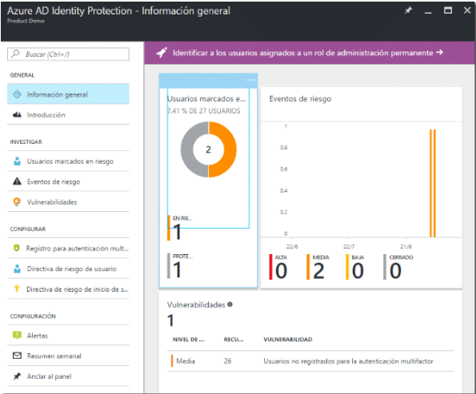
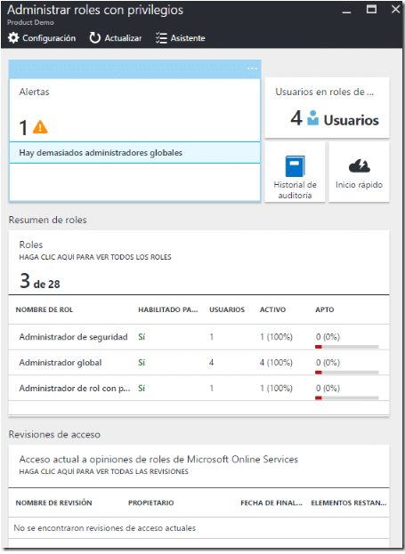

Continuando con el artículo anterior ([EMS Parte 1](http&#58;//jorgecastanedac.com/ems-parte-1-introduccin/))  en esta nueva entrega hablaremos sobre el servicio **AAD Premium** que es una solución de administración de identidades y acceso con un conjunto de funcionalidades que tienen como objetivo proteger el acceso a las aplicaciones locales y en la nube, así como ayudar a mantener la seguridad de los datos corporativos.

Como se comentó el post anterior, Gartner publicó su Cuadrante Mágico de **Gestión de Identidad y Acceso como Servicio** (IDaaS) para 2016 y Azure Active Directory se colocó en el cuadrante de "líderes", y se coloca muy fuertemente para nuestra integridad de la visión. Microsoft ha trabajado con Gartner para hacer copias gratuitas disponibles que se pueden acceder [aquí](https&#58;//info.microsoft.com/EMS-IDaaS-MQ-2016.html) .

En el siguiente cuadro vemos las diferencias de las versiones de Azure AD y las características que diferencian de cada plan, incluyendo el servicio de Office 365.

Este servicio incluye entre otras características:

·     **Inicio de sesión único (SSO):**    Puedes gestionar y unificar identidades entre múltiples plataformas, dispositivos y servicios en la nube (o en local) para lograr un inicio de sesión único. Esto permite que los empleados utilicen una única credencial de acceso, corporativa y segura para acceder a aplicaciones OnPremise y servicios Cloud.

​​·      Servicios Sincronización Cloud (App’s):

·     **AAD Protección de la identidad:**    Es una característica de la edición Azure AD Premium P2 que proporciona una vista consolidada en los eventos de riesgo y vulnerabilidades potenciales que afectan a las identidades de **su** organización. Protección de la identidad aprovecha las capacidades de detección de anomalías de AD Azure (disponible a través de informes de actividad anómala de AD Azure) existente, e introduce nuevos tipos de eventos de riesgo que pueden detectar anomalías en tiempo real.

·     **Autoservicio:**    Ofrece un portal de autoservicio a través del cual los propios usuarios que olviden una contraseña o bloqueen una cuenta, pueden restablecer sus contraseñas a partir de una pregunta de seguridad o un código enviado a su dispositivo móvil.

·     **AAD Gestión de Identidad privilegiado:**    Puede gestionar, controlar y supervisar el acceso dentro de su organización. Esto incluye el acceso a los recursos de Azure y otros servicios en línea como Office 365 o Microsoft Intune. Minimizar el número de personas que tienen acceso a información segura o recursos, debido a que reduce la posibilidad de que un usuario malintencionado conseguir que el acceso. Este componente puede ayudar a:

o    Ver qué usuarios son administradores de AD Azure.

o    Obtener informes sobre el historial de acceso de administrador y los cambios en las asignaciones de administrador.

o    Recibir alertas sobre el acceso a un papel privilegiado

​​

·     **Autenticación Multifactor (MFA):** Integra una funcionalidad que te ayuda a prevenir el acceso no autorizado a tus datos en la nube a través de una segunda autenticación mediante una App móvil, una llamada telefónica automatizada o un mensaje de texto.

**Conclusión**

EMS es el servicio para proteger, prevenir fuga de información y tener control sobre la documentación de la empresa o de los dispositivos.

**Jorge Castañeda**
 MVP Office Server & Services | Enterprise Mobility
 jorge.castaneda@outlook.com 
@xorxe
 [http://jorgecastanedac.com](http&#58;//jorgecastanedac.com/)

