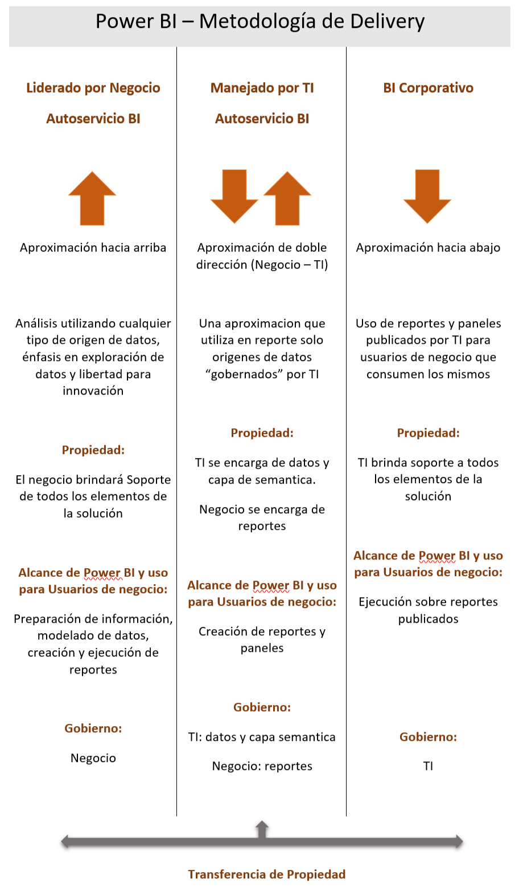
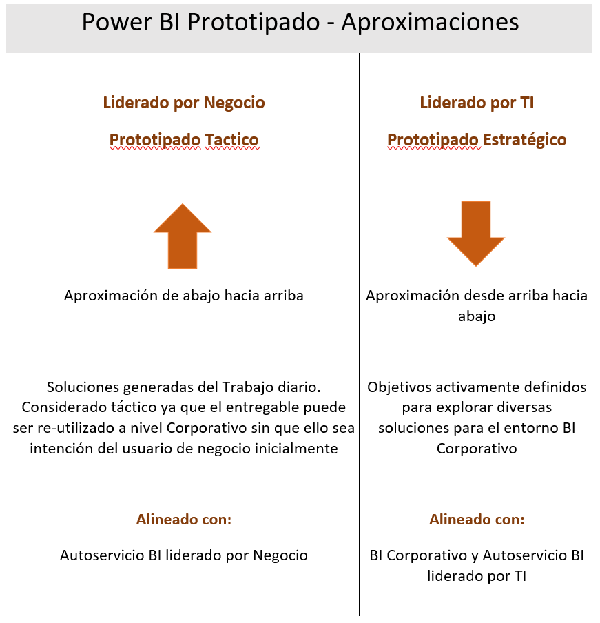
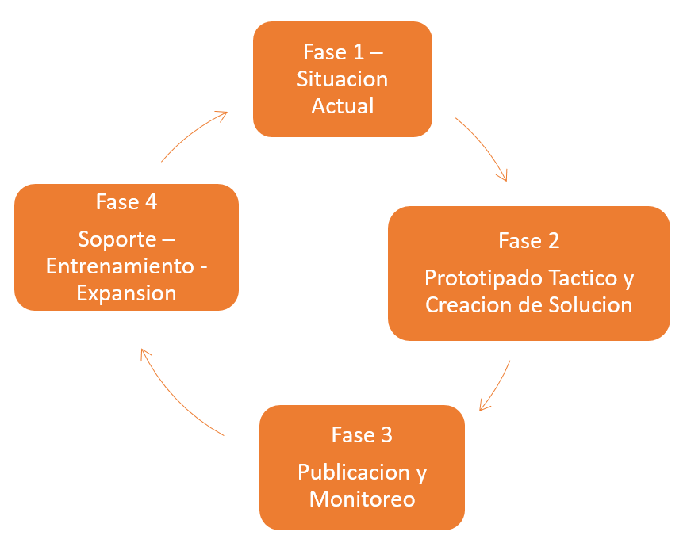
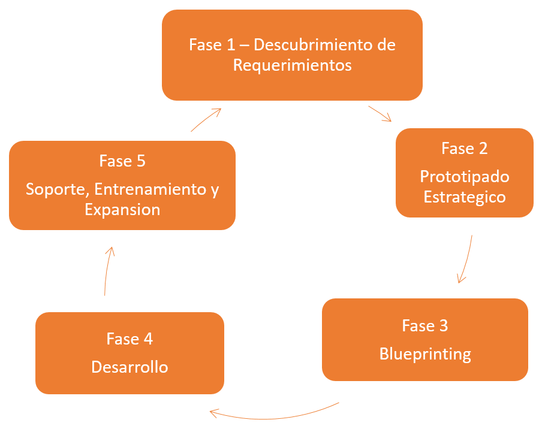

En el presente artículo describiremos varios enfoques en cuanto a definiciones en materia de Gobernabilidad BI. Hoy en día brindando servicios consultivos me ha sucedido que me pregunten acerca de cuál es el criterio de despliegue, ambientes, y decisiones que se deben tomar al momento de distribuir nuestros reportes y paneles.

Algunos temas que debemos abordar como primer paso en esta instancia:

**Desarrollando una Cultura de Analytics**

1.          Midiendo el Éxito: Adopción de Usuarios.

Hoy en día tenemos variantes para la medición de éxito y uso. Por ejemplo, a través de registros de auditoría que nos proveen los Enterprise Gateway instalados para la actualización de Datasets. Power BI actúa además como una herramienta de modelado que permite hacer un trackeo de uso sobre reportes, paneles, y orígenes de datos. Por lo tanto, un incremento del índice de adopción puede ser tangible y evidenciar un camino crítico para generar valor al negocio.

2.          Sponsoreo Corporativo.

Es fundamental contar con un sponsor corporativo que entienda los beneficios de una cultura que se mueve en base a la información y que promueva una visión de aprendizaje en diferentes niveles de la organización. Dicho sponsor además puede ser fundamental al momento de definir un plan de adopción a nivel corporativo.

3.          Campeones de Power BI.

Más allá del sponsor corporativo, el rol de Campeón Power BI es fundamental al momento de ayudar a evangelizar la visión y la generación de reportes y paneles. Los mismos pueden ser definidos a partir de cualquier rol de la compañía. Se supone busquemos personas con un alto nivel de especialización en el uso de Excel, y que deseen colaborar con el Sponsor Corporativo para plantear la mejor estrategia de implementación de Power BI en la organización.

**Planificacion de uso de Power BI como herramienta de Prototipado**

****

**Fases del Delivery – Liderado por el Negocio / Autoservicio BI**

**Fase 1**  –  Comenzar con un caso de negocio relativamente simple, pero con alto impacto en el negocio. Esto ofrece una gran oportunidad de aprendizaje con altas chances de éxito. Como resultado de esta fase el Campeón Power BI debe identificar escenarios de reportabilidad con baja complejidad, pero con gran impacto de negocio. Esos son los escenarios candidatos de prototipados en la próxima fase de Delivery

**Fase 2**  –  Implementación de Reportes seleccionados en Fase 1 por parte del Campeón Power BI. En esta fase se puede incluir solo generación del reporte o también extracción de datos, estandarización, modelado y cálculos. Recibir feedback inmediato es fundamental en esta instancia por parte de colegas. Se debe aclarar que esto no va a formar parte de un proceso formal de Delivery de Reportes.

**Fase 3**  –  Publicación y Monitoreo. Los miembros de este WorkSpace se recomiendan que sean usuarios con permisos solo de lectura. Una vez publicado el reporte existen determinadas actividades a realizar: creación de dashboard, establecer refresco de datos, verificación de seguridad y colaboración, creación de content pack, documentación en base a estándares. (se recomienda en esta instancia el uso de One Drive for Business o SharePoint Online para evitar perdida de datos y mantener versionado).

Es bueno a medida que el reporte/dashboard crece en popularidad que el Campeón Power BI tenga presente la auditoría de uso.

**Fase 4**  –  Soporte / Entrenamiento / Expansión. Expansión de visión: Compartir experiencias. Generar un sitio en la intranet o vía Newsletter. Gamification. Power BI Training.

Consolidación de infraestructura. Power BI reportes de producción. Generar un logo que ayude a identificar aquellos reportes que ya son productivos. Analizar expandir reporte utilizando SQL Server Services. Uso de Cortana Analytics.

**Fases del Delivery – Liderado por TI / Autoservicio BI**

****

**Fase 1** –  IT compila requerimientos, mediante entrevistas. Objetivo: Descubrir requerimientos de alto nivel. Guía para Prototipado (manejo de metodologías ágiles recomendado).

**Fase 2****–  Prototipado Estratégico:** Etapa fundamental ya que es muy seguido que se da el desconocimiento de información necesaria por parte de usuarios de negocio. Armar un Prototipado un set de datos de ejemplo, mockups, herramientas simples a manejar en Power BI. Fundamental el manejo de Agenda y Objetivos en estas sesiones. Utilizar ventana Query en Power BI para mostrarle al usuario transformación y limpieza de datos.

Sesiones individuales para:

•           Definir orígenes de datos, estructura, complejidad.

•           Interfaz semántica (nombres de campos, jerarquías, agrupación de datos).

•           Cálculos y reglas de Negocio.

•           Estructura de Reportes.

•           Interactividad necesaria en reportes (drill downs).

**Fase 3****–****Blueprinting. Definiciones:**

•           Origenes de datos.

•           Modelo de datos (completo o parcial).  Incluye convenciones de nombres.

•           Reglas de negocio, cálculos y jerarquías.

•           Definición de manera adecuada de visualizar la información.

•           Casos de Uso que pueden influir en temas de seguridad o decisiones de implementación.

•           Captación de necesidades específicas como exportación, drill-down, interactividad, refrescos automáticos.

**Fase 4****–****Desarrollo. Definiciones** :

•           Trabajar con iteraciones.

•           Realizar puestas en producción de pequeños componentes de la solución.

**Fase 5****–****Soporte / Entrenamiento / Expansión**

•           Es fundamental en esta etapa el monitoreo para mejoras en temas de Performance, Seguridad y detectar elementos del entorno que son críticos.

•           Elementos fudamentales en Training:

•           Diccionario de términos de información.

•           FAQ’s.

•           Videos cortos de entrenamiento.

**Conclusiones**

Como conclusión, es importante aclarar que estos dos enfoques mencionados anteriormente pueden ser personalizados y deberían serlo para adaptarlo a la dinámica, visión y cultura general de la organización. Por otro lado, este concepto requiere de reuniones de Kick Off para definir no solo el roadmap que se desee trazar en gobernabilidad sino también para definir los roles involucrados y que también mencionamos al principio del presente artículo.

Este artículo pretende ser un punto de partida que ayude a modo de guía en la definición de Gobierno BI.

**Gastón Cruz**

Business Intelligence Technical Manager | Arkano Software

