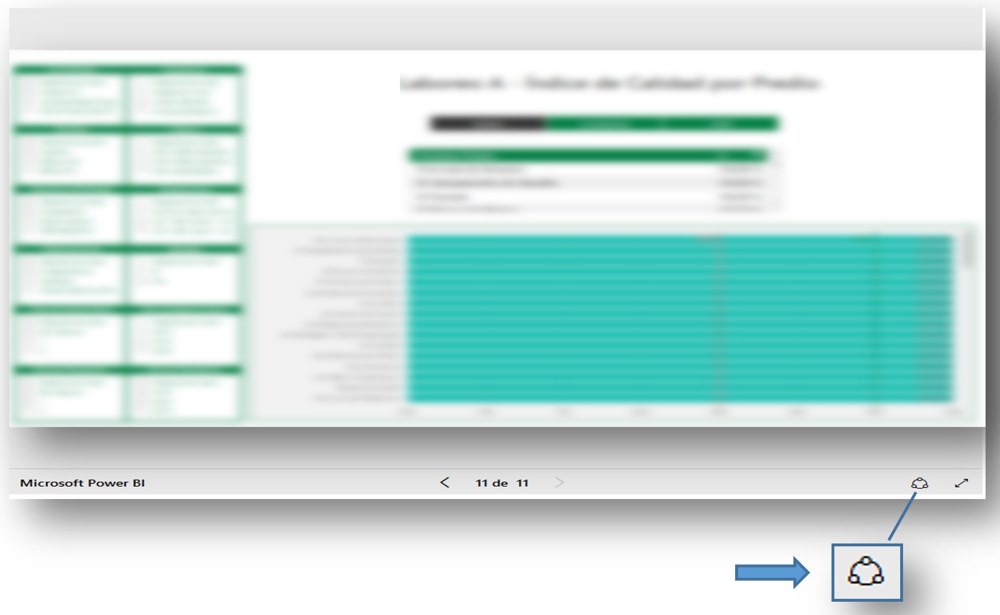
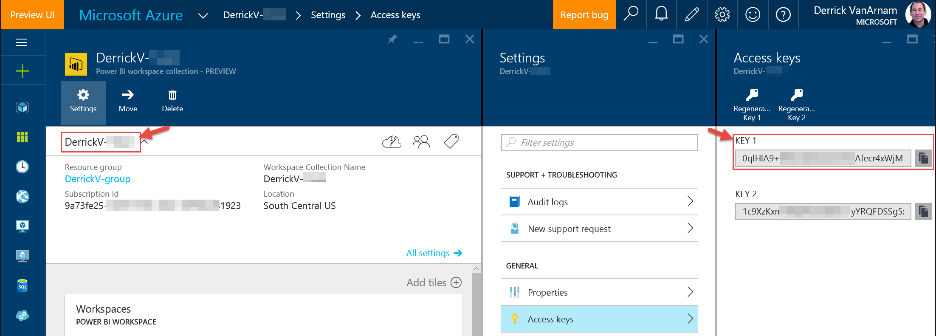
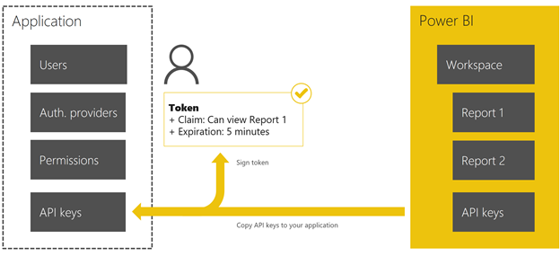
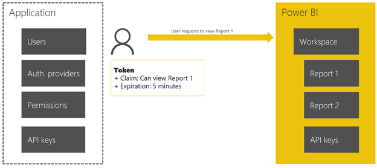
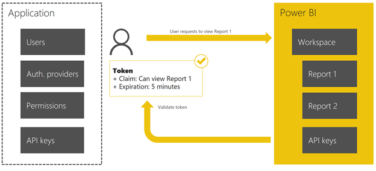
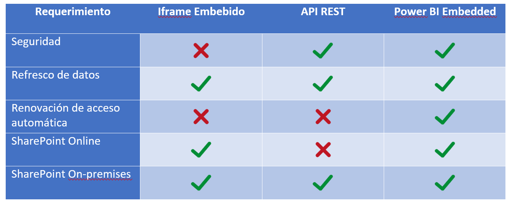

Con la inserción definitiva de Power BI en el mercado y el crecimiento continuo de la misma, es cada vez más común para las empresas en diferentes verticales el realizar el cambio lógico de tecnología y pasarse a esta herramienta en pleno crecimiento, la cual en el ámbito de Business Intelligence, integración de datos, y tecnologías Microsoft, Power BI es el abanderado.

El crecimiento, como en todos los casos, genera nuevas posibilidades y necesidades a ser resueltas, y he aquí donde los expertos en tecnologías Microsoft deben interceder para volver realidad las necesidades presentadas. En base a esto, el mayor requerimiento, en lo que es la era de la información y comunicación en la que nos encontramos, es la integración, confidencialidad y rapidez de respuesta ante el cambio. Tres hitos difíciles de alcanzar, pero imperativos de cumplir y en este escenario no fueron ajenos estas necesidades.

**Situación de Negocio**

Una importante empresa relacionada a la minería y abastecimiento de maquinaria industrial con un fuerte enlace con tecnologías Microsoft y en especial con la utilización de SharePoint como principal herramienta de almacenamiento de datos corporativos, de visualización e integración de distintas componentes sensibles de la empresa.

En los últimos meses ha empezado a utilizar Power BI como herramienta de reportería y visualización de información de forma dinámica, logrando una gran aceptación dentro de la cúpula gerencial y expertos de las diversas áreas, generando la migración de reportes legados de Reporting Services a Power BI, así como múltiples ramificaciones que debido a las limitaciones de las herramientas utilizadas, resultaban inviables de realizar.

**Situación Actual vs Deseada**

Con el crecimiento presentado y utilizando a SharePoint como principal plataforma de visualización de los reportes, se recurrió a la necesidad de visualizar reportes de Power BI embebidos en la plataforma, pero con la particularidad de que el acceso a los reportes no fuera de forma pública y que el acceso a los mismos no pueda ser compartido fuera del ámbito de SharePoint.

A su vez, en la reforma estructural a nivel tecnológico que está inmersa la empresa, se encuentra la migración de la plataforma SharePoint on-premises a su versión online, por lo que la solución debe contemplar la necesidad de poder ser utilizada indistintamente en ambas versiones.

**Análisis**

Los requerimientos presentados, constaban de dos grandes hitos, integración de Power BI con SharePoint y tipo de paquete de SharePoint a ser utilizado para contemplar la múltiple plataforma.

Dentro de las integraciones de Power BI, ya sea con SharePoint o cualquier otra plataforma o sitio web se encuentran tres variantes:

·       Embeber un reporte en un iframe (situación actual).
·       Utilización de la REST API de Power BI.
·       Power BI Embedded.

Embeber un reporte en un iframe

La primera de las posibilidades permite de forma rápida el compartir cualquier reporte en un iframe, algo que resulta atractivo debido a la rapidez de integración pero tiene la gran desventaja de que para poder visualizar un reporte el mismo debe ser publicado de forma pública.

Esto implica que cualquier usuario interno o externo con la URL del reporte podría acceder al mismo, brecha de seguridad con posible mitigación, si se considera que la única puerta de entrada a los reportes se realizará a través de SharePoint y su estructura de seguridad inherente.

De todas formas, la gran desventaja no solo radicó en lo antes mencionado, sino que se encontró en la estructura del iframe con el reporte embebido que presentaba Power BI. En el iframe se presenta la opción de compartir el reporte, es decir se puede obtener la URL del mismo, por lo que la posibilidad de mitigar la brecha de seguridad resulta inviable a través de este approach.

Utilización de la REST API de Power BI

La segunda opción era la utilización de la API REST de Power BI, con este approach se cumplen las restricciones de seguridad y las presentadas por Power BI, dado que el reporte no debe ser publicado de forma pública y se accede con la autenticación de usuario/contraseña o con el token del usuario, pero lamentablemente tiene dos limitantes, las cuales son la autenticación automática y la duración del token.

La autenticación automática, es decir el ingreso de credenciales y posterior obtención del token de acceso se debe realizar desde el servidor, dado que la API REST valida que la solicitud provenga de una aplicación registrada y dada la restricción de que la solución debe ser apta para SharePoint Online esto no era posible. A su vez, uno de los requerimientos subyacentes, era la necesidad de que el usuario no tuviera que ingresar las credenciales de la cuenta de Power BI, dado que la mayoría de los usuarios solo consumirán la información, por lo que no conocerán las credenciales de Power BI.

El otro talón de Aquiles de esta posibilidad es el tiempo de vida del token (aproximadamente una hora), lo que imposibilitaba la utilización de la solución en monitores de visualización estáticos, es decir, monitores cuya función es mostrar todo el día determinados reportes y tableros de control.

Power BI Embedded

Como opción adicional tenemos Power BI Embedded. Esta solución, en comparación a las otras conlleva un tiempo de desarrollo y aplicación mayores e involucra otros servicios de Microsoft, lo que genera gastos extras para el cliente, pero que ofrece toda la potencialidad de Power BI y el manejo inteligente de acceso al mismo.

La pregunta que surge es como implementarlo, y el gran secreto de su funcionamiento es abstraerse de todo y dejar que Azure haga el manejo de los accesos, la generación de tokens y la seguridad inherente a la aplicación, lo que conlleva a que Power BI únicamente se centre en hacer lo que mejor sabe hacer, presentar la información y mantenerla actualizada.

Básicamente para generar un reporte embebido con Power BI embedded, debemos contar con las siguientes suscripciones:

·          Cuenta de Power BI Pro.

·          Cuenta asociada de Azure.

El siguiente paso es crear un Workspace Collection y un Workspace de Power BI dedicado para la solución. Como último paso será registrar los reportes en Azure, esto registra los reportes en el Workspace de PowerBI, permitiendo integrarlos con los disponibles en Power BI Web, pero con la particularidad de que Azure podrá ofrecer un token a dicho reporte, de forma de poder controlar el acceso.

La integración entre Azure y Power BI radica en lo siguiente:

1.  Azure provee un Access Key necesario para la solicitud del token (este Access Key estará contenido en la solución de SharePoint).​

​

2. El segundo paso es generar el token, el cual tendrá un tiempo de expiración establecido:

3. El token es firmado con el Access Key provisto por Azure y almacenado en la aplicación.

4. El siguiente paso es la solicitud de visualización del reporte (a través del código del mismo, el cual es provisto por Azure al subirlo al Workspace) con el token generado

5.  Azure, a través del Workspace de Power BI verifica el token y el reporte solicitado.

6.  Como último paso el reporte es enviado al usuario.

El token generado tendrá un tiempo de expiración análogo al de la API REST, pero a diferencia de la misma, no es necesario realizar una autenticación del usuario, ya que teniendo el Access Key del Workspace y generando JSON Web Tokens, se puede actualizar de forma automática el token, sin necesidad de contar con un servidor.

Comparación

Luego del análisis de cada una de las características de las opciones disponibles y cruzándolas con los requerimientos solicitados, tenemos lo siguiente: ​​​

Una vez definida la forma de integración de SharePoint con PowerBI, se debió definir la mejor opción de desarrollo para la solución.

Bajo circunstancias normales, la mejor y única opción viable para realizar lo solicitado, de forma de contemplar los requerimientos solicitados, resumiendo: estuviera disponible para SharePoint on-premises y Online, y que fuera una solución cerrada, es decir, un paquete, sería el desarrollo de una AppPart. En este caso aplica a su vez Microsoft SharePoint Framework (en modo Preview) ofreciéndonos una forma diferente de desarrollo.

Esta nueva herramienta de Microsoft, cambia el paradigma tradicional y elimina por completo la dependencia con el servidor, transformando un sistema pensado como cliente –servidor a cliente-cliente, ofreciéndonos una integración inmediata con plataforma de desarrollo liviano como es Visual Studio Code y proveyendo de ambientes de prueba totalmente disponibles (sin configuraciones de por medio) en SharePoint Online. (*Si le interesa informarse más acerca de esta nueva herramienta, los invitamos a que busquen los artículos relacionados dentro de nuestras publicaciones*)

Debido al estado de preview con el que cuenta SharePoint Framework, es que únicamente se pudo hacer una prueba de concepto (la cual la presentaremos en un futuro articulo) con esta nueva herramienta, teniendo que recurrir a la generación de una AppPart.

**Conclusión**

El resultado final fue la generación de una AppPart, en la cual se debe especificar el Access token del Workspace de PowerBI y el código referente al reporte a visualizar, esta solución contempla los requerimientos solicitados y nos permite manejar el acceso a información sensible de forma ordenada y jerarquizada.

**Bruno Torteloro**

Software Developer en Arkano Software​

 
 
import LayoutNumber from '../../../components/layout-article'
export default LayoutNumber
