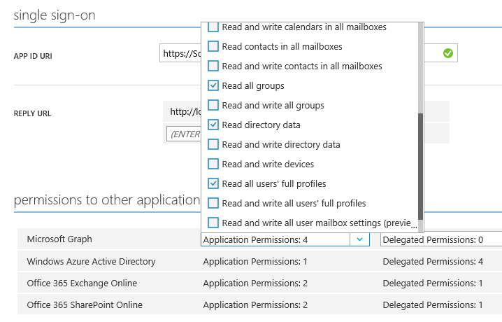
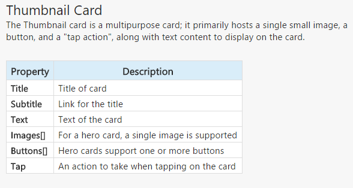
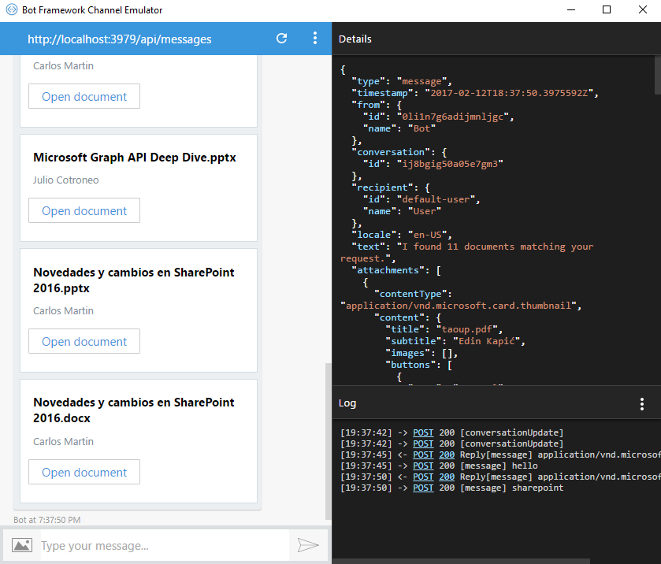
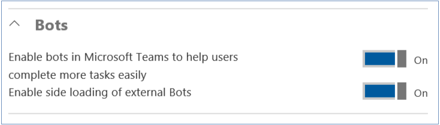
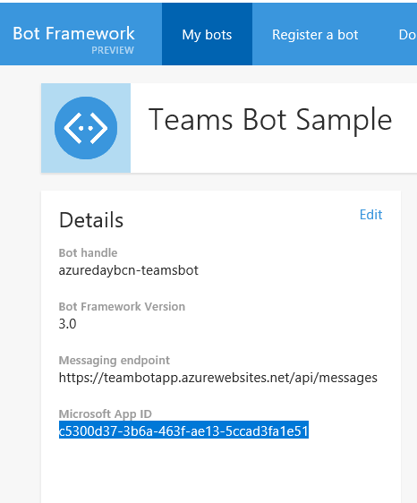
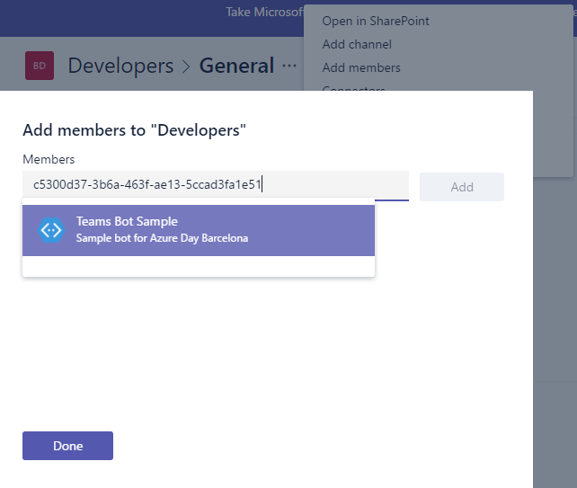
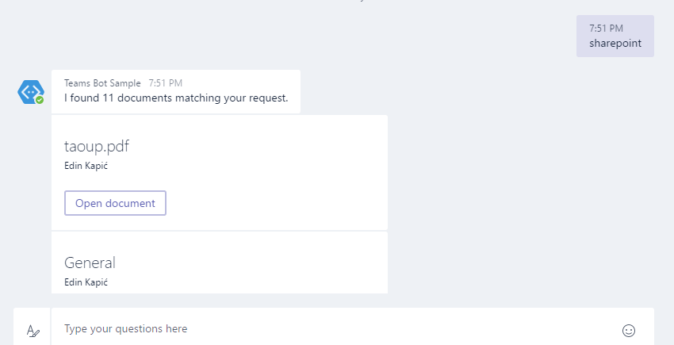

import ArticleHeader from '../../../components/article-header'

<ArticleHeader frontmatter={props.pageContext.frontmatter} />


En el pasado número 29 de CompartiMOSS salió [un artículo introductorio de Bot Framework](/revistas/numero-29/microsoft-bot-framework-para-automatizar-conversaciones), escrito por Santiago Porras. En este artículo voy a centrarme en como añadir lógica al bot, en este caso para poder integrarlo en Microsoft Teams. Para ver una descripción de Teams, os recomiendo el [artículo de Miguel Tabera en el CompartiMOSS nº 30](/revistas/numero-30/microsoft-teams-mejorando-colaboracion-office-365).

**El escenario**

Lo que quiero conseguir con el bot es que busque dentro de mi entorno de Microsoft Teams todos aquellos documentos en los que pueda estar interesado. Para facilitar el escenario, voy a construir un bot mínimo que va a buscar los documentos que están en los Teams del usuario, buscando por las palabras que introduzca el usuario en su conversación.

**La lógica del bot**

El bot no deja de ser una aplicación Web API, con unas acciones concretas mapeadas a los verbos HTTP. La más importante es la operación POST, con la siguiente firma:

```
public async Task<HttpResponseMessage> Post([FromBody]Ac​tivity activity)
```

Aquí se nos pasa la conversación como parámetro llamado **activity**.  Dentro del objeto *activity* tenemos acceso al texto del mensaje (propiedad Text) y al usuario originador del mensaje (propiedad From).

Para responder al mensaje, usaremos un *ConnectorClient*, inicializándolo con el parámetro *ServiceUrl* del propio mensaje. De esta manera responderemos al mismo canal que está usando el usuario. Cabe recordar que un mismo bot puede interactuar mediante varios canales, como pueden ser Skype, chat, Teams, email, Facebook y muchos más.

Con este código tendríamos un bot mínimo que respondería al usuario en modo "eco" para repetir el texto introducido previamente:

```
ConnectorClient connector = new ConnectorClient(new Uri(activity.ServiceUrl)); Activity reply = parentActivity.CreateReply($"Hola, has dicho {activity.Text}"); await connector.Conversations.ReplyToActivityAsync(reply);
```


**Integrando Microsoft Teams**

Ahora tenemos un bot sencillo. Lo que nos falta es integrarlo con Microsoft Teams.

Hemos dicho que un bot es una aplicación web. Por lo tanto, para interactuar con Microsoft Teams tenemos que usar la Graph API de Microsoft. Voy a dar por supuesto que ya conocéis Graph API (y si no, [en CompartiMOSS nº 25 Rubén Toribio os lo explica](/revistas/numero-25/desarrollo-de-aplicaciones-con-office-365-api)).

En concreto, usaré la [API de grupos de Graph](https&#58;//graph.microsoft.io/en-us/docs/api-reference/v1.0/resources/group) para poder encontrar los Teams que tiene un usuario. Todos los sitios de Teams son grupos de Office 365, así que si enumero los grupos de un usuario ya tendría acceso a ellos.

Para acceder a los grupos de un usuario tenemos dos vías. Una es a partir del endpoint **"/me"** donde cada usuario tiene enumerados los recursos de Office 365 a los que tiene acceso. Sin embargo, nuestro bot no tiene las credenciales del usuario así que dentro de "me" no encontrará nada.

Nuestro bot es una aplicación de servidor con su propia identidad y código secreto de autenticación, que usa la librería [ADAL.NET](https&#58;//github.com/AzureAD/azure-activedirectory-library-for-dotnet) para autenticarse contra Office 365. Notad que para que el bot puede enumerar los usuarios y acceder a los ficheros de grupos, hay que darle permisos a la aplicación de acceder a los recursos. Esto se hace en la pantalla de configuración de la aplicación en Azure Active Directory.

Los permisos exactos que necesita son: leer las colecciones de sitio del tenant, leer todos los grupos, leer los datos del directorio y leer los perfiles completos de usuarios (todos dentro de Microsoft Graph). ​



Una vez que el bot está autenticado, tengo que buscar en Graph API los datos del usuario que está conversando con el bot. Recordad que tenemos el usuario en la propiedad *From* del parámetro activity en el código del bot. Si el usuario es un usuario de Office 365, su identidad (parámetro *From.Id*) serán tres cadenas de caracteres alfanuméricos separadas por dos puntos (:). Una es el tenant, otra la cadena "orgid" y la tercera es el ID del usuario. Nos interesa la última cadena, la del identificador. Este identificador lo podemos usar en Graph API para obtener el usuario.

```
var userId = activity.From.Id; var userIdSegments = userId.Split(':');var userIdGuid = Guid.Parse(userIdSegments[userIdSegments.Length - 1]);
```


Cuidado en este punto, porque [según parece](https&#58;//github.com/Microsoft/BotBuilder/issues/2133#issuecomment-275942814), la forma del ID de usuario puede cambiar hasta que Bot Framework salga del preview. El equipo del producto dice que habrá una manera diferente de obtener el usuario dentro de Office 365, probablemente con una propiedad adicional de la Activity que recibe el bot.

**Graph API**

En vez de interactuar con Graph API usando llamadas REST, aprovecharé la librería de .NET que existe (como otras tantas para diferentes lenguajes y plataformas). La base de la librería .NET es el objeto GraphServiceClient. Para crear este objeto le tenemos que pasar un autenticador, que en el caso del bot es una autenticación contra Azure AD mediante ID y secreto de la aplicación.

```
public class AzureAuthenticationProvider : IAuthenticationProvider{    public async Task AuthenticateRequestAsync(HttpRequestMessage request)    {        string clientId = "<ID CLIENTE>";        string clientSecret = "<SECRETO DE LA APP>=";
```

```
        AuthenticationContext authContext = new AuthenticationContext("https://login.windows.net/<TENANT>/oauth2/token");
```

```
        ClientCredential creds = new ClientCredential(clientId, clientSecret);
```

```
        AuthenticationResult authResult = await authContext.AcquireTokenAsync("https://graph.microsoft.com/", creds);
```

```
        request.Headers.Add("Authorization", "Bearer " + authResult.AccessToken);    }}
```

```
private GraphServiceClient GetAuthenticatedClient(){      GraphServiceClient graphClient = new GraphServiceClient(new AzureAuthenticationProvider());      return graphClient;}
```


Una vez que ya tenemos el cliente, buscamos el usuario, sus grupos y los ficheros de esos grupos:

```
var graphClient = GetAuthenticatedClient();var users = await graphClient.Users.Request().GetAsync();var user = users    .Where(u => u.Id == userGuid.ToString())    .SingleOrDefault();var groups = await graphClient.Users[user.Id].MemberOf.Request().GetAsync();
```

```
var searchResults = new List<DriveItem>();foreach (var group in groups.Where(g => g.ODataType == ("#microsoft.graph.group"))){    var drive = await graphClient.Groups[group.Id].Drive.Request().GetAsync();    var files = await graphClient.Drives[drive.Id].Search(searchTerm).Request().GetAsync();    searchResults.AddRange(files);}return searchResults;
```


En este código pasan muchas cosas. Primero buscamos los usuarios del tenant (operación **Users**) y en concreto el usuario con el ID que corresponda al *userGuid* que extraemos del mensaje recibido por el bot.

Luego obtenemos los grupos (de Office 365 y de seguridad) a los que pertenece el usuario, usando la operación **MemberOf**. Hay que hacer un poco de filtrado para quedarnos sólo con los grupos del tipo "*Microsoft.Graph.Group*" y no los grupos de seguridad de Active Directory.

Cada grupo de Office 365 a la vez tiene un "Drive", es decir un repositorio de ficheros. En realidad, es una biblioteca de documentos de SharePoint Online asociado al grupo. Al obtener el drive, hacemos una búsqueda dentro del drive (operación *Search*). Vamos guardando todos los resultados de búsqueda en una lista porque no hay una API única para buscar en todos los grupos.

Los resultados de búsqueda son instancias de la clase *DriveItem*, que contienen el nombre del fichero, su URL, fecha y otros metadatos.

**Embelleciendo el bot con Cards**

Nuestro bot es totalmente funcional pero queremos darle un toque de interfaz de usuario más bonita. Para ello disponemos [de una librería llamada Cards, parte de Bot Framework](https&#58;//docs.botframework.com/en-us/csharp/builder/sdkreference/attachments.html). Con Cards se pueden hacer diálogos y "tarjetas" de contenido para todos los canales de comunicación.

En este caso usaré una **ThumbnailCard**. Dentro de la misma pondré el nombre del fichero, el autor y el botón para abrirlo.​



El código que lo hace es el siguiente. Le paso como parámetro la lista de los resultados encontrados y la conversación del usuario, para poder contestar a ella.

```
private Activity GetFormattedSearchResultsReply(List<DriveItem> searchResults, Activity parentActivity)
```

```
{
```

```
    Activity reply = parentActivity.CreateReply("I couldn't find any documents matching that, sorry.");
```

```
 
```

```
    if (searchResults.Count > 0)
```

```
    {
```

```
        reply.Text = ($"I found {searchResults.Count} documents matching your request.");
```

```
        reply.Attachments = new List<Microsoft.Bot.Connector.Attachment>();
```

```
 
```

```
        foreach (DriveItem driveItem in searchResults)
```

```
        {
```

```
            List<CardAction> cardButtons = new List<CardAction>();
```

```
            List<CardImage> cardImages = new List<CardImage>();
```

```
 
```

```
            CardAction plButton = new CardAction()
```

```
            {
```

```
                Value = driveItem.WebUrl,
```

```
                Type = "openUrl",
```

```
                Title = "Open document"
```

```
            };
```

```
            cardButtons.Add(plButton);
```

```
            ThumbnailCard plCard = new ThumbnailCard()
```

```
            {
```

```
                Title = driveItem.Name,
```

```
                Subtitle = driveItem.CreatedBy.User.DisplayName,
```

```
                Images = cardImages,
```

```
                Buttons = cardButtons
```

```
            };
```

```
            Microsoft.Bot.Connector.Attachment plAttachment = plCard.ToAttachment();
```

```
            reply.Attachments.Add(plAttachment);
```

```
 
```

```
        }
```

```
    }
```

```
    return reply;
```

```
}
```


  De esta forma el resultado del bot en el emulador se ve más agradable que un simple texto. 


Para publicar el bot en Microsoft Teams, tenemos que [habilitar la carga de bots no firmados](https&#58;//msdn.microsoft.com/en-us/microsoft-teams/setup). Para ello dentro de la administración de Teams en el portal de Administración de Office 365 hay que habilitar la opción de *"Enable sideloading of external bots".*



Los bots que se pueden integrar dentro de Teams tienen que estar publicados en Bot Dashboard, tal como explica Santiago en su artículo. Del dashboard de nuestro bot publicado hay que copiar el **"Microsoft App ID"**.



Entonces, dentro de nuestro Team, añadimos un nuevo usuario al Team con la opción “Add members” y pegamos este ID. Teams resolverá el ID como la identidad del bot:



Ya podemos interactuar con el bot, mediante conversación 1:1 o en el canal del equipo usando el prefijo @ como si fuera un integrante más. Una vez desplegado y añadido en Teams, el bot está funcionando como se espera:



**Ideas para extender este bot**

Este mínimo bot se puede extender de varias maneras. Se me ocurren dos:

·       Utilizar el procesamiento de lenguaje LUIS de Cognitive Services para reconocer entidades y órdenes a partir del lenguaje natural.
·       En vez de utilizar las credenciales de la aplicación, abrir un diálogo con el usuario para pedir la autenticación contra Office 365.

¿Se os ocurre alguna idea más?

El código de ejemplo del bot os lo podéis [bajar de mi OneDrive](https&#58;//1drv.ms/u/s%21AjFh3Usno9YnsaB0-dix9oqR-ym9DA). Tendréis que sustituir los IDs y secretos de la aplicación por vuestros propios.


**Edin Kapić**
 Arquitecto senior de SharePoint y Team Lead en Sogeti
 Email: edin.kapic@sogeti.com 
Twitter: @ekapic
 Blog: [www.edinkapic.com](http&#58;//www.edinkapic.com/) ​

