Para comenzar a utilizar FastTrack Network Analysis para Office 365 no tenéis más que acceder a la dirección Url [http://em1-fasttrack.cloudapp.net/o365nwtest](http://em1-fasttrack.cloudapp.net/o365nwtest) .     Al navegar a esta Url os encontraréis con la primera sorpresa “inesperada” y es que FastTrack Network Analysis para Office 365 está disponible por medio de un applet de Java lo que en la práctica se traduce en que sólo podréis ejecutar la herramienta desde Internet Explorer o Mozilla FireFox. Si tratáis de ejecutarla desde Google Chrome o Microsoft Edge, simplemente no podréis.

- Para comenzar a utilizar FastTrack Network Analysis para Office 365, hay que indicar en primer lugar la Url del tenant de Office 365 al que nos vamos a conectar para realizar la evaluación de las características de nuestra red corporativa.

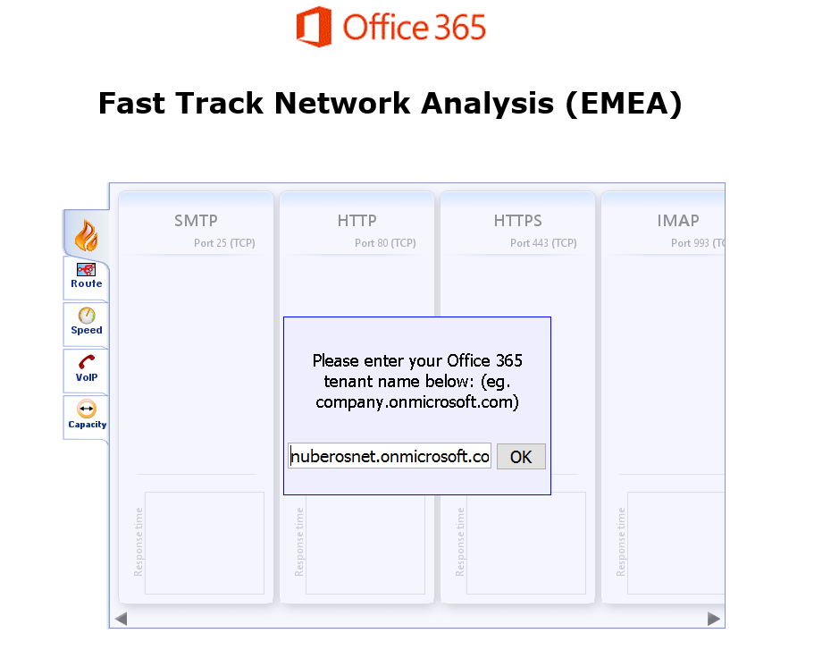

- La herramienta verifica en primer lugar que a nivel de puertos necesarios para conectarse a Office 365 todo está correcto. Por ejemplo, se comprueba si se permite, entre otros, la conexión a través de los puertos de HTTP / HTTPS (80 / 443), IMAP / POP (993 / 995). Para cada puerto se muestra el tiempo de respuesta.

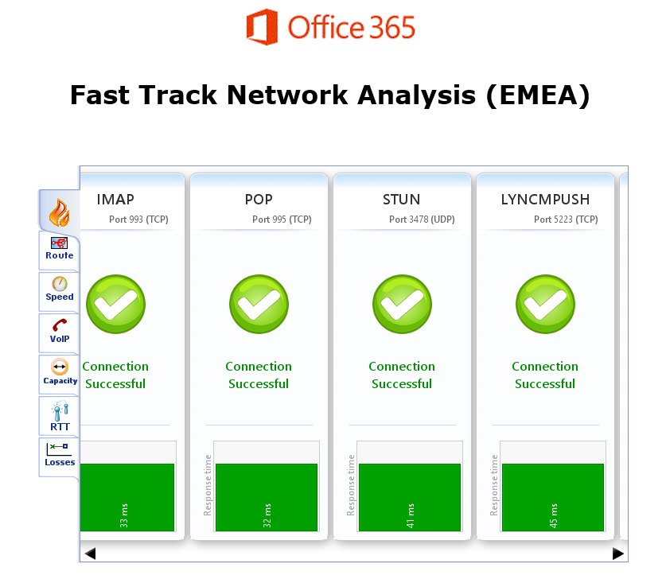

- A nivel de ruta seguida, FastTrack Network Analysis determina la ruta que siguen las peticiones que se realicen desde la red corporativa a Office 365 mostrando información detallada sobre los saltos realizados, % de paquetes perdidos en la conexión o si la resolución a nivel de DNS es adecuada.

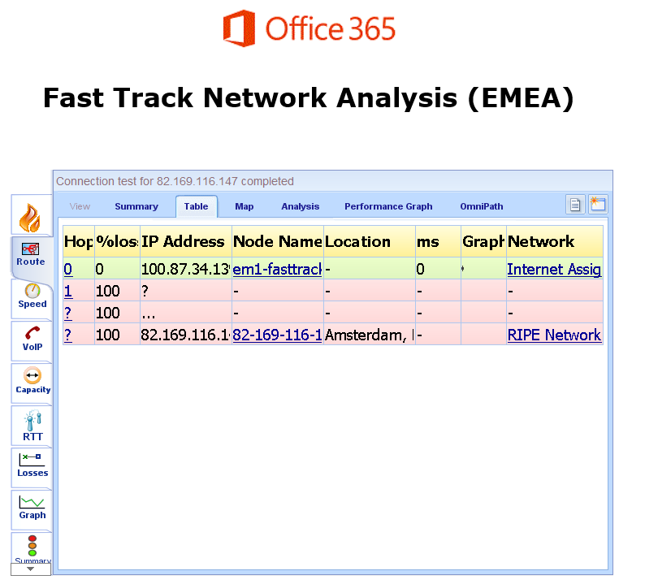

- La tercera pestaña de FastTrack Network Analysis muestra datos relativos a la velocidad de subida y de bajada de nuestra conexión a Internet, así como los valores de parámetros como el Round Trip Time (RTT), retardo máximo, conexiones usadas, etc.

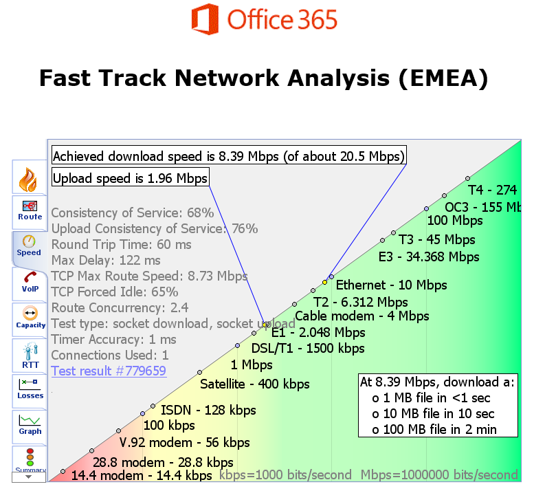

- La sección VoIP permite determinar si nuestra red está preparada para en cuanto a Jitter y perdida de paquetes para comunicaciones de tipo voz sobre IP haciendo uso de Skype for Business. ​

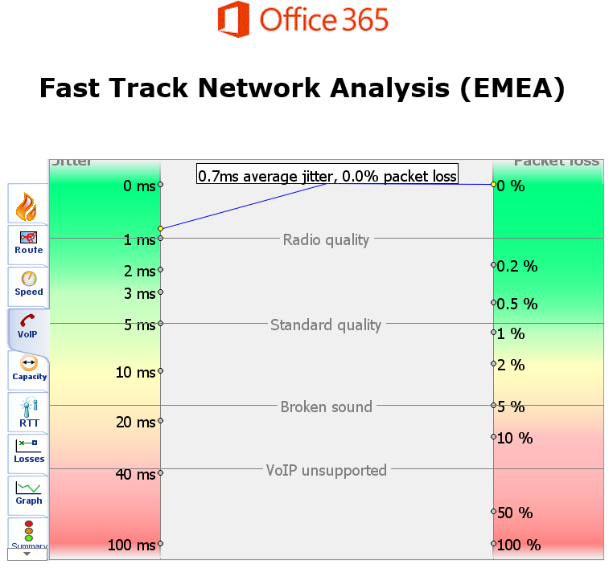

- La capacidad de la red tanto en subida de información como en bajada se muestra en la sección de “Capacity”.

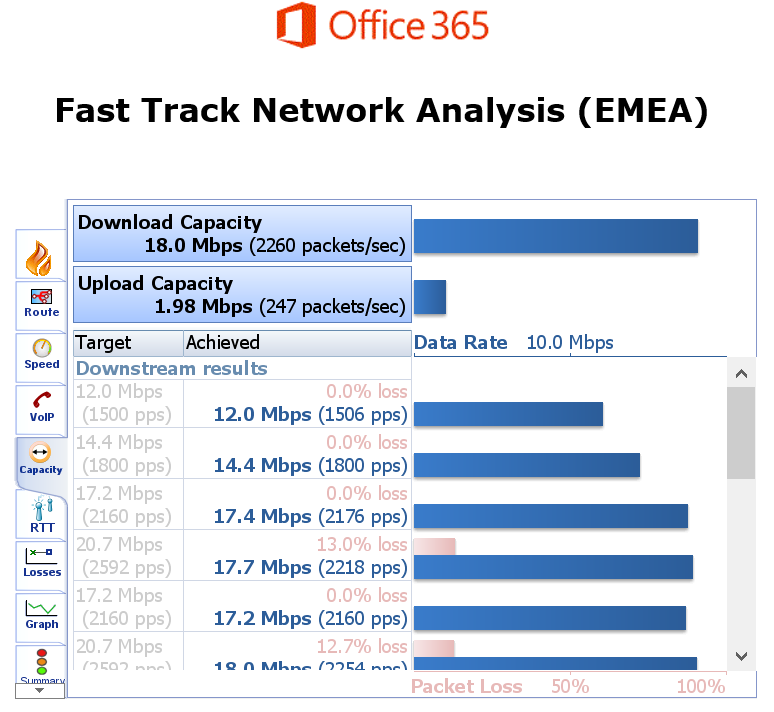

- La sección RTT muestra el valor medio de RTT y si dicho valor medio está en los parámetros esperados para tener una buena conectividad con Office 365.

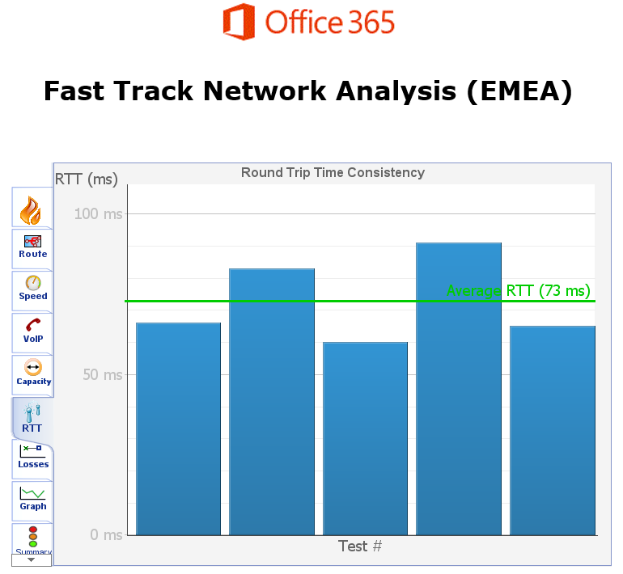

- FastTrack Network Analysis permite obtener el % de paquetes perdidos tanto en subida como en bajada a través de los resultados que se muestran en la sección “Losses”.

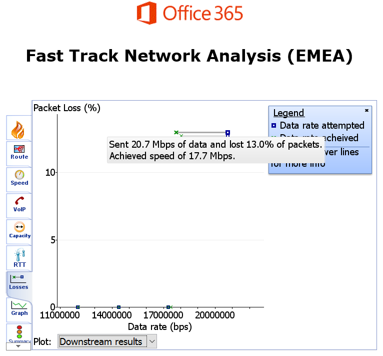

- En la pestaña “Graph” se muestran distintos gráficos como la velocidad de transferencia frente al retardo experimentado, el valor del Jitter frente al % de paquetes perdidos, etc.

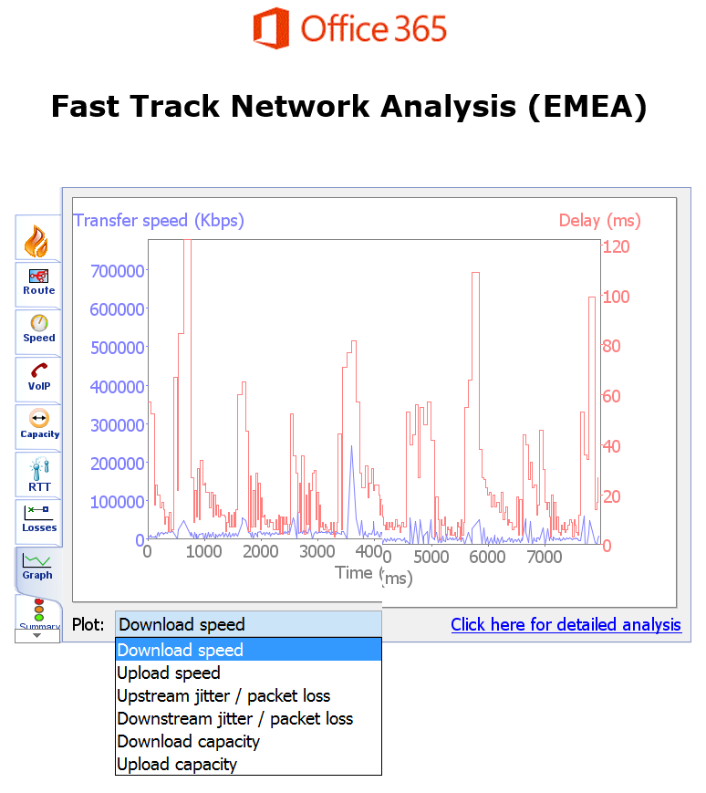

- En la sección “Summary” se muestra un resumen de los resultados obtenidos con FastTrack Network Analysis. Por cada tipo de análisis realizado se muestra un enlace a la sección correspondiente y un semáforo que identifica si hay algún tipo de problema.

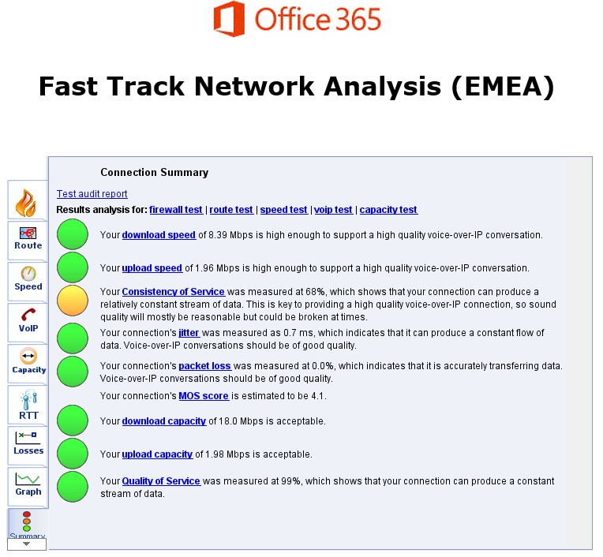

- Finalmente, la sección “Advanced” muestra estadísticas avanzadas relativas a parámetros de la calidad de red para conectarse a Office 365.

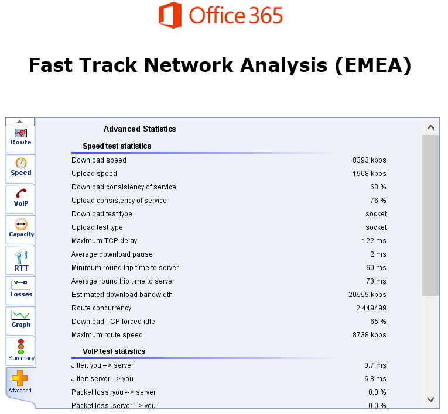

**Conclusiones**

FastTrack Network Analysis es una herramienta proporcionada por el equipo de FastTrack de Microsoft que facilita el análisis de la conectividad de red y su idoneidad para el acceso a los servicios que conforman Office 365.

**Juan Carlos González Martín**
 Office Servers and Services MVP
 Cloud & Productivity Advisor 
jcgonzalezmartin1978@hotmail.com
 @jcgm1978 | [https://jcgonzalezmartin.wordpress.com/](https://jcgonzalezmartin.wordpress.com/)

