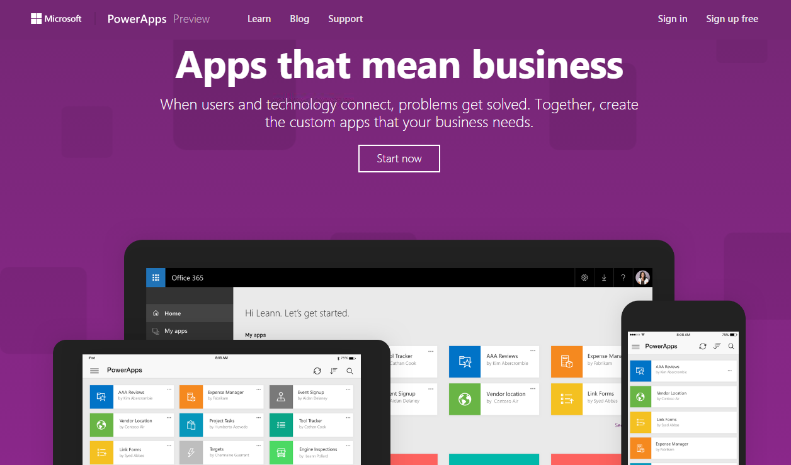
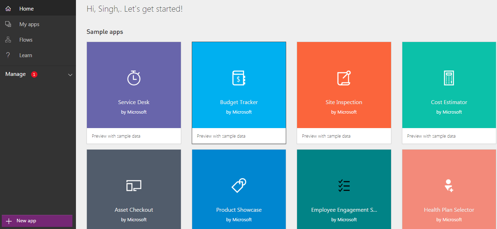
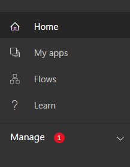
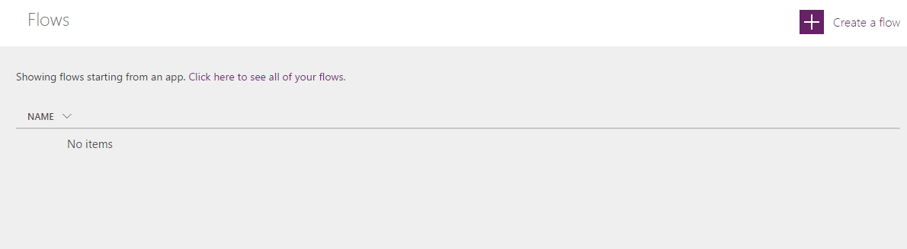
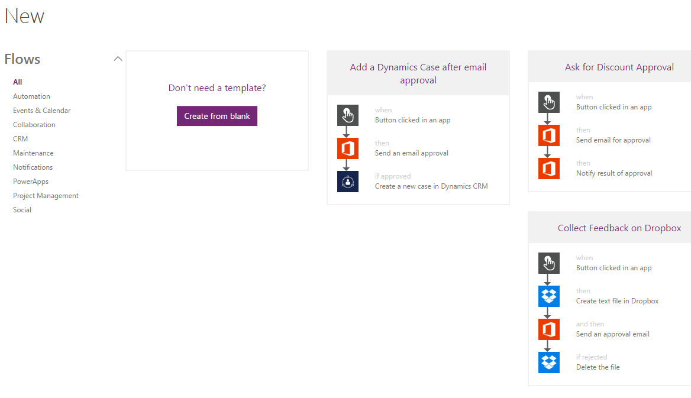
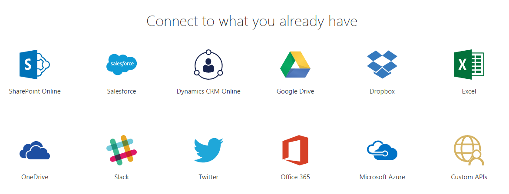
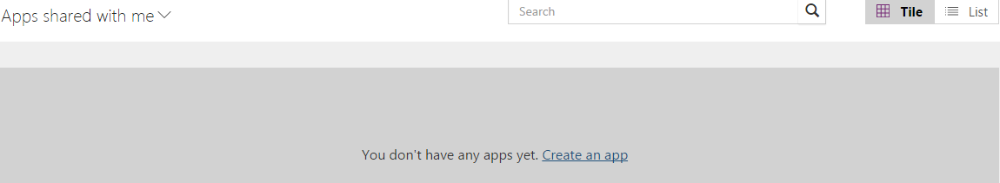
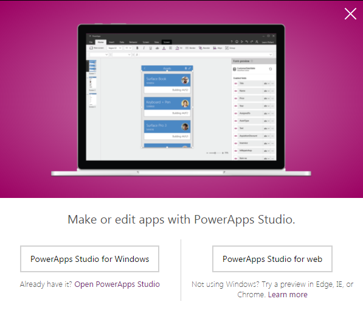
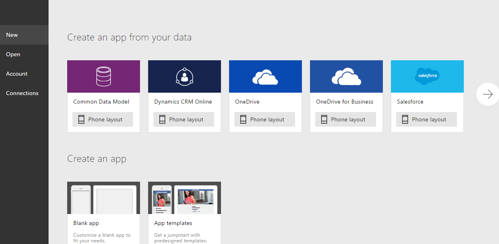

import ArticleHeader from '../../../components/article-header'

<ArticleHeader frontmatter={props.pageContext.frontmatter} />

Welcome to an article where we will see Microsoft’s new product, “PowerApps”. With just the launch, it has provided an amazing response within our technology organization as it provided an efficient way to create an app or create a flow. Microsoft PowerApps is so promising in its initial phase that once you start working on it, it’s hard to get your hands off.

**The PowerApps Portal**

Create an App in PowerApps is a very straightforward process:

- Use this [link](https&#58;//powerapps.microsoft.com/en-us/) to sign in with your organization's Office 365 ID or with your window's ID.
- Once you have been logged in, you will arrive to the portal.

- The left tool bar provides you various options to build or explore.

**Flows**

You can create automated workflows between your apps and services to get notifications or to synchronize files, collect data and many more functionalities. Flows will provide the workflows capabilities which we have been creating through SharePoint Designer or through other 3rd part tool son SharePoint.

Now Flow will be a part of them providing automatically solutions to all the task or process. You can set up a flow that will manage email flows based on different criteria or conditions.

Whether it's a complex multistep process or a simple one-step task, flows will improve the effectiveness, productivity, and performance of the process assisting all end users to get benefitted.

Let's see how we can create one:
 

·          Just on one click, you are ready to create a flow.

- ​Click on it.

- You can either create a blank flow or choose from any of the available templates as you can see on Figure 5.
- We will see a demo soon in my next article so stay tuned.

**Apps**
 Another amazing thing which PowerApps offer is creation of Apps in just few simple clicks which are compatible to all devices and browsers. As PowerApps says, Innovation just got easier. Here you can create an app while connecting to different apps which you are already using without even writing a line of code and publishing them on all devices to be used.

You can connect your app from a various everyday social or custom apps and use them in your process of development your own PowerApps. You can also connect to existing data sources and service like Excel files, SharePoint lists, CRM records, your custom APIs, your drop box or any such to collaborate on your app.

The best part is you use a designer to customize or build an app that uses device capabilities, including cameras, GPS, and pen control without writing any line code.

To create your first App:

·          Click on “My Apps”.​

​

·          Choose if you want the designer to be installed on your machine or you want to use a web designer on your browser.

·          Once you have your studio ready, you will see the screen below.

·          You can either start using an application to connect to your app or create a blank app.

·          We will see a demo soon in my next article so stay tuned.

In this article we saw our Microsoft PowerApps and Flows easing the lives of the customers and soon we will see their demo.

Until then, keep reading & keep learning!

**Manpreet Singh**
 SharePoint Consultant | Office Servers & Services MVP

