**¿Qué es****OMS****?**

Es una solución en la Nube de Microsoft que contiene una colección de servicios para administrar y proteger nuestra infraestructura OnPremise, en la nube o si tenemos una infraestructura híbrida.  OMS se puede ejecutar como servicio independiente o si tenemos en nuestra empresa desplegado System Center 2012 R2 Operations Manager o System Center 2016 Operations Manager, podemos extender SCOM y conectar con OMS. Hay que dejar claro que OMS no es un reemplazo de System Center Operation Manager (SCOM).

También si tenemos desplegado en nuestra empresa System center 2016 Configuration Manager también podemos conectar SCCM 2016 con OMS e importar la configuración de nuestras colecciones.

OMS se divide en mayoritariamente en cuatro categorías o Características.

**Insight & Analytics.**

Nos ayuda a reunir, correlacionar, buscar y actuar sobre los datos de registro (Logs). Nos da conocimientos operacionales en tiempo real, utilizando una búsqueda integrada, Dashboards de actividad, etc. También nos da soluciones desarrolladas por Microsoft que tenemos disponibles mediante la Galería.

El Análisis de registro nos permite primero a recoger todos los datos de la máquina OnPremise y la infraestructura en la nube y luego realizar consultas completas de los datos de nuestro entorno a través de las búsquedas inteligentes, análisis y visualización.  Análisis del registro de OMS nos permite interactuar rápidamente con datos de la máquina en tiempo real y con el histórico para desarrollar ideas y en las tomas de decisiones.

**Automation & Control.**

Nos ayuda a organizar y automatizar operaciones complejas y repetitivas. Con la introducción de los trabajos híbridos de los runbooks. OMS amplía las capacidades desde la nube a nuestro centro de datos OnPremise. Puede automatizar tareas manuales, repetitivas, propensos a errores en los entornos de Data Center o en la nube. También podemos implementar procesos administrativos que consisten en poder realizar múltiples tareas sin la intervención humana.

**Protection & Recovery.**

Nos ayuda a proteger y ampliar nuestro centro de datos más fácilmente implementar estrategias de backup y disaster recovery. Las soluciones de backup y recuperación son impulsadas por Azure Backup y Azure Site Recovery. Las capacidades de replicación de Azure Site recovery ayudan a proteger las aplicaciones críticas y ampliar nuestro centro de datos a Azure. También nos permite recuperación, desarrollo y pruebas, así como migrar aplicaciones a Azure. Azure Backup es una solución escalable que protege nuestros datos de uso y se conserva durante años, sin cualquier inversión de capital y con mínimos costos de operación.

**Security & Compliance.**

Nos ayuda a identificar, evaluar y mitigar los riesgos de seguridad de nuestra infraestructura. Nos ayuda mejorar la protección de las cargas de trabajo, servidores, evaluaciones de actualización de sistema, auditoría, evaluación de malware y análisis de incumplimiento. Security And Compliance nos permite identificar actualizaciones de sistema que nos faltan y el estado de malware. También puedes acumular eventos de seguridad y realizar una auditoria forense y de análisis de incumplimiento. Puede reconocer amenazas tempranas y mejorar el cumplimiento. También puede capturar y examinar la comunicación de red para determinar si hay que cualquier comunicación que ocurre con direcciones IP maliciosas.

**Primeros pasos con OMS**

Ya sabemos que es OMS y sus características o categorías principales ahora vamos hacer los primeros pasos con OMS y para empezar vamos a trabajar con una cuenta gratuita.

- Entramos al sitio web de OMS para activar una trial de OMS: [https://www.microsoft.com/es-es/cloud-platform/operations-management-suite-trial](https://www.microsoft.com/es-es/cloud-platform/operations-management-suite-trial)
- Iniciamos una sesión con una cuenta de Microsoft.

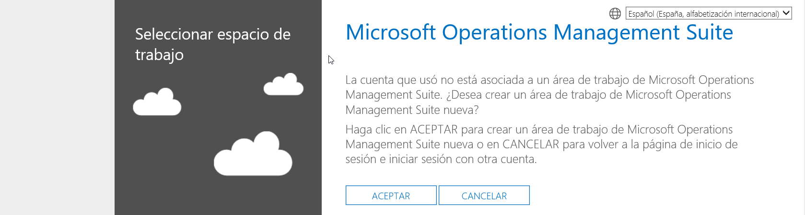

- Nos avisa que no tenemos área de trabajo. Un área de trabajo es la forma de agrupar, organizar por ejemplo hacemos un área de trabajo por producción otra área de Pre-producción etc. Ya sabemos lo que es un área de trabajo así que vamos a crearla ponemos la información que nos pide y hacemos clic en crear.

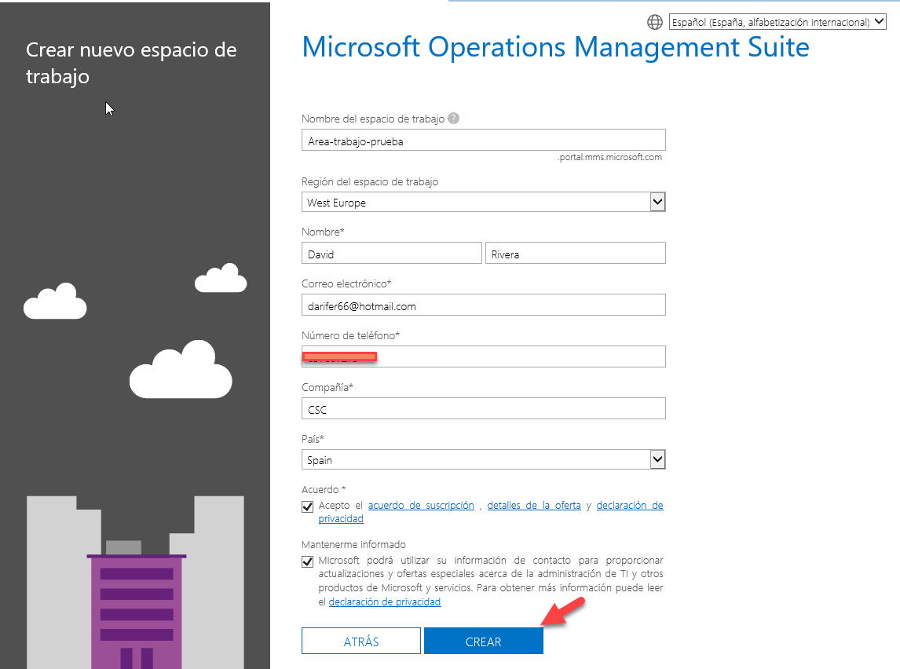

- Como yo no tenemos una suscripción de Azure y es necesaria para OMS le damos crear nuevo rellenamos toda la información. Hacemos clic en vinculo para vincular nuestra área de trabajo con la suscripción de Azure.

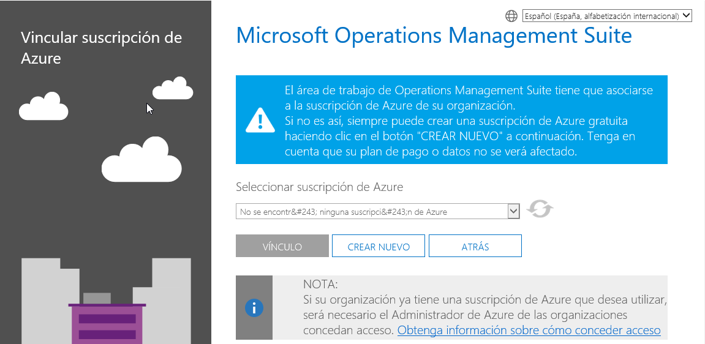

- Ya tenemos nuestra área de trabajo creada:

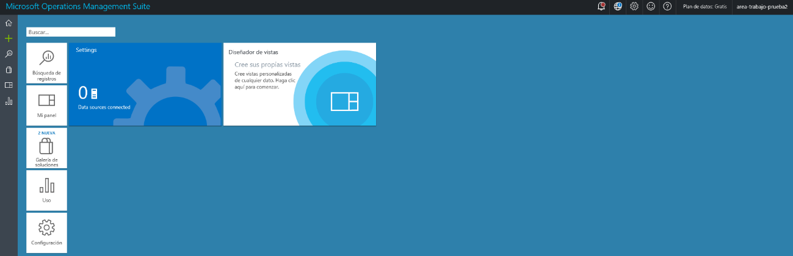

- Si hacemos clic en la galería de las soluciones veremos las cuatro características o categorías principales y las demás soluciones que tenemos disponibles. Estas soluciones se van ampliando ya que OMS avanza mucho. ​

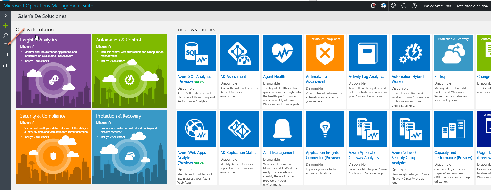

**Instalación del agente de OMS.**

Vamos a ver como se instala un agente en un servidor Windows:

- Desde la pantalla principal hacemos clic en el icono de "Home" y después clic en configuración.

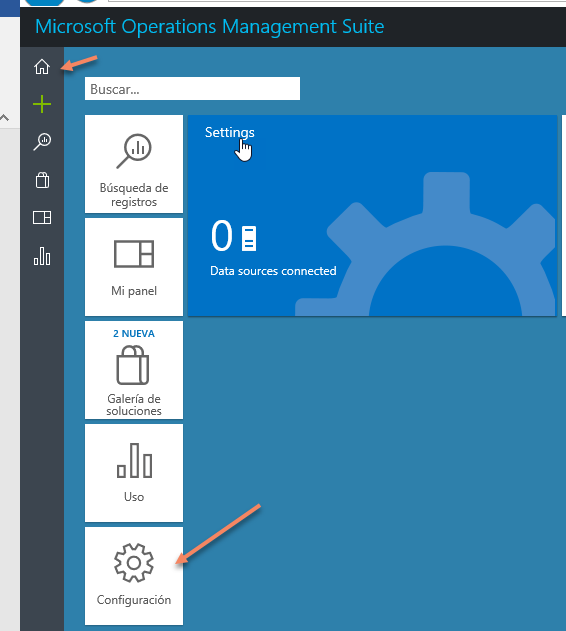

- Después hacemos clic en Connected Sources y vemos la siguiente ventana.

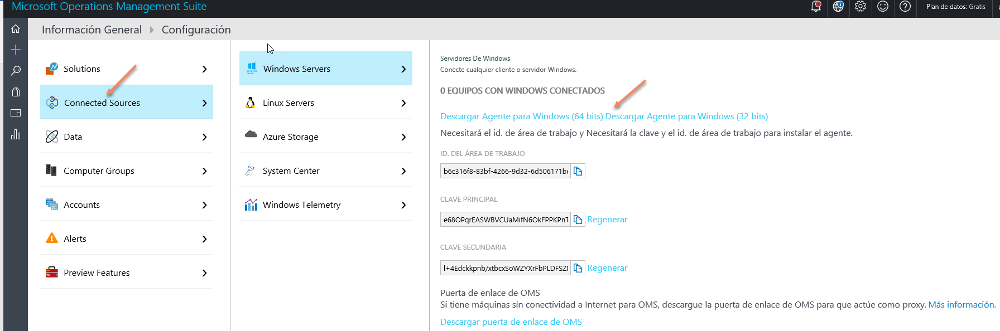

- Hacemos clic en Descargar agente para Windows, lo descargamos y lo ejecutamos.

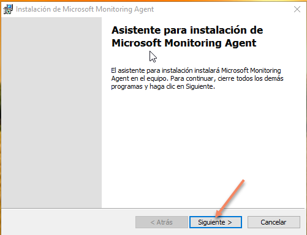

- Es muy sencillo seguimos las indicaciones de la imagen y en menos de 5 minutos tenemos instalado el agente de OMS.

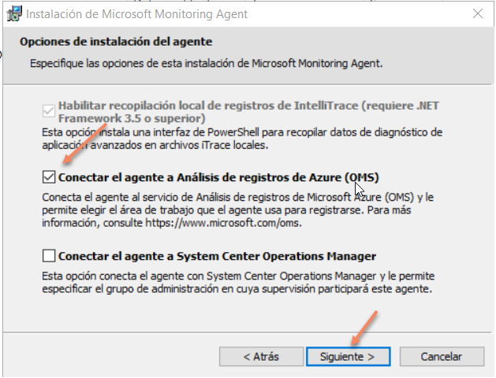

- En la siguiente ventana nos pide Id de área de trabajo y la clave de área. Esta información la sacamos desde la ventana donde hemos descargado el agente. Copiamos la información y la pegamos y hacemos clic en siguiente.

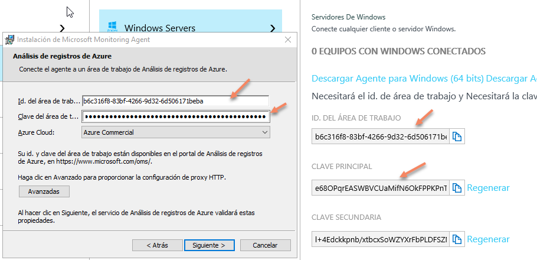

- En la siguiente ventana hacemos clic en instalar.

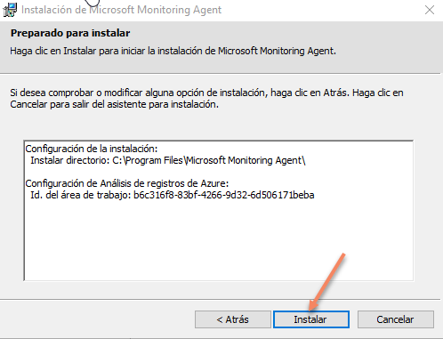

- Hacemos clic en finalizar y como se ha visto, la instalación es un proceso sencillo que lleva menos de 5 minutos. Para finalizar, esperaremos unos minutos y ya tendremos el servidor conectado a OMS

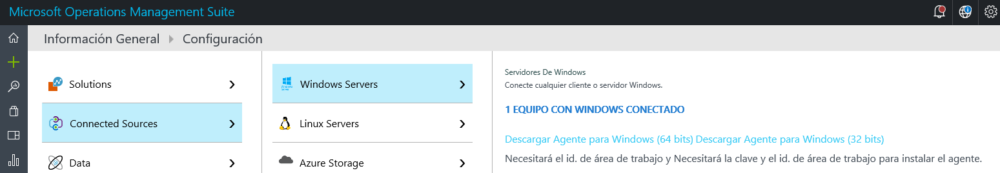

**Configuración de la extensión de SCOM a OMS**

Para configurar la extensión de SCOM a OMS:

- Abrimos la consola de SCOM vamos al nodo de administration hacemos clic en Operations management Suite hacemos clic en Register with Operations Management Suite.​

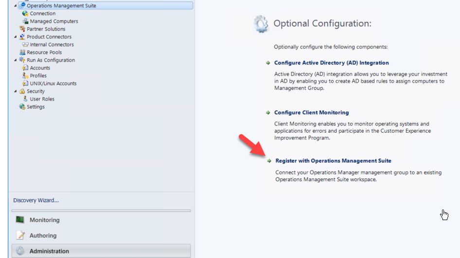

- Nos pedirá que seleccionemos el espacio de trabajo. Seleccionamos el espacio de trabajo creado en el punto anterior.

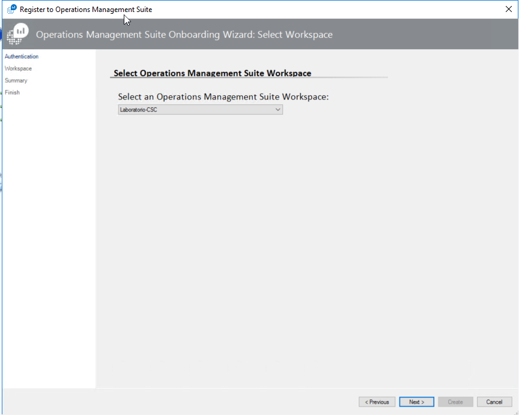

- En esta ventana nos pide la cuenta de Microsoft con la cual administramos OMS. La introducimos y hacemos clic en Sign in.

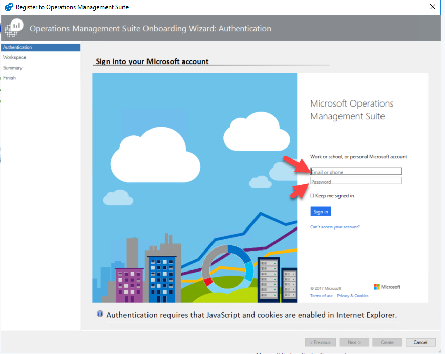

- En esta Ventana nos muestra la información de la cuenta que hemos utilizado y el espacio de trabajo que hemos utilizado para la conexión de SCOM con OMS. Hacemos clic en Close y ya tenemos conectado SCOM con OMS. ​

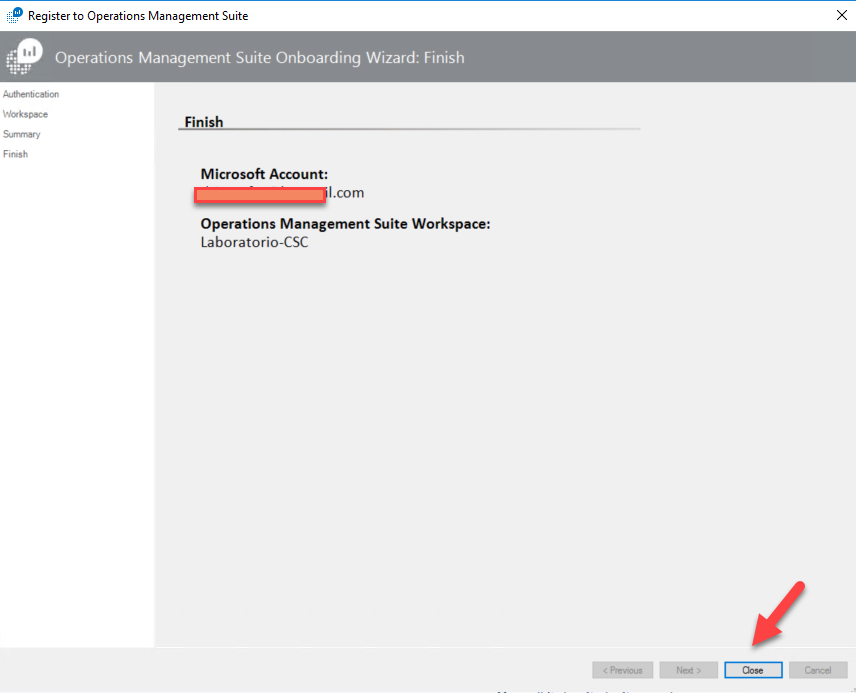

**Conclusiones**

En este artículo se ha detallado que es OMS y los elementos que lo componente, se ha realizado una introducción a la creación de espacios de trabajo para OMS, se ha realizado una instalación del agente de OMS y finalmente se ha extendido System Center Operation Manager a OMS.

**David Rivera**

Microsoft MVP  Cloud & Datacenter Management

@darifer66

