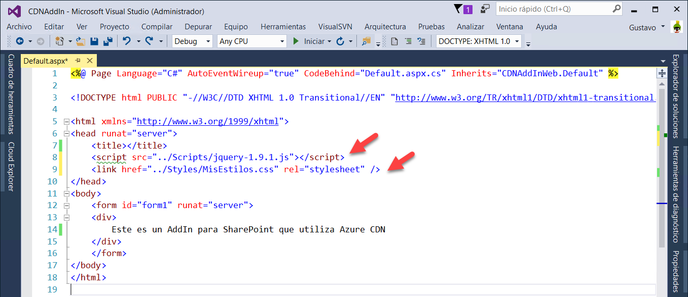
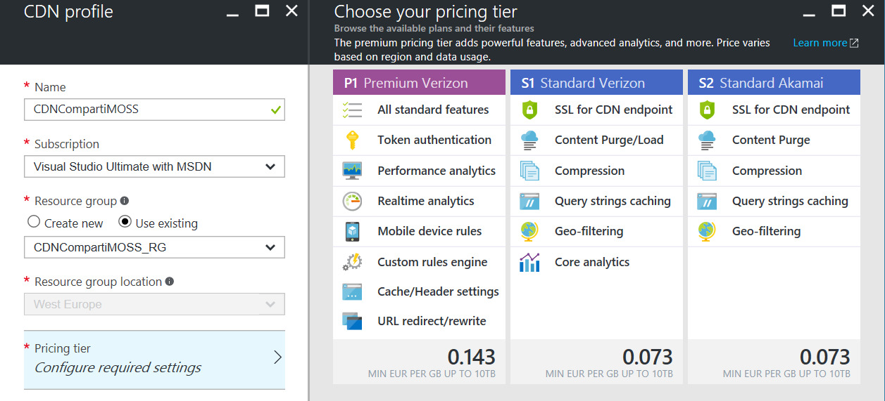
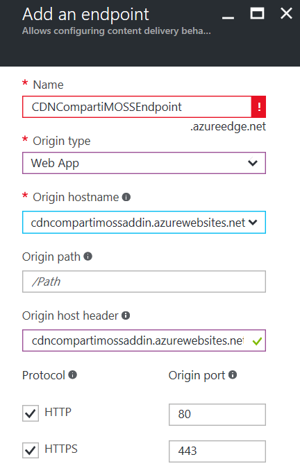
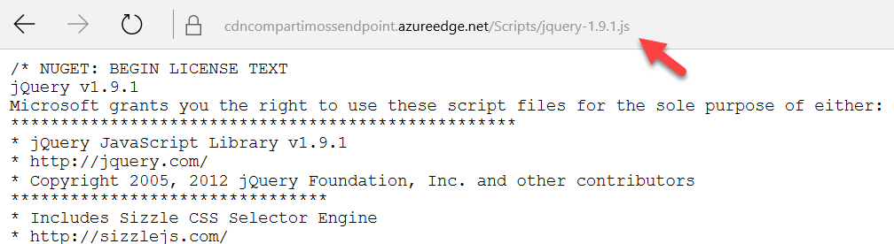
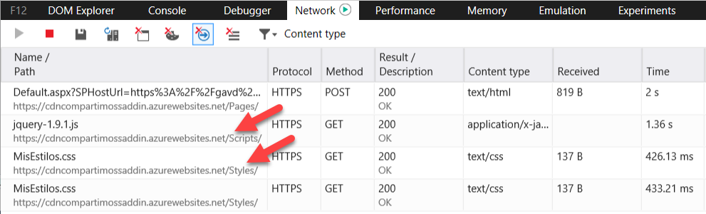
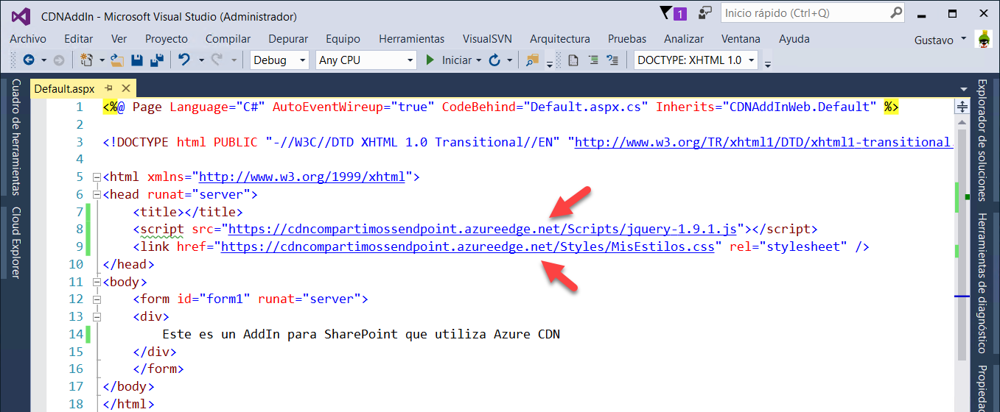
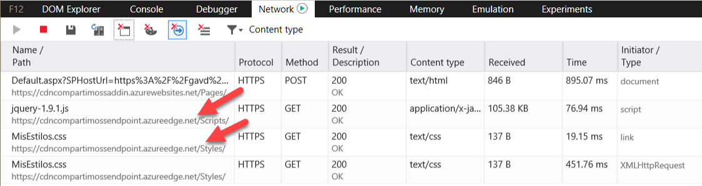

import ArticleHeader from '../../../components/article-header'

<ArticleHeader frontmatter={props.pageContext.frontmatter} />

**Que es y cómo funciona el Azure CDN**

Azure Content Delivery Network proporciona los servidores para cachear información que no cambia frecuentemente. En este momento Azure CDN tiene servidores en 44 ciudades alrededor del mundo, incluyendo dos en Colombia (Medellín y Barranquilla), Buenos Aires, Quito, Rio de Janeiro, Sao Paulo y Madrid (la lista completa se puede encontrar en el sitio de Microsoft [https://docs.microsoft.com/en-us/azure/cdn/cdn-pop-locations](https&#58;//docs.microsoft.com/en-us/azure/cdn/cdn-pop-locations)). Los servidores son de alto rendimiento y disponen de un ancho de banda sobredimensionado para poder soportar grandes cargas de trabajo.

CDN funciona de la misma manera que el cacheo local tradicionalmente utilizado por.NET Framework o por SharePoint internamente, es decir, mantiene en memoria archivos que se utilizan frecuentemente de tal forma que cuando un usuario requiere uno de ellos, lo puede acceder y enviar sin necesidad de utilizar IOs del disco duro o recuperarlos de las Bases de Datos. La ventaja de Azure CDN y sus servidores distribuidos globalmente es que la información se puede encontrar mucho más cerca del usuario final, disminuyendo el tiempo necesario para descargarla.

Azure CDN se utiliza también de la misma forma que el cacheo local tradicional: para mantener imágenes, hojas de estilo, documentos, archivos y/o scripts de cliente (JavaScript, por ejemplo). Adicionalmente, CDN ayuda a disminuir la carga de los sistemas, reduciendo la cantidad de información que se tiene que procesar (por ejemplo, en SharePoint, reduciendo el número de consultas a las Bases de Datos).

**Azure CDN y SharePoint**

Aunque SharePoint contiene nativamente diferentes mecanismos de cacheo, todos ocurren localmente en la granja misma, tanto para SharePoint Server On-Prem, como en SharePoint Online en Office 365. Esto ayuda a disminuir la carga de las granjas, pero no disminuye el tiempo de respuesta de cara a los usuarios si la distancia a la granja es grande (granja de SharePoint y cliente en diferentes continentes, por ejemplo). Azure CDN ayuda a que los archivos que no cambian frecuentemente sean servidos mucho más rápido.

El siguiente ejemplo muestra cómo crear un Add-In Provider Hosted en Office 365 de SharePoint que cachea las hojas de estilo y archivos de JavaScript, aunque la utilización con SharePoint Server On-Prem es exactamente la misma.

**Ejemplo de uso de Azure CDN con un AddIn de SharePoint Provider Hosted**

1.       Crear la Aplicación Web en Azure para el AddIn:
·       Lóguese en el centro de Administración de Azure (http://portal.azure.com). Si no dispone de una cuenta, es posible crear una de prueba desde el mismo sitio.
·       Cree un Grupo de Recursos en Azure (llamada "CDNCompartiMOSS\_RG" en el ejemplo) para contener tanto la Aplicación Web como el Perfil de CDN.
·       Cree una Web App en el Grupo de Recursos (llamada "CDNCompartiMOSSAddIn" en el ejemplo). En el sitio [http://www.gavd.net/servers/sharepointv5/spsv5\_item.aspx?top=art&itm=2008](http&#58;//www.gavd.net/servers/sharepointv5/spsv5_item.aspx?top=art&amp;itm=2008) se pueden encontrar instrucciones detalladas sobre cómo hacerlo.
2.       Cree el Add-In de SharePoint usando Visual Studio 2013 o 2015 (llamado "CDNAddIn" en el ejemplo). En el sitio [http://www.gavd.net/servers/sharepointv5/spsv5\_item.aspx?top=art&itm=2012](http&#58;//www.gavd.net/servers/sharepointv5/spsv5_item.aspx?top=art&amp;itm=2012) están las instrucciones sobre los pasos a seguir.

3.       Despliegue el Add-In en Azure. El sitio [http://www.gavd.net/servers/sharepointv5/spsv5\_item.aspx?top=art&itm=2015](http&#58;//www.gavd.net/servers/sharepointv5/spsv5_item.aspx?top=art&amp;itm=2015) indica cómo realizar la operación.

4.       Despliegue el Add-In en SharePoint Online. Las instrucciones sobre cómo hacerlo se pueden encontrar en el sitio [http://www.gavd.net/servers/sharepointv5/spsv5\_item.aspx?top=art&itm=2019](http&#58;//www.gavd.net/servers/sharepointv5/spsv5_item.aspx?top=art&amp;itm=2019). Desde este momento se dispone de un AddIn de SharePoint en Office 365 completamente funcional.

5.       Agregue un directorio "Styles" y una hoja de estilos en el proyecto Web del Add-In en Visual Studio. Agregue adicionalmente referencias en la página "Default.aspx" a uno de los scripts de JavaScript que ya existen y a la hoja de estilos acabada de crear. Publique de nuevo el Add-In en Azure siguiendo las mismas instrucciones dadas en el punto 4.

6.          Utilizando la administración de Azure, agregue un Perfil de CDN en el Grupo de Recursos (buscar por CDN en la ventana de "Add"). Asígnele un nombre ("CDNCompartiMOSS" en el ejemplo), seleccione la suscripción y el Grupo de Recursos (si no está seleccionado por defecto). Seleccione un nivel de precios. La creación puede durar hasta media hora. Un "Perfil" no es más que un contenedor para puntos de acceso (EndPoints) a CDN.

7.          Después de que el Perfil ha sido creado,  a  agréguele un "Endpoint" (use el botón de "+Endpoint" en el menú horizontal superior que aparece en la ventana de Azure cuando se selecciona el Perfil): defina el nombre ("CDNCompartiMOSSEndpoint" en el ejemplo), "Web App" como Tipo de Origen, seleccione como "Origen hostname" el nombre de la Web App creada anteriormente (cdncompartimoss.azurewebsites.com). No modifique el "Origin path" ni el "Origin host header" y utilice los protocolos HTTP y HTTPS.

8 .          Cuando termina la creación del Endpoint, la conexión entre la Aplicación Web y el cache de CDN queda realizada por medio de la opción "Origin hostname" configurada al momento de creación. Si se hace ejecutar el Add-In de SharePoint, todos los archivos que utiliza son copiados a todos los servidores globales de Azure CDN automáticamente (la replicación global puede tomar unos 15 minutos). Si se selecciona el Endpoint en la pantalla de administración de Azure, bajo la sección de "Overview", en "Endpoint hostname" se puede ver el URL del CDN para el Add-In ("https://CDNCompartiMOSSEndpoint.azureedge.net" en el ejemplo). Si utiliza el URL del directorio de los scripts junto con el URL del Endpoint en un navegador, puede comprobar que los archivos realmente han sido copiados, como muestra la imagen 4:

9.          Cuando se tracea de donde proceden los archivos al momento de ejecución del Add-In (con las herramientas de desarrollo de Edge, por ejemplo), se puede ver que todavía provienen de la granja de SharePoint, como muestra la Imagen 5: ​

Para hacer que SharePoint utilice el CDN es necesario  cambiar el URL de los archivos CSS y JS en default.aspx (en Visual Studio) y publicar la aplicación de nuevo. Utilice el URL base del Endpoint creado anteriormente:

10.          Después de publicar el Add-In, se puede comprobar que los archivos provienen del cache de CDN:

Los tiempos de carga dependen totalmente de la localización del cliente con respecto a los centros de datos de Azure y Office 365. En el ejemplo mostrado, tanto el cliente como los centros de datos se encuentran en localidades muy cercanas, por lo que no se aprecia la diferencia. Si el cliente y el centro de datos de Office se encuentran en continentes diferentes, Azure CDN utilizará un cache cercano al cliente y las diferencias serán radicales.

**Conclusión**

Azure CDN (Content Delivery Network) es una opción de cacheo global que se puede utilizar para reemplazar el cacheo nativo de SharePoint. El cacheo puede aligerar la descarga de archivos que cambian muy poco en el tiempo, tales como hojas de estilo y scripts de JavaScript.

El precio de utilización de Azure CDN es bastante bajo y su configuración y utilización son muy sencillos. Fuera de las posibilidades técnicas mostradas en el ejemplo del artículo, es posible también configurar otros parámetros, tales como el tiempo de cacheo y el cacheo por directorios específicos. Hay que tener siempre en cuenta que archivos en CDN son públicos y no es posible asegurarlos, por lo que los archivos cacheados no deben contener información sensitiva.

Una posibilidad muy interesante para explorar en el futuro, es la utilización de Azure CDN para contener las nuevas WebParts de Cliente de SharePoint basadas en el SharePoint Framework (SPFx), que está en el momento de publicación del articulo apenas en Release Candidate. Todas las WebParts de Cliente tienen que ser programadas en JavaScript, y una vez puestas en producción, los archivos que las componen no cambiarán rápidamente, por lo que forman un candidato ideal para Azure CDN.

**Gustavo Velez**
 MVP Office Servers and Services
 gustavo@gavd.net 
http://www.gavd.net

