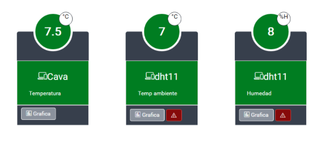

import ArticleHeader from '../../../components/article-header'

<ArticleHeader frontmatter={props.pageContext.frontmatter} />


El IoT (Internet de las cosas) está explotando y todo el mundo está hablando de ello. Las fuentes de Twitter están zumbando, y los mensajes de blog están inundados de información. Sin embargo, para muchos de nosotros simples mortales, parece algo de otro mundo.

En este post, voy a tratar de hacer que sea fácil para que usted pueda entender los conceptos básicos y la tecnología detrás de las escenas. También crearé una aplicación web de muestra totalmente funcional, donde podrá ver el resultado final y cómo se conectan todas las piezas.

Entonces, ¿Que es el IoT? Probablemente encontrará diferentes explicaciones, pero para mí, la mejor explicación es:

*El IoT se compone de cosas o dispositivos que están conectados a una red; Producen o reciben datos, y luego realizan acciones basadas en él.*

Tomemos un sensor de temperatura como un simple ejemplo. En este escenario, este sensor en particular envía datos a un sitio web en tiempo real. Está conectado a un refrigerador en una farmacia, que por ley necesita tener temperatura controlada. En lugar de emplear a una persona para ir a la nevera cada 30 minutos para tomar nota de la temperatura actual, anotarla manualmente en un pedazo de papel, y luego guardar la evidencia de que la temperatura se ha escrito por 24 horas, el sensor lo toma automáticamente.

El IOT permite nuevos escenarios empresariales, nuevos productos, nuevos servicios y -como el que voy a mostrar- hay cientos que ya están en producción. Y no es algo de otro mundo.

**¿Qué necesitará para completar esto?**

Lo primero que debes tener es la cosa, o dispositivo. En mi caso tengo una Raspberry PI 3. Se trata de una computadora de $ 39.99 dólares a la que podemos conectar dispositivos y luego crear aplicaciones que interactúan con esos dispositivos o sensores. Aquí también tengo un sensor BMP180, que se puede encontrar en Amazon por $ 9 o $ 10. Este sensor mide la temperatura en tiempo real. Más adelante aprenderá cómo mostrarlo en tiempo real en una aplicación web.

La Raspberry PI 3 viene por defecto con Raspbian instalado. Se trata de un sistema operativo basado en Linux y Debian, sin embargo, se puede instalar Windows IoT Core. Se trata de una versión de huella mínima del sistema operativo. Lo asombroso de este sistema operativo es que puedes crear aplicaciones con las herramientas que ya conoces y amas. Sí, Universal Windows Plataforma Apps se ejecutará en IoT Core, así como Windows 8 o Windows 10, con el mismo lenguaje de programación que ya conoces, C#.

Hay APIs por ahí para crear aplicaciones en JavaScript o en otros idiomas, pero por simplicidad sólo mostraré el código C#.

**Partes móviles de nuestra solución**

**La PI APP**

En nuestra solución, en Visual Studio, tengo un proyecto en Universal Windows App. Esta aplicación tiene sólo cuatro trabajos: se conectará al sensor, leerá la temperatura del sensor, lo mostrará en la pantalla y luego la enviará al concentrador de IoT.

La aplicación en este dispositivo nunca se conectará en tiempo real con una base de datos. Estos sensores pueden leer cientos de lecturas por segundo, por lo que dependiendo de cómo codifique o configure su aplicación, si la inserta directamente en una base de datos, la aplicación probablemente no escalará bien.

**IoT Hub**

El IoT Hub es un sistema de mensajería construido sobre Azure Event Hub. Es básicamente un sistema que es capaz de recibir millones de mensajes por segundo, que luego podemos procesar en un momento posterior. Por lo tanto, si tenemos 10.000 sensores de temperatura, el envío de temperatura cada segundo, podría recibir 10.000 mensajes por segundo, y eso no es mucho para este servicio Azure. He copiado y pegado las capacidades de este artículo de Microsoft Azure. Azure IoT Hub:

·       Proporciona múltiples opciones de comunicación de dispositivo a la nube y de la nube a dispositivo, incluyendo mensajería unidireccional, transferencia de archivos y métodos de solicitud y respuesta.
·       Proporciona un almacenamiento que se puede consultar para los metadatos del dispositivo y la información de estado sincronizada. 
·       Permite comunicaciones seguras y control de acceso utilizando claves de seguridad por dispositivo o certificados X.509. 
·       Proporciona un amplio monitoreo de la conectividad de dispositivos y eventos de administración de identidad de dispositivos. 
·       Incluye bibliotecas de dispositivos para los idiomas y plataformas más populares.

**Azure Web Job**

Bien, ahora tenemos nuestra aplicación IoT Core enviando mensajes al concentrador de IoT en tiempo real, ¿qué hacemos a continuación? Debemos procesarlos sin conexión a través de un proceso diferente -en este caso, un trabajo de Web de Azure.

Un trabajo de Azure Web es sólo un proceso de fondo que puede escribirse en C#, Powershell y en diferentes idiomas. Estos viven junto a una aplicación web y puede desarrollar cualquier lógica de negocio que desee, con el fin de procesar las cosas en el fondo.

Mi trabajo particular de Web de Azure se conecta al IoT Hub y toma los últimos mensajes en el IoT, luego inserta un nuevo registro en SQL Server (también en Azure) y marca los mensajes o el lote de mensajes procesados.

**SQL Server**

Como con casi cualquier otra aplicación, necesitamos una manera de almacenar nuestra información, porque el dispositivo pertenece a una empresa y a un usuario. Aunque hemos utilizado SQL Server para una base de datos relacional, esto no es obligatorio. La capa puede ser cambiada por alguna base de datos relacional si lo desea, pero la capa de la aplicación web cambiará en este caso, por supuesto.

**Web App**

La aplicación web es sólo una aplicación ASP.NET MVC, la que ya conoces y amas. Sin embargo, enchufamos SignalR. Como muchos de ustedes ya saben, SignalR es un marco de comunicación en tiempo real que le permitirá presionar los cambios que ocurren en el lado del servidor a la parte delantera sin respaldo de correos, o los tiempos de espera establecidos por JavaScript.

SignalR se basa en diferentes tecnologías construidas en los navegadores modernos para permitir esta comunicación en tiempo real. En nuestro caso, tenemos un panel que muestra la temperatura en tiempo real, el retraso es sólo lo que se necesita entre la aplicación PI para enviar el mensaje, el trabajo web para procesar el mensaje e inserta en una base de datos y luego lee el dato de la tabla correspondiente.

Cuando lo probamos, el retraso no fue más de 1-2 segundos, lo cual está bien para nuestro escenario. Un refrigerador no cambiará la temperatura drásticamente en ese período de tiempo.

**Creación del IoT Hub**

Para que el código siguiente funcione, necesitamos crear un IoT Hub en el Portal Azure. No hay ciencia en este paso. Sólo tienes que hacer clic en el signo más, encontrar IoT Hub... y eso es todo.

Copia y pega la URL (debe ser algo como esto: myiothub.azuredevices.net) - lo necesitará más tarde.

Encontrará instrucciones sobre esto en la primera parte de este post:

[https://azure.microsoft.com/en-us/documentation/articles/iot-hub-csharp-csharp-getstarted/](https&#58;//azure.microsoft.com/en-us/documentation/articles/iot-hub-csharp-csharp-getstarted/)

**Raspberry PI App (Plataforma Universal Windows)**

Voy a asumir que usted ya ha instalado la última versión de Windows IoT Core en su Raspberry PI. Si no es aquí un enlace que explica cómo hacerlo:

[https://developer.microsoft.com/enus/windows/iot/Docs/GetStarted/rpi3/sdcard/insider/GetStartedStep1.htm](https&#58;//developer.microsoft.com/en-us/windows/iot/Docs/GetStarted/rpi3/sdcard/insider/GetStartedStep1.htm)

Una vez instalado Windows IoT Core, puede ejecutar Visual Studio y crear una aplicación UWP con C#, luego revise el código. Hay varias piezas de código relevante. Al final de la publicación encontrarás un enlace a mi repositorio de GitHub donde se publica el código completo, pero solo en este post solo muestro las piezas relevantes.

Cuando se inicia la aplicación, hay que inicializar el sensor. El sensor es BMP180 y lee la temperatura. Debe crear un temporizador con este código. El temporizador tiene un intervalo asignado, y una devolución de llamada, lo que significa que un determinado método se ejecutará cada número de milisegundos, de acuerdo con lo que el usuario ha configurado.

Puede encontrar la clase de sensor Bmp180 en este proyecto:

[https://www.hackster.io/acegrc/bmp180-windows-iot-d14b76](https&#58;//www.hackster.io/acegrc/bmp180-windows-iot-d14b76)

```
private async void InitializeSensors()
```

```
        {
```

```
            string calibrationData;
```

```
            try
```

```
            {
```

```
                _bmp180 = new Bmp180Sensor();
```

```
                await _bmp180.InitializeAsync();
```

```
                calibrationData = _bmp180.CalibrationData.ToString();   //Ret      orna una cadena que representa al objeto actual.
```

```
                if (_periodicTimer == null)
```

```
                {
```

```
                    _periodicTimer = new Timer(this.TimerCallback, null, 0, readingInterval);
```

```
                }
```

```
            }
```

```
            catch (Exception ex)
```

```
            {
```

```
                calibrationData = "Error de dispositivo! " + ex.Message;
```

```
            }
```

```
        }
```

Una vez inicializado el dispositivo, cree el código para la devolución de llamada del temporizador. Este código sólo lee los datos del sensor y, a continuación, crea un mensaje JSON que se enviará al IoT Hub.

```
public async void TimerCallback(object state)
```

```
        {
```

```
            string temperatureText;
```

```
            try
```

```
            {
```

```
                var sensorData = await _bmp180.GetSensorDataAsync(Bmp180AccuracyMode.UltraHighResolution);
```

```
                temperatureText = sensorData.Temperature.ToString("");
```

```
                temperatureText += "°C";
```

```
 
```

```
                var temperatureDataPoint = new
```

```
                {
```

```
                    deviceKey = deviceKey,
```

```
                    deviceName = deviceName,
```

```
                    temperatura = sensorData.Temperature,
```

```
                    fecha = DateTime.Now
```

```
                };
```

```
                //// actualizaciones de la interfaz de usuario... deben ser invocados en el subproceso de interfaz de usuario
```

```
                var task = this.Dispatcher.RunAsync(CoreDispatcherPriority.Normal, () =>
```

```
                {
```

```
                    temperatura.Text = temperatureText;
```

```
                });
```

```
                var messageString = JsonConvert.SerializeObject(temperatureDataPoint);
```

```
                var message = new Microsoft.Azure.Devices.Client.Message(Encoding.ASCII.GetBytes(messageString));
```

```
                message.Properties["Ambiente"] = ambiente;
```

```
                autoResetEvent.WaitOne();
```

```
                await deviceClient.SendEventAsync(message);
```

```
                autoResetEvent.Set();
```

```
            }
```

```
            catch (Exception ex)
```

```
            {
```

```
                var a = ex.StackTrace;
```

```
                temperatureText = "Sensor Error: " + ex.Message;
```

```
            }
```

```
   
```

```
        }
```

El cliente del dispositivo tiene que ser inicializado con la cadena de conexión del IoT Hub  y la clave del dispositivo, como esto.

```
deviceClient = DeviceClient.Create(iotHubUri, new DeviceAuthenticationWithRegistrySymmetricKey(deviceName, deviceKey));
```

**Azure Web Job**

Después de que nuestros sensores estén leyendo datos y enviando mensajes al IoT Hub, necesitamos procesar esos mensajes e insertarlos en la base de datos. Nuestro trabajo web es solo una aplicación de consola C# que lee continuamente desde el Hub e inserta en la base de datos.

Nuestro trabajo web de Azure utiliza EventProcessorHost. Esta es una clase proporcionada por el Azure SDK que permite controlar la recepción de los mensajes y también la creación de punto de control.

¿Qué es un puesto de control? Es sólo una forma de controlar o tomar una instantánea de cuándo se procesan los mensajes, de modo que cuando la próxima vez que se ejecute el trabajo, no vuelva a leer los mismos mensajes.

Para que funcione, necesitamos una cuenta de almacenamiento de Azure. Luego en el archivo de configuración para la aplicación de consola, tenemos que introducir la cadena de conexión del IoT Hub. Tenga en cuenta que debe extraerlo de la pestaña Mensajería en el portal azure: es lo que ellos llaman el punto final compatible con Event Hub.

Mi app.config se parece a esto:

```
<appSettings>
```

```
    <add key="EventHubConnectionString" 
```

```
value="Endpoint=sb:/xuzthub-ns-tempsense-69811-eb157a3ed0.servicebus.windows.net/;SharedA
```

```
ccessKeyName=iothubowner;SharedAccessKey=mykey" />
```

```
     <add key="EventHubName" value="myeventhubname" />
```

```
     <add key="StorageAccountName" value="mystorageaccountname" />
```

```
     <add key="StorageAccountKey" value="mystorageaccountkey/>
```

```
     <add key="TamanoLoteMensajes" value="100" />
```

```
   </appSettings>
```

```
   <connectionStrings>
```

```
     <add name="TempsenseConnection"
```

```
connectionString="Server=192.168.100.3\SQL2014;Initial Catalog=myDB;Persist Security 
```

```
Info=False;User ID=myusername;Password=mypassword;" providerName="System.Data.SqlClient" 
```

```
/>
```

En Azure, los trabajos en la web tienen disparadores. Estos disparadores significan que ciertas funciones se ejecutan cuando sucede algo, como cuando un archivo se deja caer en el almacenamiento Azure o se recibe un mensaje en una cola. En mi caso, he utilizado un cronjob disparador, lo que significa que la función se ejecute cada minuto o, sin embargo, a menudo.

```
public static void CronJob([TimerTrigger("* */1 * * * *")] TimerInfo timer)
```

```
        {
```

```
            try
```

```
            {
```

```
                Console.WriteLine(String.Format("Inicio lectura mensajes : {0}", DateTime.Now.ToString()));
```

```
                string storageConnectionString = string.Format("DefaultEndpointsProtocol=https;AccountName={0};AccountKey={1}",
```

```
                                       Configuracion.StorageAccountName, Configuracion.
```

```
                                       StorageAccountKey);
```

```
                string _guid = Guid.NewGuid().ToString();
```

```
                string eventProcessorHostName = _guid;
```

```
                EventProcessorHost eventProcessorHost = new EventProcessorHost(
```

```
                                                                eventProcessorHostName,
```

```
                                                                Configuracion.EventHubName,
```

```
                                                                EventHubConsumerGroup.DefaultGroupName,
```

```
                                                                Configuracion.EventHubConnectionString,
```

```
                                                                storageConnectionString);
```

```
                Console.WriteLine("Registering EventProcessor...");
```

```
                var options = new EventProcessorOptions();
```

```
                options.ExceptionReceived += (sender, e) => { Console.WriteLine(e.Exception); };
```

```
                eventProcessorHost.RegisterEventProcessorAsync(options).Wait();
```

```
eventProcessorHost.UnregisterEventProcessorAsync().Wait();
```

```
                Console.WriteLine(String.Format("Fin lectura mensajes : {0}", DateTime.Now.ToString()));
```

```
            }
```

```
            catch (Exception ex)
```

```
            {
```

```
                throw ex;
```

```
            }
```

```
        }
```

La clase de procesador de eventos, que es realmente responsable de abrir y cerrar conexiones, también es responsable de recibir los mensajes del IoT Hub.

```
namespace ActiveSense.Tempsense.Receptor
```

```
{
```

```
    public class SimpleEventProcessor : IEventProcessor
```

```
    {
```

```
        Stopwatch checkpointStopWatch;
```

```
        int messageCount = 0;
```

```
        async Task IEventProcessor.CloseAsync(PartitionContext context, CloseReason reason)
```

```
        {
```

```
            Console.WriteLine("Processor Shutting Down. Partition '{0}', Reason:'{1}'.", context.Lease.PartitionId, reason);
```

```
            if (reason == CloseReason.Shutdown)
```

```
            {
```

```
                await context.CheckpointAsync();
```

```
            }
```

```
        }
```

```
        Task IEventProcessor.OpenAsync(PartitionContext context)
```

```
        {
```

```
            Console.WriteLine("SimpleEventProcessor initialized. Partition:'{0}',offset:'{1}'", context.Lease.PartitionId, context.Lease.Offset);
```

```
            this.checkpointStopWatch = new Stopwatch();
```

```
            this.checkpointStopWatch.Start();
```

```
            return Task.FromResult(null);
```

```
        }
```

```
        public Task ProcessEventsAsync(PartitionContext context, IEnumerable messages)
```

```
        {
```

```
            List medidas = new List();
```

```
            foreach (EventData eventData in messages)
```

```
            {
```

```
                string strConn = string.Format(ConfigurationManager.ConnectionStrings["myConnection"].ConnectionString, eventData.Properties["Ambiente"]);
```

```
                messageCount++;
```

```
               string data = Encoding.UTF8.GetString(eventData.GetBytes());
```

```
                JObject o = JObject.Parse(data);
```

```
                var deviceKey = int.Parse(o["deviceKey"].ToString());
```

```
                using (ActiveSenseContext db = new ActiveSenseContext(strConn))
```

```
                {
```

```
                    try
```

```
                    {
```

```
                        var disp = db.Dispositivos
```

```
                            .Where(p => p.DispositivoID == deviceKey);
```

```
                        if (disp.ToList().Count > 0)
```

```
                        {
```

```
                            ActiveSense.mynm.model.Modelo.Medida medida = new ActiveSense.mynm.model.Modelo.Medida()
```

```
                            {
```

```
                                DispositivoID = disp.FirstOrDefault().DispositivoID,
```

```
                                Valor = decimal.Parse(o["valor"].ToString()),
```

```
                                FechaHora = Convert.ToDateTime(o["fecha"].ToString()),
```

```
                            };
```

```
                            Console.WriteLine(string.Format("Message received. Partition:{0}, Data:{1}{2}", context.Lease.PartitionId, data, eventData.EnqueuedTimeUtc));
```

```
                            db.Medidas.Add(medida);
```

```
                            db.SaveChanges();
```

```
                        }
```

```
                        else
```

```
                        {
```

```
                            Console.WriteLine(string.Format("Device Key not found in database:{0}, Message:{1}", o["deviceKey"].ToString(), o));
```

```
                        }
```

```
                    }
```

```
                    catch (Exception ex)
```

```
                    {
```

```
                        Console.WriteLine(string.Format("Mensaje tuvo error:{0},{1}", ex.Message, data));
```

```
                    }
```

```
                }
```

```
            }
```

```
            //if (messageCount > Configuracion.TamanoLoteMensajes)
```

```
            context.CheckpointAsync();
```

```
            return Task.FromResult(null);
```

```
        }
```

```
    }
```

```
}
```

Bueno, ahora tiene nuestros datos en la base de datos, nuestro sensor está enviando mensajes al IoT Hub, y nuestro webjob de Azure los está leyendo en tiempo real e insertándolos fila por fila en nuestra tabla de medidas.

**Aplicación web**

La aplicación web es una simple aplicación ASP.NET MVC que muestra datos en tiempo real. La parte agradable de toda la demostración aquí es la lectura en tiempo real, para la cual utilizamos SignalR.

SignalR es un framework que nos proporciona las utilidades que necesitamos para actualizar nuestra página en tiempo real cuando algo sucede en el servidor. En nuestro caso tenemos un temporizador que, basado en un intervalo predefinido, va a la base de datos, toma la última temperatura del dispositivo, y luego lo envía a los clientes (los navegadores), y luego con JavaScript refrescará al usuario Interfaz en tiempo real. La mejor manera de demostrar que esto funciona es sólo para poner un dedo en el sensor, y luego verá la temperatura disparar.

Para fines de demostración todas las temperaturas son en grados Celsius.

El código que implementa este panel está usando SignalR. Para esto tenemos que crear un Hub que está abajo:

```
public class TemperatureHub : Hub
```

```
    {
```

```
        // Create the instance of ChartDataUpdate    
```

```
        private readonly LastTemperatureUpdate _instance;
```

```
        public TemperatureHub() : this(LastTemperatureUpdate.Instance) { }
```

```
        public TemperatureHub(LastTemperatureUpdate instance)
```

```
        {
```

```
            _instance = instance;
```

```
        }
```

```
        public void InitTempData(string data = "" )
```

```
        {
```

```
            _instance.idUsuario = data;
```

```
            _instance.GetTempData();
```

```
        }
```

```
    }
```

```
public void GetTempData()
```

```
    {
```

```
        _timer = new Timer(TempTimerCallback, null, _updateInterval, _updateInterval);
```

```
    }
```

```
    private void TempTimerCallback(object state)
```

```
    {
```

```
        if (_sendingLastTemperature)
```

```
        {
```

```
            return;
```

```
        }
```

```
        lock (_tempUpdateLock)
```

```
        {
```

```
            if (!_sendingLastTemperature)
```

```
            {
```

```
                _sendingLastTemperature = true;
```

```
                SendLastTemperature();
```

```
                _sendingLastTemperature = false;
```

```
            }
```

```
        }
```

```
    }
```

```
  private void SendLastTemperature()
```

```
    {
```

```
        tempUpdate.TakeLastTemp(this.idUsuario);
```

```
        GetAllClients().All.UpdateTemperature(tempUpdate);
```

```
    }
```

Por lo tanto, tenemos un ChartHub - que es un componente SignalR que centraliza la comunicación con los clientes (navegadores) - y en el inicializador del concentrador definimos un temporizador con un método de devolución de llamada Interval. Cuando se ejecuta ese método, lee la última temperatura de la base de datos. Luego con SignalR API envía la nueva información (la última temperatura de cada sensor) a todos los clientes (los navegadores abiertos en la vista del tablero).

El código de abajo es la vista del tablero de mandos, que en realidad es responsable de que el mensaje sea enviado por el servidor y luego tomar esos datos y actualizar la interfaz de usuario. Por motivos de simplicidad no pegaré todo el JS y HTML, solo la pieza que recibe los datos. El resto del código está en el repositorio de GITHUB.

```
<script >
```

```
 
```

```
         $().ready(function () {
```

```
             $(function () { 
```

```
                 $("#ContenedorPreload").show();
```

```
                 $("#content").hide();
```

```
                 //Create the Hub
```

```
                 var temperatureHub = $.connection.temperatureHub;
```

```
                 //Call InitChartData
```

```
                 $.connection.hub.start().done(function () {
```

```
                     temperatureHub.server.initTempData($('#usery').val());
```

```
                 });
```

```
                 temperatureHub.client.updateTemperature = function (tempUpdate) {
```

```
                     UpdateTemperature(tempUpdate);
```

```
                 };
```

```
             });
```

```
         });
```

```
</script >
```

Y el resultado final es un tablero que muestra la temperatura en tiempo real, como muestra esta captura de pantalla:



El código completo de este proyecto está en este repo de GitHub.

[https://github.com/levalencia/IoTRealTimeSensorWebApp](https&#58;//github.com/levalencia/IoTRealTimeSensorWebApp)

<u></u>

**Agradecimientos**

Mis agradecimientos a Gina Ospina que me ha ayudado con la traducción de este artículo desde el original publicado en el blog de MVP Award.

**Luis Esteban Valencia**

Office Servers & Services MVP

@levalencia

