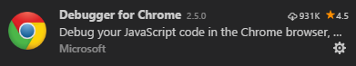
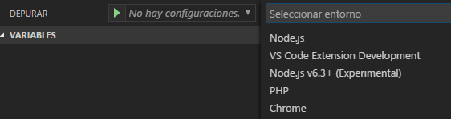
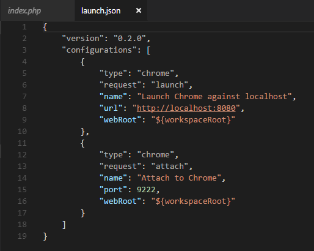
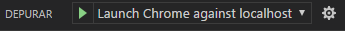

Para poder depurar nuestro código y visualizarlo en un navegador debemos tener instalada la extensión Debugger for Chrome mostrada en la Imagen 1.

Una vez que tenemos listo nuestro código y queremos depurarlo, damos clic en el icono de depuración y vemos como en la parte superior nos marca como No hay configuraciones y al dar clic en el icono de play, nos despliega opciones de entorno (Imagen 2).

Seleccionamos Chrome en este caso y nos abre un archivo llamado launch.json en el cual podemos ver la configuración que trae por default Visual Studio Code.

Wamp Server por default nos genera una carpeta en la ruta C:\wamp64 en la cual debemos crear una carpeta para cada proyecto.

Una vez que tengamos la carpeta creada y dentro de ella, el archivo que queremos depurar nos vamos al archivo launch.json y en la línea 8 cambiamos: "url": "http://localhost:8080", por "url": "http://localhost:8080/CARPETA\_PROYECTO, guardamos y vemos que nos cambia en la sección depurar de No hay configuraciones a Launch Chrome against localhost como se muestra en la Ilustración 3. Da clic nuevamente en el icono de play y se abrirá Chrome automáticamente

**Maria Abrego**

MVP Windows Platform

Maleny1292@gmail.com

@maleny\_abrego ​

