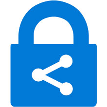

En este artículo, trataremos de hacer una introducción a la suite de movilidad empresarial de Microsoft, Enterprise Mobility + Security. Durante las siguientes líneas, veremos de que es capaz EM+S y porque, a día de hoy se está convirtiendo en una necesidad en cuanto nuestra infraestructura empieza a migrarse a la nube.

**¿Qué es Enterprise Mobility + Security?**

A groso modo, podemos decir que estamos hablando de la solución que propone Microsoft para suplir las carencias y falta de control en la seguridad con la que contamos hoy en día en las organizaciones que han decidido dar el paso y migrar completa o parcialmente su infraestructura a la nube.

Con el nuevo paradigma que implica tener parte de nuestros servicios en la nube, los administradores de las empresas se encontraban con varios problemas:

·       ¿Dónde están mis datos?
·       ¿Desde dónde pueden acceder a los datos de la compañía mis usuarios?
·       ¿Cómo puedo evitar la fuga de información?

Como podéis imaginar, en esta situación, las medidas que veníamos utilizando hasta ahora se han quedado completamente obsoletas, por lo que, es necesario cambiar el enfoque que estábamos dando a la hora de asegurar los datos y servicios de las compañías. A modo de resumen, con la llegada del cloud, los firewalls perimetrales, los bloqueos de acceso, etc, pierden toda su utilidad y debemos enfrentarnos a la movilidad empresarial, es decir, nuestros datos o nuestros servicios, pueden ser accesibles desde cualquier parte del globo, y, aquí es donde entra Enterprise Mobility +Security.

EM+S, nos permite tener el control sobre nuestros servicios, datos, sistemas, etc. que se encuentren en el cloud, de forma que podamos otorgar toda la movilidad posible a nuestros usuarios sin tener que sacrificar en seguridad.

Al ser un producto que engloba diversas tecnologías, está dividido en 4 grandes pilares:

·       **Azure AD Premium**
·       **Intune**
·       **Azure Rights Management**
·       **Microsoft Advanced Threat Analytics**

En un mundo basado en el cloud, nuestros usuarios quieren trabajar desde cualquier lugar o dispositivo, Microsoft EM+S nos proporciona esa capa de seguridad y control que nos permite darles esa libertad.

**Azure AD Premium**

Este es el pilar sobre el cual se sustenta toda la suite. Se trata de la capa que realiza la gestión de identidades y, es el nexo de unión entre el resto de servicios. Podríamos decir que se trata de un directorio activo en la nube, pero, solamente basado en identidades. Gracias a este servicio, cualquier usuario puede hacer login en casi cualquier servicio, sin importar el modelo de dispositivo, la ubicación o la identidad del usuario. Veamos que nos ofrece este producto entrando un poquito más en profundidad.

*Single-Sign-On*

Uno de los grandes puntos a destacar, es que, mediante Azure AD Premium, habilita la posibilidad de single-sign-on a cualquier servicio cloud u OnPremises. Con una única identidad, puedes acceder a prácticamente todo.

*Acceso Condicional*

Se trata en el bloqueo del acceso a los servicios, en base a diferentes condiciones, como, por ejemplo, si el usuario se encuentra iniciando sesión desde una ubicación de riesgo.

*Autenticación Multi-Factor*

Añade una segunda capa de de seguridad a la hora de realizar el login, solicitando una segunda verificación, mediante, una llamada telefónica, un SMS o incluso un token.

**Microsoft Intune**

Microsoft Intune, se encarga de proteger los datos de la compañía en los dispositivos móviles de los usuarios. Se trata de un gestor de dispositivos móviles, el cual, vincula el dispositivo móvil a una identidad de Azure AD y establece unas políticas de seguridad, como, por ejemplo, que el dispositivo tenga una contraseña de desbloqueo.

Mediante este servicio, los usuarios pueden incluso acceder a los servicios de la empresa de una forma segura (incluso con su dispositivo personal), siempre y cuando estén enrolados con Microsoft Intune.

Nos permite limitar el acceso, en base a la aplicación utilizada (si es una app administrada o no), si se cumplen las políticas de cumplimiento normativo, si el SO se encuentra actualizado, etc.

**Azure Information Protection**

Este es el servicio, con el cual podemos identificar de mejor manera el nuevo objetivo a la hora de proteger la información. Azure Information Protection, a diferencia de otros productos, encripta el fichero directamente, permitiendo el acceso solamente a los destinatarios deseados.

Además de esto, es una herramienta de clasificación de documentos, los cuales se protegen solos, en el caso de que, se detecte que contenga información confidencial, que contenga datos que no deberían ser enviados, etc.

Además, al ser el propio fichero el que se encuentra encriptado, incluso si un usuario despedido, tenía la información en un USB, este no podrá acceder a la información. También podemos saber, quien está consumiendo esta información, desde donde e incluso que usuarios sin permisos están intentando acceder.

Estamos, bajo mi punto de vista, ante el producto que más capacidad tiene a la hora de otorgar ese plus de movilidad al usuario y a la hora de asegurar mas los datos de la compañía.

**Microsoft Advanced Threath Analytics**

Digamos, que podemos monitorizar las actividades de los usuarios gracias a este servicio. Pero, uno de los factores más a tener en cuenta es que, no solo monitoriza las actividades, sino que, también estudia el comportamiento de los usuarios y hace saltar las alarmas cuando un usuario intenta hacer actividades anómalas.

Para realizar estos análisis, se basa en los siguientes 3 puntos:

·       Análisis de Big-data para los comportamientos anómalos y las actividades sospechosas.
·       Detección de ataques maliciosos.
·       Alertas para riesgos conocidos.

Es un producto basado en *Machine Learning,*por lo que, siempre está aprendiendo y mejorando los alertas que nos va a ir indicando.

En siguientes entregas, entraremos más en la parte técnica y veremos su puesta en marcha, funcionamiento y diversos casos de ejemplo.

**Victor San Nicolás**

Cloud Solutions Specialist

 
 
import LayoutNumber from '../../../components/layout-article'
export default LayoutNumber
