En nuestros días el término de IoT (internet de las cosas) está teniendo mayor relevancia de lo esperado y se está convirtiendo en parte fundamental para el desarrollo de futuras tecnologías que puedan aportar o dar valor agregado a las cosas que nos hacen fácil la vida. IoT nos ayudará a avanzar en la capacidad de recopilar, analizar y distribuir datos que se pueden a futuro convertir en información, conocimiento y porque no en sabiduría. Al día de hoy, ya se están llevando a cabo proyectos relacionados con el IoT que prometen entre otras cosas mejorar la distribución de los recursos del mundo y ayudarnos a ser más productivos.

Uno de los usos de sensores se lleva a cabo a través de Raspberry Pi, que es una placa computadora (SBC) de bajo costo; se podría decir que es un computador de tamaño reducido, del orden de una tarjeta de crédito. Este proyecto fue ideado en 2006 pero no fue lanzado al mercado hasta febrero de 2012. Ha sido desarrollado por un grupo de la Universidad de Cambridge y su misión era fomentar la enseñanza a los niños. De hecho, en enero de este año Google donó más de 15.000 Raspberry Pi para colegios en Reino Unido. La Raspberry Pi, es una excelente herramienta para aprender electrónica y programación. Los primeros diseños de Raspberry Pi se basaban en el microcontrolador Atmel ATmega644. Sus esquemas y el diseño del circuito impreso están disponibles para su descarga pública.

Debido a su funcionamiento y respuesta que ha obtenido por parte del público, la organización Raspberry Pi ha decidido crear un kit oficial que contendrá todo lo necesario para que cualquier usuario pueda trabajar con Raspberry Pi desde el primer momento.

Uno de los pilares más importantes y en que la Raspberry Pi está siendo parte fundamental es en el desarrollo y diseños de IoT o para objetos que usen IoT. IoT es el concepto que está moviendo la evolución de la tecnología en el mundo, ahora ya no es tan imposible pensar que con tan solo un celular se puedan manipular las puertas, las ventanas, y las luces del hogar y que con solo un dispositivo como una Raspberry que es de fácil manejo y acceso, se vuelve más atractivo para el consumidor.

La aplicación de la IoT se encuentra en varios sectores, la construcción, la agricultura, la salud, el transporte entre otros, entonces ¿por qué IoT y node.js? Dispositivos como sensores tienen tendencia a generar gran volumen de datos y así generar un gran número de solicitudes, node.js suministra estas peticiones a través de flujos. Si de adquirir los datos en tiempo real se trata node.js es conocido por su velocidad, eficiencia y escalabilidad como el participante clave para la aplicación de datos en tiempo real. Node.js viene con poder de JavaScript que es bastante sencillo de aprender y entender. Básicamente node.js es oportuno cuando necesitas realizar muchas cosas al mismo tiempo como operaciones I/O  a la vez (acceso a base de datos, ficheros entre otros). Permite utilizar JavaScript tanto en el cliente como en el servidor.

A continuación, indicaremos el funcionamiento de un proyecto con sensores de temperatura y humedad relativa donde capturamos sus datos en tiempo real, los enviamos al IoT hub de Azure y por medio de un servicio de Windows guardamos en base de datos estas tomas. Utilizamos una Raspberry Pi 3. La referencia de los sensores utilizados es:

·         Bmp180.

·         Dht22.

**Archivos y Módulos necesarios**

·         Archivos en Visual Studio Code, JavaScript del lado del servidor:

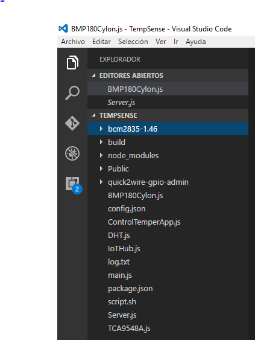

·         Módulos instalados:

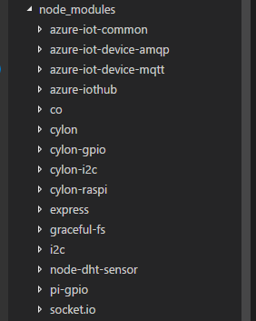

Estos son los módulos de Node.js, ya sean propios o instalados, se encuentran los módulos utilizados para la comunicación con el IoT Hub de Azure:
·       Cylon es utilizada para temperatura.
·       El i2c es para el sensor  BMP180.
·       Express es para el servidor.
·       Graceful-fs es para escritura en archivos planos.
·       Socket.io canal de comunicación entre cliente servidor para envío de datos de forma asíncrona.

**Sensor BMP180**

El EventEmitter es una clase maestra, cuando se desarrollan los módulos propios estos deben heredar, así se pueden emitir eventos.

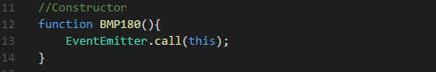

InitRobot es iniciar el robot, se utiliza ya que cylon es una librería de robotica y cuenta con un robot de temperatura y asi seria la estructura del robot. Sigue la configuración que se utiliza Raspberry, y un sensor BMP180, esto es lo que pide el robot.

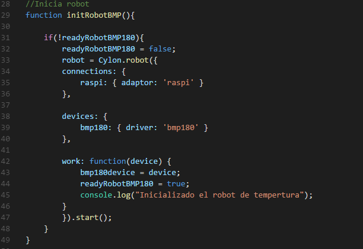

**Lectura de temperatura del sensor BMP180**
La variable self toma el contexto de esa misma clase a través de la instancia this, es decir, ese método va a emitir eventos. Por ejemplo, para emitir temperatura se llamó a readytemp, y la variable temperatura seria el argumento.

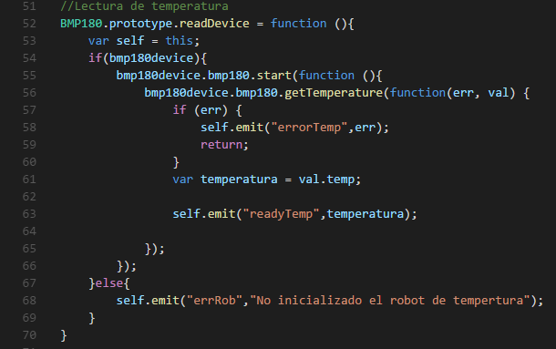

Estado del robot de temperatura con el sensor BMP180:

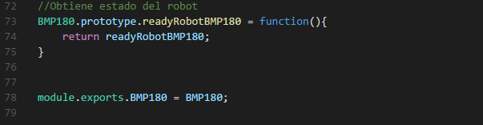

**Sensor DHT22**
Se realiza el constructor y la herencia con el EventEmitter.

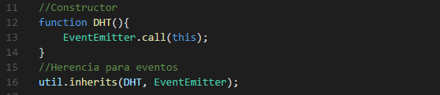

Se configura el sensor DHT y el pin de lectura de  la temperatura y la humedad relativa.

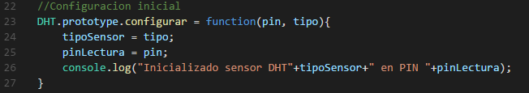

Lectura del sensor DHT datos de temperatura y humedad relativa.

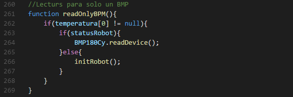

**Azure IoT Hub**
Módulos internos, el require ('azure-iot-device-mqtt') es usado para el envío de mensajes a Azure, y la instancia del cliente es clientFromConnectionString. El *require ('azure-iot-common')* se usa para armar los mensajes.

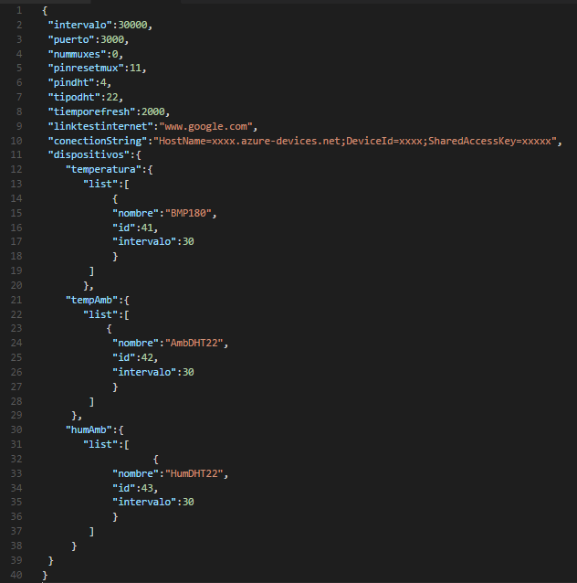

·         El constructor:

·         Creación del cliente Azure IoT Hub: se crea el cliente de Azure, es decir  se instancia un cliente.

·         Se abre una conexión, se abre el canal como tal.

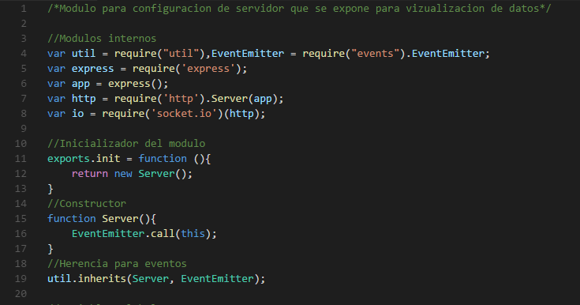

·         Envío de mensajes: el SendEvent es el encargado del envío de mensajes. El fulfill es para esa promesa, que es una clase. En esa clase se está ejecutando un código entonces cuando ese código termina con ese fulfill retorna, sale de la promesa.

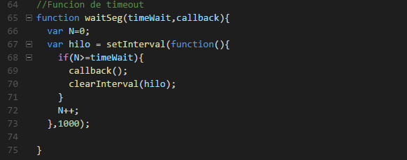

·         Función de timeout:

**Main**

Modulo principal para gestión y configuración de parámetros para lectura de temperatura y humedad relativa .Eventos relacionados.

Arreglos de configuración para temperatura del sensor BMP180, y la temperatura y humedad relativa del sensor DHT.

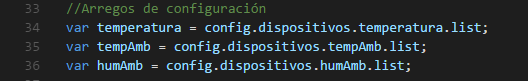

Cuando se emita el evento se captura el readyTemp, la temperatura del sensor BMP180.

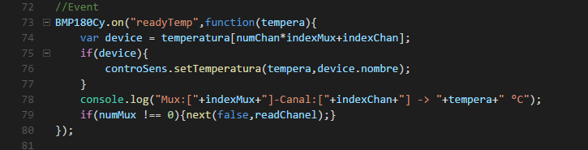

Lo mismo sucede con el sensor DHT cuando se emita el evento se captura la temperatura y la humedad.

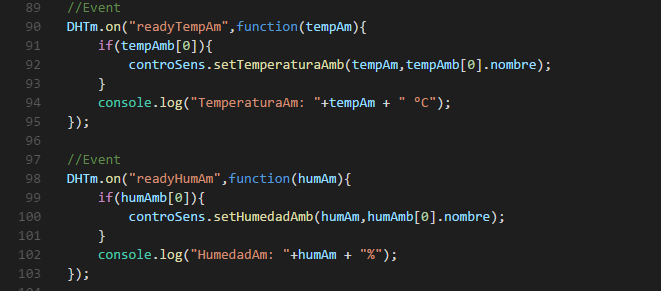

Se ejecuta cada periodo revisando el estado de los procesos.

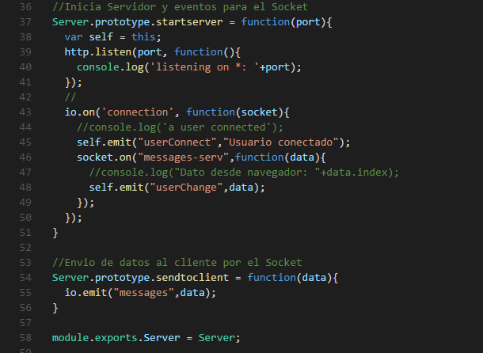

Se tiene una configuración con Id para el envío de mensajes a Azure IoT Hub.

**Módulos del lado del cliente**
·       HTML necesario.

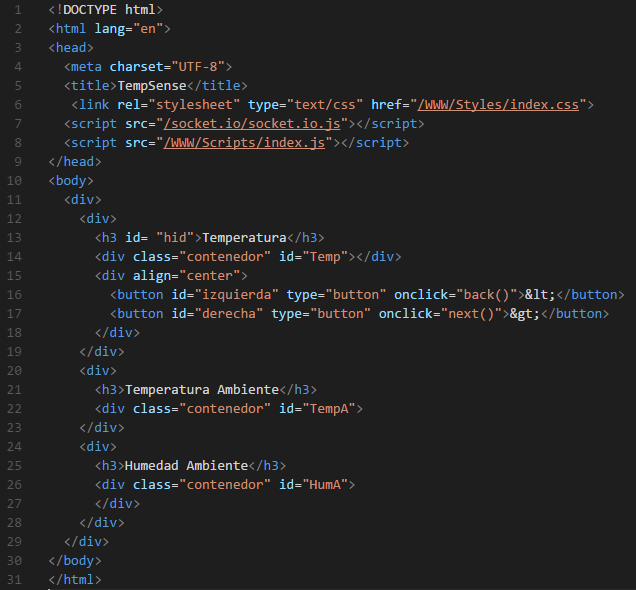

·       Codigo JavaScript para gestionar el  socket del lado del cliente.

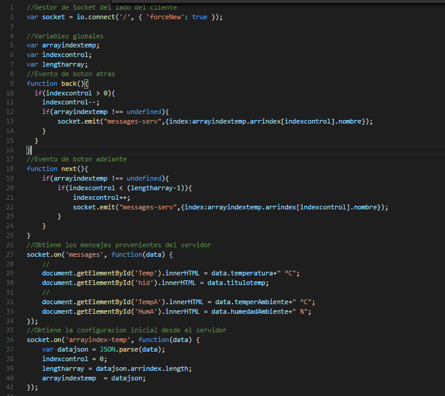

·       Finalmente se obtienen los datos en tiempo real.

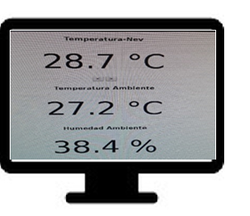

**Luis E. Valencia**
Office Servers & Servers MVP
@levalencia
Colaboración en redacción: Gina Ospina​​

