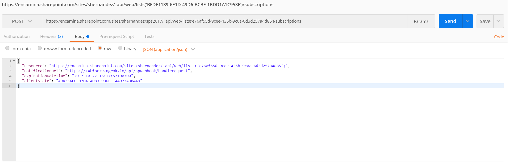

import ArticleHeader from '../../../components/article-header'

<ArticleHeader frontmatter={props.pageContext.frontmatter} />


Quién no recuerda esos tiempos de vino y rosas, de cuando la juventud se te iba poco a poco en cada despliegue, no te hacía falta radiador porque tu pc echaba humo y en los que por la sala se escuchaba un ¡implementó!.

Sí, eran tiempos bonitos, pero un poco aciagos para el desarrollador SharePoint; y si de algo bonito, espectacular, pero a la vez difícil de controlar y predecir nos debemos acordar, esos sin duda eran nuestros amigos los Event Receiver, tanto en su versión On-premises, como en su versión Remote en SharePoint Online.

Eso ahora es historia, os lo puedo asegurar, ¿Queréis conocer cómo podemos mantener la esencia que nos cautivó, pero haciendo desaparecer todo lo malo?, tiene un nombre y es Webhooks.

**¿Qué es Webhook?**

Podemos definir Webhook como un protocolo basado en "Callbacks", y que permiten mediante un sistema de suscripciones, conectar una aplicación de origen con una aplicación externa mediante peticiones http.

Es decir, centrándonos en SharePoint, podemos suscribir por ejemplo una WebApi desarrollada por nosotros e independiente a nuestro SharePoint online, y por cada evento de cambio en la lista en la que estemos suscritos, la webApi recibirá una petición http post, con el cambio efectuado.

Webhook nos permite conectar aplicaciones externas a nuestro SharePoint, con independencia de la tecnología en la que estén implementadas, cuenta con mecanismos de reintentos, y como veremos un poco más adelante son muy seguros, ya que en la petición no se envía el "cambio producido en el evento", si no que únicamente se notifica el hecho de que se ha producido un cambio en un recurso de origen (lista de SharePoint).

**SharePoint y Webhooks, el nuevo Event Receiver**

Centrándonos aún más en SharePoint, vamos a ver los tipos de eventos que podemos "capturar" de una lista, como suscribirnos a estos eventos y por último como ver los cambios relacionados con el evento.

**Suscribirte por Webhook a una lista**

Para trabajar con Webhook, necesitamos hacer uso de la API de SharePoint, y por tanto estar autenticados en nuestro SharePoint Online (veremos ejemplos de cómo lograrlo). Como vemos en la siguiente imagen, lo primero que debemos hacer es realizar una petición POST a  [http://miSharepointSite/\_api/web/lists('identificador-lista')/subscriptions](http&#58;//misharepointsite/_api/web/lists%28%27identificador-lista%27%29/subscriptions)**.**

En el cuerpo de la petición deberemos incluir los siguientes datos en formato JSON:

·       resource: [http://miSharepointSite/\_api/web/lists('identificador-lista')](http&#58;//misharepointsite/_api/web/lists%28%27identificador-lista%27%29).
·       notificationUrl: [https://tuClienteWebhook/your/webhook/method](https&#58;//tuclientewebhook/your/webhook/method).
·       expirationDateTime: "2017-05-31 16:00 +00:00".


**Imagen****1****.- Crear una suscripción.**

Si la petición ha sido correcta contra la API de SharePoint, este realizará una petición POST contra el cliente Webhook que le hemos indicado en la suscripción, en la petición se pasará un Token de Validación, para indicar que es una petición de confirmación de suscripción. En caso correcto, se devolverá al suscriptor, el identificador de suscripción, que será útil para renovar la suscripción (solo tiene una validez máxima de 6 meses), o para eliminarla si fuera necesario. Este proceso tiene una respuesta máxima de 5 s de duración, si pasado ese periodo el cliente webhook no devuelve un "200 ok" a SharePoint, no se podrá dar como válida la suscripción.​

**Recibir una notificación de cambio**

Una vez realizada la suscripción de forma correcta, cada cambio que se produzca en la lista indicada en el parámetro "Resource", se notificará de forma muy similar a como se ha realizado el proceso de suscripción.


**Imagen****2****.- Notificación de un cambio.**

La única diferencia con el proceso anterior, es que ahora se nos devuelven datos adicionales:

·       **clientState**: Cadena que podemos indicar en el proceso de suscripción para securizar nuestro cliente con las peticiones de cambio (no obligatorio).
·       **webId**: Identificador de la web en el que se produce el cambio.
·       **resource**: identificador de la lista.
·       **tenantId**: identificador del tenant en el que se produce el cambio.

Como podemos apreciar sabemos sobre que SharePoint Online, que sitio web y que lista se ha producido "un cambio", pero no el contenido del cambio ni el tipo.

**Obtén los cambios de un evento**

Para poder obtener el "detalle concreto" del evento, tenemos que hacer uso de CSOM API.
 Para ello en nuestro cliente podemos implementar la lógica necesaria para una vez recibido la lista y el sitio web, consultar los cambios de este evento. Si nos fijamos en la siguiente imagen, podemos implementar una API, Web o un Azure Functions por ejemplo para capturar los eventos de cambios y añadir la lógica de obtención de cambio.

Esto es un caso ideal, ya que presuponemos que solo hay un cambio concurrente, y no tenemos en cuenta que los cambios no tienen por qué venir en orden (webhook no asegura que los eventos lleguen en orden de ejecución), ya que este modelo de solución simplemente va a buscar el último cambio sobre nuestra lista.


**Imagen****3****.- Patron sencillo GetChange.**

Pero si nos creemos este caso, para realizar pruebas de baja concurrencia podríamos implementar con CSOM un código muy parecido al siguiente:

```
//Abrimos el context de nuestro sitio de SharePoint, y obtenemos la lista en la que se produjo el cambio using (ClientContext client = new ClientContext(url))
```

```
{client.Credentials = new SharePointOnlineCredentials(userName,           GetPassword(passWord));
```

```
var list = client.Web.Lists.GetById(new Guid(resource));client.Load(list);client.ExecuteQuery();
```

```
//Definimos los cambios que queremos caputarChangeQuery changes = new ChangeQuery(true, true);changes.Item = true;changes.RecursiveAll = true;changes.Add = true;changes.User = true;changes.Update = true;changes.List = true;changes.Field = true;if (list != null){
```

```
//Obtenemos los cambios producidos en la listavar listChages = list.GetChanges(changes);client.Load(listChages);client.ExecuteQuery();
```

```
//Procesamos el último cambio producidovar result = listChages.LastOrDefault();if (result != null){var itemChange = (ChangeItem)result;var type = result.ChangeType;if (type != ChangeType.NoChange){var changeInfo = new SPChangeInfo(){ItemId = itemChange?.ItemId.ToString(),ItemTitle = string.Format("{0}_{1}", itemChange.ListId.ToString(), itemChange.ItemId.ToString()),ListName = itemChange.ListId.ToString(),TypeChange = type.ToString()};
```

```
//Insertamos los cambios en una lista de Sharepoint,código libre en mi caso hago un insert en una lista con CSOM. Deberemos configurar una lista de trazas parecida a la que veremos un poco más adelante.success = InsertTraceChanges(traceLibrary, client, changeInfo, origin);}
```

El modelo SPChangeInfo se puede definir de una forma parecida a esta:

```
public class SPChangeInfo{        public string ItemId { get; set; }
```

```
        public string ItemTitle { get; set; }        public string ListName { get; set; }        public string TypeChange { get; set; }}
```

Si analizamos la clase, podemos comprobar que se tracea ahora si la información necesaria para saber que ha ocurrido (lista, item, tipo de cambio…). Para poder recrear este ejemplo necesitaremos el paquete Microsoft.SharePointOnline.CSOM


**Imagen****4****.- Paquete CSOM SharePoint Online.**

**Patrones y Webhook**

Viendo el caso base, vemos que es ampliamente mejorable ya que, en un sistema normal, se producirán miles de cambios concurrentes obligándonos a necesitar una cola de procesos, además de que necesitaremos mejorar el modelo de obtención del cambio por CSOM.

Para la obtención de los cambios por evento, podemos ver que la clase ChangeQuery tiene una propiedad **ChangeToken**, que podemos utilizar para obtener lotes de cambios. Esto es muy útil, ya que para los casos de "**inserciones por bulk**", o "**borrados de más de un elemento concurrentemente**" en una lista de SharePoint, simplemente se va a generar un evento de notificación Webhook, pero por el contrario se van a producir muchos cambios por debajo.

Fijándonos en el patrón **GetChange**() de la siguiente figura, podemos ver que haciendo uso de procesos asíncronos como puede ser un **webJob** podemos corregir el problema de volumen elevados de cambios, procesando poco a poco los mismos.


**Imagen****5****.- Patrón GetChange Token.**

Además, con la idea de, por un lado, no perder ningún cambio y, por otro, ir haciéndolo en background para no penalizar al sistema.

**Tipos de eventos capturados y operaciones sobre suscripciones**

Ahora mismo únicamente se pueden capturar eventos asíncronos a nivel de lista:

·       ItemAdded
·       ItemUpdated
·       ItemDeleted
·       ItemCheckedOut
·       ItemCheckedIn
·       ItemUncheckedOut
·       ItemAttachmentAdded
·       ItemAttachmentDeleted
·       ItemFileMoved
·       ItemVersionDeleted
·       ItemFileConverted

En cuanto a operaciones que podemos hacer por uso de la API de SharePoint con suscripciones Webhook tenemos las siguientes:


| **Operación** | **Tipo** | **URL** |
| --- | --- | --- |
| **Crear** | POST | &lt;site&gt;/api/web/lists('id')/suscriptions |
| **Modificar** | UPDATE | &lt;site&gt;/api/web/lists('id')/suscriptions('idSuscription') |
| **Borrar** | DELETE | &lt;site&gt;/api/web/lists('id')/suscriptions('idSuscription') |
| **Ver suscripciones** | GET | &lt;site&gt;/api/web/lists('id')/suscriptions |


En la [dev.office.com](https&#58;//dev.office.com/sharepoint/docs/apis/webhooks/lists/create-subscription) además podemos ver los tipos de cabecera y cuerpos en cada petición.

**Tu primer ejemplo, construyendo un Tracer sobre SharePoint**

Una vez visto cómo podemos obtener los cambios por CSOM, y los distintos escenarios de solución, podemos crear un ejemplo sencillo basándonos en el método de GetChanges básico que vimos al principio, o bien lanzarnos a implementar un patrón completo por Token de cambio.

En ambos casos vamos a necesitar empezar por crear un cliente, obtener contexto de autenticación sobre SPO (en nuestro caso usaremos PostMan, en otros artículos veremos cómo desplegar una App en Azure AD), y por último necesitaremos añadir la lógica de obtención de cambios que hayamos escogido para dejar traza en SharePoint de cada evento que se dispare.

**Creación de un cliente**

Para crear un cliente webhook que reciba notificaciones de SharePoint Online, necesitaremos implementar una API con el siguiente código:

```
//Definimos un método Post en nuestra API Rest, al cual invocará SPO por cada cambio (notificationURL)
```

```
 [HttpPost] public HttpResponseMessage HandleRequest() { HttpResponseMessage httpResponse = new HttpResponseMessage(HttpStatusCode.BadRequest); string validationToken = string.Empty; IEnumerable<string> clientStateHeader = new List<string>();
```

```
 //Si en la suscripción añadimos "ClientState", aquí podemos validarlo para securizar nuestro cliente string webhookClientState = ConfigurationManager.AppSettings["webhookclientstate"].ToString(); if (Request.Headers.TryGetValues("ClientState", out clientStateHeader)) {string clientStateHeaderValue = clientStateHeader.FirstOrDefault() ?? string.Empty;if (!string.IsNullOrEmpty(clientStateHeaderValue) &&      clientStateHeaderValue.Equals(webhookClientState))         {var queryStringParams = HttpUtility.ParseQueryString(Request.RequestUri.Query);
```

```
//Este es el código que se ejecutará en caso de ser "el proceso de suscripción", dando un 200 para crear la suscripción en SPO if (queryStringParams.AllKeys.Contains("validationtoken")){httpResponse = new HttpResponseMessage(HttpStatusCode.OK);validationToken = queryStringParams.GetValues("validationtoken")[0].ToString();httpResponse.Content = new StringContent(validationToken);return httpResponse;}else{var requestContent = Request.Content.ReadAsStringAsync().Result;
```

```
if (!string.IsNullOrEmpty(requestContent)){NotificationModel notification = null;try{
```

```
//Serializamos la notificación, que traerá todos los campos que hemos visto antesvar objNotification = JsonConvert.DeserializeObject<ResponseModel<NotificationModel>>(requestContent);notification = objNotification.Value[0];}catch(Exception e){  return httpResponse;}
```

```
if (notification != null){
```

```
//Código libre, aquí añadiremos el código que vimos en el apartado de Obtención de cambios, o por el contrario un patrón de cambios más trabajado
```

```
//añadir el código que grabe la traza del cambio en Sharepoint "AddTrace(notification)", utilizando el código CSOM GetChanges if (AddTrace(notification))httpResponse = new HttpResponseMessage(HttpStatusCode.OK);}       }}
```

```
return httpResponse;
```

```
}
```

Con este cliente, ya tenemos por un lado un receptor de las notificaciones, y la lógica necesaria para que deje trazas en una lista de SharePoint. La idea es que este cliente deje en SharePoint toda la actividad que se produzca sobre las listas que tienen asociada una suscripción webhook.

**PostMan como primer paso para hablar con la Api de Sharepoint**

Existe la posibilidad de crear una aplicación web en Azure, y asegurarla por Outh 2.0, delegando permisos en Graph y SharePoint Online para poder realizar peticiones a la API de SPO. Pero este proceso además de largo de explicar es un tanto complejo, que daría ya para un artículo individualizado. Por si alguien se anima a crear un ejemplo así de trabajado pueden obtener más información tanto de dev.office.com, en el cual hay un ejemplo base para empezar a trabajar con patrones y con este modelo de autenticación, o por el contrario se pueden mirar mi sesión del SharePoint Saturday de Madrid en Channel9 (aún por subir creo), que indago más en esta parte.

Bueno para empezar muy rápido podemos registrar en el mismo AD en el que tenemos nuestro tenant de SPO la aplicación de **Postman**, con el cual vamos a obtener un Token Bearer.

Para ello en el **Postman** debemos configurar una autenticación Outh 2.0 de la siguiente forma:


**Imagen****6****.- Post Oauth 2.**

Todos los datos de la autenticación, los obtenemos desde la página de configuración de Azure AD, donde habremos registrado la aplicación PostMan, con la URI http://www.getpostman.outh2/callback


**Imagen****7****.- Aplicación Postman en Azure AD.**

En el propio cliente PostMan debemos añadir el ClientID y el ClientSecret obtenidos a registrar la app en Azure AD, así como los extremos de autenticación (Auth URL y Access Token URL).


**Imagen****8****.- Extremos de la app en Azure AD.**

Por último y muy importante, necesitamos delegar permisos de escritura en SharePoint Online, para que el token que nos genere sea válido para generar y editar suscripciones webhook.


**Imagen****9****.- Conceder permisos a SPO.**

**Un poco de debug**

Una vez configurado el cliente PostMan de forma correcta, podemos empezar a probar a crear suscripciones y comprobar que el cliente deja trazas en nuestra lista de SharePoint. Pero claro, antes de desplegar el cliente en Azure y empezar a trabajar sería bueno poder debugar alguna ejecución. Para poder probar en local y no tener que hacer un debug remoto que siempre es más lento podemos usar la aplicación ngrok.

Es una aplicación gratuita y muy fácil de usar, simplemente situándonos en la carpeta en la cual hemos descomprimido la app, y ejecutando la instrucción "**ngrok http port-number --host-header=localhost:port-number"**, se generará un tunel en nuestra máquina que permitirá a SPO notificar los cambios.

Para obtener el puerto que utiliza en localhost nuestro cliente, podemos lanzarla en local o bien en propiedades del proyecto buscar la dirección de debug que tenemos configurada.

Como se ve en la siguiente imagen, se auto-genera un URL que será la que debamos utilizar como "**notificationURL**" cuando generemos la suscripción.


**Imagen****10****.- Creando un tunnel con ngRok.**

**Ya podemos tracear, comprueba el resultado**

Para probar que todo funciona correctamente, y así poder hacer un debug inicial, basta con suscribirnos a una lista de prueba que generemos en nuestro SharePoint que llamaremos "Webhook Test", y lo haremos como vemos en la siguiente imagen de Postman.



**Imagen****11****.- Creando una suscripción con PostMan.**

En el cuerpo de la petición incluiremos como notificationURL la dirección que nos proporcionó ngRok, y no olvidemos incluir en la cabecera de la petición el Token Bearer que nos genera PostMan. Si no queremos trabajar mucho, en la pestaña Authorization, pulsamos en "Get New Access Token" y sobre el token que nos genera seleccionamos "Use Token".

Este proceso nos genera la siguiente cabecera de petición:


**Imagen****12****.- Token Bearer con Postman.**

Por último, invocamos el método POST que vimos para crear suscripciones, pasándole el ID de la lista que hemos creado como WebHook Test en SPO. En mi caso el cliente Webhook que he creado, lleva una cierta lógica que inserta con CSOM el cambio asociado al evento, dejando una traza de cambio en una lista Webhook Tracer. Si procedemos a crear un elemento en la lista en la que asociamos la suscripción webhook, el resultado que os debería dejar en la lista de trazas es algo muy parecido a la siguiente imagen.


**Imagen****13****.- Lista de tracer en SPO.**

**Mi nuevo mejor amigo**

Como hemos visto, ya tenemos nuevo amigo, y no es otro que Webhook. Al menos en mi parecer con estos patrones de cambios que hemos visto, y notificaciones webhook, tenemos un camino abierto para poder extender nuestro SharePoint. ¿Qué nos impide incluir este cliente en un Azure Function y empezar a dar forma a una arquitectura ServerLess asociada a SPO?.

En mi opinión mantenemos casi todo lo bueno de un Event Receiver, pero omitimos lo malo, ya que el despliegue es directo con peticiones http a un api, podemos hacer un retract de nuestro evento con otra petición http, y por si fuera poco es mucho más seguro ya que nos obliga asignarlo lista a lista, lo que ya de por sí focaliza mucho la ejecución. Si esto aún fuera poco, para un desarrollador que no sea experto en SharePoint no es ningún problema, ya que no dependemos del framework en ningún momento.

Animo a usar Webhook, no solo en SharePoint, sino en cualquier sistema que tenga integraciones con terceros y necesite de un tráfico de notificaciones y eventos como el que hemos visto en los ejemplos.


**Sergio Hernández**

Principal Team Leader en Encamina​

