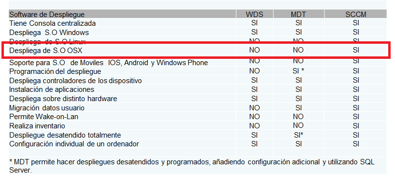
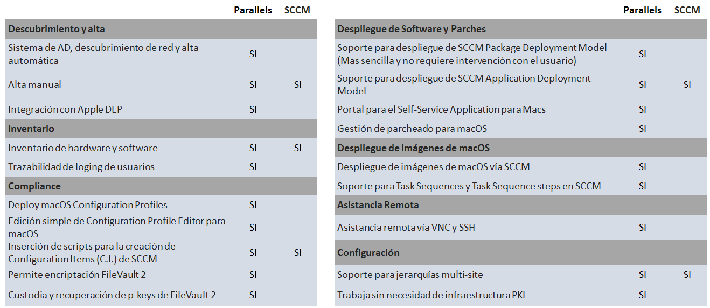
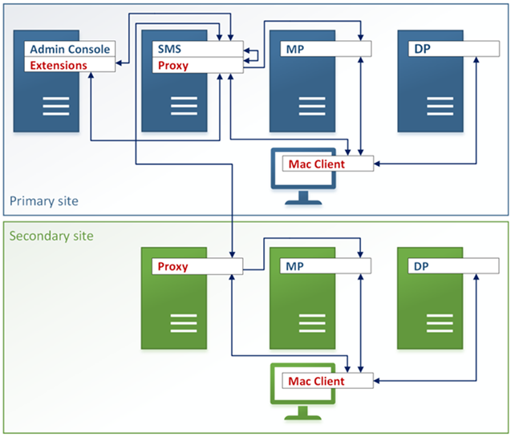
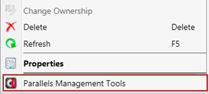
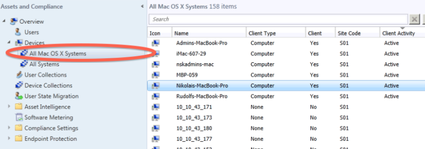
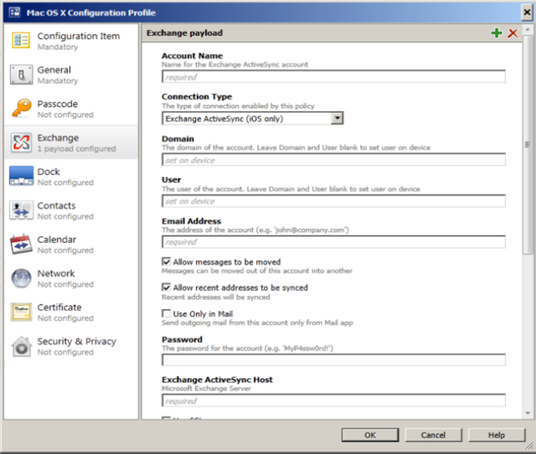
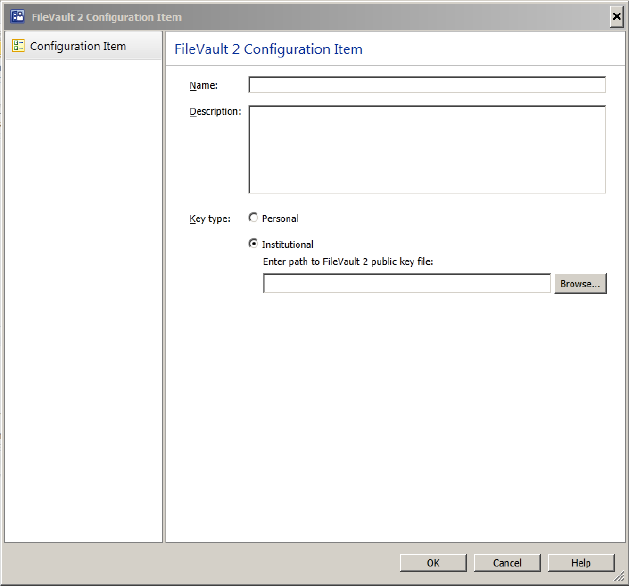
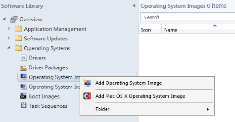

La empresa, hoy en día se enfrenta a la necesidad de dar cabida a muchos dispositivos que en otras épocas serían impensables. Esto se da, por esa palabra que está tan de moda ahora mismo, el BYOD (Bring Your Own Device) o trae tu propio dispositivo, en la que se permite al empleado que traiga su propio portátil, móvil o tablet y lo conecte a ciertas partes de la red corporativa, que tendrán mayor o menor nivel de acceso y permisibilidad en función de la política del departamento de tecnologías de la información y por supuesto de la dirección de la empresa.

Pero no solo por el BYOD, si no que ahora emerge, al menos al público en general la hasta ahora desconocida para muchas empresas CYOD (Choose your own device) o elige tu propio dispositivo.

Este "elige tu propio dispositivo", que está creciendo de manera exponencial, ya que permite dar flexibilidad a los trabajadores a la hora de seleccionar la máquina con la que van a trabajar y hace que estos puedan adquirir, a cuenta de la empresa el equipamiento que mejor se adapte a sus necesidades, aunque siempre con una limitación presupuestaria, y que incrementa la productividad de los empleados al sentirse más cómodos con sus equipos.

Ambos nos proponen un nuevo enfoque, proporcionándonos una nueva forma de trabajar, bastante distinta de la que utilizábamos hasta ahora.

Mientras que BYOD nos propone que el empleado traiga su dispositivo y trabaje desde el mismo, proporcionando un buen desempeño desde el punto de vista económico, ya que es el empleado el que pone el equipo, favoreciendo también un aumento de la productividad, pero presenta problemas desde el punto de vista de seguridad, ya que el empleado usa su equipo en el trabajo, después posiblemente lo use en su casa para navegar, lo lleve de viaje, etc. y puede terminar perdiendo el equipo con información sensible en su disco duro, o por el contrario, que no lo pierda pero introduzca virus, troyanos o cualquier otro tipo de malware en nuestra empresa.

En el caso del CYOD, reducimos la flexibilidad del empleado, ya que limitaremos tanto el presupuesto como las características del equipo que este puede comprar o seleccionar, pero incrementa el coste ya que el dispositivo forma parte del parque informático de la empresa y por tanto sale de las arcas de la misma, pero incrementamos la seguridad ya que este empleado tendrá que pasar si o si por las políticas de seguridad de la empresa.

Tanto la BYOD como la CYOD nos brindan ventajas y desventajas, pero debemos afrontarlas de manera que nos sea posible gestionar dichas políticas sin que se nos vaya de las manos.  Dentro de estas opciones, sobre todo en el caso de CYOD, están proliferando los empleados que eligen dispositivos Mac. Estos dispositivos de Apple, son equipos con un gran desempeño que además para algunos son un símbolo de estatus. Otros usuarios, seleccionan este tipo de dispositivos porque tienen que manejar programas de diseño que tradicionalmente se han manejado sobre este tipo de equipos, o que han mostrado unas tasas de rendimiento superiores en estos equipos. En esos casos, nos encontramos con que hasta ahora, las máquinas Mac quedaban aisladas, no tenían acceso a todo, o si lo tenían era sin aplicarles ningún tipo de políticas.

En este sentido, las empresas, o bien no pueden, o no quieren invertir en la gestión de este tipo de equipos y las motivaciones pueden ser muy diversas, pero siempre van a lo mismo, a la falta de inversión en nuevas herramientas de gestión para estos dispositivos, en no invertir en nuevas infraestructuras para la gestión de estos equipos y por supuesto en no destinar nada de presupuesto a la formación del equipo técnico para la gestión de estas herramientas.

Si lo pensamos fríamente, ante esta falta de apoyo, ¿Qué opciones tenemos? Pues como siempre, tenemos varias opciones, pero no todas son las más óptimas para la empresa o para el bien del departamento de TI.

La primera opción es la de no hacer nada. Ésta es quizá la más típica y la que se ha usado hasta ahora, pero es también la más peligrosa para la seguridad de la infraestructura y sobre todo de los datos. Dentro de esta opción tenemos el gestionar sólo los dispositivos Windows, ignorando los dispositivos Mac como si no existieran, o tenemos la opción de que sean los propios usuarios de Mac los que gestionen sus equipos como quieran, usando lo que se llama “powerusers” o usuarios con algunos privilegios que sean capaces de gestionar estos equipos.

No hace falta que digamos que estas opciones no son precisamente las mejores para nosotros ya que facilitamos el “ShadowIT”, ni para nuestra empresa ya que podríamos incurrir en una negligencia que desemboque en una tragedia dentro de la empresa.

La segunda opción es la de gestionar los dispositivos Mac de manera manual. Esta opción es la que cualquier coordinador de tecnologías de la información anclado en el pasado dará por buena, ya que por lo general se centra en “lo urgente en vez de lo importante” y va apagando fuegos sin llegar a poner orden en la infraestructura; que por un lado da lugar a errores, ya que por ejemplo hará que tengamos equipos que no han sido catalogados, ordenadores con distintas versiones de software, otros a los que no hemos instalado un programa que después resulta imprescindible y un largo etc.

Este enfoque no sólo es poco fiable, sino que además es caro al incrementarse la mano de obra necesaria para gestionar todas las tareas, ya que el ITpro tiene que realizar las tareas desplazándose al equipo, hacer todo manualmente, revisar los equipos, instalar software manualmente, etc.

La tercera opción, que ya empieza a tener algo más de sentido que las dos anteriores es la de gestionar los Mac desde una infraestructura de terceros totalmente independiente de la utilizada para la gestión de dispositivos Windows. Para esto se necesitará una inversión adicional en equipamientos, comunicaciones, licencias, etc. Teniendo el hándicap de que muchas de esas soluciones, además del coste que tienen no brindan una solución completa.

La cuarta y última opción es la de realizar la gestión de todos los equipos desde la infraestructura existente de Microsoft.

Pero en esta cuarta opción, volvemos a tener nuevamente varias opciones a valorar y que nos brindaran distintos niveles de optimización de las tareas que realizamos.

Siguiendo con esta cuarta opción, que es la que más se alinea con la gestión centralizada de nuestra infraestructura sea cual sea el tipo de sistema a gestionar, WDS (Windows Deployment Service) y MDT (Microsoft Deployment Toolkit) no permiten siquiera desplegar OSX, y solo Microsoft System Center Configuration Manager lo permite, aunque sólo desde su versión 2012 SP1. Por lo que los dos primeros quedan descartados dejando solo a SCCM como candidato para gestionar nuestra infraestructura híbrida de dispositivos Windows y Mac.

Pero SCCM no sólo nos permite realizar el despliegue de OSX, si no que nos permite otras tareas, por ejemplo, dar de alta los dispositivos Mac, aunque sólo nos permite darlos de alta de manera manual. Nos permite realizar el inventario de hardware y software de las máquinas Mac, aunque no podremos realizar el inventario completo ya que la integración no es completa. También nos permite la inserción de scripts para C.I. (Configuration Items) de SCCM, aunque he de decir que la forma en que lo realiza aún es un poco engorrosa, y cuesta un poco hacerse con la forma de trabajo de este tipo de scripts. SCCM, además nos da soporte para el despliegue de SCCM Application Deployment Model. Lo último que nos brinda SCCM de manera nativa para la gestión de dispositivos Mac, como no podía ser de otra manera ya que es heredado del propio Configuration Manager es el soporte para jerarquías multi-site. Por último tenemos que contar que SCCM, en su gestión nativa de dispositivos Mac requiere de infraestructura PKI.

Pero claro, tal como podemos ver en estas especificaciones que acabamos de describir, System Center Configuration Manager nos da una pequeña parte de lo que en realidad podemos necesitar para poder decir que tenemos una infraestructura hibrida plenamente gestionable desde un punto centralizado.

Para solucionar esto necesitamos la integración de un producto de terceros, pero la integración de un producto de terceros con ciertas garantías, que no requiera de inversiones faraónicas y que nos permita gestionar la infraestructura por parte de nuestro equipo de TI que ya está formada en el manejo de una herramienta fiable y conocida como es Microsoft System Center Configuration Manager.

El software que cumple con estos requerimientos es Parallels Mac Management, coloquialmente conocido como PMM por sus siglas. Aquí voy a hacer un breve inciso para hablar un poco de Parallels Inc.

La empresa que desarrolla este software, Parallels Inc. no es una empresa nueva en esto de las aplicaciones relacionadas con la gestión y lleva bastantes años ya trabajando en la virtualización y otros temas relacionados con el mundo Mac, además, como ejemplo de otro producto de Parallels destinado a la mejora de nuestra infraestructura podemos citar el RAS que han lanzado recientemente.

Parallels lleva ya algunos años con el desarrollo de PMM y en el año 2014 fue merecedor de un premio por parte de Microsoft, que distinguió a Parallels Mac Management con el premio de mejor sistema de gestión en el TechEd 2014. Con esto quiero decir que es una empresa sólida que ha demostrado que sabe hacer bien las cosas y que lleva tiempo invirtiendo esfuerzos en desarrollar PMM y que como podréis ver a continuación ha hecho muy bien sus deberes.

Parallels Mac Management nos proporciona, entre otras funcionalidades el descubrimiento y alta de clientes Mac a lo largo de la infraestructura y lo hace de manera automatizada, no siendo necesario hacer el descubrimiento y alta de manera manual como en el caso de SCCM.

Las funcionalidades de inventario de PMM están mejoradas ya que tienen un mayor grado de integración con la plataforma OSX. La solución de Parallels también proporciona integración con Apple DEP (Device Enrollment Program) que facilita la gestión de dispositivos mediante preconfiguraciones.

Nos permite así mismo utilizar y administrar FileVault 2, que, para asemejarlo a algo conocido por nosotros, que somos usuarios de plataformas de Microsoft, es el equivalente a Bitlocker.

Por supuesto, PMM nos permite realizar el despliegue de software de distintas fuentes y maneras, realizar la gestión de parcheos de macOS, como podríamos hacer con un PC con Windows, permite acceder a un Self-Service Application Portal que permite que el usuario pueda acceder a un frontal en el que puede descargar aplicaciones que pueda necesitar.

También permite realizar el despliegue de imágenes de sistema operativo completo de macOS como si de un Microsoft Windows se tratara, para la instalación del equipo completo y por supuesto, explota la tan importante infraestructura de Reporting services de SQL Server que ya está operativa para los reportes para SCCM para la parte de Windows. Esta parte además no genera estructuras adicionales, si no que utiliza la propia estructura que se haya montado para Microsoft System Center Configuration Manager.

Sólo con lo que ya hemos descrito en los párrafos anteriores podemos ver que contar con PMM es mucho más provechoso que contar solo con SCCM, pero se ve mucho más claro si consultamos la siguiente tabla comparativa donde se confronta un software con otro y se comparan funcionalidades.

Es importante que sepamos que SCCM no es sustituido por PMM, de hecho, PMM no se puede instalar sin SCCM. Esta relación es una simbiosis en la que Parallels Mac Management se instala sobre Configuration Manager, pero así mismo SCCM se nutre de las funcionalidades que éste le añade, por eso me gusta decir siempre que no es uno u otro, sino que su unión hace su fuerza.

Ahora que hemos hablado un poco sobre qué es capaz de hacer, vamos a ver cómo lo hace; y para ello vamos a comenzar por ver qué conforma esta solución, qué componentes la integran.  Los elementos que conforman la solución de Parallels Mac Management son en realidad cinco partes:

·         Parallels Proxy.

·         Parallels Mac Client.

·         Admin Console Extensions.

·         NetBoot Server.

·         OSX Software Update Point.

Vamos a estudiar cada uno de ellos de manera breve:

Parallels Proxy, en realidad no es un componente en sí, desde el punto de vista que podemos pensar en origen los técnicos de TI, porque se trata de un servicio que actúa como enlace entre SCCM y las Macs para que así éstas puedan ser gestionadas como si fueran un dispositivo más.

Parallels Mac Client es el programa que se instala en cada una de las máquinas Mac y que nos permite realizar la comunicación entre las máquinas Mac y Parallels Proxy.

Admin Console Extensions son las extensiones que usa PMM para proporcionar la gestión de máquinas Mac desde la consola de SCCM. Muchas veces pasan completamente desapercibidas porque PMM es tan poco invasivo que se integra como una pestaña o un menú más dentro de la interface gráfica de SCCM. En otras ocasiones podremos identificarlo, pero sólo porque conste el nombre de Parallels o su logo.

OSX Software Update Point es el servicio que usa PMM para publicar actualizaciones de Apple para el SCCM.

El último componente es el NetBoot Server, que es un componente opcional y que nos permite realizar la provisión de imágenes de macOS directamente contra máquinas Mac instalando el equipo desde cero.

Todos estos componentes y la integración de los mismos la podemos ver en la siguiente imagen.

Antes, he dicho que Parallels Mac Management no genera nuevas consolas, que no hay que arrancar aplicaciones de terceros ni nada aparte del propio Configurations Manager, que lo único que veremos son menús adicionales que se muestran en SCCM, y que en muchos casos sólo podremos identificar por el logo de la empresa o porque pone el nombre de la misma para que tengamos claro que son herramientas destinadas a la gestión de dispositivos Mac.

Además, PMM nos genera un nivel de integración tal, que no hace ni siquiera una estructura paralela para los dispositivos de macOS sino que los trata como una colección adicional.

Otra de las ventajas de las que no he hablado hasta ahora es que con PMM tenemos la posibilidad de crear perfiles de configuración (Configuration Profiles) que nos permiten establecer plantillas para que los Mac se configuren de una manera estándar, sería por así decirlo como establecer una GPO para la gestión de determinadas funcionalidades del sistema operativo en este tipo de dispositivos.

Además, aunque lo he citado previamente, la encriptación de dispositivos, que tanto preocupa en la actualidad a las empresas. Ya que un dispositivo extraviado o robado puede suponer una fuga de información bastante importante que llegue a poner en peligro la viabilidad del proyecto empresarial. Pues este asunto que cada día preocupa más a las empresas también está contemplada por PMM para los dispositivos Mac. Desde la consola de SCCM, PMM nos permite configurar Mac OS X FileVault, utilizando claves de tipo “Institutional Key” y “Personal Key” y además permitiendo a los administradores del sistema la recuperación de las claves desde la consola de SCCM en caso de ser necesario.

También quiero hacer un pequeño apunte sobre la provisión del sistema operativo completo. En este sentido, Parallels Mac Management sigue la misma tónica que en resto de aspectos. Para poder provisionar el macOS necesita de un NetBoot Server integrado con la infraestructura existente de WDS/PXE, utilizando el mismo flujo de trabajo que el despliegue de imágenes de Windows. Además, soporta “task sequences” y “task sequence steps” para la provisión de sistemas reconfigurados con aplicaciones ya predefinidas y por último puede utilizar cargadores de arranque similares a PXE.

Hay un punto adicional que tenemos que tener en consideración cuando desplegamos la infraestructura para la gestión de Macs con la solución nativa de SCCM. Es la infraestructura de PKI que es necesario implementar para poder gestionar los certificados para estos dispositivos. Estos certificados tienen que ser instalados en los clientes para que puedan ser gestionados por SCCM y no es algo trivial, requiere una buena planificación y cualquiera que haya trabajado con certificados sabe lo complicado que gestionar esto puede llegar a ser. En cambio, PMM no requiere de esta infraestructura de manera obligatoria, pudiendo gestionar los dispositivos Mac con o sin el uso de certificados.

En realidad hay muchas más funcionalidades que Parallels Mac Management nos proporciona, pero no podemos expandirnos más ya que el espacio en esta publicación es limitado. Si tienes interés en continuar aprendiendo sobre esta solución o resolver cualquier duda te invito a contactar conmigo y gustosamente te orientaré en lo que necesites.

**Conclusión**

Como hemos podido ver a lo largo del artículo, nos encontramos con una realidad que cada día es más patente: los dispositivos Mac han llegado a nuestras empresas y debemos aprender a convivir con ellos. Y por supuesto no basta con sobrellevarlos como podamos, si no que debemos aprender a gestionarlos sin limitaciones, haciendo que se alineen con las políticas de seguridad y cualquier otra política de la empresa.

Todo esto puede ser realizado con la ayuda de Microsoft System Center Confirguration Manager, pero como este, a  fecha de hoy con la versión 1702 de System Center Configuration 2016, aún cuenta con muchas limitaciones en la parte de gestión de dispositivos Mac, se hace necesario que contemos con la ayuda de software de terceros.

Y dentro del software de terceros disponible en el mercado, la solución más competitiva y que mejor se integra con SCCM es el Parallels Mac Management de Parallels. Este plugin que se integra sobre el propio SCCM, pasa casi completamente desapercibido ya que está 100 % integrado en SCCM que nos permite incrementar las herramientas de gestión de SCCM para dispositivos Mac hasta casi un control absoluto de la plataforma, sin necesitar apenas modificaciones sobre nuestra forma de trabajar habitual.

**Juan Ignacio Oller Aznar** 
MVP Cloud and Datacenter Management 
jioller@live.com
 @jioller
 [http://blogs.itpro.es/jioller](http://blogs.itpro.es/jioller) 
[http://dc2mobility.com](http://dc2mobility.com/)

 
 
import LayoutNumber from '../../../components/layout-article'
export default LayoutNumber
