Welcome to an article on How to create an App using Microsoft PowerApps. Now in our market we have apps everywhere so why not all organizations too should have their own apps in their organizations.

It can be used in various purposes and when it’s so simple to build as you will see in my screen below so why not build it.

**Why PowerApps?**

Organization can’t be always a free source app they need to store some data with secured access and who can provide a better security than Microsoft. You need to have Microsoft PowerApps for allowing users to access the apps through them so you not only save the extra money for app hosting but you also host in one of world’s best platform.

When it comes to developer, it is a right tool to use for quicker and smart apps.

Let’s see how we do it.

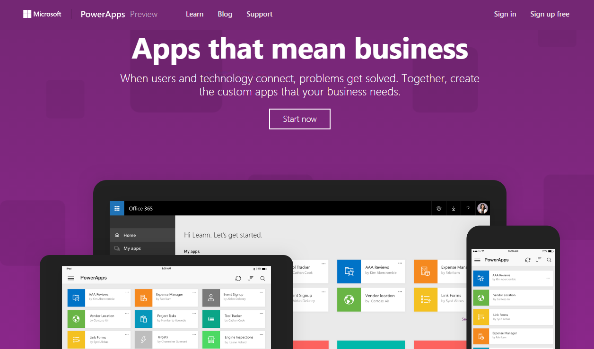

·       Welcome to Power Apps

·       Use this  [link](https://powerapps.microsoft.com/en-us/) to sign in with your organization’s Office 365 ID or with your window’s ID.

·       Once you login, you will arrive to the portal.

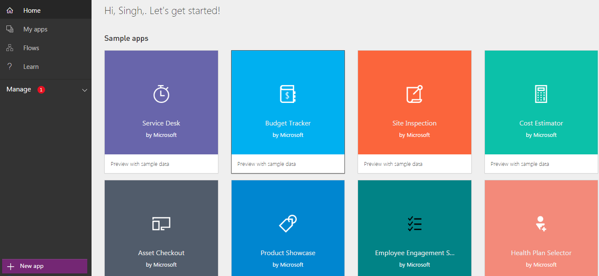

·       The left tool bar provides you various options to build or explore.

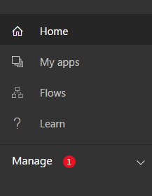

·       Starting with our options, we have the Home section which we saw above.

**Apps**
 An amazing platform which PowerApps offer is creation of Apps in just few simple clicks which are compatible to all devices and browsers. As PowerApps says, Innovation just got easier. Here you can create an app while connecting to different apps which you are already using without even writing a line of code and publishing them on all devices to be used.

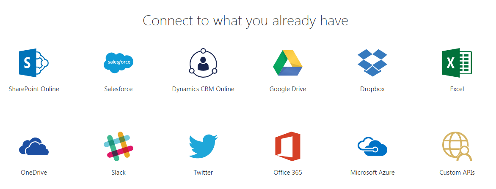

You can connect your app from a various everyday social or custom apps and use them in your process of development your own PowerApps. You can connect to existing data sources and service like Excel files, SharePoint lists, CRM records, your custom APIs, your drop box or any such to collaborate on your app.

The best part is you use a designer to customize or build an app that uses device capabilities, including cameras, GPS, and pen control without writing any line code.

·       So click on “My Apps”.

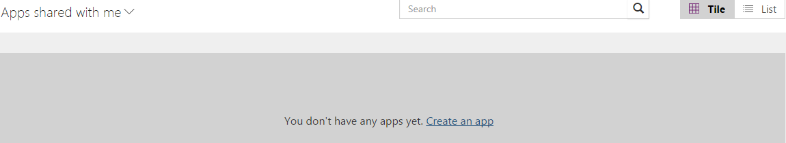

·       Choose if you want the designer to be installed on your machine or you want to use a web designer on your browser.

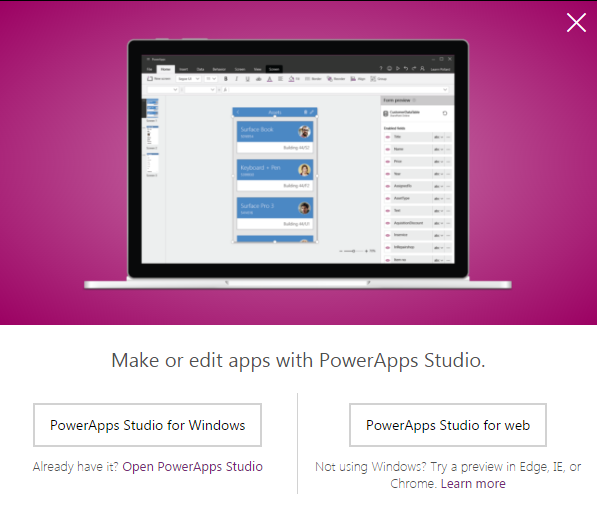

·       Once you have your studio ready, you will see the screen below.

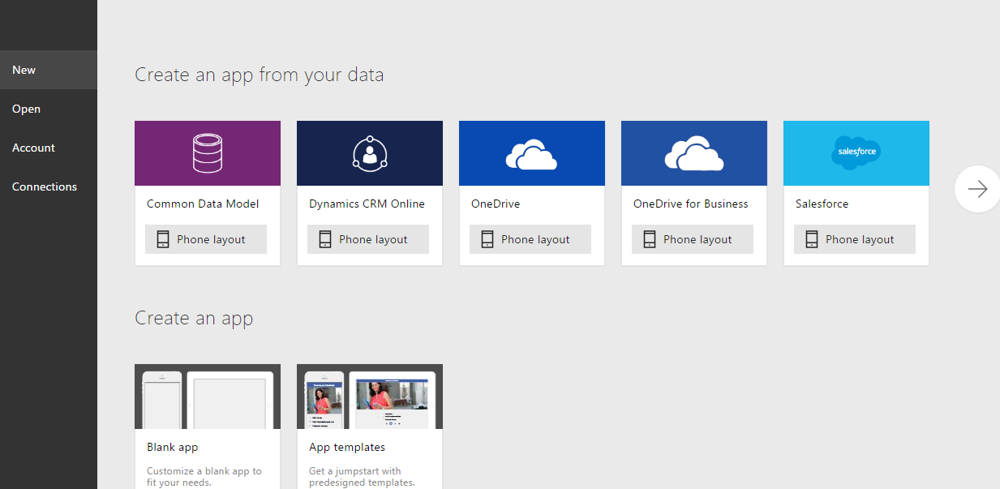

·       You can either start using an application to connect to your app or create a blank app.

·       We are using PowerApps Studio for Web. Click on Blank App.

·       You can choose what source of data you want to use in your app. As for me, I will choose SharePoint.

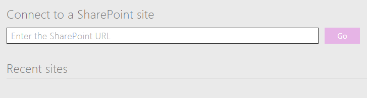

·       Enter the site URL

- Fill in yo​ur credentials and your app will be connected to your SharePoint site. I will be choosing a custom list to do store the data as per the screen below.

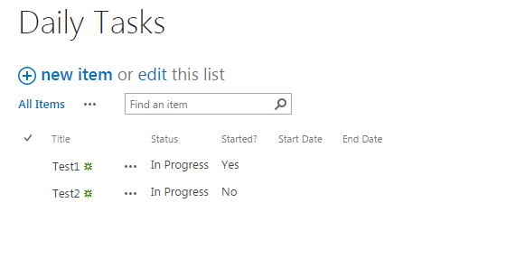

·       We are going to build an app to see the team’s daily task activities and their progress.

·       Let’s see how we can create an app.

·       Once you connect to your PowerApps studio, you will see the platform being ready as per the screen below.

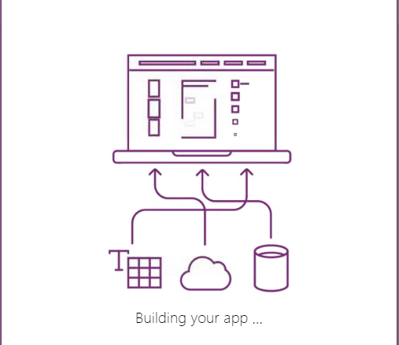

·       Once your platform is ready, you will see the following build. 
 
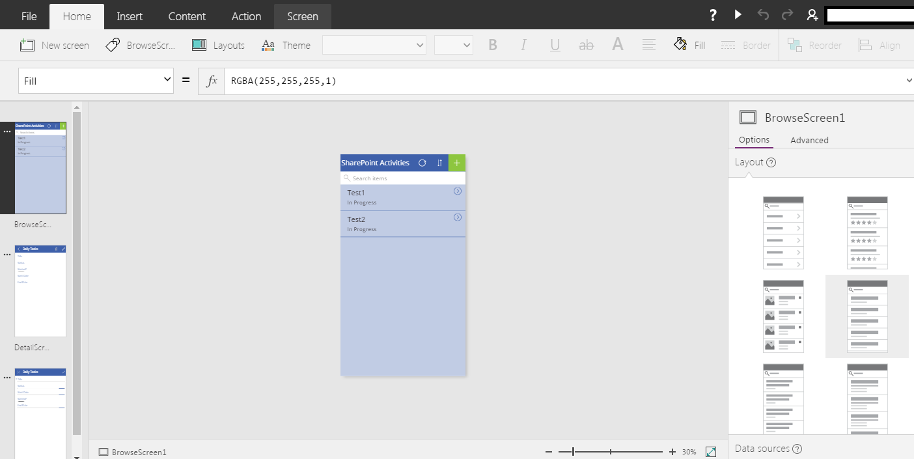

·       On the right hand side, you can choose various layouts as in how your app should look like.

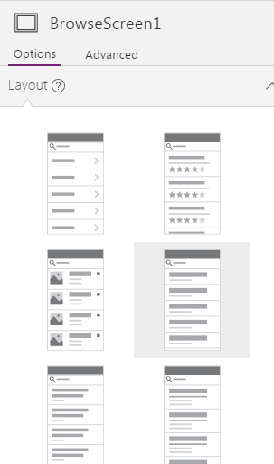

·       In a similar way, you can see your app screens on the left with what changes you make.

**Developing an App**

·       When you select a format as phone or tablet, PowerApps Studio gives you a blank platform to build your app.

·      Using the platform, you can align what kind of data you want. ​​

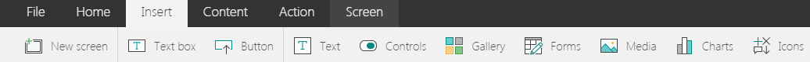

·       You can insert the following controls on your apps as we can see the above:

1.      A New Screen.

2.      A Text Box.

3.      Button.

4.      Text.

5.      Controls.

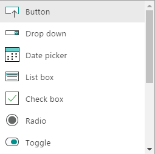

6 .      Gallery.

7 .      Forms- you can have edit and view forms on your app.

8 .      Media.

9 .      Charts.​

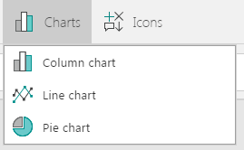

10.      Icons

·       You just need to drag and drop them to your app’s screen.

So as we are currently using the SharePoint services, I am loading the title of the tasks and their status from the SharePoint list.

**The result**

**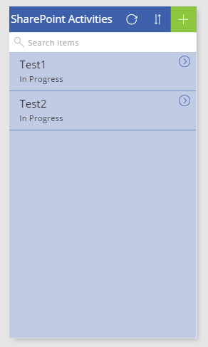**

·       We are using a refresh icon on the top. Then we are using the sort functions and a new tasks icon.

·       When you click on Add new, you see the following screen on your app.

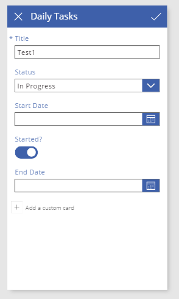

·       Or when you click on edit on the items of the app, you see the following screen on your app.

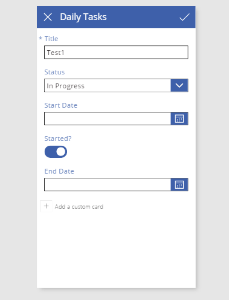

·       As my app is ready, I will go in and save the app.

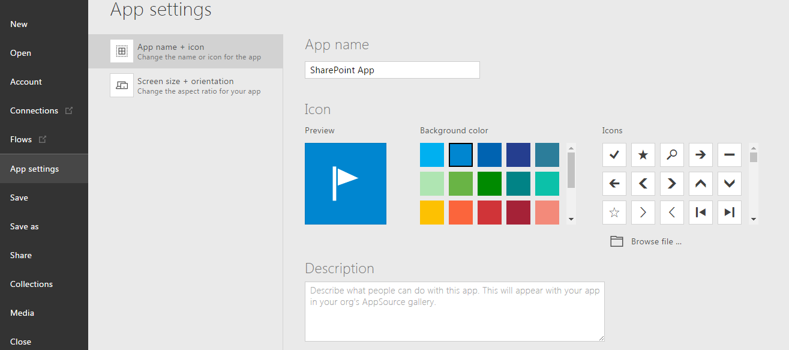

·       Provide a name and description to your app and click on Save.

·       Your app is Live within your organization and ready to use.

**Manpreet Singh**

SharePoint Consultant | Office Servers & Services MVP

